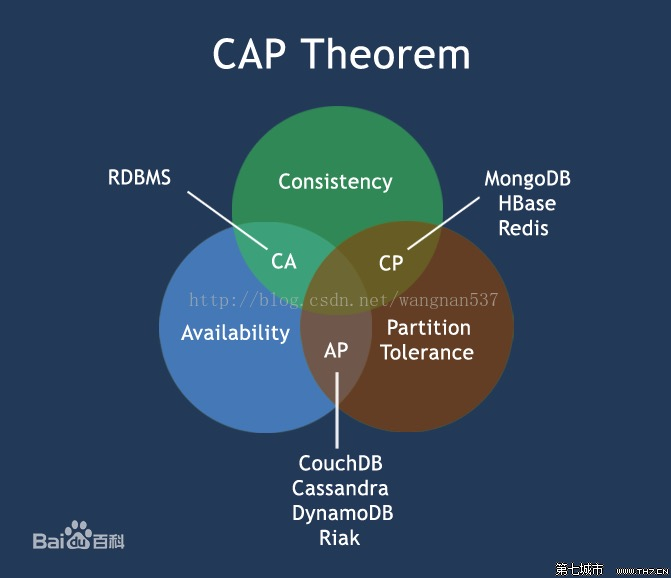
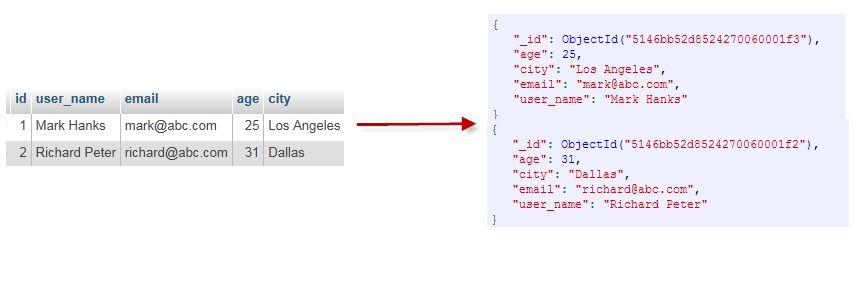
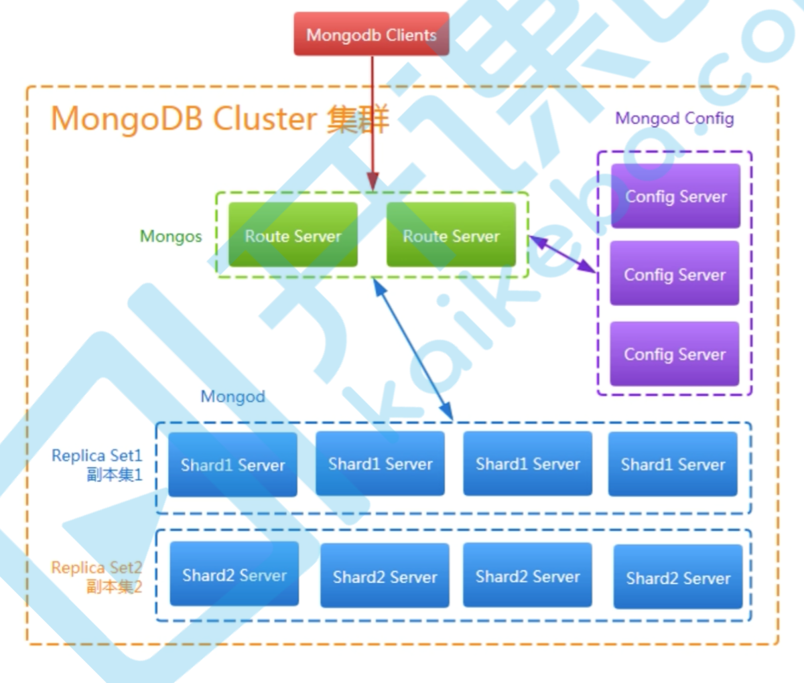
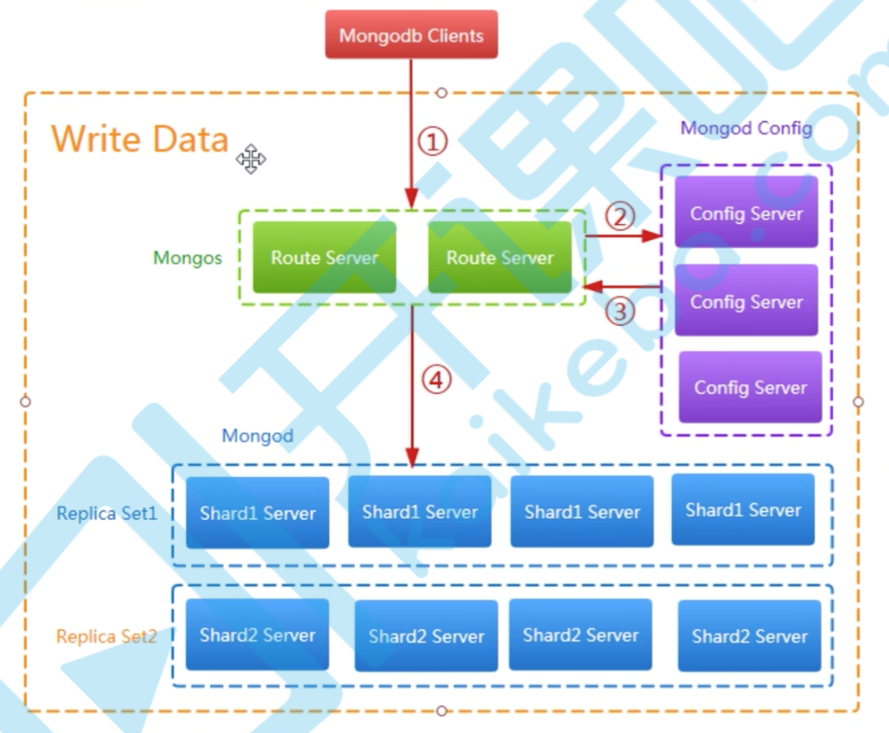
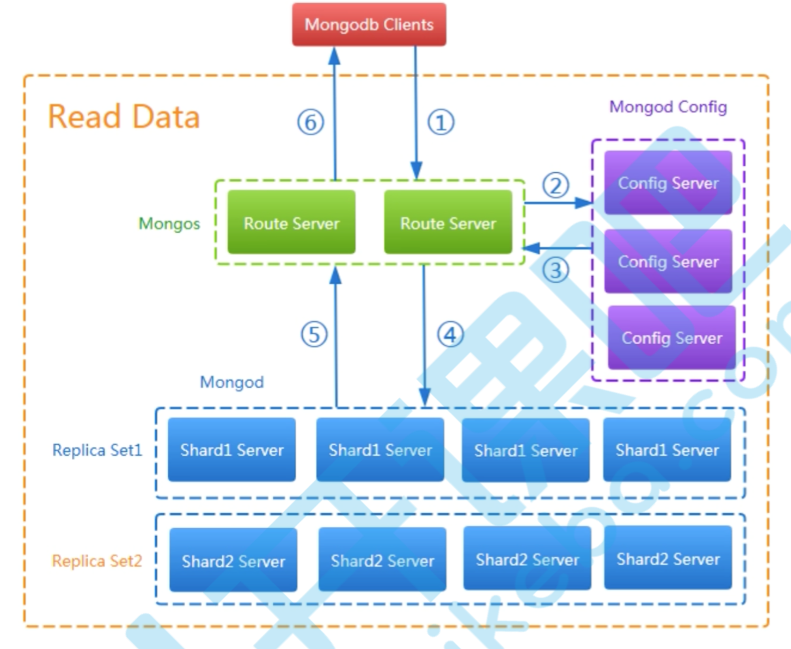
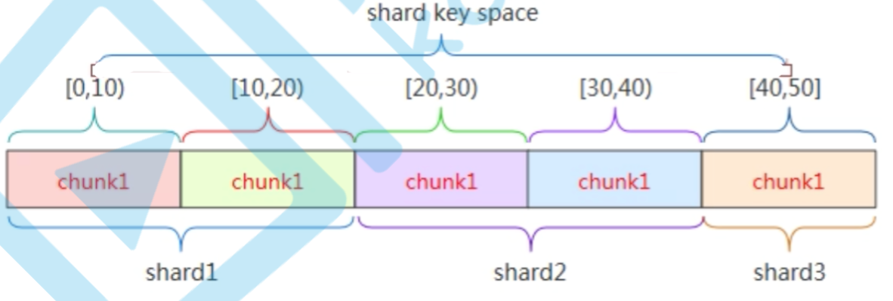
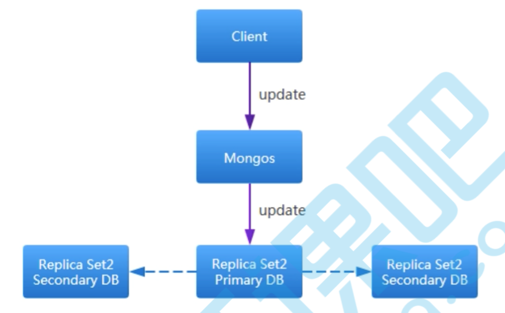
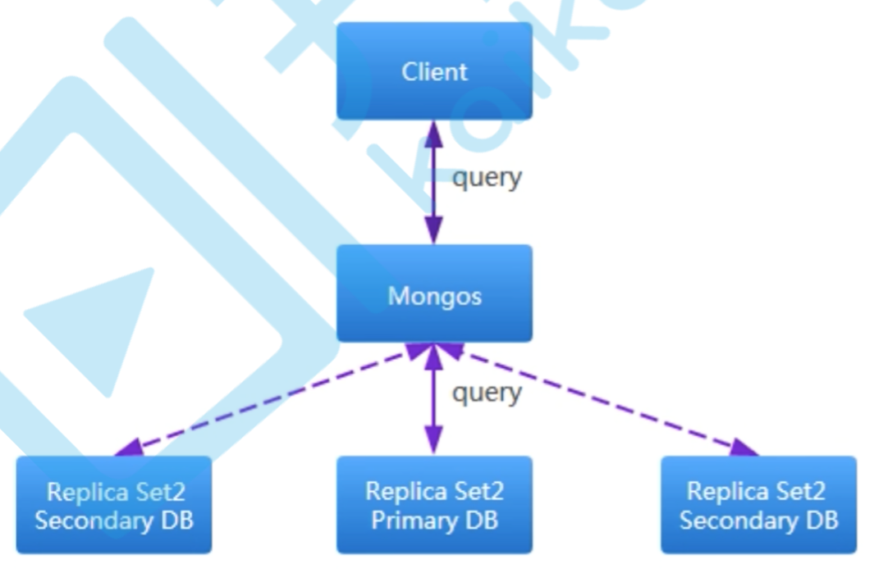

# [MongoDB](https://www.runoob.com/mongodb/mongodb-tutorial.html)介绍

​	官网地址：https://www.mongodb.com/

​	MongoDB 是一个基于【**分布式文件存储**】的数据库,它属于NoSQL数据库。由 C++ 语言编写。旨在为 WEB 应用提供【**可扩展**】的【**高性能**】数据存储解决方案。

​	MongoDB 是一个介于关系数据库和非关系数据库之间的产品,是非关系数据库当中功能最丰富,最像关系数据库的。它支持的数据结构非常松散,是类似`json`的`bson`格式,因此可以存储比较复杂的数据类型。Mongo最大的特点是它支持的查询语言非常强大,其语法有点类似于面向对象的查询语言,几乎可以实现类似关系数据库单表查询的绝大部分功能,而且还支持对数据建立索引。

> NoSQL分类:键值型(key-value)、文档型(document) 
>
> MongoDB就是文档型NoSQL数据库,它文档中的数据是以类似JSON的BSON格式进行存储的。我们拿JSON去理解, JSON中的数据,都是key-value,key一般都是String类型的,而value就多种多样了。只有value的类型,后续 有专门的讲解。记住value中可以再存储一个文档。 
>

# 分布式系统介绍

​	**分布式系统(distributed system)由多台计算机和通信的软件组件通过计算机网络连接(本地网络或广域网)组成**。

​	**分布式系统是建立在网络之上的[软件系统]。正是因为软件的特性，所以分布式系统具有高度的内聚性和透明性。**

​	因此，网络和分布式系统之间的区别更多的在于高层软件(特别是操作系统)，而不是硬件。

​	分布式系统可以应用在不同的平台上，如：PC、工作站、局域网和广域网上等。

# CAP原则

在计算机科学中，CAP定理(CAP theorem)，又称布鲁尔定理(Brewer's theorem),它指出对于一个分布式计算系统来说，不可能同时满足以下三点：

* **一致性**(Consistency)：所有节点在同一时间具有相同的数据
* **可用性**(Availability)：保证每个请求不管成功或失败都有响应
* **分区容错性**(Partition tolerance)：系统中任意信息的丢失或失败不会影响系统的继续运作。

​	CAP理论的核心：一个分布式系统不可能同时很好的满足一致性、可用性和分区容错性这三个需求，最多只能同时较好满足两个。

​	因此，根据CAP原理将NoSQL数据库分成了满足CA、CP、AP三大类原则：

* CA－单点集群，满足一致性，可用性的系统，通常在可扩展性上不太强大
* CP－满足一致性，分区容错性的系统，通常性能不是特别高；
* AP－满足可用性，分区容错性的系统，通常可能对一致性要求低一些。



# BASE

**BASE：Basically Available，Soft-state，Eventually Consistent**。由Eric Brewer定义。

​	CAP理论的核心：一个分布式系统不可能同时很好的满足一致性、可用性和分区容错性这三个需求，最多只能同时较好的满足两个。

​	BASE是NoSQL数据库通常对可用性及一致性的若要求原则：

* Basically Availble——基本可用
* Soft-state——软状态／柔性事务。"Soft state"可用理解为无连接的，而"Hard state"是"面向连接"的。
* Eventual Consistency——最终一致性，也是ACID的最终目的。

# MongoDB概念解析

​	不管我们学习什么数据库都应该学习其中的基础概念，在mongodb中基本的概念是文档、集合、数据库，下面我们挨个介绍。

​	下表将帮助您更容易理解Mongo中的一些概念：

| SQL术语/概念 | MongoDB术语/概念 | 解释/说明                           |
| :----------- | :--------------- | :---------------------------------- |
| database     | database         | 数据库                              |
| table        | collection       | 数据库表/集合                       |
| row          | document         | 数据记录行/文档                     |
| column       | field            | 数据字段/域                         |
| index        | index            | 索引                                |
| table joins  |                  | 表连接,MongoDB不支持                |
| primary key  | primary key      | 主键,MongoDB自动将_id字段设置为主键 |

通过下图实例，我们也可以更直观的了解Mongo中的一些概念：



## 数据库

一个mongodb中可以建立多个数据库。

MongoDB的默认数据库为`"db"`，该数据库存储在`data`目录中。

MongoDB的单个实例（进程）可以容纳多个独立的数据库，每一个都有自己的集合和权限，不同的数据库也放置在不同的文件中。

**"show dbs"** 命令可以显示所有数据的列表。

```shell
$ ./mongo
MongoDB shell version: 3.0.6
connecting to: test
> show dbs
local  0.078GB
test   0.078GB
> 
```

执行 **"db"** 命令可以显示当前数据库对象或集合。

```shell
$ ./mongo
MongoDB shell version: 3.0.6
connecting to: test
> db
test
> 
```

运行"use"命令，可以连接到一个指定的数据库。

```shell
> use local
switched to db local
> db
local
> 
```

以上实例命令中，"local" 是你要链接的数据库。

在下一个章节我们将详细讲解MongoDB中命令的使用。

数据库也通过名字来标识。数据库名可以是满足以下条件的任意UTF-8字符串。

* 不能是空字符串（"")。
* 不得含有' '（空格)、.、$、/、\和\0 (空字符)。
* 应全部小写。
* 最多64字节。

有一些数据库名是保留的，可以直接访问这些有特殊作用的数据库。

* **admin**： 从权限的角度来看，这是"root"数据库。要是将一个用户添加到这个数据库，这个用户自动继承所有数据库的权限。一些特定的服务器端命令也只能从这个数据库运行，比如列出所有的数据库或者关闭服务器。
* **local:** 这个数据永远不会被复制，可以用来存储限于本地单台服务器的任意集合
* **config**: 当Mongo用于分片设置时，config数据库在内部使用，用于保存分片的相关信息。

## 文档(Document)

​	文档是一组键值(key-value)对(即 BSON)。MongoDB 的文档不需要设置相同的字段，并且相同的字段不需要相同的数据类型，这与关系型数据库有很大的区别，也是 MongoDB 非常突出的特点。

​	一个简单的文档例子如下：

```json
{"site":"www.runoob.com", "name":"菜鸟教程"}
```

下表列出了 RDBMS 与 MongoDB 对应的术语：

|       RDBMS        | MongoDB                           |
| :----------------: | :-------------------------------- |
|       数据库       | 数据库                            |
|        表格        | 集合                              |
|         行         | 文档                              |
|         列         | 字段                              |
|       表联合       | 嵌入文档                          |
|        主键        | 主键 (MongoDB 提供了 key 为 _id ) |
| 数据库服务和客户端 |                                   |
|   Mysqld/Oracle    | mongod                            |
|   mysql/sqlplus    | mongo                             |

⚠️需要注意的是：

1. 文档中的键/值对是有序的。
2. 文档中的值不仅可以是在双引号里面的字符串，还可以是其他几种数据类型（甚至可以是整个嵌入的文档)。
3. MongoDB区分类型和大小写。
4. MongoDB的文档不能有重复的键。
5. 文档的键是字符串。除了少数例外情况，键可以使用任意UTF-8字符。

文档键命名规范：

* 键不能含有\0 (空字符)。这个字符用来表示键的结尾。
* .和$有特别的意义，只有在特定环境下才能使用。
* 以下划线"_"开头的键是保留的(不是严格要求的)。

## 集合

​	集合就是 **`MongoDB` 文档组**，<u>类似于 RDBMS （关系数据库管理系统：Relational Database Management System)中的表格</u>。

​	集合存在于数据库中，集合没有固定的结构，这意味着你在对集合可以插入不同格式和类型的数据，但通常情况下我们插入集合的数据都会有一定的关联性。

​	比如，我们可以将以下不同数据结构的文档插入到集合中：

```json
{"site":"www.baidu.com"}
{"site":"www.google.com","name":"Google"}
{"site":"www.runoob.com","name":"菜鸟教程","num":5}
```

> 当第一个文档插入时，集合就会被创建。

### 合法的集合名

* 集合名不能是空字符串""。
* 集合名不能含有\0字符（空字符)，这个字符表示集合名的结尾。
* 集合名不能以"system."开头，这是为系统集合保留的前缀。
* 用户创建的集合名字不能含有保留字符。有些驱动程序的确支持在集合名里面包含，这是因为某些系统生成的集合中包含该字符。除非你要访问这种系统创建的集合，否则千万不要在名字里出现$。　

如下实例：

```shell
db.col.findOne()
```

### capped collections

​	Capped collections 就是**固定大小的collection**。

​	它有很高的性能以及**队列过期的特性(过期按照插入的顺序)**. 有点和 "RRD" 概念类似。

​	Capped collections 是高性能自动的维护对象的插入顺序。**它非常适合类似记录日志的功能和标准的 collection 不同，你必须要显式的创建一个capped collection，指定一个 collection 的大小，单位是字节。collection 的数据存储空间值提前分配的**。

​	Capped collections 可以按照文档的插入顺序保存到集合中，而且这些文档在磁盘上存放位置也是按照插入顺序来保存的，所以当我们更新Capped collections 中文档的时候，更新后的文档不可以超过之前文档的大小，这样话就可以确保所有文档在磁盘上的位置一直保持不变。

​	由于 Capped collection 是按照文档的插入顺序而不是使用索引确定插入位置，这样的话可以提高增添数据的效率。<u>MongoDB 的操作日志文件 oplog.rs 就是利用 Capped Collection 来实现的</u>。

> ⚠️：要注意的是指定的存储大小包含了数据库的头信息。

```shell
db.createCollection("mycoll", {capped:true, size:100000})
```

* 在 capped collection 中，你能添加新的对象。
* 能进行更新，然而，对象不会增加存储空间。如果增加，更新就会失败 。
* 使用 Capped Collection 不能删除一个文档，可以使用 drop() 方法删除 collection 所有的行。
* 删除之后，你必须显式的重新创建这个 collection。
* 在32bit机器中，capped collection 最大存储为 1e9( 1X109)个字节。

## 元数据

​	数据库的信息是存储在集合中。它们使用了系统的命名空间：

```shell
dbname.system.*
```

​	在MongoDB数据库中名字空间` <dbname>.system.*` 是包含多种系统信息的特殊集合(Collection)，如下:

| 集合命名空间             | 描述                                      |
| :----------------------- | :---------------------------------------- |
| dbname.system.namespaces | 列出所有名字空间。                        |
| dbname.system.indexes    | 列出所有索引。                            |
| dbname.system.profile    | 包含数据库概要(profile)信息。             |
| dbname.system.users      | 列出所有可访问数据库的用户。              |
| dbname.local.sources     | 包含复制对端（slave）的服务器信息和状态。 |

​	对于修改系统集合中的对象有如下限制:

> 在{{system.indexes}}插入数据，可以创建索引。但除此之外该表信息是不可变的(特殊的drop index命令将自动更新相关信息)。
>
> {{system.users}}是可修改的。 {{system.profile}}是可删除的。

# MongoDB数据类型

下表为MongoDB中常用的几种数据类型：

| 数据类型           | 描述                                                         |
| :----------------- | :----------------------------------------------------------- |
| String             | 字符串。存储数据常用的数据类型。在 MongoDB 中，UTF-8 编码的字符串才是合法的。 |
| Integer            | 整型数值。用于存储数值。根据你所采用的服务器，可分为 32 位或 64 位。 |
| Boolean            | 布尔值。用于存储布尔值（真/假）。                            |
| Double             | 双精度浮点值。用于存储浮点值。                               |
| Min/Max keys       | 将一个值与 BSON（二进制的 JSON）元素的最低值和最高值相对比。 |
| Array              | 用于将数组或列表或多个值存储为一个键。                       |
| Timestamp          | 时间戳。记录文档修改或添加的具体时间。                       |
| Object             | 用于内嵌文档。                                               |
| Null               | 用于创建空值。                                               |
| Symbol             | 符号。该数据类型基本上等同于字符串类型，但不同的是，它一般用于采用特殊符号类型的语言。 |
| Date               | 日期时间。用 UNIX 时间格式来存储当前日期或时间。你可以指定自己的日期时间：创建 Date 对象，传入年月日信息。 |
| Object ID          | 对象 ID。用于创建文档的 ID。                                 |
| Binary Data        | 二进制数据。用于存储二进制数据。                             |
| Code               | 代码类型。用于在文档中存储 JavaScript 代码。                 |
| Regular expression | 正则表达式类型。用于存储正则表达式。                         |

下面说明下几种重要的数据类型。

## ObjectId

ObjectId 类似唯一主键，可以很快的去生成和排序，包含 12 bytes，含义是：

* 前 4 个字节表示创建 **unix** 时间戳,格林尼治时间 **UTC** 时间，比北京时间晚了 8 个小时
* 接下来的 3 个字节是机器标识码
* 紧接的两个字节由进程 id 组成 PID
* 最后三个字节是随机数


​	MongoDB 中存储的文档必须有一个 _id 键。这个键的值可以是任何类型的，默认是个 ObjectId 对象

​	由于 ObjectId 中保存了创建的时间戳，所以你不需要为你的文档保存时间戳字段，你可以通过 getTimestamp 函数来获取文档的创建时间:

```shell
> var newObject = ObjectId()
> newObject.getTimestamp()
ISODate("2017-11-25T07:21:10Z")
```

ObjectId 转为字符串

```shell
> newObject.str
5a1919e63df83ce79df8b38f
```

## 字符串

**BSON 字符串都是 UTF-8 编码。**

## 时间戳

​	BSON 有一个特殊的时间戳类型用于 MongoDB 内部使用，与普通的日期类型不相关。 时间戳值是一个 64 位的值。其中：

* 前32位是一个 time_t 值（与Unix新纪元相差的秒数）
* 后32位是在某秒中操作的一个递增的序数

在单个 mongod 实例中，时间戳值通常是唯一的。

在复制集中， oplog 有一个 ts 字段。这个字段中的值使用BSON时间戳表示了操作时间。

> BSON 时间戳类型主要用于 MongoDB 内部使用。在大多数情况下的应用开发中，你可以使用 BSON 日期类型。

## 日期

​	表示当前距离 Unix新纪元（1970年1月1日）的毫秒数。日期类型是有符号的, 负数表示 1970 年之前的日期。

```shell
> var mydate1 = new Date()     //格林尼治时间
> mydate1
ISODate("2018-03-04T14:58:51.233Z")
> typeof mydate1
object
```

```shell
> var mydate2 = ISODate() //格林尼治时间
> mydate2
ISODate("2018-03-04T15:00:45.479Z")
> typeof mydate2
object
```

这样创建的时间是日期类型，可以使用 JS 中的 Date 类型的方法。

返回一个时间类型的字符串：

```shell
> var mydate1str = mydate1.toString()
> mydate1str
Sun Mar 04 2018 14:58:51 GMT+0000 (UTC) 
> typeof mydate1str
string
```

或

```shell
> Date()
Sun Mar 04 2018 15:02:59 GMT+0000 (UTC)   
```

## 小结

总结起来,RDBMS和NoSQL的区别在于三点:**事务、表关联、表结构约束**

| RDBMS        | NoSQL                  |
| ------------ | ---------------------- |
| 有事务       | 无事务(性能提升)       |
| 有表关联     | 数据和数据之间没有关系 |
| 有表结构约束 | key-value结构,没有约束 |

示例：

* RDBMS中的User表(字段先要预定义):

  ```sql
  id 			         name             address 
  自增主键、int     非空、字符串      允许空、字符串
  ```

* MongoDB中的User文档(字段不需要预定义):

  ```json
  文档对象1:
  {
  	"_id": ObjectID(),
  	"name": "James",
  	"age": 18
  }
  插入之后,产生了三个列:id name age
  
  文档对象2:
  {
  	"_id": ObjectID(),
  	"name": "xiaoqiao",
  	"address": "my house"
  }
  插入之后,产生了三个列:id  name    address
  
  但是会和上面的列计算出一个并集,最后会有4个列：id name age address
  ```

# MongoDB底层原理图解

Mongodb的部署方案有有单机部署、副本集（主备）部署、分片部署、副本集与分片部署。

## 副本集与分片混合部署

Mongodb的集群部署方案有三类角色：**实际数据存储节点、配置文件存储节点和路由接入节点**。

* 实际数据存储节点的作用就是存储数据；

* 路由接入节点的作用是在分片的情况下起到负载均衡的作用；

* 存储配置存储节点的作用其实存储的是片键与chunk以及chunk与server的映射关系，用上面的数据表示的配置节点存储的数据模型如下表：
  map1:

  | key range | chunk  |
  | --------- | ------ |
  | [0,10}    | chunk1 |
  | [10,20}   | chunk2 |
  | [20,30}   | chunk3 |
  | [30,40}   | chunk4 |
  | [40,50}   | chunk5 |

  map2:

  | chunk  | shard  |
  | ------ | ------ |
  | chunk1 | shard1 |
  | chunk2 | shard2 |
  | chunk3 | shard3 |
  | chunk4 | shard4 |
  | chunk5 | shard5 |

MongoDB的客户端直接与路由节点相连,从配置节点上查询数据,根据查询结果到实际的存储节点上查询和存储数
据。

副本集与分片混合部署方式如图：



```text
相同的副本集中的节点存储的数据是一样的,副本集中的节点是分为主节点、从节点、仲裁节点(非必须)三种角色。
这种设计方案的目的,主要是为了高性能、高可用、数据备份。

不同的副本集中的节点存储的数据是不一样,这种设计方案,主要是为了解决高扩展问题,理论上是可以无限扩展的。

每一个副本集可以看成一个shard(分片),多个副本集共同组成一个逻辑上的大数据节点。通过对shard上面进行逻辑分块chunk(块),每个块都有自己存储的数据范围,所以说客户端请求存储数据的时候,会去读取config server中的映射信息,找到对应的chunk(块)存储数据。
```

1. 混合部署方式下向MongoDB写数据的流程图：
   
2. 混合部署方式下读MongoDB里的数据流程如图：




## 副本集集群

​	对于副本集集群，又有主和从两种角色，写数据和读数据也不同，**写数据的过程是只写到主节点中，由主节点以异步的方式同步到从节点**：



而**读数据则只要从任一节点中读取，具体到哪个节点读取是可以指定的**：



# MongoDB的应用场景和不适用场景

## 适用场景

* 更高的写入负载
  默认情况下，MongoDB更侧重高数据写入性能，而非事务安全，MongoDB很适合业务系统中有大量"低价值"数据的场景。但是应当避免在高事务安全性的系统中使用MongoDB，除非能从架构设计上保证事务安全。
* 高可用性
  MongoDB的副本集(Master-Slave)配置非常简洁方便，此外，MongoDB可以快速响应地处理单节点故障，自动、安全的完成故障转移。这些特性使得MongoDB能在一个相对不稳定(如云主机)的环境中，保持高可用性。
* 数据量很大或者未来会变得很大
  依赖数据库(MySQL)自身特性，完成数据的扩展是较困难的事，在MySQL中，当一个单表达到5～10G时会出现明显的性能降低，此时需要通过数据的水平或垂直拆分、库的拆分完成扩展，使用MySQL通常需要借助驱动层或代理层完成这类需求。而MongoDB内建了多种数据分片的特性，可以很好的适应大数据量的需求。
* 基于位置的数据查询
  MongoDB支持二维空间索引，因此可以快速及精准的从指定位置获取数据。
* 表结构不明确，且数据在不断变大
  在一些传统RDBMS中，增加一个字段会锁住整个数据库／表，或者在执行一个重负载的请求时会明显造成其它请求的性能降低。通常发生在数据表大于1G的时候(当大于1TB时更甚)。因MongoDB是文档型数据库，为非结构化的文档增加一个新字断是很快速的操作，并且不会影响到已有数据。另外一个好处，当业务数据发生变化时，是将不再需要由DBA修改表结构。
* 没有DBA支持
  如果没有专职的DBA，并且准备不使用标准的关系型思维(结构化、连接等)来处理数据，那么MongoDB将是你的首选。MongoDB对于对象数据的存储非常方便，类可以直接序列化程JSON存储到MongoDB中。但是需要先了解一些最佳实践，避免当数据变化大后，由于文档设计问题而造成的性能缺陷。

## 不适用场景

​	在某些场景下,MongoDB作为一个非关系型数据库有其局限性。MongoDB**不支持事务操作**,所以需要用到事务的应用建议不用MongoDB,另外MongoDB目前**不支持join操作**,需要复杂查询的应用也不建议使用MongoDB。

