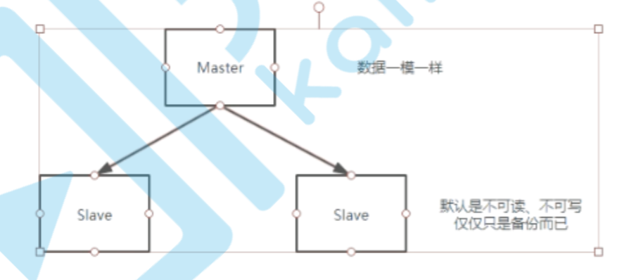

	MongoDB的主从集群，其实官方已经不推荐了，但是要理解主从集群的一些特性：默认从机是不可操作的，只是作为数据备份的。如果需要从机对外提供读读操作，需要单独发送指令。



​	伪分布式搭建：在同一台机器，使用多个不同的端口，去启动多个实例。组成一个分布式系统。

​	真正的分布式搭建：在不同机器，使用相同的端口，分别启动实例。如果是真正的分布式搭建，一定要保证网络畅通或防火墙开启问题。

# 主机配置

/root/mongodb/ms/master/mongodb.cfg

```shell
#数据库文件位置 
dbpath=/root/mongodb/ms/master/data
#日志文件位置 
logpath=/root/mongodb/ms/master/logs/mongodb.log 
# 以追加方式写入日志
logappend=true
# 是否以守护进程方式运行
fork=true
#绑定当前机器ip，即客户端访问的ip
bind_ip=192.168.10.135
# 默认27017
port=27001
# 主从模式下,指定我自身的角色是主机
master=true
# 主从模式下,从机的地址信息
source=192.168.10.135:27002
```

# 从机配置

/root/mongodb/ms/slave/mongodb.cfg

```shell
# 数据库文件位置 
dbpath=/root/mongodb/ms/slave/data
#日志文件位置 
logpath=/root/mongodb/ms/slave/logs/mongodb.log 
# 以追加方式写入日志
logappend=true
# 是否以守护进程方式运行
fork = true
bind_ip=192.168.10.135
# 默认27017
port = 27002
slave = true
# 主从模式下,主机的地址信息 
source=192.168.10.135:27001
```

# 测试

启动服务

```shell
mongod -f /root/mongodb/ms/master/mongodb.cfg
mongod -f /root/mongodb/ms/slave/mongodb.cfg
```

连接测试

```shell
mongo localhost:27001
mongo localhost:27002
```

测试命令

```shell
db.isMaster()
```

# 读写分离

MongoDB副本集对读写分离的支持是通过Read Preferences特性进行支持的,这个特性非常复杂和灵活。设置读写分离需要先在从节点SECONDARY 设置

```shell
rs.slaveOk()
```

