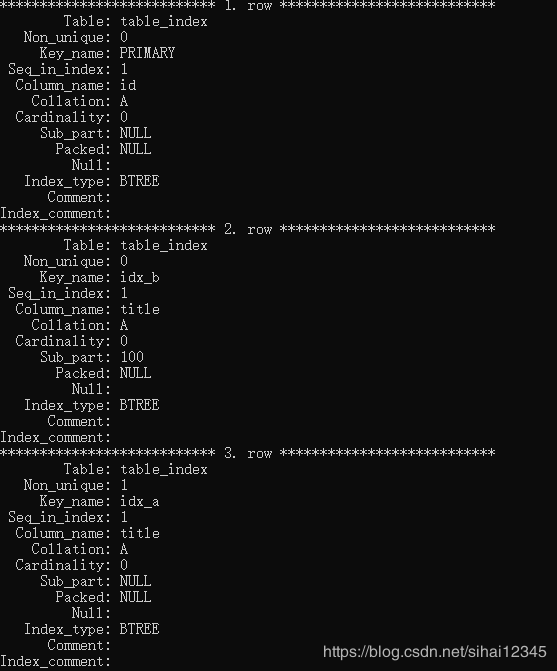
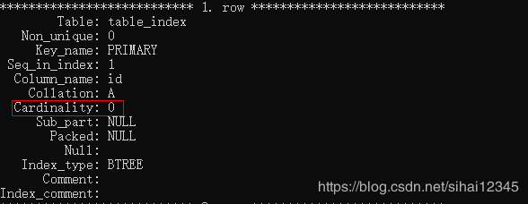
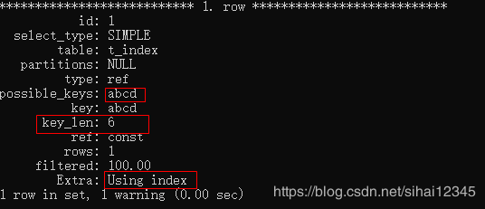
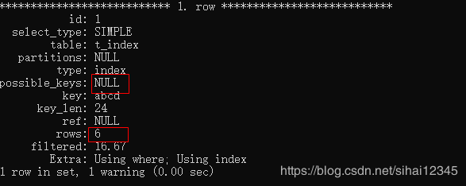
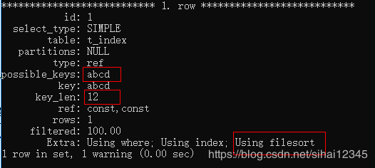
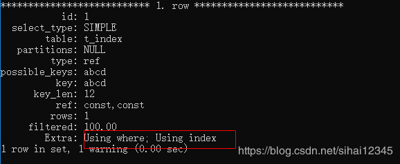
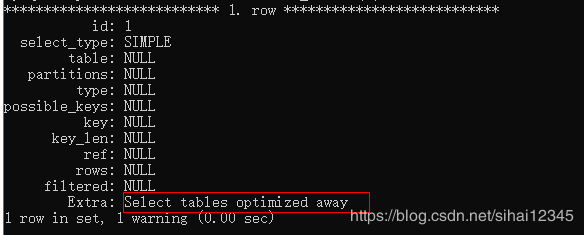
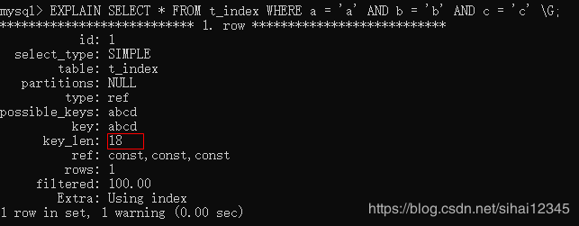
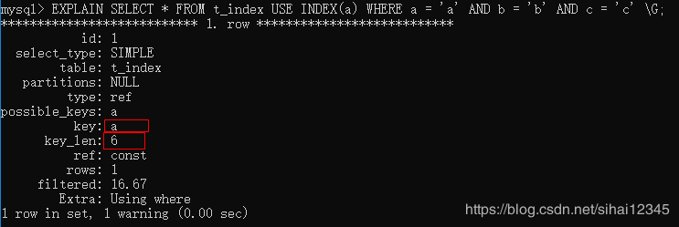

# 前言

​	这篇文章不会讲解索引的基础知识，主要是关于MySQL数据库的B 树索引的相关原理，里面的一些知识都参考了MySQL技术内幕这本书，也算对于这些知识的总结。对于B树和B 树相关的知识，可以参考我的这篇博客：[面试官问你B树和B 树，就把这篇文章丢给他](https://blog.ouyangsihai.cn/mian-shi-guan-wen-ni-b-shu-he-b-shu-jiu-ba-zhe-pian-wen-zhang-diu-gei-ta.html)

# 索引多管理

​	索引有很多中类型：普通索引、唯一索引、主键索引、组合索引、全文索引，下面我们看看如何创建和删除下面这些类型的索引。

## 索引的创建方式

索引的创建是可以在很多种情况下进行的。

* 直接创建索引

  ```mysql
  CREATE [UNIQUE|FULLLTEXT] INDEX index_name ON table_name(column_name(length))
  ```

  `[UNIQUE|FULLLTEXT]`：表示可选择的索引类型，唯一索引还是全文索引，不加话就是普通索引。`table_name`：表的名称，表示为哪个表添加索引。`column_name(length)`：column_name是表的列名，length表示为这一列的前length行记录添加索引。

* 修改表结构的方式添加索引

  ```mysql
  ALTER TABLE table_name ADD [UNIQUE|FULLLTEXT] INDEX index_name (column(length))
  ```

* 创建表的时候同时创建索引

  ```mysql
  CREATE TABLE `table` (
      `id` int(11) NOT NULL AUTO_INCREMENT ,
      `title` char(255) CHARACTER NOT NULL ,
      PRIMARY KEY (`id`),
      [UNIQUE|FULLLTEXT] INDEX index_name (title(length))
  )
  ```

## 主键索引和组合索引创建的方式

* 创建表的时候同时创建索引

  ```mysql
  CREATE TABLE `table` (
      `id` int(11) NOT NULL AUTO_INCREMENT ,
      `title` char(255) CHARACTER NOT NULL ,
      PRIMARY KEY (`id`),
      INDEX index_name(id,title)
  )
  ```

* 修改表结构的方式添加索引

  ```mysql
  ALTER TABLE table_name ADD INDEX name_city_age (name,city,age); 
  ```

  **主键索引创建方式** 主键索引是一种特殊的唯一索引，一个表只能有一个主键，不允许有空值。一般是在建表的时候同时创建主键索引。

  ```mysql
  CREATE TABLE `table` (
      `id` int(11) NOT NULL AUTO_INCREMENT ,
      `title` char(255) CHARACTER NOT NULL ,
      PRIMARY KEY (`id`)
  )
  ```

## 删除索引

删除索引可利用`ALTER TABLE`或`DROP INDEX`语句来删除索引。类似于`CREATE INDEX`语句，`DROP INDEX`可以在`ALTER TABLE`内部作为一条语句处理，语法如下。

```mysql
DROP INDEX index_name ON talbe_name;
ALTER TABLE table_name DROP INDEX index_name;
ALTER TABLE table_name DROP PRIMARY KEY;
```

第3条语句只在删除`PRIMARY KEY`索引时使用，因为一个表只可能有一个`PRIMARY KEY`索引，因此不需要指定索引名。

## 索引实例

上面讲了一下基本的知识，接下来，还是通过一个具体的例子来体会一下。

* **step1：创建表**

  ```mysql
   create table table_index(
      id int(11) not null auto_increment,
      title char(255) not null,
      primary key(id)
  );
  ```

* **step2：添加索引**
  首先，我们使用直接添加索引的方式添加一个普通索引。

  ```mysql
  CREATE INDEX idx_a ON table_index(title);
  ```

  接着，我们用修改表结构的时候添加索引。

  ```mysql
  ALTER TABLE table_index ADD UNIQUE INDEX idx_b (title(100));
  ```

  最后，我们再添加一个组合索引。

  ```mysql
  ALTER TABLE table_index ADD INDEX idx_id_title (id,title);
  ```

  这样，我们就把前面索引的方式都用上一遍了，我相信你也熟悉这些操作了。

* **step3：使用SHOW INDEX命令查看索引信息**
  如果想要查看表中的索引信息，可以使用命令`SHOW INDEX`,下面的例子，我们查看表`table_index`的索引信息。

  ```mysql
  SHOW INDEX FROM table_index\G;
  ```

  

  得到上面的信息，上面的信息什么意思呢？我们逐一介绍！

  | 字段         | 解释                                                         |
  | ------------ | ------------------------------------------------------------ |
  | Table        | 索引所在的表                                                 |
  | Non_unique   | 非唯一索引，如果是0，代表唯一的，也就是说如果该列索引中不包括重复的值则为0 否则为1 |
  | Key_name     | 索引的名字，如果是主键的话 则为PRIMARY                       |
  | Seq_in_index | 索引中该列的位置，从1开始,如果是组合索引 那么按照字段在建立索引时的顺序排列 |
  | Collation    | 列是以什么方式存储在索引中的。可以是A或者NULL，B 树索引总是A，排序的， |
  | Sub_part     | 是否列的部分被索引，如果只是前100行索引，就显示100，如果是整列，就显示NULL |
  | Packed       | 关键字是否被压缩，如果没有，为NULL                           |
  | Index_type   | 索引的类型，对于InnoDB只支持B 树索引，所以都是显示BTREE      |

* **step4：删除索引**
  直接删除索引方式

  ```mysql
  DROP INDEX idx_a ON table_index;
  ```

  修改表结构时删除索引

  ```mysql
  ALTER TABLE table_index DROP INDEX idx_b;
  ```

## Cardinality关键字解析

​	在上面介绍了那么多个关键字的意思，但是`Cardinality`这个关键字非常的关键，优化器会根据这个值来判断是否使用这个索引。在B 树索引中，只有高选择性的字段才是有意义的，**高选择性**就是这个字段的取值范围很广，比如姓名字段，会有很多的名字，可选择性就高了。

​	一般来说，判断是否需要使用索引，就可以通过`Cardinality`关键字来判断，如果非常接近1，说明有必要使用，如果非常小，那么就要考虑是否使用索引了。

​	需要注意的一个问题时，这个关键字不是及时更新的，需要更新的话，需要使用`ANALYZE TABLE`，例如。

```mysql
analyze table table_index;
```


因为目前没有数据，所以，你会发现，这个值一直都是0，没有变化。



### InoDB存储引擎Cardinality的策略

​	在InnoDB存储引擎中，这个关键字的更新发生在两个操作中：insert和update。但是，并不是每次都会更新，这样会增加负荷，所以，对于这个关键字的更新有它的策略：

* 表中`1/16`的数据发生变化
* InnoDB存储引擎的计数器`stat_modified_conter`>2000000000

默认InnoDB存储引擎会对8个叶子节点进行采样，采样过程如下：

* B 树索引中叶子节点数量，记做`A`
* **随机**取得B 树索引中的`8`个叶子节点。统计每个页不同的记录个数，分别为p1-p8
* 根据采样信息得到Cardinality的预估值：`(p1 p2 p3 ... p8)*A/8`

​	因为随机采样，所以，每次的Cardinality值都是不一样的，只有一种情况会一样的，就是表中的叶子节点**小于或者等于8**，这时候，怎么随机采样都是这8个，所以也就一样的。

## Fast Index Creation

​	在MySQL 5.5之前，**对于索引的添加或者删除，每次都需要创建一张临时表，然后导入数据到临时表，接着删除原表**，如果一张大表进行这样的操作，会非常的耗时，这是一个很大的缺陷。

​	InnoDB存储引擎从1.0.x版本开始加入了一种Fast Index Creation（快速索引创建）的索引创建方式。

​	这种方式的策略为：**每次为创建索引的表加上一个S锁（共享锁），在创建的时候，不需要重新建表，删除辅助索引只需要更新内部视图，并将辅助索引空间标记为可用**，所以，这种效率就大大提高了。

## 在线数据定义

​	MySQL5.6开始支持的在线数据定义操作就是：允许辅助索引创建的同时，还允许其他insert、update、delete这类DM操作，这就极大提高了数据库的可用性。

​	所以，我们可以使用新的语法进行创建索引：

```mysql
ALTER TABLE table_name ADD [UNIQUE|FULLLTEXT] INDEX index_name (column(length))
[ALGORITHM = {DEFAULT|INPLACE|COPY}]
[LOCK = {DEFAULT|NONE|SHARED|EXLUSIVE}]
```

`ALGORITHM`指定创建或者删除索引的算法

* COPY：创建临时表的方式
* INPLACE：不需要创建临时表
* DEFAULT：根据参数`old_alter_table`参数判断，如果是`OFF`,采用`INPLACE`的方式

LOCK表示对表添加锁的情况

* NONE：不加任何锁
* SHARE：加一个S锁，并发读可以进行，写操作需要等待
* EXCLUSIVE：加一个X锁，读写都不能并发进行
* DEFAULT：先判断是否可以使用`NONE`，如不能，判断是否可以使用`SHARE`，如不能，再判断是否可以使用`EXCLUSIVE`模式。

# B树索引的使用

## 联合索引

​	联合索引是指对表上的多个列进行索引，这一部分我们将通过几个例子来讲解联合索引的相关知识点。

​	首先，我们先创建一张表以及为这张表创建联合索引。

```mysql
create table t_index(
  a char(2) not null default '',
  b char(2) not null default '',
  c char(2) not null default '',
  d char(2) not null default ''
)engine myisam charset utf8;
```

创建联合索引

```mysql
alter table t_index add index abcd(a,b,c,d);
```

插入几条测试数据

```mysql
insert into t_index values('a','b','c','d'),
('a2','b2','c2','d2'),
('a3','b3','c3','d3'),
('a4','b4','c4','d4'),
('a5','b5','c5','d5'),
('a6','b6','c6','d6');
```

到这一步，我们已经基本准备好了需要的数据，我们可以进行更深一步的联合索引的探讨。

### 我们什么时候需要创建联合索引呢

​	索引建立的主要目的就是为了提高查询的效率，那么联合索引的目的也是类似的，联合索引的目的就是为了提高存在多个查询条件的情况下的效率，就如上面建立的表一样，有多个字段，当我们需要利用多个字段进行查询的时候，我们就需要利用到联合索引了。

### 什么时候联合索引才会发挥作用呢

​	有时候，我们会用联合索引，但是，我们并不清楚其原理，不知道什么时候联合索引会起到作用，什么时候又是会失效的？

​	带着这个问题，我们了解一下联合索引的**最左匹配原则**。

​	**最左匹配原则**：这个原则的意思就是**创建组合索引，以最左边的为准，只要查询条件中带有最左边的列，那么查询就会使用到索引。**

​	下面，我们用几个例子来看看这个原则。

```mysql
EXPLAIN SELECT * FROM t_index WHERE a = 'a' \G;
```



​	我们看看这条语句的结果，首先，我们看到使用了索引，因为**查询条件中带有最左边的列a**，那么利用了几个索引呢？这个我们需要看`key_len`这个字段，我们知道utf8编码的一个字符3个字节，而我们使用的数据类型是`char(2)`，占两个字节，索引就是2*3等于6个字节，所以只有一个索引起到了作用。

```mysql
EXPLAIN SELECT * FROM t_index WHERE b = 'b2' \G;
```



​	这个语句我们可以看出，这个没有使用索引，因为`possible_keys`为空，而且，从查询的行数`rows`可以看出为6（我们测试数据总共6条），说明进行了全盘扫描的，说明这种情况是不符合**最左匹配原则**，所以不会使用索引查询。

```mysql
EXPLAIN SELECT * FROM t_index WHERE a = 'a2' AND b = 'b2' ORDER BY d \G;
```



​	这种情况又有点不一样了，我们使用了一个排序，可以看出使用了索引，通过`key_len`为12可以得到使用了2个索引`a、b`，另外在Extra选项中可以看到使用了`Using filesort`，也就是文件排序，这里使用文件排序的原因是这样的：上面的查询使用了a、b索引，但是当我们用d字段来排序时，（a，d）或者（b，d）这两个索引是没有排序的，**联合索引的使用有一个好处，就是索引的下一个字段是会自动排序的**，在这里的这种情况来说，c字段就是排序的，但是d是不会，如果我们用c来排序就会得到不一样的结果。

```mysql
EXPLAIN SELECT * FROM t_index WHERE a = 'a2' AND b = 'b2' ORDER BY c \G;
```



​	是不是可以看到，当我们用c进行排序的时候，因为使用了a、b索引，所以c就自动排序了，所以也就不用filesort了。

​	讲到这里，我相信通过上面的几个例子，对于联合索引的相关知识已经非常的透彻清晰了，最后，我们再来聊几个常见的问题。

### Q1：为什么不对表中的每一个列创建一个索引呢

​	第一，创建索引和维护索引要耗费时间，这种时间随着数据量的增加而增加。 第二，索引需要占物理空间，除了数据表占数据空间之外，每一个索引还要占一定的物理空间，如果要建立聚簇索引，那么需要的空间就会更大。 第三，当对表中的数据进行增加、删除和修改的时候，索引也要动态的维护，这样就降低了数据的维护速度。

### Q2：为什么需要使用联合索引

**减少开销**。建一个联合索引(col1,col2,col3)，实际相当于建了(col1),(col1,col2),(col1,col2,col3)三个索引。每多一个索引，都会增加写操作的开销和磁盘空间的开销。对于大量数据的表，使用联合索引会大大的减少开销！

**覆盖索引**。对联合索引(col1,col2,col3)，如果有如下的sql: select col1,col2,col3 from test where col1=1 and col2=2。那么MySQL可以直接通过遍历索引取得数据，而无需回表，这减少了很多的随机io操作。减少io操作，特别的随机io其实是dba主要的优化策略。所以，在真正的实际应用中，覆盖索引是主要的提升性能的优化手段之一。

**效率高**。索引列越多，通过索引筛选出的数据越少。有1000W条数据的表，有如下sql:select from table where col1=1 and col2=2 and col3=3,假设假设每个条件可以筛选出10%的数据，如果只有单值索引，那么通过该索引能筛选出1000W10%=100w条数据，然后再回表从100w条数据中找到符合col2=2 and col3= 3的数据，然后再排序，再分页；如果是联合索引，通过索引筛选出1000w10% 10% *10%=1w，效率提升可想而知！

**覆盖索引**覆盖索引是一种从辅助索引中就可以得到查询的记录，而不需要查询聚集索引中的记录，使用覆盖索引的一个好处是辅助索引不包含整行记录的所有信息，所以大小远小于聚集索引，因此可以大大减少IO操作。覆盖索引的另外一个好处就是对于统计问题有优化，我们看下面的一个例子。

```mysql
explain select count(*) from t_index \G;
```



如果是myisam引擎，Extra列会输出`Select tables optimized away`语句，myisam引擎已经保存了记录的总数，直接返回结果，就不需要覆盖索引优化了。

如果是InnoDB引擎，Extra列会输出`Using index`语句，说明InnoDB引擎优化器使用了覆盖索引操作。

## 索引提示

​	MySQL数据库支持索引提示功能，索引提示功能就是我们可以显示的告诉优化器使用哪个索引，一般有下面两种情况可能使用到索引提示功能（INDEX HINT）：

* MySQL数据库的优化器错误的选择了某个索引，导致SQL运行很慢
* 某SQL语句可以选择的索引非常的多，这时优化器选择执行计划时间的开销可能会大于SQL语句本身。

这里我们接着上面的例子来讲解，首先，我们先为上面的`t_index`表添加几个索引；

```mysql
alter table t_index add index a (a);
alter table t_index add index b (b);
alter table t_index add index c (c);
```

接着，我们执行下面的语句；

```mysql
EXPLAIN SELECT * FROM t_index WHERE a = 'a' AND b = 'b' AND c = 'c' \G;
```



你会发现这条语句就可以使用三个索引，这个时候，我们可以显示的使用索引提示来使用a这个索引，如下：

```mysql
EXPLAIN SELECT * FROM t_index USE INDEX(a) WHERE a = 'a' AND b = 'b' AND c = 'c' \G;
```



这样就显示的使用索引a了，如果这种方式有时候优化器还是没有选择你想要的索引，那么，我们可以另外一种方式`FORCE INDEX`。

```mysql
EXPLAIN SELECT * FROM t_index FORCE INDEX(a) WHERE a = 'a' AND b = 'b' AND c = 'c' \G;
```


这种方式则一定会选择你想要的索引。

## 索引优化

### Multi-Range Read 优化

​	MySQL5.6开始支持，这种优化的目的是为了减少磁盘的随机访问，并且将随机访问转化为较为顺序的数据访问，这种优化适用于range、ref、eq_ref类型的查询。

Multi-Range Read 优化的好处：

* 让数据访问变得较为顺序。
* 减少缓冲区中页被替换的次数。
* 批量处理对键值的查询操作。

我们可以使用参数`optimizer_switch`中的标记来控制是否开启Multi-Range Read 优化。下面的方式将设置为总是开启状态：

```mysql
SET @@optimizer_switch='mrr=on,mrr_cost_based=off';
```

### Index Condition Pushdown（ICP） 优化

​	这种优化方式也是从MySQL5.6开始支持的，不支持这种方式之前，当进行索引查询时，首先我们先根据索引查找记录，然后再根据where条件来过滤记录。然而，当支持ICP优化后，MySQL数据库会在取出索引的同时，判断是否可以进行where条件过滤，也就是将where过滤部分放在了存储引擎层，大大减少了上层SQL对记录的索取。

ICP支持range、ref、eq_ref、ref_or_null类型的查询，当前支持MyISAM和InnoDB存储引擎。

我们可以使用下面语句开启ICP：

```mysql
set @@optimizer_switch = "index_condition_pushdown=on"
```

或者关闭：

```mysql
set @@optimizer_switch = "index_condition_pushdown=off"
```

当开启了ICP之后，在执行计划Extra可以看到`Using index condition`提示。

# 索引的特点、优点、缺点及适用场景

## 索引的特点

* 可以加快数据库的检索速度
* 降低数据库插入、修改、删除等维护的速度
* 只能创建在表上，不能创建在视图上
* 既可以直接创建也可以间接创建

## 索引的优点

* 创建唯一性索引，保证数据库表中的每一行数据的唯一性
* 大大加快数据的检索速度
* 加快数据库表之间的连接，特别是在实现数据的参考完整性方面特别有意义
* 在使用分组和排序字句进行数据检索时，同样可以显著减少查询的时间
* 通过使用索引，可以在查询中使用优化隐藏器，提高系统性能

## 索引的缺点

* 第一，创建索引和维护索引要耗费时间，这种时间随着数据量的增加而增加。
* 第二，索引需要占物理空间，除了数据表占数据空间之外，每一个索引还要占一定的物理空间，如果要建立聚簇索引，那么需要的空间就会更大。
* 第三，当对表中的数据进行增加、删除和修改的时候，索引也要动态的维护，这样就降低了数据的维护速度。

## 索引的适用场景

* 匹配全值

  对索引中所有列都指定具体值，即是对索引中的所有列都有等值匹配的条件。

* 匹配值的范围查询
  对索引的值能够进行范围查找。

* 匹配最左前缀
  仅仅使用索引中的最左边列进行查询，比如在 col1 col2 col3 字段上的联合索引能够被包含 col1、(col1 col2)、（col1 col2 col3）的等值查询利用到，可是不能够被 col2、（col2、col3）的等值查询利用到。 最左匹配原则可以算是 MySQL 中 B-Tree 索引使用的首要原则。

* 仅仅对索引进行查询
  当查询的列都在索引的字段中时，查询的效率更高，所以应该尽量避免使用 select *，需要哪些字段，就只查哪些字段。

* 匹配列前缀
  仅仅使用索引中的第一列，并且只包含索引第一列的开头一部分进行查找。

* 能够实现索引匹配部分精确而其他部分进行范围匹配

* 如果列名是索引，那么使用 column_name is null 就会使用索引，例如下面的就会使用索引

  ```mysql
  explain select * from t_index where a is null \G
  ```

* 经常出现在关键字order by、group by、distinct后面的字段

* 在union等集合操作的结果集字段

* 经常用作表连接的字段

* 考虑使用索引覆盖，对数据很少被更新，如果用户经常值查询其中你的几个字段，可以考虑在这几个字段上建立索引，从而将表的扫描变为索引的扫描

## 索引生效情况

* 以%开头的 like 查询不能利用 B-Tree 索引，执行计划中 key 的值为 null 表示没有使用索引
* 数据类型出现隐式转换的时候也不会使用索引，例如，`where 'age' 10=30`
* 对索引列进行函数运算，原因同上
* 正则表达式不会使用索引
* 字符串和数据比较不会使用索引
* 复合索引的情况下，假如查询条件不包含索引列最左边部分，即不满足最左原则 leftmost，是不会使用复合索引的
* 如果 MySQL 估计使用索引比全表扫描更慢，则不使用索引
* 用 or 分割开的条件，如果 or 前的条件中的列有索引，而后面的列中没有索引，那么涉及的索引都不会被用到
* 使用负向查询（not ，not in， not like ，<> ,!= ,!> ,!< ） 不会使用索引