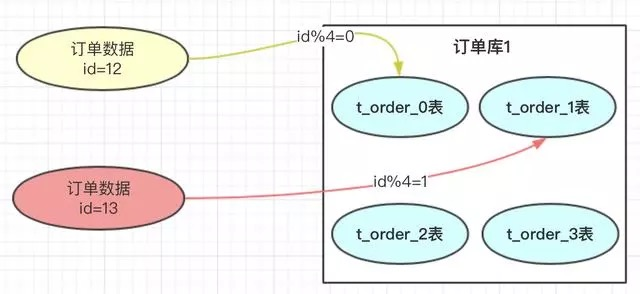
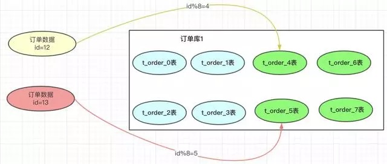
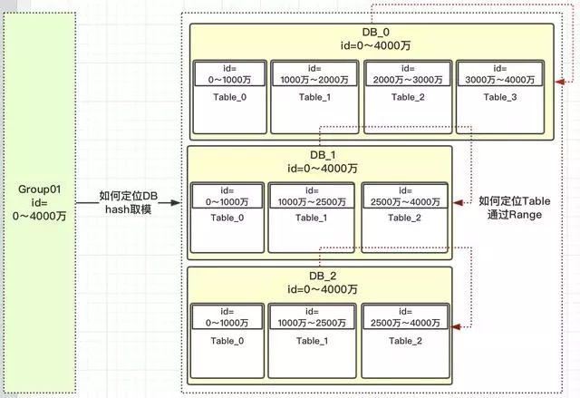
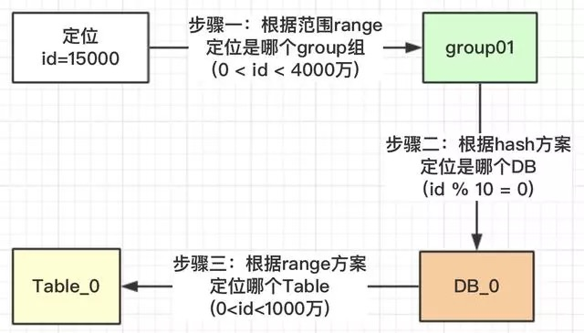
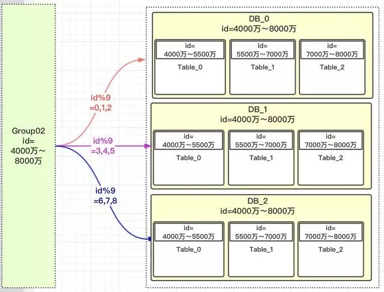
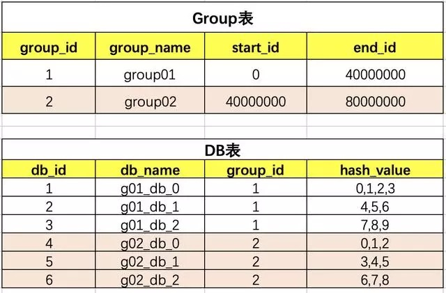
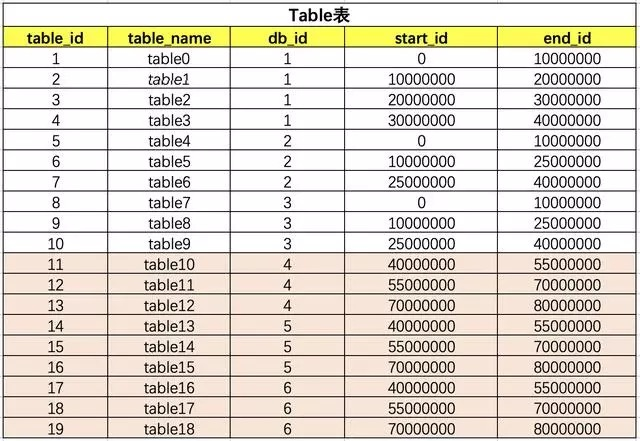

	中大型项目中，一旦遇到数据量比较大，小伙伴应该都知道就应该对数据进行拆分了。**有垂直和水平两种**。

​	**垂直拆分**比较简单，也就是本来一个数据库，数据量大之后，从业务角度进行拆分多个库。如下图，独立的拆分出订单库和用户库。

​	**水平拆分**的概念，是同一个业务数据量大之后，进行水平拆分。

​	上图中订单数据达到了4000万，我们也知道mysql单表存储量推荐是百万级，如果不进行处理，mysql单表数据太大，会导致性能变慢。使用方案可以参考数据进行水平拆分。把4000万数据拆分4张表或者更多。当然也可以分库，再分表；把压力从数据库层级分开。

## 分库分表方案

​	分库分表方案中有常用的方案，hash取模和range范围方案；分库分表方案最主要就是路由算法，把路由的key按照指定的算法进行路由存放。下边来介绍一下两个方案的特点。

### hash取模方案

​	在我们设计系统之前，可以先预估一下大概这几年的订单量，如：4000万。每张表我们可以容纳1000万，也我们可以设计4张表进行存储。

> 那具体如何路由存储的呢？hash的方案就是对指定的路由key（如：id）对分表总数进行取模，上图中，id=12的订单，对4进行取模，也就是会得到0，那此订单会放到0表中。id=13的订单，取模得到为1，就会放到1表中。为什么对4取模，是因为分表总数是4。

* 优点
  订单数据可以均匀的放到那4张表中，这样此订单进行操作时，就不会有热点问题。

  > 热点的含义：热点的意思就是对订单进行操作集中到1个表中，其他表的操作很少。
  >
  > 订单有个特点就是时间属性，一般用户操作订单数据，都会集中到这段时间产生的订单。如果这段时间产生的订单 都在同一张订单表中，那就会形成热点，那张表的压力会比较大。

* 缺点
  将来的数据迁移和扩容，会很难。

  如：业务发展很好，订单量很大，超出了4000万的量，那我们就需要增加分表数。如果我们增加4个表
  

  > 一旦我们增加了分表的总数，取模的基数就会变成8，以前id=12的订单按照此方案就会到4表中查询，但之前的此订单时在0表的，这样就导致了数据查不到。就是因为取模的基数产生了变化。

  ​	遇到这个情况，我们小伙伴想到的方案就是做数据迁移，把之前的4000万数据，重新做一个hash方案，放到新的规划分表中。也就是我们要做数据迁移。这个是很痛苦的事情。有些小公司可以接受晚上停机迁移，但大公司是不允许停机做数据迁移的。

  > 当然做数据迁移可以结合自己的公司的业务，做一个工具进行，不过也带来了很多工作量，每次扩容都要做数据迁移

那有没有不需要做数据迁移的方案呢，我们看下面的方案

### range范围方案

range方案也就是以范围进行拆分数据。

​	range方案比较简单，就是把一定范围内的订单，存放到一个表中；如上图id=12放到0表中，id=1300万的放到1表中。设计这个方案时就是前期把表的范围设计好。通过id进行路由存放。

* 优点
  我们小伙伴们想一下，此方案是不是有利于将来的扩容，不需要做数据迁移。即时再增加4张表，之前的4张表的范围不需要改变，id=12的还是在0表，id=1300万的还是在1表，新增的4张表他们的范围肯定是 大于 4000万之后的范围划分的。

* 缺点
  有热点问题，我们想一下，因为id的值会一直递增变大，那这段时间的订单是不是会一直在某一张表中，如id=1000万 ～ id=2000万之间，这段时间产生的订单是不是都会集中到此张表中，这个就导致1表过热，压力过大，而其他的表没有什么压力。

### 总结

**hash取模方案**：没有热点问题，但扩容迁移数据痛苦

**range方案**：不需要迁移数据，但有热点问题。

那有什么方案可以做到两者的优点结合呢？，**==即不需要迁移数据，又能解决数据热点的问题呢？==**

**其实还有一个现实需求，能否根据服务器的性能以及存储高低，适当均匀调整存储呢？**

## 方案思路

​	**hash是可以解决数据均匀的问题，range可以解决数据迁移问题，那我们可以不可以两者相结合呢？利用这两者的特性呢？**

​	我们考虑一下数据的扩容代表着，路由key（如id）的值变大了，这个是一定的，那我们先保证数据变大的时候，**首先用range方案让数据落地到一个范围里面**。这样以后id再变大，**那以前的数据是不需要迁移的**。

​	但又要考虑到**数据均匀**，那是不是可以在**一定的范围内数据均匀**的呢？因为我们每次的扩容肯定会**事先设计好这次扩容的范围大小**，我们只要**保证这次的范围内的数据均匀**是不是就ok了。

## 方案设计

​	我们先定义一个group组概念，这组里面包含了一些分库以及分表，如下图

上面有几个关键点：

> 1）id=0～4000万肯定落到group01组中
>
> 2）group01组有3个DB，那一个id如何路由到哪个DB？
>
> 3）根据hash取模定位DB，那模数为多少？模数要为所有此group组DB中的表数，上图总表数为10。为什么要去表的总数？而不是DB总数3呢？
>
> 4）如id=12，id%10=2；那值为2，落到哪个DB库呢？这是设计是前期设定好的，那怎么设定的呢？
>
> 5）一旦设计定位哪个DB后，就需要确定落到DB中的哪张表呢？

## 核心主流程

​	按照上面的流程，我们就可以根据此规则，定位一个id，我们看看有没有避免热点问题。

​	我们看一下，id在【0，1000万】范围内的，根据上面的流程设计，1000万以内的id都均匀的分配到DB_0,DB_1,DB_2三个数据库中的Table_0表中，为什么可以均匀，因为我们用了hash的方案，对10进行取模。

> 上面我们也提了疑问，为什么对表的总数10取模，而不是DB的总数3进行取模？我们看一下为什么DB_0是4张表，其他两个DB_1是3张表？

​	在我们安排服务器时，有些服务器的性能高，存储高，就可以安排多存放些数据，有些性能低的就少放点数据。如果我们取模是按照DB总数3，进行取模，那就代表着【0，4000万】的数据是平均分配到3个DB中的，那就不能够实现按照服务器能力适当分配了。

​	按照Table总数10就能够达到，看如何达到

​	上图中我们对10进行取模，如果值为【0，1，2，3】就路由到DB_0，【4，5，6】路由到DB_1，【7，8，9】路由到DB_2。现在小伙伴们有没有理解，这样的设计就可以把多一点的数据放到DB_0中，其他2个DB数据量就可以少一点。DB_0承担了4/10的数据量，DB_1承担了3/10的数据量，DB_2也承担了3/10的数据量。整个Group01承担了【0，4000万】的数据量。

> 注意：小伙伴千万不要被DB_1或DB_2中table的范围也是0～4000万疑惑了，这个是范围区间，也就是id在哪些范围内，落地到哪个表而已。

​	上面一大段的介绍，就解决了热点的问题，以及可以按照服务器指标，设计数据量的分配。

## 如何扩展

​	其实上面设计思路理解了，扩容就已经出来了；那就是扩容的时候再设计一个group02组，定义好此group的数据范围就ok了。

​	因为是新增的一个group01组，所以就没有什么数据迁移概念，完全是新增的group组，而且这个group组照样就防止了热点，也就是【4000万，5500万】的数据，都均匀分配到三个DB的table_0表中，【5500万～7000万】数据均匀分配到table_1表中。

## 系统设计

​	思路确定了，设计是比较简单的，就3张表，把group，DB，table之间建立好关联关系就行了。

group和DB的关系

table和db的关系

​	上面的表关联其实是比较简单的，只要原理思路理顺了，就ok了。小伙伴们在开发的时候不要每次都去查询三张关联表，可以保存到缓存中（本地jvm缓存），这样不会影响性能。

​	一旦需要扩容，小伙伴是不是要增加一下group02关联关系，那应用服务需要重新启动吗？

​	简单点的话，就凌晨配置，重启应用服务就行了。但如果是大型公司，是不允许的，因为凌晨也有订单的。那怎么办呢？本地jvm缓存怎么更新呢？

​	其实方案也很多，可以使用用zookeeper，也可以使用分布式配置，这里是比较推荐使用分布式配置中心的，可以将这些数据配置到分布式配置中心去。