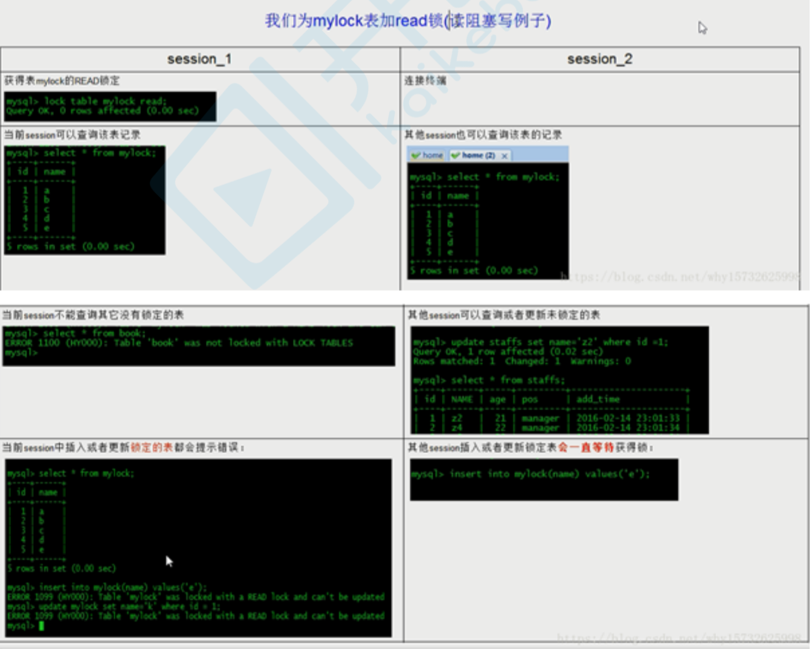

# MySQL单机安装

```shell
操作系统:CentOS 7 
MySQL:5.6
```

## MySQL的卸载

### 查看MySQL软件

```shell
rpm -qa|grep mysql
```

### 卸载MySQL

```shell
yum remove -y mysql mysql-libs mysql-common
rm -rf /var/lib/mysql
rm /etc/my.cnf
```

查看是否还有 MySQL 软件,有的话继续删除。
软件卸载完毕后如果需要可以删除 MySQL 的数据库: `/var/lib/mysql`

## 安装MySQL

```shell
wget http://dev.mysql.com/get/mysql-community-release-el6-5.noarch.rpm
rpm -ivh mysql-community-release-el6-5.noarch.rpm
yum install -y mysql-community-server
```

## 配置MySQL

```shell
vim /etc/my.cnf
```

修改内容如下：

```shell
[mysqld]
# MySQL设置大小写不敏感:默认:区分表名的大小写,不区分列名的大小写 # 0:大小写敏感 1:大小写不敏感
lower_case_table_names=1
# 默认字符集
default-character-set=utf8
```

## 启动MySQL

```mysql
systemctl start mysqld

-- 重启
systemctl restart mysqld
```

## 设置root用户密码

例如:为 `root` 账号设置密码为 `111111` :

```shell
/usr/bin/mysqladmin -u root password 'root'
```

## 登录MySQL

* 登录命令：

  ```shell
  #-u:指定数据库用户名 -p:指定数据库密码,记住-u和登录密码之间没有空格
  mysql -uroot -proot
  ```

## MySQL远程连接授权

* 授权命令

  ```shell
  grant 权限 on 数据库对象 to 用户
  ```

* 示例：授予`root`用户对所有数据库对象的全部操作权限:

  ```mysql
  -- %表示所有机器，也可以制定具体IP
  mysql>GRANT ALL PRIVILEGES ON *.* TO 'root'@'%' IDENTIFIED BY 'root' WITH GRANT
  OPTION;
  ```

* 命令说明

  * `ALL PRIVILEGES` :表示授予所有的权限,此处可以指定具体的授权权限。
  * `*.*` :表示所有库中的所有表
  * `'root'@'%'` : root是数据库的用户名,%表示是任意ip地址,可以指定具体ip地址。
  * `IDENTIFIED BY 'root'` :root是数据库的密码。

## 关闭Linux防火墙

```shell
# 两个命令组合使用
systemctl stop firewalld(默认)
systemctl disable firewalld.service(设置开启不启动)
```

# DDL语句

## 数据库操作：database

### 创建数据库

```mysql
create database 数据库名;
create database 数据库名 character set 字符集;
```

### 查看数据库

* 查看数据库服务器中的所有的数据库:

  ```mysql
  show databases;
  ```

* 查看某个数据库的定义的信息:

  ```mysql
  show create database 数据库名;
  ```

### 删除数据库（慎用）

```mysql
drop database 数据库名称;
```

### 其他数据库操作命令

* 切换数据库:

  ```mysql
  use 数据库名;
  ```

* 查看正在使用的数据库:

  ```mysql
  select database();
  ```

## 表操纵：table

### 字段类型

* 常用的类型有：

  * 数字型:int
  * 浮点型:double 
  * 字符型:varchar(可变长字符串) 
  * 日期类型:date(只有年月日,没有时分秒) 
    datetime(年月日,时分秒) 
  * boolean类型:不支持,一般使用`tinyint(1)`替代(值为0和1) 

  

  

### 创建表

```mysql
create table 表名(
  字段名 类型(长度) 约束, 
  字段名 类型(长度) 约束
);
```

* 单表约束

  ```sql
  - 主键约束:primary key 
  - 唯一约束:unique
  - 非空约束:not null
  ```

* 注意⚠️：

  ```mysql
  主键约束 = 唯一约束 + 非空约束
  ```

### 查看表

* 查看数据库中的所有表:

  ```mysql
  show tables;
  ```

* 查看表结构:

  ```mysql
  desc 表名;
  ```

### 删除表

```sql
drop table 表名;
```

### 修改表

```mysql
alter table 表名 add 列名 类型(长度) 约束; --修改表添加列.
alter table 表名 modify 列名 类型(长度) 约束; --修改表修改列的类型长度及约束. 
alter table 表名 change 旧列名 新列名 类型(长度) 约束; --修改表修改列名.
alter table 表名 drop 列名; --修改表删除列.
rename table 表名 to 新表名; --修改表名
alter table 表名 character set 字符集; --修改表的字符集
```

# DML语句

## 插入记录：insert

* 语法

  ```sql
  insert into 表 (列名1,列名2,列名3..) values (值1,值2,值3..); -- 向表中插入某些列 
  insert into 表 values (值1,值2,值3..); --向表中插入所有列
  insert into 表 (列名1,列名2,列名3..) values select (列名1,列名2,列名3..) from 表; 
  insert into 表 values select * from 表;
  ```

* 注意⚠️

  1. 列名数与values后面的值的个数相等 
  2. 列的顺序与插入的值得顺序一致 
  3. 列名的类型与插入的值要一致. 
  4. 插入值得时候不能超过最大长度. 
  5. 值如果是字符串或者日期需要加引号' ' (一般是单引号 )

* 例如：

  ```sql
  INSERT INTO sort(sid,sname) VALUES('s001', '电器'); 
  INSERT INTO sort(sid,sname) VALUES('s002', '服饰'); 
  INSERT INTO sort VALUES('s003', '化妆品');
  INSERT INTO sort VALUES('s004','书籍');
  ```

## 更新记录：update

* 语法

  ```sql
  update 表名 set 字段名=值,字段名=值;
  update 表名 set 字段名=值,字段名=值 where 条件;
  ```

* 注意

  * 列名的类型与修改的值要一致.
  * 修改值得时候不能超过最大长度.
  * 值如果是字符串或者日期需要加' '.

## 删除记录：delete

* 语法

  ```sql
  delete from 表名 [where 条件];
  ```

* 面试题⚠️⚠️⚠️

  ```sql
  --删除表中所有记录使用【delete from 表名】,还是用【truncate table 表名】?
  --删除方式:
  -- delete :一条一条删除,不清空auto_increment记录数。
  -- truncate :直接将表删除,重新建表,auto_increment将置为零,从新开始。
  ```

# DQL语句

## 准备工作

```mysql
-- 创建商品表
CREATE TABLE products (
  pid INT PRIMARY KEY AUTO_INCREMENT, # 自增加 AUTO_INCREMENT 
  pname VARCHAR(20),#商品名称
  price DOUBLE, #商品价格
  pdate DATE, # 日期
  sid VARCHAR(20) #分类ID
);

INSERT INTO products VALUES(NULL,'泰国大榴莲', 98, NULL, 's001'); 
INSERT INTO products VALUES(NULL,'新疆大枣', 38, NULL, 's002'); 
INSERT INTO products VALUES(NULL,'新疆切糕', 68, NULL, 's001'); 
INSERT INTO products VALUES(NULL,'十三香', 10, NULL, 's002'); 
INSERT INTO products VALUES(NULL,'老干妈', 20, NULL, 's002');
```

## DQL语法顺序

完整DQL语法顺序

```sql
SELECT DISTINCT
    < select_list >
FROM
    < left_table > < join_type >
JOIN < right_table > ON < join_condition >
WHERE
    < where_condition >
GROUP BY
    < group_by_list >
HAVING
    < having_condition >
ORDER BY
    < order_by_condition >
LIMIT < limit_number >
```

### 简单查询

SQL语法关键字：`SELECT、FROM`

* 查询所有商品

  ```mysql
  select * from product;
  ```

* 查询商品名称和价格

  ```mysql
  select pname,price from product;
  ```

* 别名查询，使用关键字as，as可以省略

  * 表别名

    ```mysql
    select * from product as p;
    ```

  * 列别名

    ```mysql
    select pname as pn from product;
    ```

* 过滤重复值

  ```mysql
  select distinct price from product;
  ```

* 查询结果是表达式(运算查询):将所有商品的价格+10元进行显示.

  ```mysql
  select pname,price+10 from product;
  ```

### 条件查询

SQL语法关键字：`WHERE`

WHERE后的条件语法：

1. \> ,<,=,>=,<=,<>

2. like 使用占位符 _ 和 % _代表一个字符 %代表任意个字符. 

   ```mysql
   select * from product where pname like '%新%';
   ```

3. in在某个范围中获得值(exists). 

   ```mysql
   select * from product where pid in (2,5,8);     
   ```


* 查询商品名称为十三香的商品所有信息

  ```mysql
  select * from product where pname = '十三香';
  ```

* 查询商品价格>60元的所有的商品信息

  ```mysql
  select * from product where price > 60;
  ```

### 排序

SQL语法关键字`ORDER BY、ASC(升序)、DESC(降序)`

* 查询所有的商品,按价格进行排序.(asc-升序,desc-降序)

  ```mysql
  select * from product order by price;
  ```

* 查询名称有新的商品的信息并且按价格降序排序.

  ```mysql
  select * from product where pname like '%新%' order by price desc;
  ```

### 聚合函数（组函数）

特点：只对单列进行操作，常用的聚合函数：

> sum():求某一列的和
> avg():求某一列的平均值
> max():求某一列的最大值
> min():求某一列的最小值
> count():求某一列的元素个数

* 获得所有商品的价格的总和:

  ```mysql
  select sum(price) from product;
  ```

* 获得所有商品的平均价格:

  ```mysql
  select avg(price) from product;
  ```

* 获得所有商品的个数：

  ```mysql
  select count(*) from product;
  ```

### 分组

SQL语法关键字：`GROUP BY、HAVING`

注意事项⚠️：

> 1. select语句中的列(非聚合函数列),必须出现在group by子句中
> 1. group by子句中的列,不一定要出现在select语句中
> 1. 聚合函数只能出现select语句中或者having语句中,一定不能出现在where语句中。

* 根据cid字段分组,分组后统计商品的个数.

  ```mysql
  select cid,count(*) from product group by cid;
  ```

* 根据cid分组,分组统计每组商品的平均价格,并且平均价格> 60;

  ```mysql
  select cid,avg(price) from product group by cid having avg(price)>60;
  ```

## 分页查询

SQL语法关键字:`LIMIT  [offset(偏移量),] rows(每页多少行)`

格式：`SELECT * FROM table LIMIT [offset,] rows`

* `LIMIT`关键字不是`SQL92`标准提出的关键字，它是MyQL独有的语法。
* 通过`LIMIT`关键字，MySQL实现了物理分页。
* 分页分为逻辑分页和物理分页
  * 逻辑分页:将数据库中的数据查询到内存之后再进行分页。
  * 物理分页:通过LIMIT关键字,直接在数据库中进行分页,最终返回的数据,只是分页后的数据。

## 子查询

* 定义

> 1. 子查询允许把一个查询嵌套在另一个查询当中。
> 2. 子查询,又叫内部查询,相对于内部查询,包含内部查询的就称为外部查询。
> 3. 子查询可以包含普通select可以包括的任何子句,比如:distinct、 group by、order by、limit、join和 union等; 
> 4. 但是对应的外部查询必须是以下语句之一:`select、insert、update、delete`。  

* 位置

> * select中、from 后、where 中
> * group by 和order by 中无实用意义。

## 其他查询语句

* union 集合的并集(不包含重复记录)
* unionall 集合的并集(包含重复记录)

# SQL解析顺序

接下来再走一步,让我们看看一条SQL语句的前世今生。
首先看一下示例语句:

```sql
SELECT DISTINCT
    < select_list >
FROM
    < left_table > < join_type >
JOIN < right_table > ON < join_condition >
WHERE
    < where_condition >
GROUP BY
    < group_by_list >
HAVING
    < having_condition >
ORDER BY
    < order_by_condition >
LIMIT < limit_number >
```

然而它的执行顺序⚠️⚠️⚠️是这样的:

```sql
 1 FROM <left_table>
 2 ON <join_condition>
 3 <join_type> JOIN <right_table> --join多张表，第二步和第三步会循环执行
 4 WHERE <where_condition> --第四步会循环执行,多个条件的执行顺序是从左往右的（Oracle是从右往左的）。
 5 GROUP BY <group_by_list>
 6 HAVING <having_condition>
 7 SELECT --分组之后才会执行SELECT
 8 DISTINCT <select_list>
 9 ORDER BY <order_by_condition>
10 LIMIT <limit_number> --前9步都是SQL92标准语法。limit是MySQL的独有语法。
```

虽然自己没想到是这样的,不过一看还是很自然和谐的,从哪里获取,不断的过滤条件,要选择一样或不一样的,排好序,那才知道要取前几条呢。
既然如此了,那就让我们一步步来看看其中的细节吧。

## 准备工作

1. 创建测试库

   ```mysql
   create database testQuery
   ```

2. 创建测试表

   ```mysql
   CREATE TABLE table1
   (
       uid VARCHAR(10) NOT NULL,
       name VARCHAR(10) NOT NULL,
       PRIMARY KEY(uid)
   )ENGINE=INNODB DEFAULT CHARSET=UTF8;
   CREATE TABLE table2
   (
       oid INT NOT NULL auto_increment,
       uid VARCHAR(10),
       PRIMARY KEY(oid)
   )ENGINE=INNODB DEFAULT CHARSET=UTF8;
   ```

3. 插入数据

   ```mysql
   INSERT INTO table1(uid,name) VALUES('aaa','mike'),('bbb','jack'),('ccc','mike'),
   ('ddd','mike');
   INSERT INTO table2(uid) VALUES('aaa'),('aaa'),('bbb'),('bbb'),('bbb'),('ccc'),(NULL);
   ```

4. Select查询

   ```mysql
   SELECT
   a.uid,
       count(b.oid) AS total
   FROM
       table1 AS a
   LEFT JOIN table2 AS b ON a.uid = b.uid
   WHERE
       a. NAME = 'mike'
   GROUP BY
   a.uid HAVING
       count(b.oid) < 2
   ORDER BY
       total DESC
   LIMIT 1;
   ```

   现在开始SQL解析之旅吧!

## 1.FROM

对FROM的左边的表和右边的表计算`笛卡尔积(CROSS JOIN)`。产生`虚表VT1`

```mysql
mysql> select * from table1,table2; 
```


## 2.ON过滤

对`虚表VT1`进行ON筛选,只有那些符合的行才会被记录在`虚表VT2`中。
注意⚠️：这里因为语法限制,使用了`WHERE`代替,从中读者也可以感受到两者之间微妙的关系;

```mysql
mysql> SELECT
    -> *
    -> FROM
    -> table1,
    -> table2
    -> WHERE
    -> table1.uid = table2.uid
    -> ;
```


## 3.OUTER JOIN添加外部列

​	如果指定了`OUTER JOIN`(比如`left join、 right join`),那么保留表中未匹配的行就会作为外部行添加到`虚拟表 VT2 `中,产生 `虚拟表VT3 `。 

​	如果`FROM`子句中包含两个以上的表的话,那么就会对上一个`join`连接产生的结果VT3和下一个表重复执行步骤1~3这 三个步骤,一直到处理完所有的表为止。 

```mysql
mysql> SELECT
    -> *
    -> FROM
    -> table1 AS a
    -> LEFT OUTER JOIN table2 AS b ON a.uid = b.uid;
```


## 4.WHERE

​	对 `虚拟表VT3` 进行`WHERE`条件过滤。只有符合的记录才会被插入到 `虚拟表VT4` 中。 

注意⚠️：

​	此时因为分组, *不能使用聚合运算*;也*不能使用SELECT中创建的别名* ; 

与ON的区别：

* 如果有外部列, ,主表(保留表)会返回所有的列; 
* 如果没有添加外部列,两者的效果是一样的;  

应用：

* 对主表的过滤应该放在WHERE; 
* 对于关联表,先条件查询后连接则用ON,先连接后条件查询则用WHERE; 

```mysql
mysql> SELECT
    -> *
    -> FROM
    -> table1 AS a
    -> LEFT OUTER JOIN table2 AS b ON a.uid = b.uid
    -> WHERE
    -> a. NAME = 'mike';
```


## 5.GROUP BY

根据`group by`子句中的列,对VT4中的记录进行分组操作,产生`虚拟表VT5`。

注意⚠️：

​	其后处理过程的语句,如`SELECT,HAVING`,所用到的列必须包含在`GROUP BY`中。对于没有出现的,得用聚合函数;

原因：`GROUP BY`改变了对表的引用,将其转换为新的引用方式,能够对其进行下一级逻辑操作的列会减少;

我的理解是：

​	根据分组字段,将具有相同分组字段的记录归并成一条记录,因为每一个分组只能返回一条记录,除非是被过滤掉
了,而不在分组字段里面的字段可能会有多个值,多个值是无法放进一条记录的,所以必须通过聚合函数将这些具有
多值的列转换成单值;

```mysql
mysql> SELECT
    -> *
    -> FROM
    -> table1 AS a
    -> LEFT OUTER JOIN table2 AS b ON a.uid = b.uid
    -> WHERE
    -> a. NAME = 'mike'
    -> GROUP BY
    -> a.uid;
```


## 6.HAVING

对`虚拟表VT5`应用`having`过滤,只有符合的记录才会被插入到`虚拟表VT6`中。

```mysql
mysql> SELECT
    -> *
    -> FROM
    -> table1 AS a
    -> LEFT OUTER JOIN table2 AS b ON a.uid = b.uid
    -> WHERE
    -> a. NAME = 'mike'
    -> GROUP BY
    -> a.uid
    -> HAVING
    -> count(b.oid) < 2;
```


## 7.SELECT

这个子句对SELECT子句中的元素进行处理,生成VT5表。(5-J1)计算表达式 计算SELECT 子句中的表达式,生成VT5-J1

## 8.DISTINCT

寻找VT5-1中的重复列,并删掉,生成VT5-J2 

​	如果在查询中指定了`DISTINCT`子句,则会创建一张内存临时表(如果内存放不下,就需要存放在硬盘了)。这张临时表的表结构和上一步产生的`虚拟表VT5`是一样的,不同的是对进行`DISTINCT`操作的列增加了一个唯一索引,以此来 除重复数据。 

```mysql
mysql> SELECT
    -> a.uid,
    -> count(b.oid) AS total
    -> FROM
    -> table1 AS a
    -> LEFT OUTER JOIN table2 AS b ON a.uid = b.uid
    -> WHERE
    -> a. NAME = 'mike'
    -> GROUP BY
    -> a.uid
    -> HAVING
    -> count(b.oid) < 2;
```


## 9.ORDER BY

从VT5-J2中的表中,根据`ORDER BY` 子句的条件对结果进行排序,生成VT6表。

注意⚠️：唯一可使用SELECT中别名的地方;

```mysql
mysql> SELECT
    -> a.uid,
    -> count(b.oid) AS total
    -> FROM
    -> table1 AS a
    -> LEFT OUTER JOIN table2 AS b ON a.uid = b.uid
    -> WHERE
    -> a. NAME = 'mike'
    -> GROUP BY
    -> a.uid
    -> HAVING
    -> count(b.oid) < 2
    -> ORDER BY
    -> total DESC;
```


## 10.LIMT（MySQL特有）

`LIMIT`子句从上一步得到的 `VT6虚拟表` 中选出从指定位置开始的指定行数据。

注意⚠️：`offset` 和`rows` 的正负带来的影响;

当偏移量很大时，效率是很低的，可以这样做

* **采用子查询的方式优化** ,在子查询里先从索引获取到最大id,然后倒序排,再取N行结果集；
* **采用INNER JOIN优化**,JOIN子句里也优先从索引获取ID列表,然后直接关联查询获得最终结果

```mysql
mysql> SELECT
    -> a.uid,
    -> count(b.oid) AS total
    -> FROM
    -> table1 AS a
    -> LEFT JOIN table2 AS b ON a.uid = b.uid
    -> WHERE
    -> a. NAME = 'mike'
    -> GROUP BY
    -> a.uid
    -> HAVING
    -> count(b.oid) < 2
    -> ORDER BY
    -> total DESC
    -> LIMIT 1;
```


## 解析顺序总结

### 图示


### 流程分析

1. FROM(将最近的两张表,进行笛卡尔积)---VT1 
2. ON(将VT1按照它的条件进行过滤)---VT2 
3. LEFT JOIN(保留左表的记录)---VT3 
4. WHERE(过滤VT3中的记录)--VT4...VTn 
5. GROUP BY(对VT4的记录进行分组)---VT5 
6. HAVING(对VT5中的记录进行过滤)---VT6 
7. SELECT(对VT6中的记录,选取指定的列)--VT7 
8. ORDER BY(对VT7的记录进行排序)--VT8 
9. LIMIT(对排序之后的值进行分页)—MySQL特有的语法

流程说明：

* 单表查询：根据 WHERE 条件过滤表中的记录,形成中间表(这个中间表对用户是不可见的);然后根据
  SELECT 的选择列选择相应的列进行返回最终结果。

* 两表连接查询：对两表求积(笛卡尔积)并用 ON 条件和连接连接类型进行过滤形成中间表;然后根据WHERE条
  件过滤中间表的记录,并根据 SELECT 指定的列返回查询结果。

  ```
  笛卡尔积:行相乘、列相加。
  ```

* 多表连接查询：先对第一个和第二个表按照两表连接做查询,然后用查询结果和第三个表做连接查询,以此类
  推,直到所有的表都连接上为止,最终形成一个中间的结果表,然后根据WHERE条件过滤中间表的记录,并根据
  SELECT指定的列返回查询结果。

### WHERE条件解析顺序

* MySQL :从左往右去执行 WHERE 条件的。
* Oracle :从右往左去执行 WHERE 条件的。

```
写WHERE条件的时候,优先级高的部分要去编写过滤力度最大的条件语句。
```

# 多表之间的关系

如何分析表关系及建立表关系。准备工作：

1. 分类表

   ```mysql
   create table category(
       cid varchar(32) primary key,
       cname varchar(100)
   );
   ```

2. 商品表

   ```mysql
   create table product(
       pid varchar(32) primary key,
       pname varchar(40),
       price double
   );
   ```

3. 订单表

   ```mysql
   create table orders(
       oid varchar(32) primary key,
       totalprice double
   );
   ```

4. 订单项表

   ```mysql
   create table orderitem(
       oid varchar(50),
       pid varchar(50)
   );
   ```

## 表与表之间的关系

​	表与表之间的关系，说的是表与表之间的数据关系。

* 一对一关系(一夫一妻)
* 一对多关系(会员和订单)
* 多对多关系(商品和订单)

## 外键

如何表示表与表之间的关系呢?就是使用外键约束表示的。 

要想理解外键,我们先去理解表的角色:主表和从表(需要建立关系才有了主从表的角色区分)

* 主从表的理解
  

  现在我们有两张表"分类表"和"商品表"。
  目前从表的声明上来说，没有关系，但是我们有个需求：

  商品应该所属的分类，这个时候需要将分类表和商品表建立关系，如何建立？

  按照以上需求分析：

  ```shell
  主表是:商品表。主表中,应该有一个字段去关联从表,而这个关联字段就是外键。
  从表是:分类表。从表中,应该有一个字段去关联主表,而这个关联字段就是主键。
  ```

* 主键外键的理解
  

* 如何操作外键

  * 主表添加外键

    ```mysql
    alter table 表名 add [constraint][约束名称] foreign key (主表外键字段) references 从表(从表 主键)
    ```

  * 主表删除外键

    ```mysql
    alter table 表名 drop foreign key 外键约束名称
    ```

* 使用外键目的

## 一对一关系（了解）

在实际工作中,一对一在开发中应用不多,因为一对一完全可以创建成一张表

案例：一个丈夫只能有一个妻子

* 建表语句:

  ```mysql
  CREATE TABLE wife(
      id  INT PRIMARY KEY ,
      wname  VARCHAR(20),
      sex CHAR(1)
  );
  CREATE TABLE husband(
      id  INT PRIMARY KEY ,
      hname  VARCHAR(20),
      sex CHAR(1)
  );
  ```

* 一对一关系创建方式1之 :
  添加外键列wid,指定该列的约束为唯一(不加唯一约束就是一对多关系)

  ```mysql
  LTER TABLE husband ADD wid INT UNIQUE;
  ```

* 添加外键约束

  ```mysql
  alter table husband add foreign key (wid) references wife(id);
  ```

* 一对一关系创建方式2之 :(课后作业)

  * 思路:使用主表的主键作为外键去关联从表的主键

## 一对多关系

例案:一个分类对应多个商品

总结：有外键的就是多的一方。

注意⚠️事项：一对多关系和一对一关系的创建很类似,唯一区别就是外键不唯一。

## 多对多关系

案例：同一个商品对应多个订单，一个订单对应多个商品


* 注意⚠️事项：
  * 需要中间表去完成多对多关系的创建
  * 多对多关系其实就是两个一对多关系的组合
* 多对多关系创建
  * 创建中间表,并在其中创建多对多关系中两张表的外键列
  * 在中间表中添加外键约束
  * 在中间表中添加联合主键约束

# 多表关联查询

​	我们已经学会了如何在一张表中读取数据,这是相对简单的,但是在真正的应用中经常需要从多个数据表中读取数
据。

​	本章节我们将向大家介绍如何使用 `MySQL` 的 `JOIN` 在两个或多个表中查询数据。你可以在 `SELECT`, `UPDATE` 和 `DELETE` 语句中使用 `MySQL` 的 `JOIN` 来联合多表查询。 

`JOIN` 按照大致分为如下三类: 

* CROSS JOIN(交叉连接)
* INNER JOIN(内连接或等值连接)。 
* OUTER JOIN(外连接) 

建表语句：

```mysql
insert into category (cid,cname) values ('c001','家电'); 
insert into category (cid,cname) values ('c002','服饰'); 
insert into category (cid,cname) values ('c003','化妆品');
insert into product(pid,pname,price,cid) values ('p001','联想',5000,'c001'); 
insert into product(pid,pname,price,cid) values ('p002','海尔',3000,'c001'); 
insert into product(pid,pname,price,cid) values ('p003','雷神',5000,'c001');
insert into product(pid,pname,price,cid) values ('p004','阿迪',1000,'c002'); 
insert into product(pid,pname,price,cid) values ('p005','耐克',1200,'c002');
insert into product(pid,pname,price,cid) values ('p006','NB',800,'c002'); 
insert into product(pid,pname,price,cid) values ('p007','彪马',600,'c002');
insert into product(pid,pname,price,cid) values ('p008','雪花秀',1500,'c003'); 
insert into product(pid,pname,price,cid) values ('p009','悦诗风吟',1100,'c003');
```

## 交叉连接

关键字：`CROSS JOIN`

交叉连接也叫笛卡尔积连接。尔积连接是指在数学中,两个集合X和Y的笛卡尓积(Cartesian product),又称直积,表示为 X*Y ,第一个对象是 X 的成员而第二个对象是 Y 的所有可能有序对的其中一个成员。

交叉连接的表现：**行数相乘、列数相加**

* 隐式交叉连接

  ```mysql
  SELECT  *  FROM   A, B
  ```

* 显式交叉连接

  ```mysql
  SELECT  *  FROM  A  CROSS  JOIN  B
  ```

案例：查询商品表和分类表的笛卡尔积


## 内连接

关键字：`INNER JOIN`

内连接也叫**等值连接** ,内联接使用比较运算符根据每个表共有的列的值匹配两个表中的行。

* 隐式内连接

  ```mysql
  SELECT  *  FROM  A,B  WHERE  A.id = B.id
  ```

* 显示内连接

  ```mysql
  SELECT  *  FROM  A  INNER JOIN  B ON A.id = B.id
  ```

## 外连接

​	外联接可以是左向外联接、右向外联接或完整外部联接。也就是说外连接又分为:**左外连接、右外连接、全外连接**

外连接需要有主表或者保留表的概念。
在 FROM 子句中指定外联接时,可以由下列几组关键字中的一组指定:

* 左外连接

  ```mysql
  -- LEFT JOIN 或者 LEFT OUTER JOIN
  SELECT  *  FROM  A  LEFT  JOIN  B ON A.id = B.id
  ```

* 右外连接

  ```mysql
  -- RIGHT JOIN 或者 RIGHT OUTER JOIN
  SELECT  *  FROM  A  RIGHT  JOIN  B ON A.id = B.id
  ```

* 全外连接(**MySQL不支持**)

  ```mysql
  -- FULL JOIN 或 FULL OUTER JOIN
  SELECT  *  FROM  A  FULL JOIN  B ON A.id = B.id
  ```

外键连接总结：

* 通过业务需求,分析主从表
* 如果使用LEFT JOIN,则主表在它左边
* 如果使用RIGHT JOIN,则主表在它右边
* 查询结果以主表为主,从表记录匹配不到,则补 null 

# MySQL锁

## MySQL锁介绍

* 按照锁的粒度来说,MySQL主要包含三种类型(级别)的锁定机制:

  ```mysql
  -- 全局锁:锁的是整个database。由MySQL的SQL layer（server）层实现的
  -- 表级锁:锁的是某个table。由MySQL的SQL layer（server）层实现的
  -- 行级锁:锁的是某行数据,也可能锁定行之间的间隙。由某些存储引擎实现,比如InnoDB。
  ```

* 按照锁的功能来说分为: 共享读锁和排他写锁 。

* 按照锁的实现方式分为：悲观锁和乐观锁(使用某一版本列或者唯一列进行逻辑控制)

* 表级锁和行级锁区别：

  ```mysql
  -- 表级锁:开销小,加锁快;不会出现死锁;锁定粒度大,发生锁冲突的概率最高,并发度最低;
  -- 行级锁:开销大,加锁慢;会出现死锁;锁定粒度最小,发生锁冲突的概率最低,并发度也最高;
  ```

## MySQL表级锁

### 表级锁介绍

由MySQL SQL layer（server层）层实现

* MySQL的表级锁有两种:

  ```mysql
  -- 一种是表锁。
  -- 一种是元数据锁(meta data lock,MDL)。
  ```

* MySQL 实现的表级锁定的争用状态变量:

  ```shell
  mysql> show status like 'table%';
  ```

  

  ```mysql
  -- table_locks_immediate:产生表级锁定的次数;
  -- table_locks_waited:出现表级锁定争用而发生等待的次数;
  ```

### 表锁介绍

* 表锁有两种表现形式：

  ```mysql
  -- 表共享读锁(Table Read Lock) 
  -- 表独占写锁(Table Write Lock)
  ```

* 手动增加表锁

  ```mysql
  lock table 表名称 read(write),表名称2 read(write),其他;
  ```

* 查看表锁情况

  ```mysql
  show open tables;
  ```

* 删除表锁

  ```mysql
  unlock tables;
  ```

### 表锁演示

#### 环境准备

```mysql
CREATE TABLE mylock (
    id int(11) NOT NULL AUTO_INCREMENT,
    NAME varchar(20) DEFAULT NULL,
    PRIMARY KEY (id)
);
INSERT INTO mylock (id,NAME) VALUES (1, 'a');
INSERT INTO mylock (id,NAME) VALUES (2, 'b');
INSERT INTO mylock (id,NAME) VALUES (3, 'c');
INSERT INTO mylock (id,NAME) VALUES (4, 'd');
```

#### 读锁演示




#### 写锁演示


#### 表锁使用

从两个维度来说，默认加锁和手动加锁：

* 默认加锁：对于表锁的使用，一般直接默认由MySQL帮我们去使用，如何使用呢？
  * 如果是DML和DQL语句，则默认加上读锁：`lock table xxx read`；
  * 如果是DDL语句，则默认加上写锁：`lock table xxx write`
* 手动加锁
  * 如果是DQL语句，则加读锁：
  * 如果是DML、DDL，则加写锁；

### 元数据锁介绍

​	MDL不需要显式使用,在访问一个表的时候会被自动加上。MDL的作用是,保证读写的正确性。你可以想象一下,如果一个查询正在遍历一个表中的数据,而执行期间另一个线程对这个表结构做变更,删了一列,那么查询线程拿到的结果跟表结构对不上,肯定是不行的。 

​	因此, 在MySQL5.5版本中引入了MDL,当对一个表做增删改查操作的时候,加 MDL 读锁;当要对表做结构变更操作的时候,加 MDL 写锁。 

* 读锁之间不互斥,因此你可以有多个线程同时对一张表增删改查。
* 读写锁之间、写锁之间是互斥的,用来保证变更表结构操作的安全性。因此,如果有两个线程要同时给一个表加字段,其中一个要等另一个执行完才能开始执行。

### 元数据锁演示


​	我们可以看到 session A 先启动,这时候会对表 t 加一个 MDL 读锁。由于 session B 需要的也是 MDL 读 锁,因此可以正常执行。 

​	之后 session C 会被 blocked,是因为 session A 的 MDL 读锁还没有释放,而 session C 需要 MDL 写锁, 因此只能被阻塞。 

​	如果只有 session C 自己被阻塞还没什么关系,但是之后所有要在表 t 上新申请 MDL 读锁的请求也会被 session C 阻塞。前面我们说了,所有对表的增删改查操作都需要先申请 MDL 读锁,就都被锁住,等于这个表现 在完全不可读写了。 

​	你现在应该知道了,事务中的 MDL 锁,在语句执行开始时申请,但是语句结束后并不会马上释放,而会等到整个事 务提交后再释放。 

## MySQL行级锁

### 行级锁介绍

MySQL的行级锁,是由存储引擎来实现的,这里我们主要讲解InnoDB的行级锁。

* InnoDB的行级锁,按照锁定范围来说,分为三种:

  ```mysql
  -- 记录锁(Record Locks):锁定索引中一条记录。
  -- 间隙锁(Gap Locks):要么锁住索引记录中间的值,要么锁住第一个索引记录前面的值或者最后一个索引记录后面
  的值。
  -- Next-Key Locks:是索引记录上的记录锁和在索引记录之前的间隙锁的组合。
  ```

* InnoDB的行级锁,按照功能来说,分为两种:

  ```mysql
  -- 共享锁(S):允许一个事务去读一行,阻止其他事务获得相同数据集的排他锁。
  -- 排他锁(X):允许获得排他锁的事务更新数据,阻止其他事务取得相同数据集的共享读锁和排他写锁。
  ```

  对于UPDATE、DELETE和INSERT语句,InnoDB会自动给涉及数据集加排他锁(X);

  对于普通SELECT语句,InnoDB不会加任何锁,事务可以通过以下语句显示给记录集加共享锁或排他锁。

  * 手动添加共享锁（S）：

    ```mysql
    SELECT * FROM table_name WHERE ... LOCK IN SHARE MODE
    ```

  * 手动添加排他锁（X）：

    ```mysql
    SELECT * FROM table_name WHERE ... FOR UPDATE
    ```

* InnoDB也实现了表级锁,也就是意向锁,意向锁是mysql内部使用的,不需要用户干预。

  ```mysql
  -- 意向共享锁(IS):事务打算给数据行加行共享锁,事务在给一个数据行加共享锁前必须先取得该表的IS锁。 
  -- 意向排他锁(IX):事务打算给数据行加行排他锁,事务在给一个数据行加排他锁前必须先取得该表的IX锁。
  ```

* InnoDB行锁是通过给索引上的索引项加锁来实现的 ,因此InnoDB这种行锁实现特点意味着:只有通过索引条件检索的数据,InnoDB才使用行级锁,否则,InnoDB将使用表锁!

  |                | 共享锁(S) | 排他锁(X) | 意向共享锁(IS) | 意向排他锁(IX) |
  | -------------- | --------- | --------- | -------------- | -------------- |
  | 共享锁(S)      | 兼容      | 冲突      | 兼容           | 冲突           |
  | 排他锁(X)      | 冲突      | 冲突      | 冲突           | 冲突           |
  | 意向共享锁(IS) | 兼容      | 冲突      | 兼容           | 兼容           |
  | 意向排他锁(IX) | 冲突      | 冲突      | 兼容           | 兼容           |

* Innodb所使用的行级锁定争用状态查看:

  ```mysql
  mysql> show status like 'innodb_row_lock%';
  ```

  

  ```mysql
  -- Innodb_row_lock_current_waits:当前正在等待锁定的数量;
  -- Innodb_row_lock_time:从系统启动到现在锁定总时间长度;
  -- Innodb_row_lock_time_avg:每次等待所花平均时间;
  -- Innodb_row_lock_time_max:从系统启动到现在等待最常的一次所花的时间; 
  -- Innodb_row_lock_waits:系统启动后到现在总共等待的次数;
  ```

  对于这5个状态变量,比较重要的主要是:

  ```mysql
  -- Innodb_row_lock_time_avg(等待平均时长) 
  -- Innodb_row_lock_waits(等待总次数)
  -- Innodb_row_lock_time(等待总时长)这三项。
  ```

尤其是当等待次数很高,而且每次等待时长也不小的时候,我们就需要分析系统中为什么会有如此多的等待,然后根
据分析结果着手指定优化计划。

### InnoDB行锁演示

#### 创建表及索引

```mysql
create table test_innodb_lock (a int(11),b varchar(16)) engine=innodb;
create index test_innodb_a_idx on test_innodb_lock(a);
create index test_innodb_lock_b_idx on test_innodb_lock(b);
```

#### 行锁定基本演示

|      | Session a                                                    | Session b                                                    |
| ---- | ------------------------------------------------------------ | ------------------------------------------------------------ |
| 1    | `mysql>set autocommit=0;Querty OK,0 rows affected(0.00 sec)` | `mysql>set autocommit=0;Querty OK,0 rows affected(0.00 sec)` |
| 2    | `mysql>update test_innodb_lock set b = 'b1' where a = 1;Query OK,1 rows affected(0.00 sec) Rows matched:1 Changed:1 Warnings:0更新，但是不提交` |                                                              |
| 3    |                                                              | `mysql>update test_innodb_lock set b = 'b2' where a = 1;被阻塞，等待` |
| 4    | `mysql>commit;Query OK,0 rows affected(0.05 sec)提交`        |                                                              |
| 5    |                                                              | `mysql>update test_innodb_lock set b = 'b2' where a = 1;Query OK,0 rows affected(36.14 sec) Rows matched:1 Changed:0 Warnings:0解锁阻塞，更新正常进行` |

#### 无索引升级为表锁演示

|      | Session a                                                    | Session b                                                    |
| ---- | ------------------------------------------------------------ | ------------------------------------------------------------ |
| 1    | `mysql>set autocommit=0;Querty OK,0 rows affected(0.00 sec)` | `mysql>set autocommit=0;Querty OK,0 rows affected(0.00 sec)` |
| 2    | `mysql>update test_innodb_lock set b = '2' where b = 2000;Query OK,1 rows affected(0.02 sec) Rows matched:1 Changed:1 Warnings:0` | `mysql>update test_innodb_lock set b = '3' where b = 3000;被阻塞，等待` |
| 3    | `mysql>commit;Query OK,0 rows affected(0.10 sec)`            |                                                              |
| 4    |                                                              | `mysql>update test_innodb_lock set b = '3' where b = 3000;Query OK,1 rows affected(1 min 3.41 sec) Rows matched:1 Changed:1 Warnings:0 阻塞解除，完成更新` |

#### 间隙锁带来的插入问题演示

|      | Session a                                                    | Session b                                                    |
| ---- | ------------------------------------------------------------ | ------------------------------------------------------------ |
| 1    | `mysql> set autocommit=0; Query OK, 0 rows affected(0.00 sec)` | `mysql> set autocommit=0; Query OK, 0 rows affected(0.00 sec)` |
| 2    | `mysql>select * from test_innodb_lock; `<br>\| a \| b \| <br/>\| 1 \| b2 \| <br>\| 3 \| 3 \| <br>\| 4 \| 4000 \| <br>\| 5 \| 5000 \| <br>\| 6 \| 6000 \| <br>\| 7 \| 7000 \| <br>\| 8 \| 8000 \| <br>\| 9 \| 9000 \| <br>9 rows in set (0.00 sec) |                                                              |
| 3    | `mysql> update test_innodb_lock set b = a * 100 where a < 4 and a > 1; Query OK, 1 rows affected (0.02 sec) Rows matched:1 Changed:1 Warnings: 0` |                                                              |
| 4    |                                                              | `mysql> insert into test_innodb_lock values(2,'200');—被阻塞，等待` |
| 5    | `mysql> commit; Query OK, 0 rows affected (0.02 sec)`        |                                                              |
| 6    |                                                              | `mysql> insert into test_innodb_lock values(2,'200');  Query OK, 1 rows affected (38.68 sec)—阻塞解除，完成插入` |

#### 使用共同索引不同数据的阻塞示例

|      | Session a                                                    | Session b                                                    |
| ---- | ------------------------------------------------------------ | ------------------------------------------------------------ |
| 1    | `mysql> set autocommit=0; Query OK, 0 rows affected(0.00 sec)` | `mysql> set autocommit=0; Query OK, 0 rows affected(0.00 sec)` |
| 2    | `mysql> update test_innodb_lock set b = 'bbbbb' where a = 1 and b = 'b2';Query OK, 1 rows affected (0.00 sec) Rows matched:1 Changed:1 Warnings: 0` | `mysql> update test_innodb_lock set b = 'bbbbb' where a = 1 and b = 'b1';—被阻塞` |
| 3    |                                                              |                                                              |
| 4    | `mysql> commit; Query OK, 0 rows affected (0.02 sec)`        |                                                              |
| 5    |                                                              | `mysql> update test_innodb_lock set b = 'bbbbb' where a = 1 and b = 'b1';Query OK, 1 rows affected (42.89 sec) Rows matched:1 Changed:1 Warnings: 0 session提交事务，阻塞去除，更新完成` |

#### 死锁演示

|      | Session a                                                    | Session b                                                    |
| ---- | ------------------------------------------------------------ | ------------------------------------------------------------ |
| 1    | `mysql> set autocommit=0; Query OK, 0 rows affected(0.00 sec)` | `mysql> set autocommit=0; Query OK, 0 rows affected(0.00 sec)` |
| 2    | `mysql> update t1 set id = 110 where id = 11;Query OK, 0 rows affected (0.00 sec) Rows matched:0 Changed:0 Warnings: 0` |                                                              |
| 3    |                                                              | `mysql> update t2 set id = 210 where id = 21;Query OK, 1 rows affected (0.00 sec) Rows matched:1 Changed:1 Warnings: 0` |
| 4    | `mysql> update t2 set id = 2100 where id = 21;--等待session b释放资源，被阻塞` |                                                              |
| 5    |                                                              | `mysql> update t1 set id = 1100 where id = 11;Query OK, 0 rows affected (0.39 sec) Rows matched:0 Changed:0 Warnings: 0--等待sessioin释放资源，被阻塞` |
|      | 两个session互相等待对方的资源释放之后才能释放自己的资源，造成了死锁 |                                                              |

# MySQL事务

## 事务介绍

​	在MySQL中的事务是由存储引擎实现的，而且支持事务的存储引擎不多，我们主要探讨InnoDB存储引擎中的事务。

​	事务处理可以用来维护数据库的完整性，保证成批的SQL语句要么全部执行，要么全部不执行。

​	事务用来管理DDL、DML、DCL操作，比如insert、update、delete语句，默认是**自动提交**的。一般来说，事务是必须满足4个条件(**ACID**)：

* Atomicity(原子性)：构成事务的的所有操作必须是一个逻辑单元,要么全部执行,要么全部不执行。
* Consistency(一致性)：**数据库在事务执行前后状态都必须是稳定的或者是一致的**。
* Isolation(隔离性)：事务之间不会相互影响（**由锁机制和MVCC机制来实现**，MVCC：优化读写性能（读不加锁，读写不冲突））。
* Durability(持久性)：事务执行成功后必须全部写入磁盘。

## 事务开启

​	在MySQL命令行的默认设置下,事务都是自动提交的,即执行SQL语句后就会马上执行COMMIT操作。因此要显式地开启一个事务务须使用命令`BEGIN`或`START TRANSACTION`,或者执行命令`SET AUTOCOMMIT=0`,用来禁止使用当前会话的自动提交。 

常见的操作有以下三个: 

* `BEGIN`或`START TRANSACTION`;--显式地开启一个事务; 
* `COMMIT`也可以使用`COMMIT WORK`,不过<u>二者是等价的</u>。COMMIT会提交事务,并使已对数据库进行的所有修改称为永久性的; 
* `ROLLBACK`有可以使用`ROLLBACK WORK`,不过<u>二者是等价</u>的。回滚会结束用户的事务,并撤销正在进行的所有未提交的修改; 

## 事务并发问题

​	在事务的并发操作中可能会出现一些问题

* 丢失更新：一个事务更新之后，另一个事务也更新了，但第二个事务回滚了，则第一个事务也<u>被回滚</u>了。
* 脏读：一个事务读取到另一个事务<u>未提交的数据</u>。
* 不可重复读：一个事务因读取到另一个事务<u>已提交的update或者delete数据</u>。导致对同一条记录读取两次以上的结果不一致。
* 幻读：一个事务因读取到另一个事务<u>已提交的insert数据</u>。导致对同一张表读取两次以上的结果不一致。

## 事务隔离级别

* 四种隔离级别(SQL92标准)，现在看看MySQL数据库为我们提供的四种隔离级别(由低到高)：

  * Read uncommitted(读未提交)：最低级别，任何情况都无法保证。
  * Read committed(RC，读已提交)：可避免脏读的发生。
  * Repeatable read(RR，可重复读)：可避免脏读、不可重复读的发生。(⚠️注意事项：InnoDB还可以解决幻读，主要原因是Next-key锁，只有RR才能使用Next－Key锁)
  * Serializable(串行化)：可避免脏读、不可重复读、幻读的发生。(由MVCC降级为Locking－Base CC)。

* 默认隔离级别

  * 大多数数据库的默认隔离级别是`Read Committed`,比如Oracle、DB2等。
  * MySQL数据库的默认隔离级别是Repeatable Read

* 如何设置和查看隔离级别

  * 在MySQL数据库中查看当前事务的隔离级别:

    ```mysql
    select @@tx_isolation;
    ```

  * 在MySQL数据库中设置事务的隔离级别:

    ```mysql
    set [glogal | session] transaction isolation level '隔离级别名称'; 
    set tx_isolation='隔离级别名称';
    ```

* ⚠️注意事项：

  ```mysql
  -- 隔离级别越高,越能保证数据的完整性和一致性,但是对并发性能的影响也越大。
  ```

  ​	对于多数应用程序,可以优先考虑把数据库系统的隔离级别设为`Read Committed`。它能够避免脏读取,而且
  具有较好的并发性能。尽管它会导致不可重复读、幻读这些并发问题,在可能出现这类问题的个别场合,可以
  由应用程序采用悲观锁或乐观锁来控制。

# MySQL索引

## 索引介绍

### 索引是什么

* 官方介绍索引是帮助MySQL高效获取数据的数据结构
* 通俗来讲，数据库索引好比是一本书前面的目录，能加快数据库的查询速度；
* 一般来说，索引本身也很大，不可能全部存储在内存中，因此索引往往是存储在磁盘上的文件中的(可能存储在单独的索引文件中，也可能和数据一起存储在数据文件中)；
* 我们通常所说的索引，没有特别说明，都是指B树(多路搜索树，并不一定是二叉的)结构组织的索引。
* 其中聚集索引、覆盖索引、组合索引、前缀索引、唯一索引默认都是使用B＋树索引，统称索引。

### 索引的优势和劣势

#### 优势

* 类似于书的目录，可以提高数据检索的效率，降低数据库的IO成本；
* 通过索引对数据进行排序，降低数据排序的成本，降低了CPU的消耗；
  * 被索引的列会自动进行排序,包括**单列索引**和**组合索引**,只是组合索引的排序要复杂一些。
  * 如果按照索引列的顺序进行排序,对应order by语句来说,效率就会提高很多。

#### 劣势

* 索引会占据磁盘空间
* 索引会提高查询效率，但是会降低更新表带效率。比如每次对表进行增删改操作，MySQL不仅要保存数据，还要保存或者更新对应的索引文件。

## 索引的分类

### 单列索引

* 普通索引：MySQL中基本索引类型,没有什么限制,允许在定义索引的列中插入重复值和空值,纯粹为了查询数
  据更快一点。
* 唯一索引:索引列中的值必须是唯一的,但是允许为空值。
* 主键索引:是一种特殊的唯一索引,不允许有空值。

### 组合索引

* 在表中的多个字段组合上创建的索引；
* 只有在查询条件中使用了这些字段的左边字段时，索引才会被使用，遵循最左前缀原则(最左匹配原则)。
* 一般情况下，建议使用组合索引代替单列索引(主键索引除外，具体原因后续知识点详解)。

### 全文索引

​	只有在`MyISAM`上才能使用,只能在`CHAR,VARCHAR,TEXT`类型字段上使用全文索引。

### 空间索引

​	不做介绍，一般使用不到。

## 索引的使用

### 创建索引

* 单列索引之普通索引

  ```mysql
  CREATE INDEX index_name ON table(column(length))
  ALTER TABLE table_name ADD INDEX index_name ON (column(length))
  ```

* 单列索引之唯一索引

  ```mysql
  CREATE UNIQUE INDEX index_name ON table(column(length))
  ```

* 单列索引之全文索引

  ```mysql
  CREATE FULLTEXT INDEX index_name ON table(column(length))
  ```

* 组合索引

  ```mysql
  ALTER TABLE article ADD INDEX index_titme_time (title(50),time(10))
  ```

### 删除索引

```mysql
DROP INDEX index_name ON table
```

### 查看索引

```mysql
SHOW INDEX FROM table_name \G
```