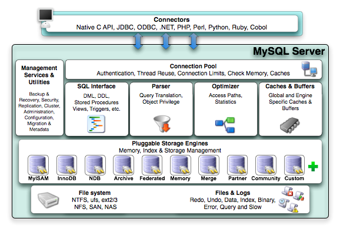

# 逻辑架构图

逻辑架构图


逻辑架构图(扩展)




## Commectors

​	指的是不同语言中与SQL的交互

## Management Services & Utilities

​	系统管理和控制工具

## Connection Pool：连接池

* 管理缓冲用户连接,线程处理等需要缓存的需求。
* 负责监听对 MySQL Server 的各种请求,接收连接请求,转发所有连接请求到线程管理模块。每一个连接上MySQL Server 的客户端请求都会被分配(或创建)一个连接线程为其单独服务。
* 而连接线程的主要工作就是负责 MySQL Server 与客户端的通信,接受客户端的命令请求,传递 Server 端的结果信息等。线程管理模块则负责管理维护这些连接线程。包括线程的创建,线程的 cache 等。

## SQL Interface：SQL接口

​	接受用户的SQL命令,并且返回用户需要查询的结果。比如select from就是调用SQL Interface

## Parser：解析器

​	SQL命令传递到解析器的时候会被解析器验证和解析 。主要功能:

1. 将SQL语句进行语义和语法的分析,分解成数据结构,然后按照不同的操作类型进行分类,然后做出针对性的转发到后续步骤,以后SQL语句的传递和处理就是基于这个结构的。 
2. 如果在分解构成中遇到错误,那么就说明这个sql语句是不合理的 

## Optimizer：查询优化器

SQL语句在查询之前会使用查询优化器对查询进行优化 。

## Cache和Buffer：查询缓存

​	他的主要功能是将客户端提交给MySQL的 select请求的返回结果集 cache 到内存中,与该 query 的一个 hash 值做一个对应。该 Query 所取数据的基表发生任何数据的变化之后, MySQL 会自动使该 query 的Cache 失效。在读写比例非常高的应用系统中, Query Cache 对性能的提高是非常显著的。当然它对内存的消耗也是非常大 的。 

​	如果查询缓存有命中的查询结果,查询语句就可以直接去查询缓存中取数据。这个缓存机制是由一系列小缓存组成的。比如表缓存,记录缓存,key缓存,权限缓存等。

## Pluggable Storage Engines：存储引擎

​	**存储引擎接口模块**可以说是 MySQL 数据库中最有特色的一点了。目前各种数据库产品中,基本上只有 MySQL 可以实现**其底层数据存储引擎的插件式管理**。这个模块实际上只是一个抽象类,但正是因为它成功地将各种数据处理高度抽象化,才成就了今天 MySQL 可插拔存储引擎的特色。 

​	从图还可以看出,MySQL区别于其他数据库的最重要的特点就是其**插件式的表存储引擎** 。MySQL插件式的存储引擎架 构提供了一系列标准的管理和服务支持,这些标准与存储引擎本身无关,可能是每个数据库系统本身都必需的,如 SQL分析器和优化器等,而存储引擎是底层物理结构的实现,每个存储引擎开发者都可以按照自己的意愿来进行开发。

> ​	与其他数据库例如Oracle 和SQL Server等数据库中只有一种存储引擎不同的是,MySQL有一个被称为“Pluggable Storage Engine Architecture”(可插拔的存储引擎架构)的特性,也就意味着MySQL数据库提供了多种存储引擎。 
>
> ​	而且存储引擎是针对表的,用户可以根据不同的需求为数据表选择不同的存储引擎,用户也可以根据自己的需要编写自己的存储引擎。也就是说,同一数据库不同的表可以选择不同的存储引擎
> ​    creat table xxx()engine=InnoDB/Memory/MyISAM
> 简而言之,存储引擎就是如何存储数据、如何为存储的数据建立索引和如何更新、查询数据等技术的实现方法。 

* MySQL存储引擎种类

  | 存储引擎          | 说明                                                         |
  | ----------------- | ------------------------------------------------------------ |
  | MyISAM            | 告诉引擎，拥有较高的插入，查询速度，但不支持事务             |
  | InnoDB            | 5.5版本后MySQL的默认数据库，支持事务和行级锁定，比MyISAM处理速度稍慢 |
  | ISAM              | MyISAM的前身，MySQL5.0以后不再默认安装                       |
  | MRG_MyISAM(MERGE) | 将多个表联合成一个表使用，在超大规模数据存储时很有用         |
  | Memory            | 内存存储引擎，拥有极高的插入、更新和查询效率。但是会占用和数据量成正比的内存空间。只在内存上保存数据，意味着数据可能会丢失。 |
  | Falcon            | 一种新的存储引擎，支持事务处理，传言可能是InnoDB的替代者     |
  | Archive           | 将数据压缩后进行存储，非常适合存储大量的独立的、作为历史记录的数据，但是只能进行插入和查询操作 |
  | CSV               | CSV存储引擎是基于CSV格式文件存储数据(应用于跨平台的数据交换) |

* 查看存储引擎：

  ```mysql
  mysql> show engines;
  ```

* InnoDB和MyISAM存储引擎区别：

  |          | InnoDB                                     | MyISAM                                     |
  | -------- | ------------------------------------------ | ------------------------------------------ |
  | 存储文件 | .frm表定义文件；.ibd数据文件和索引文件     | .frm表定义文件；.myd数据文件；.myi索引文件 |
  | 锁       | 表锁（server层实现）、行锁(存储引擎层实现) | 表锁(server层实现)                         |
  | 事务     | 支持                                       | 不支持                                     |
  | CRUD     | 读写                                       | 读多                                       |
  | count    | 扫表                                       | 专门存储的地方                             |
  | 索引结构 | B＋Tree                                    | B＋Tree                                    |

  ​	MySQL的InnoDB和MyISAM存储引擎最大的区别：**事务的支持**和**行级锁的支持**。

  ​	InnoDB存储引擎，它的数据库数据和索引数据都死后存储在一起的，都是存储到一颗B+树。而B＋树的非叶子节点，只存储索引；叶子节点存储了表带一行记录。

  ​	xtraDB存储引擎是由Percona公司提供的存储引擎,该公司还出品了Percona Server这个产品,它是基于MySQL开源代码进行修改之后的产品。 

  ​	阿里对于Percona Server服务器进行修改,衍生了自己的数据库(alisql)。

* 与存储引擎有关的：
  * 表
  * 行锁
  * 事务
  * 索引

# 简版执行流程图


​	从图中你可以清楚地看到 SQL 语句在 MySQL 的各个功能模块中的执行过程。大体来说,MySQL 可以分为**Server层** 和**存储引擎层**两部分。

​	Server层包括连接器、查询缓存、分析器、优化器、执行器等，涵盖MySQL的大多数核心服务功能，以及所有的内置函数(如日期、时间、数学和加密函数等)，所有存储引擎的功能都在这一层实现，比如存储过程、触发器、视图等。

​	存储引擎层负责数据的存储和提取。其架构模式是插件式的，支持InnoDB、MyISAM、Memory等多个存储引擎。现在最常用的存储引擎是InnoDB，它从MySQL5.5.5版本开始成为默认存储引擎。即，你在执行`create table`建表的时候，可以通过`ENGINE=InnoDB`来指定存储引擎类型，若不指定，默认使用`InnoDB`存储类型。不同的存储引擎，表数据存取方式不同，支持的功能也不同，后续会讨论引擎的选择。 

​	如SQL：`mysql> select * from T where ID=10;`我们看到的只是输入一条语句,返回一个结果,却不知道这条语句在 MySQL 内部的执行过程。 这里把 MySQL 拆解一下,看看里面都有哪些“零件”,希望借由这个拆解过程,让你对 MySQL 有更深入的理解。这样当我们碰到 MySQL 的一些异常或者问题时,就能够直戳本质,更为快速地定位并解决问题。 	

​	存储引擎层负责数据的存储和提取。其架构模式是插件式的，支持InnoDB、MyISAM、Memory等多个存储引擎。现在最常用的存储引擎是InnoDB，它从MySQL5.5.5版本开始成为默认存储引擎。即，你在执行`create table`建表的时候，可以通过`ENGINE=InnoDB`来指定存储引擎类型，若不指定，默认使用`InnoDB`存储类型。不同的存储引擎，表数据存取方式不同，支持的功能也不同，后续会讨论引擎的选择。

## 连接器

* 通过命令`mysql -h$ip -P$port -u$user -p`连接数据库，首先接待你的就是连接器。连接器负责跟客户端建立连接、获取权限、维持和管理连接。(连接命令中的 mysql 是客户端工具,用来跟服务端建立连接。)
* 命令执行后，需要在交互对话中输入密码。(虽然密码也可以直接跟在-p后写入命令行中，但这样会导致密码泄漏，若连接生产服务器，强烈建议不要这样做)
* 在完成经典的 TCP 握手后,连接器就要开始通过用户名和密码认证你的身份
  * 如果用户名或密码不对,你就会收到一个`Access denied for user`的错误,然后客户端程序结束执行。
  * 如果用户名密码认证通过,连接器会到权限表里面查出你拥有的权限。之后,这个连接里面的权限判断逻辑,都将依赖于此时读到的权限。这也意味着，一个用户成功建立连接后，即使用管理员帐号对这个用户权限做了修改，也不会影响已经存在连接的权限，只有重新连接才会使用新的权限设置。
* 连接完成后，可以通过命令`show processlist`命令查看连接状态（Command列显示Sleep，表示空闲状态）。如果客户端长时间没操作，连接器会自动断开，具体时间由参数`wait_timeout`控制，默认8小时。
  * 如果在连接被断开后，客户端再次发送请求的话，会报`Lost connection to MySQL server during query`异常，若要继续就需要重连，然后再执行请求。

​	数据库中，长连接指连接成功后，如果客户端保持有请求，则一直使用同一个连接。短连接则是指每次执行完很少的几次请求就断开连接，下次请求再重新建立连接。

​	建立连接的过程通常是比较复杂的,所以我建议你在使用中要尽量减少建立连接的动作,也就是尽量使用长连接。但是全部使用长连接后,你可能会发现,有些时候 MySQL 占用内存涨得特别快,这是因为 MySQL 在执行过程中临时使用的内存是管理在连接对象里面的。这些资源会在连接断开的时候才释放。所以如果长连接累积下来,可能导致内存占用太大,被系统强行杀掉(OOM),从现象看就是 MySQL 异常重启了。 怎么解决这个问题呢？可以考虑以下两种方案：

1. 定期断开长连接。使用一段时间,或者程序里面判断执行过一个占用内存的大查询后,断开连接,之后要查询再重连。 
2. 如果你用的是 `MySQL 5.7` 或更新版本,可以在每次执行一个比较大的操作后,通过执行 `mysql_reset_connection` 来重新初始化连接资源。这个过程不需要重连和重新做权限验证,但是会将连接恢复到刚刚创建完时的状态。 

## 查询缓存

​	连接建立完成后,你就可以执行 `select` 语句了。执行逻辑就会来到第二步:查询缓存。

* MySQL 拿到一个查询请求后,会先到查询缓存看看,之前是不是执行过这条语句。之前执行过的语句及其结果可能会以 `key-value` 对的形式,被直接缓存在内存中。`key` 是查询的语句,`value` 是查询的结果。如果你的查询能够直接在这个缓存中找到`key`,那么这个`value` 就会被直接返回给客户端。 
* 如果语句不在查询缓存中,就会继续后面的执行阶段。执行完成后,执行结果会被存入查询缓存中。你可以看到,如果查询命中缓存,MySQL 不需要执行后面的复杂操作,就可以直接返回结果,这个效率会很高。  

​	但大部分情况不建议使用查询缓存，为什么？因为查询缓存往往弊大于利：

* 查询缓存的失效非常频繁,只要有对一个表的更新,这个表上所有的查询缓存都会被清空。因此很可能你费劲地把结果存起来,还没使用呢,就被一个更新全清空了。
* 对于更新压力大的数据库来说,查询缓存的命中率会非常低。除非你的业务就是有一张静态表,很长时间才会更新一次。比如,一个系统配置表,那这张表上的查询才适合使用查询缓存

​	好在 MySQL 也提供了这种“**按需使用**”的方式。你可以将参数 `query_cache_type` 设置成`DEMAND`,这样对于默
认的 SQL 语句都不使用查询缓存,而对于你确定要使用查询缓存的语句,可以用 `SQL_CACHE` 显式指定，如`mysql> select SQL_CACHE * from T where ID=10;`

⚠️⚠️⚠️需要注意的是,`MySQL 8.0` 版本直接将查询缓存的整块功能删掉了,也就是说 8.0 开始彻底没有这个功能了。

## 分析器

​	若未命中查询缓存，则开始真正执行语句，首先，进入分析器进行解析：

* 分析器**先会做"词法分析"**。你输入的是由多个字符串和空格组成的一条 SQL 语句,MySQL 需要识别出里面的字符串分别是什么,代表什么。

  * MySQL 从你输入的"select"这个关键字识别出来,这是一个查询语句。它也要把字符串“T”识别成“表名 T”,把字符串“ID”识别成“列 ID”。

* **其次做"语法分析"**，根据词法分析的结果,语法分析器会根据语法规则,判断你输入的这个SQL 语句是否满足 MySQL 语法。

  * 如果你的语句不对,就会收到`"You have an error in your SQL syntax"`的错误提醒,比如下面这个语句select 少打了开头的字母"s"。

    ```mysql
    mysql> elect * from t where ID=1;
    ERROR 1064 (42000): You have an error in your SQL syntax; check the manual that
    corresponds to your MySQL server version for the right syntax to use near 'elect *
    from t where ID=1' at line 1
    ```

    一般语法错误会提示第一个出错的位置，所以注意关注紧接"use near"的内容。

## 优化器

​	经过了分析器,MySQL 就知道你要做什么了。在开始执行之前,还要先经过优化器的处理。 

​	优化器是在表里面有多个索引的时候,决定使用哪个索引;或者在一个语句有多表关联(join)的时候,决定各个 表的连接顺序。比如你执行下面这样的语句,这个语句是执行两个表的 join: 

```mysql
mysql> select * from t1 join t2 using(ID)  where t1.c=10 and t2.d=20;
```

* 既可以先从表 t1 里面取出 c=10 的记录的 ID 值,再根据 ID 值关联到表 t2,再判断 t2 里面 d 的值是否等于 20。
* 也可以先从表 t2 里面取出 d=20 的记录的 ID 值,再根据 ID 值关联到 t1,再判断 t1 里面 c 的值是否等于 10。

​	这两种执行方法的逻辑结果是一样的,但是执行的效率会有不同,而优化器的作用就是决定选择使用哪一个方案。

## 执行器

​	MySQL 通过分析器知道了你要做什么,通过优化器知道了该怎么做,于是就进入了执行器阶段,开始执行语句。 

* 开始执行的时候,要先判断一下你对这个表 T 有没有执行查询的权限

  * 如果没有,就会返回没有权限的错误,如下所示 (在工程实现上,如果命中查询缓存,会在查询缓存返回结果的时候,做权限验证。查询也会在优化器之前调用 precheck 验证权限)。 

    ```mysql
    mysql> select * from T where ID=10;
    ERROR 1142 (42000): SELECT command denied to user 'b'@'localhost' for table 'T'
    ```

  * 如果有权限,就打开表继续执行。打开表的时候,执行器就会根据表的引擎定义,去使用这个引擎提供的接口。比如我们这个例子中的表 T 中,ID 字段没有索引,那么执行器的执行流程是这样的:

    1. 调用 InnoDB 引擎接口取这个表的第一行,判断 ID 值是不是 10,如果不是则跳过,如果是则将这行存在结 果集中; 
    2. 调用引擎接口取“下一行”,重复相同的判断逻辑,直到取到这个表的最后一行.
    3. 执行器将上述遍历过程中所有满足条件的行组成的记录集作为结果集返回给客户端。 

  至此,这个语句就执行完成了。

# 详细执行流程图


# 物理结构

* MySQL是通过文件系统对数据和索引进行存储的。 
* MySQL从物理结构上可以分为日志文件和数据索引文件。 

MySQL在Linux中的数据索引文件和日志文件都在`/var/lib/mysql`目录下。 

扩展：


## 日志文件(顺序IO)

​	MySQL通过日志记录了数据库操作信息和错误信息。常用的日志文件包括错误日志、二进制日志、查询日志、慢查询日志和事务Redo日志、中断日志等。

​	可通过命令`show variables like 'log_%';`查看当前数据库中的日志使用信息。

### 错误日志(err log)

​	错误日志记录了MySQL运行过程中遇到的**所有严重的错误信息**，以及MySQL**每次启动和关闭的详细信息**。默认是开启的，而且从5.5.7以后无法关闭错误日志。默认的错误日志名称:hostname.err。

​	错误日志所记录的信息是可以通过`log-error`和`log-warnings`来定义的，其中log-err是定义是否启用错误日志的功能和错误日志的存储位置，log-warnings是定义是否将警告信息业定义至错误日志中。

```mysql
-- log_error可以直接定义为文件路径,也可以为ON|OFF; 
-- log_warings只能使用1|0来定义开关启动
```

### 二进制日志(bin log)

​	默认是关闭的,需要通过配置:`log-bin=mysql-bin`进行开启。其中mysql-bin是binlog日志文件的basename,binlog日志文件的名称:mysql-bin-000001.log。binlog记录了**数据库所有的ddl语句和dml语句** ,但不包括select语句内容,语句以事件的形式保存,描述了数据的变更顺序,binlog还包括了每个更新语句的执行时间信息,binlog主要作用是用于恢复数据,因此binlog对于灾难恢复和备份恢复来说至关重要。 

​	如果是DDL语句,则直接记录到binlog日志,而**DML语句，必须通过事务提交才能记录到binlog日志中**。

​	binlog主要**用于实现mysql主从复制、数据备份、数据恢复**。

### 通用查询日志(general query log)

​	通用查询日志，默认关闭

​	由于通用查询日志会记录用户的所有操作,其中还包含增删查改等信息,在并发操作大的环境下会产生大量的信息从而导致不必要的磁盘IO,会影响mysql的性能的。如若不是为了调试数据库的目的，**建议不要开启查询日志**。

### 慢查询日志(slow query log)

​	默认关闭，可以通过以下设置进行开启：

```mysql
slow_query_log=ON
long_query_time=10 -- 记录执行时间超过long_query_time秒到所有查询，便于收集查询时间较长的SQL语句
```

### 事务日志(redo/undo log)

* 事务日志(InnoDB特有的日志)也叫redo日志，记录相当于事务操作的版本变更。
  * 文件名为"ib_logfile0"和“ib_logfile1”,默认存放在表空间所在目录。
* 还有一个日志文件叫undo 日志，记录回滚日志，默认存储在ib_data目录下。

### 中继日志(relay log)

* 是在**主从复制**环境中产生的日志。

* 主要作用是为了从机可以从中继日志中获取到主机同步过来的SQL语句,然后执行到从机中。

## 数据文件(随即IO)

查看MySQL数据文件：

```mysql
SHOW VARIABLES LIKE '%datadir%';
```

### InnoDB数据文件

* **.frm文件**：主要存储与表相关的存储信息，主要包括**表结构的定义信息**
* **.idb文件**：使用**独享表空间**存储**表数据**和**索引**信息，一张表对应一个idb文件
* **ibdata文**件：使用**共享表空间**存储**表数据**和**索引**信息，所以表共同使用一个或者多个ibdata文件。

### MyIsam数据文件

* .frm文件：主要存放与表相关的数据信息，主要包括表结构的定义信息
* .myd文件：主要用来存储表数据信息
* .myi文件：主要用来存储表数据文件中任何索引的数据树。

