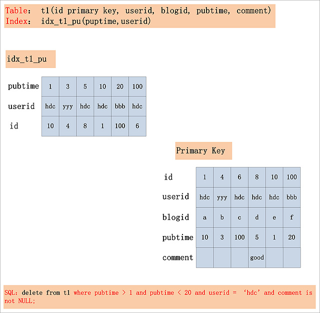
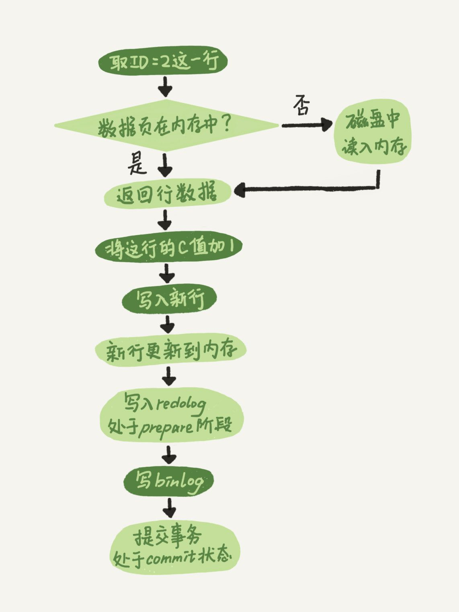
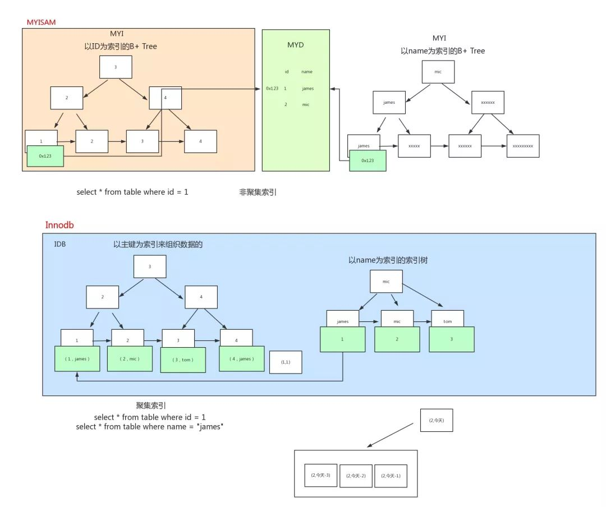
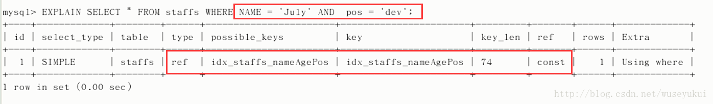
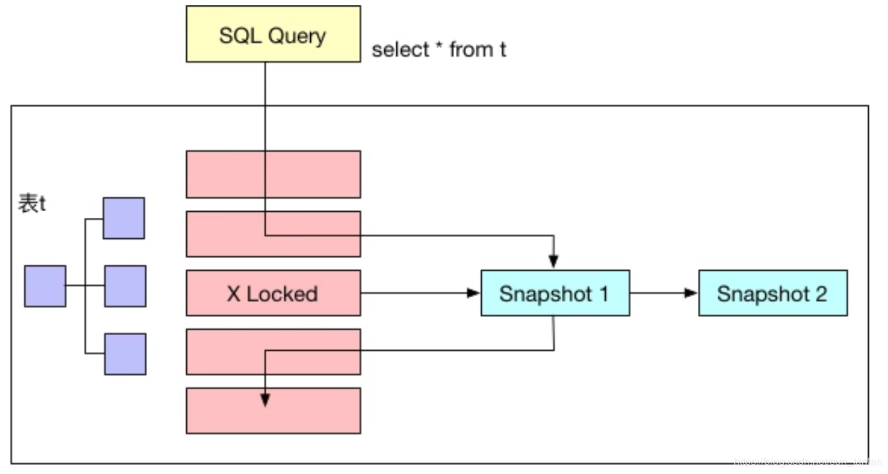
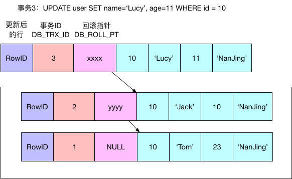
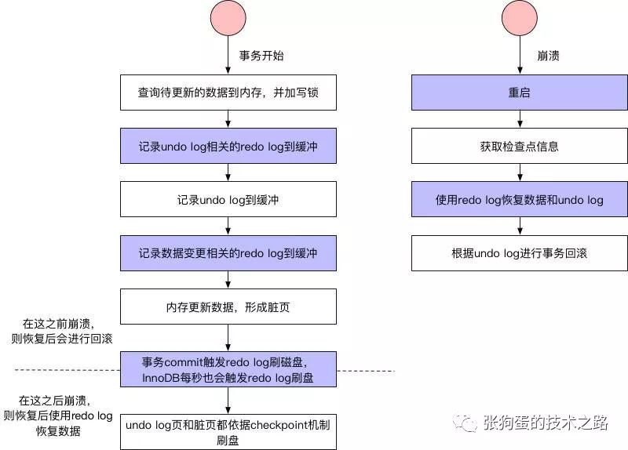

# 相关术语介绍

## 多版本并发控制

​	**`MySQL InnoDB`存储引擎,实现的是基于多版本的并发控制协议**—— (`Multi-Version Concurrency Control`)(注:与MVCC相对的,是基于锁的并发控制,`Lock-Based Concurrency Control`)。`MVCC`最大的好处, 相信也是耳熟能详：**读不加锁，读写不冲突** 。在读多写少的OLTP应用中,读写不冲突是非常重要的,极大的增加了系统的并发性能,这也是为什么现阶段,几乎所有的RDBMS,都支持了MVCC。 

## 当前读和快照读

​	在MVCC并发控制中,读操作可以分成两类：快找读(snapshot read)与当前读(current read)。

* 快照读：读取的是记录的**可见版本(有可能是历史版本)，不用加锁**。
* 当前读：读取的是记录的**最新版本**，并且当前读返回的**记录会加上锁**，保证其他事务不会再并发修改这条记录。

​	在一个支持MVCC并发控制的系统中,哪些读操作是快照读?哪些操作又是当前读呢?以MySQL InnoDB为例:

* 快找读：**简单的select操作**,属于快照读,不加锁。(当然,也有例外,下面会分析)

  ```mysql
  select * from table where ?;
  ```

* 当前读：**特殊的读操作，插入／更新／删除操作**，属于当前读，需要加锁。

  ```mysql
  select * from table where ? lock in share mode;//共享锁(S) 
  select * from table where ? for update;//排他锁(X)
  insert into table values (...) ; //排他锁(X)
  update table set ? where ? ; //排他锁(X)
  delete from table where ? ; //排他锁(X)
  ```

  所有以上的语句,都属于当前读,读取记录的最新版本。并且,读取之后,还需要保证其他并发事务不能修改当前记
  录,对读取记录加锁。

为什么将插入/更新/删除操作,都归为当前读?可以看看下面这个更新操作,在数据库中的执行流程：


​	从图中,可以看到,一个Update操作的具体流程：

1. 当Update SQL被发给MySQL后,MySQL Server会根据where条件,读取第一条满足条件的记录,然后InnoDB引擎会将第一条记录返回,并加锁 (current read)。
2. 待MySQL Server收到这条加锁的记录之后,会再发起一个Update请求,更新这条记录。
3. 一条记录操作完成,再读取下一条记录,直至没有满足条件的记录为止。
   1. 因此,Update操作内部,就包含了一个当前读。同理,Delete操作也一样。
   2. Insert操作会稍微有些不同,简单来说,就是Insert操作可能会触发Unique Key的冲突检查,也会进行一个当前读。

⚠️注意：

> 根据上图的交互,针对一条当前读的SQL语句,InnoDB与MySQL Server的交互,是一条一条进行的,因此,加锁也
> 是一条一条进行的。先对一条满足条件的记录加锁,返回给MySQL Server,做一些DML操作;然后在读取下一条加
> 锁,直至读取完毕。

## 聚集索引

Cluster Index:聚簇索引。 

​	InnoDB存储引擎的数据组织方式是聚簇索引表：完整的记录,存储在主键索引中,通过主键索引,就可以获取记录所有的列。关于聚簇索引表的组织方式,可以参考MySQL的官方文档:[Clustered and Secondary Indexes](https://dev.mysql.com/doc/refman/8.0/en/innodb-index-types.html) 。 这里不再做具体的介绍。接下来的部分,**主键索引/聚簇索引**两个名称,会有一些混用,望知晓。 

## 最左前缀原则

​	顾名思义,就是**最左优先**,这个最左是**针对于组合索引和前缀索引**,理解如下:

1. 最左前缀匹配原则,非常重要的原则,mysql会一直向右匹配直到遇到范围查询(`>、<、between、like`)就停止匹配,比如a = 1 and b = 2 and c > 3 and d = 4 如果建立(a,b,c,d)顺序的索引,d是用不到索引的,如果建立(a,b,d,c)的索引则都可以用到,a,b,d的顺序可以任意调整。 
2. =和in可以乱序,比如a = 1 and b = 2 and c = 3 建立(a,b,c)索引可以任意顺序,mysql的查询优化器会 帮你优化成索引可以识别的形式 

## 两阶段锁

​	传统RDBMS加锁的一个原则,就是`2PL (Two-Phase Locking,二阶段锁)`。相对而言,2PL比较容易理解,说的是锁操作分为两个阶段：**加锁阶段**与**解锁阶段**,并且保证加锁阶段与解锁阶段不相交。下面,仍旧以MySQL为例,来简单看看2PL在MySQL中的实现。


​	从上图可知，2PL就是将加锁／解锁分为两个完全不相交的阶段。

> 加锁阶段：只加锁，不放锁
>
> 解锁阶段：只放锁，不加锁

## 隔离级别

MySQL/InnoDB定义的4种隔离级别：

* Read Uncommited

  ```mysql
  -- 可以读取未提交记录。此隔离级别不会使用，忽略。
  ```

* Read Commited(RC)

  ```mysql
  -- 快照读忽略，这里不考虑
  -- 针对当前读，RC隔离级别保证对读取到的记录加锁(记录锁)，存在幻读现象。
  ```

* Repeatable Read(RR)

  ```mysql
  -- 快照读忽略，这里不考虑
  -- 针对当前读，RR隔离级别保证对读取到的记录加锁(记录锁)，同时保证对读取的范围加锁，新的满足查询条件的记录不能够插入(间隙锁)，不存在幻读现象。
  ```

* Serializable

  ```mysql
  -- 从MVCC并发控制退化为基于锁的并发控制。不区别快照读与当前读,所有的读操作均为当前读,读加读锁 (S 锁),写加写锁 (X锁)。
  -- Serializable隔离级别下,读写冲突,因此并发度急剧下降,在MySQL/InnoDB下不建议使用。
  ```

## Gap锁和Next-Key锁

​	InnoDB中的完整行锁包含三部分:**记录锁(`Record Lock`)、间隙锁(`Gap Lock`)、`Next-Key Lock`**。以下定义摘自MySQL官方文档

> * 记录锁(Record Locks)：记录锁锁定索引中一条记录。
> * 间隙锁(Gap Locks)：间隙锁要么锁住索引记录中间的值,要么锁住第一个索引记录前面的值或者最后
>   一个索引记录后面的值。
> * Next-Key Locks：Next-Key锁是索引记录上的记录锁和在索引记录之前的间隙锁的组合。

# 行锁原理分析

## 一条简单SQL的加锁分析

​	在了解完一些术语背景知识之后,接下来将选择几个有代表性的例子,来详细分析MySQL的加锁处理。当然,还是从最简
单的例子说起。经常有人拿一个SQL,直接问这个SQL加什么锁?就如同下面两条简单的SQL,他们加什么锁?

* SQL一：

  ```mysql
  select * from t1 where id = 10;
  ```

* SQL二：

  ```mysql
  delete from t1 where id = 10;
  ```

针对这个问题,该怎么回答?能想象到的一个答案是:

* SQL1: 不加锁。因为MySQL是使用多版本并发控制的,读不加锁。 
* SQL2：对id = 10的记录加写锁 (走主键索引)。

​	这个答案对吗?说不上来。即可能是正确的,也有可能是错误的,**已知条件不足,这个问题没有答案**。必须还要知道
以下的一些前提,前提不同,能给出的答案也就不同。要回答这个问题,还缺少哪些前提条件?

* 前提一：id列是不是主键?
* 前提二：当前系统的隔离级别是什么?
* 前提三：id列如果不是主键,那么id列上有索引吗?
* 前提四：id列上如果有二级索引,那么这个索引是唯一索引吗?
* 前提五：两个SQL的执行计划是什么?索引扫描?全表扫描? 

​	**没有这些前提,直接就给定一条SQL,然后问这个SQL会加什么锁,都是很业余的表现。**而当这些问题有了明确的答案之后,给定的SQL会加什么锁,也就一目了然。下面,我们将这些问题的答案进行组合,然后按照从易到难的顺序,逐个分析每种组合下,对应的SQL会加哪些锁? 

⚠️注意：下面的这些组合,需要做一个前提假设,也就是有索引时,执行计划一定会选择使用索引进行过滤 (索引扫描)。但实际情况会复杂很多,**真正的执行计划,还是需要根据MySQL输出的为准**。

> * 组合一:id列是主键,RC隔离级别
> * 组合二:id列是二级唯一索引,RC隔离级别
> * 组合三:id列是二级非唯一索引,RC隔离级别
> * 组合四:id列上没有索引,RC隔离级别
> * 组合五:id列是主键,RR隔离级别
> * 组合六:id列是二级唯一索引,RR隔离级别
> * 组合七:id列是二级非唯一索引,RR隔离级别
> * 组合八:id列上没有索引,RR隔离级别
> * 组合九:Serializable隔离级别 

​	排列组合还没有列举完全,但是看起来,已经很多了。真的有必要这么复杂吗?事实上,要分析加锁,就是需要这么复杂。但是从另一个角度来说,只要你选定了一种组合,SQL需要加哪些锁,其实也就确定了。接下来,就让我们来逐个分析这9种组合下的SQL加锁策略。 

⚠️注意：*在前面八种组合下,也就是RC,RR隔离级别下SQL1：**select操作均不加锁,采用的是快照读**,因此在下面的讨论中就忽略了, 主要讨论SQL2：delete操作的加锁*。 

### 组合一：id主键＋RC

​	这个组合是最简单、最容易分析的组合。id是主键,Read Committed隔离级别,给定SQL:`delete from t1 where id = 10`; 只需要将主键上id = 10的记录加上X锁即可。如下图所示:


结论：

```mysql
-- id是主键时,此SQL只需要在id=10这条记录上加X锁即可。
```

### 组合二：id唯一索引＋RC

​	这个组合,id不是主键,而是一个Unique的二级索引键值。那么在RC隔离级别下,`delete from t1 where id = 10`; 需要加什么锁呢?见下图:


​	此组合中,id是unique索引,而主键是name列。此时,加锁的情况就与组合一有所不同。由于id是unique索引,因此delete语句会选择走id列的索引进行where条件的过滤,在找到id=10的记录后,首先会将unique索引上的id=10索引记录加上X锁,同时,会根据读取到的name列,回主键索引(聚簇索引),然后将聚簇索引上的name = ‘d’ 对应的主键索引项加X锁。为什么聚簇索引上的记录也要加锁?试想一下,如果并发的一个SQL,是通过主键索引来更新:`update t1 set id = 100 where name = 'd';` 此时,如果delete语句没有将主键索引上的记录加锁,那么并发的update就会感知不到delete语句的存在,违背了同一记录上的更新/删除需要串行执行的约束。

结论：

```mysql
-- 若id列是unique列,其上有unique索引。那么SQL需要加两个X锁,一个对应于id unique索引上的id = 10的记录,另一把锁对应于聚簇索引上的【name=’d’,id=10】的记录。
```

### 组合三：id非唯一索引＋RC

​	相对于组合一、二,组合三又发生了变化,隔离级别仍旧是RC不变,但是id列上的约束又降低了,id列不再唯一,只有一个普通的索引。假设`delete from t1 where id = 10;` 语句,仍旧选择id列上的索引进行过滤where条件,那么此时会持有哪些锁?同样见下图:


​	根据此图,可以看到,首先,id列索引上,满足id = 10查询条件的记录,均已加锁。同时,这些记录对应的主键索引上的记录也都加上了锁。与组合二唯一的区别在于,组合二最多只有一个满足等值查询的记录,而组合三会将所有满足查询条件的记录都加锁。

结论：

```mysql
-- 若id列上有非唯一索引,那么对应的所有满足SQL查询条件的记录,都会被加锁。同时,这些记录在主键索引上的记录,也会被加锁。
```

### 组合四：id无索引＋RC

​	相对于前面三个组合,这是一个比较特殊的情况。id列上没有索引,where id = 10;这个过滤条件,没法通过索引进行过滤,那么 。对应于这个组合,SQL会加什么锁?或者是换句话说,全表扫描时,会加什么锁?这个答案也有很多:有人说会在表上加X锁;有人说会将聚簇索引上,选择出来的id = 10;的记录加上X锁。那么实际情况呢?请看下图:


​	**由于id列上没有索引,因此只能走聚簇索引,进行全部扫描**。从图中可以看到,满足删除条件的记录有两条,但是, 聚簇索引上所有的记录,都被加上了X锁。无论记录是否满足条件,全部被加上X锁。既不是加表锁,也不是在满足条件的记录上加行锁。 

​	有人可能会问?为什么不是只在满足条件的记录上加锁呢?这是由于MySQL的实现决定的。**如果一个条件无法通过索引快速过滤,那么存储引擎层面就会将所有记录加锁后返回,然后由MySQL Server层进行过滤**。因此也就把所有的记录,都锁上了。 

​	⚠️注意：在实际的实现中,MySQL有一些改进,在MySQL Server过滤条件,发现不满足后,会调用`unlock_row`方法,把不满足条件的记录放锁 (违背了2PL的约束)。这样做,保证了最后只会持有满足条件记录上的锁,但是每条记录的加锁操作还是不能省略的。

结论：

```mysql
-- 若id列上没有索引,SQL会走聚簇索引的全扫描进行过滤,由于过滤是由MySQL Server层面进行的。因此每条记录, 无论是否满足条件,都会被加上X锁。但是,为了效率考量,MySQL做了优化,对于不满足条件的记录,会在判断后放锁,最终持有的,是满足条件的记录上的锁,但是不满足条件的记录上的加锁/放锁动作不会省略。同时,优化也违背了2PL的约束。 
```

### 组合五：id主键＋RR

​	id列是主键列,Repeatable Read隔离级别,针对`delete from t1 where id = 10;` 这条SQL,加锁与组合一:[[id主键,Read Committed]]([http://hedengcheng.com/?p=771#_%E7%BB%84%E5%90%88%E4%B8%80%EF%BC%9Aid%E4%B8%BB%E9%94%AE+RC](http://hedengcheng.com/?p=771#_组合一：id主键+RC))一致。

### 组合六：id唯一索引＋RR

​	组合六的加锁,与组合二:[[id唯一索引,Read Committed]]([http://hedengcheng.com/?p=771#_%E7%BB%84%E5%90%88%E4%BA%8C%EF%BC%9Aid%E5%94%AF%E4%B8%80%E7%B4%A2%E5%BC%95+RC](http://hedengcheng.com/?p=771#_组合二：id唯一索引+RC))一致。两个X锁,id唯一索引满足条件的记录上一个,对应的聚簇索引上的记录一个。

### 组合七：id非唯一索引＋RR

​	还记得前面提到的MySQL的四种隔离级别的区别吗? 但是在组合五、组合六中,加锁行为又是与RC下的加锁行为完全一致。那么RR隔离级别下,如何防止幻读呢?问题的答案,就在组合七中揭晓。 

​	组合七,Repeatable Read隔离级别,id上有一个非唯一索引,执行`delete from t1 where id = 10;`假设选择id列上的索引进行条件过滤,最后的加锁行为,是怎么样的呢?同样看下面这幅图: 


​	此图,相对于组合三:[[id列上非唯一锁,Read Committed]]([http://hedengcheng.com/?p=771#_%E7%BB%84%E5%90%88%E4%B8%89%EF%BC%9Aid%E9%9D%9E%E5%94%AF%E4%B8%80%E7%B4%A2%E5%BC%95+RC](http://hedengcheng.com/?p=771#_组合三：id非唯一索引+RC))看似相同,其实却有很大的区别。最大的区别在于,这幅图中多了一个GAP锁,而且GAP锁看起来也不是加在记录上的,倒像是加载两条记录之间的位置,GAP锁有何用?

​	其实这个多出来的**GAP锁,就是RR隔离级别,相对于RC隔离级别,不会出现幻读的关键**。确实,GAP锁锁住的位置, 也不是记录本身,而是两条记录之间的GAP。所谓幻读,就是同一个事务,连续做两次当前读 (例如:`select * from t1 where id = 10 for update;`),那么这两次当前读返回的是完全相同的记录 (记录数量一致,记录本身也一致),第二次的当前读,不会比第一次返回更多的记录 (幻象)。 

​	如何保证两次当前读返回一致的记录,那就需要在第一次当前读与第二次当前读之间,其他的事务不会插入新的满足条件的记录并提交。为了实现这个功能,GAP锁应运而生。 

​	如图中所示,有哪些位置可以插入新的满足条件的项 (id = 10),考虑到B+树索引的有序性,满足条件的项一定是 连续存放的。记录[6,c]之前,不会插入id=10的记录;[6,c]与[10,b]间可以插入[10, aa];[10,b]与[10,d] 间,可以插入新的[10,bb],[10,c]等;[10,d]与[11,f]间可以插入满足条件的[10,e],[10,z]等;而[11,f]之后 也不会插入满足条件的记录。因此,为了保证[6,c]与[10,b]间,[10,b]与[10,d]间,[10,d]与[11,f]不会插入 新的满足条件的记录,MySQL选择了用GAP锁,将这三个GAP给锁起来。 

​	Insert操作,如insert [10,aa],首先会定位到[6,c]与[10,b]间,然后在插入前,会检查这个GAP是否已经被锁上,如果被锁上,则Insert不能插入记录。因此,通过第一遍的当前读,不仅将满足条件的记录锁上 (X锁),与组合三类似。同时还是增加3把GAP锁,将可能插入满足条件记录的3个GAP给锁上,保证后续的Insert不能插入新的 id=10的记录,也就杜绝了同一事务的第二次当前读,出现幻象的情况。 

​	有心的朋友看到这儿,可以会问:既然防止幻读,需要靠GAP锁的保护,为什么组合五、组合六,也是RR隔离级别, 却不需要加GAP锁呢? 

​	首先,这是一个好问题。其次,回答这个问题,也很简单。**GAP锁的目的是为了防止同一事务的两次当前读,出现幻读的情况**。而组合五,id是主键;组合六,id是unique键,都能够保证唯一性。一个等值查询,最多只能返回一条记录,而且新的相同取值的记录,一定不会在新插入进来,因此也就避免了GAP锁的使用。其实,针对此问题,还有一个更深入的问题：如果组合五、组合六下,针对SQL:`select * from t1 where id = 10 for update;` 第 一次查询,没有找到满足查询条件的记录,那么GAP锁是否还能够省略?此问题留给大家思考 

结论：

```mysql
-- Repeatable Read隔离级别下,id列上有一个非唯一索引,对应SQL:delete from t1 where id = 10; 首先,通过id索引定位到第一条满足查询条件的记录,加记录上的X锁,加GAP上的GAP锁,然后加主键聚簇索引上的记录X锁,然后返回;然后读取下一条,重复进行。直至进行到第一条不满足条件的记录[11,f],此时,不需要加记录X 锁,但是仍旧需要加GAP锁,最后返回结束
```

### 组合八：id无索引＋RR

​	组合八,Repeatable Read隔离级别下的最后一种情况,id列上没有索引。此时SQL:`delete from t1 where id = 10;` 没有其他的路径可以选择,只能进行全表扫描。最终的加锁情况,如下图所示:


​	如图,这是一个很恐怖的现象。首先,聚簇索引上的所有记录,都被加上了X锁。其次,聚簇索引每条记录间的间隙 (GAP),也同时被加上了GAP锁。这个示例表,只有6条记录,一共需要6个记录锁,7个GAP锁。试想,如果表上有 1000万条记录呢? 

​	在这种情况下,这个表上,除了不加锁的快照度,其他任何加锁的并发SQL,均不能执行,不能更新,不能删除,不 能插入,全表被锁死。 

​	当然,跟组合四:[[id无索引, Read Committed]]([http://hedengcheng.com/?p=771#_%E7%BB%84%E5%90%88%E5%9B%9B%EF%BC%9Aid%E6%97%A0%E7%B4%A2%E5%BC%95+RC](http://hedengcheng.com/?p=771#_组合四：id无索引+RC))类似,这个情况下,MySQL也做了一些优化,就是所谓的`semi-consistent read`。`semi-consistent read`开启的情况下,对于不满足查询条件的记录,MySQL会提前放锁。针对上面的这个用例,就是除了记录[d,10],[g,10]之外,所有的记录锁都会被释放,同时不加GAP锁。`semi- consistent read`如何触发:要么是read committed隔离级别;要么是Repeatable Read隔离级别,同时设置了[innodb_locks_unsafe_for_binlog](https://dev.mysql.com/doc/refman/5.5/en/innodb-parameters.html)参数。

结论：

```mysql
-- 在Repeatable Read隔离级别下,如果进行全表扫描的当前读,那么会锁上表中的所有记录,同时会锁上聚簇索引内的所有GAP,杜绝所有的并发"更新/删除/插入"操作。当然,也可以通过触发'semi-consistent read',来缓解加锁开销与并发影响,但是'semi-consistent read'本身也会带来其他问题,不建议使用。
```

### 组合九：Serializable

​	针对前面提到的简单的SQL,最后一个情况:Serializable隔离级别。对于SQL2:`delete from t1 where id = 10;`来说,Serializable隔离级别与Repeatable Read隔离级别完全一致,因此不做介绍。 

​	Serializable隔离级别,影响的是SQL1:`select * from t1 where id = 10;` 这条SQL,在RC,RR隔离级别 下,都是快照读,不加锁。但是在Serializable隔离级别,SQL1会加读锁,也就是说快照读不复存在, MVCC并发控制降级为Lock-Based CC。

结论：

```mysql
-- 在MySQL/InnoDB中,所谓的读不加锁,并不适用于所有的情况,而是隔离级别相关的。Serializable隔离级别, 读不加锁就不再成立,所有的读操作,都是当前读。
```

## 一条复杂SQL的加锁分析

​	到这里,其实MySQL的加锁实现也已经介绍的八八九九。只要将本文上面的分析思路,大部分的SQL,都能分析出其会加哪些锁。而这里,再来看一个稍微复杂点的SQL,用于说明MySQL加锁的另外一个逻辑。SQL用例如下:



​	如图中的SQL,会加什么锁?假定在Repeatable Read隔离级别下 (Read Committed隔离级别下的加锁情况,留给
学生们分析),同时,假设SQL走的是idx_t1_pu索引。

​	在详细分析这条SQL的加锁情况前,还需要有一个知识储备,那就是一个SQL中的where条件如何拆分?在这里,我直
接给出分析后的结果:

* Index key：pubtime > 1 and puptime < 20。此条件,用于确定SQL在idx_t1_pu索引上的查询范围。
* Index Filter：userid = 'hdc'。此条件,可以在idx_t1_pu索引上进行过滤,但不属于Index Key。
* Table Filter：comment is not NULL。此条件,在idx_t1_pu索引上无法过滤,只能在聚簇索引上过滤。

在分析出SQL where条件的构成之后,再来看看这条SQL的加锁情况 (RR隔离级别),如下图所示:


​	从图中可以看出,在Repeatable Read隔离级别下,由Index Key所确定的范围,被加上了GAP锁;Index Filter锁给定的条件 (userid = 'hdc')何时过滤,视MySQL的版本而定,在MySQL 5.6版本之前,不支持Index Condition Pushdown(ICP),因此Index Filter在MySQL Server层过滤,在5.6后支持了Index Condition Pushdown,则在index上过滤。若不支持ICP,不满足Index Filter的记录,也需要加上记录X锁,若支持ICP,则不满足Index Filter的记录,无需加记录X锁 (图中,用红色箭头标出的X锁,是否要加,视是否支持ICP而定);而Table Filter对应的过滤条件,则在聚簇索引中读取后,在MySQL Server层面过滤,因此聚簇索引上也需要X锁。最后,选取出了一条满足条件的记录[8,hdc,d,5,good],但是加锁的数量,要远远大于满足条件的记录数量。

结论：

```mysql
在Repeatable Read隔离级别下,针对一个复杂的SQL,首先需要提取其where条件。
- Index Key确定的范围,需要加上GAP锁;
- Index Filter过滤条件,视MySQL版本是否支持ICP,若支持ICP,则不满足Index Filter的记录,不加X锁,否则需要X锁;
- Table Filter过滤条件,无论是否满足,都需要加X锁。
```

## 死锁原理和分析

​	本文前面的部分,基本上已经涵盖了MySQL/InnoDB所有的加锁规则。深入理解MySQL如何加锁,有两个比较重要的作用:

* 可以根据MySQL的加锁规则,写出不会发生死锁的SQL; 
* 可以根据MySQL的加锁规则,定位出线上产生死锁的原因; 

下面,来看看两个死锁的例子 (一个是两个Session的两条SQL产生死锁;另一个是两个Session的一条SQL,产生死 锁): 


​	上面的两个死锁用例。第一个非常好理解,也是最常见的死锁,每个事务执行两条SQL,分别持有了一把锁,然后加另一把锁,产生死锁。

​	第二个用例,虽然每个Session都只有一条语句,仍旧会产生死锁。要分析这个死锁,首先必须用到本文前面提到的MySQL加锁的规则。针对Session 1,从name索引出发,读到的[hdc, 1],[hdc, 6]均满足条件,不仅会加name索引上的记录X锁,而且会加聚簇索引上的记录X锁,加锁顺序为先[1,hdc,100],后[6,hdc,10]。而Session 2,从pubtime索引出发,[10,6],[100,1]均满足过滤条件,同样也会加聚簇索引上的记录X锁,加锁顺序为[6,hdc,10],后[1,hdc,100]。发现没有,跟Session 1的加锁顺序正好相反,如果两个Session恰好都持有了第一把锁,请求加第二把锁,死锁就发生了。

结论：

```mysql
-- 死锁的发生与否,并不在于事务中有多少条SQL语句,【死锁的关键在于】:两个(或以上)的Session【加锁的顺序】不一致。而使用本文上面提到的,分析MySQL每条SQL语句的加锁规则,分析出每条语句的加锁顺序,然后检查多个并发SQL间是否存在以相反的顺序加锁的情况,就可以分析出各种潜在的死锁情况,也可以分析出线上死锁发生的原因。
```

​	如何解决死锁呢？*MySQL默认会主动探知死锁,并回滚某一个影响最小的事务。等另一事务执行完成之后,再重新执行该事务*。

## 原理分析总结

​	要做到完全掌握MySQL/InnoDB的加锁规则,甚至是其他任何数据库的加锁规则,需要具备以下的一些知识点: 

* 了解数据库的一些基本理论知识:
  * 数据的存储格式 (堆组织表 vs 聚簇索引表);
  * 并发控制协议 (MVCC vs Lock-Based CC);
  * Two-Phase Locking;
  * 数据库的隔离级别定义 (Isolation Level); 
* 了解SQL本身的执行计划 (主键扫描 vs 唯一键扫描 vs 范围扫描 vs 全表扫描); 
* 了解数据库本身的一些实现细节 (过滤条件提取;Index Condition Pushdown;Semi-Consistent Read);
* 了解死锁产生的原因及分析的方法 (加锁顺序不一致;分析每个SQL的加锁顺序)

# 事务流程分析

​	接下来我就以update为例,讲解下MySQL5.6的innodb的事务流程,总结起来就是:

SQL语句如下:

```mysql
update user set name='zhange' where id=2;
```



* 深色步骤是在MySQL的SQL Layer层实现
* 浅色步骤是在MySQL的存储引擎层实现

## 事务日志文件redo和undo

总起来概述可以认为: 

* undo用来保存数据更改之前的数据;保证一致性
* redo用来保存数据更改之后的数据(注意是物理的修改信息),保证原子性、持久性 

1. 首先介绍Undo Log 
   Undo Log 主要是为了实现事务的一致性,在MySQL数据库InnoDB存储引擎中,还用Undo Log来实现多版本并发控制(简称:MVCC),之后的文章将会介绍MVCC; 

   Undo Log的原理很简单,为了满足事务的一致性,在操作任何数据之前,首先将数据备份到一个地方,也就是 Undo Log,然后进行数据的修改。如果出现了错误或者用户执行了ROLLBACK语句,系统可以利用Undo Log中的备份将数据恢复到事务开始之前的状态。 

   需要注意在MySQL 5.6之前,undo log是放在了共享表空间 ibdata1中的,MySQL5.6中开始支持把undo log分离 到独立的表空间,并放到单独的文件目录下;采用独立undo表空间,再也不用担心undo会把 ibdata1 文件搞大。 

   **undo log是为回滚而用**,具体内容就是copy事务前的数据库内容(行)到innodb_buffer_pool中的undo buffer(或者undo page),在适合的时间把undo buffer中的内容刷新到磁盘。undo buffer与redo buffer一 样,也是环形缓冲,但当缓冲满的时候,undo buffer中的内容也会被刷新到磁盘;并且innodb_purge_threads后 台线程会清空undo页、清理“deleted”page,InnoDB将Undo Log看作数据,因此记录Undo Log的操作也会记录 到redo log中。这样undo log就可以象数据一样缓存起来

2. 接下来介绍 Redo Log,注意是先写redo,然后才修改buffer cache中的页,因为修改是以页为单位的,所以先 写redo才能保证一个大事务commit的时候,redo已经刷新的差不多了。反过来说假如是先改buffer cache中的 页,然后再写redo,就可能会有很多的redo需要写,因为一个页可能有很多数据行;而很多数据行产生的redo也可 能比较多,那么commit的时候,就可能会有很多redo需要写; 

   和Undo Log相反,Redo Log记录的是新数据的备份。在事务提交前,只要将Redo Log持久化即可, 

   不需要将数据持久化。当系统崩溃时,虽然数据没有持久化,但是Redo Log已经持久化。系统可以根据Redo Log的 内容,将所有数据恢复到最新的状态。需要注意的是,事务过程中,先把redo写进redo log buffer中,然后 MySQL后台进程page cleaner thread适当的去刷新redo到低层磁盘永久保存; 

# 索引分析

## 索引的存储结构

### 索引存储结构

* 索引是在存储引擎中实现的,也就是说不同的存储引擎,会使用不同的索引
* MyISAM和InnoDB存储引擎 :只支持BTREE索引 , 也就是说默认使用BTREE，不能更换
* MEMORY/HEAP存储引擎：支持HASH和BTREE索引 

### B树和B＋树

[数据结构示例网站:](https://www.cs.usfca.edu/~galles/visualization/Algorithms.html)

#### B树图示

​	B树是为了磁盘或其它存储设备而设计的一种多叉(下面你会看到,相对于二叉,B树每个内结点有多个分支,即多叉)平衡查找树。


* B树的高度一般都是在2-4这个高度,树的高度直接影响IO读写的次数。
* 如果是三层树结构---支撑的数据可以达到20G,如果是四层树结构---支撑的数据可以达到几十T

#### B树和B＋树的区别

**B树和B+树的最大区别在于非叶子节点是否存储数据的问题**。

```mysql
-- B树是非叶子节点和叶子节点都会存储数据。
-- B+树只有叶子节点才会存储数据,而且存储的数据都是在一行上,而且这些数据都是有指针指向的,也就是有顺序的
```

### 非聚集索引(MyISAM)

* B+树叶子节点只会存储数据行(数据文件)的指针，简单来说数据和索引不在一起，就是非聚集索引。
* 非聚集索引包含主键索引和辅助索引都会存储指针的值。

#### 主键索引


​	这里设表一共有三列,假设我们以 Col1 为主键,则上图是一个 MyISAM 表的主索引(Primary key)示意。可以看出
MyISAM 的索引文件仅仅保存数据记录的地址。


#### 辅助索引(次要索引)

​	在 MyISAM 中,主索引和辅助索引(Secondary key)在结构上没有任何区别,只是主索引要求 key 是唯一的,而辅助索引的 key 可以重复。如果我们在 Col2 上建立一个辅助索引,则此索引的结构如下图所示


同样也是一颗B＋Tree，data域保存数据记录的地址。因此,MyISAM 中索引检索的算法为首先按照 B+Tree 搜索算法搜索索引,如果指定的 Key 存在,则取出其data 域的值,然后以 data 域的值为地址,读取相应数据记录。

### 聚集索引(InnoDB)

* 主键索引(聚集索引)的叶子节点会存储数据行,也就是说数据和索引是在一起，这就是聚集索引。
* 辅助索引只会存储主键值
* 如果没有没有主键,则使用唯一索引建立聚集索引;如果没有唯一索引,MySQL会按照一定规则创建聚集索引。 

#### 主键索引

​	InnoDB 要求表必须有主键(MyISAM 可以没有),如果没有显式指定,则 MySQL系统会自动选择一个可以唯一标识
数据记录的列作为主键,如果不存在这种列,则MySQL 自动为 InnoDB 表生成一个隐含字段作为主键,类型为长整
形。


​	上图是 InnoDB 主索引(同时也是数据文件)的示意图,可以看到叶节点包含了完整的数据记录。这种索引叫做聚集索引。因为 InnoDB 的数据文件本身要按主键聚集,

#### 辅助索引(次要索引)

​	第二个与 MyISAM 索引的不同是 InnoDB 的辅助索引 data 域存储相应记录主键的值而不是地址。换句话说,InnoDB 的所有辅助索引都引用主键作为 data 域。

​	聚集索引这种实现方式使得按主键的搜索十分高效,但是辅助索引搜索需要检索两遍索引:首先检索辅助索引获得主
键,然后用主键到主索引中检索获得记录。


结论：如果是非主键查询，则需要搜索两次索引树(一次是name辅助索引树，一次是主键索引树)，最终取出来数据。

引申：为什么不建议使用过长的字段作为主键？

因为所有辅助索引都引用主索引，过长的主索引会

### MyISAM和InnoDB的存储结构图示

​	为了更形象说明这两种索引的区别, 我们假想一个表如下图存储了 4 行数据。其中Id作为主索引，Name作为辅助索引。图示清晰的显示了聚簇索引和非聚簇索引的差异:



## 为什么使用组合索引

​	为了节省mysql索引存储空间以及提升搜索性能，可建立组合索引(能使用组合索引就不使用单列索引)

例如：创建组合索引(相当于建立了col1,col1 col2,col1 col2 col3三个索引):

```mysql
ALTER TABLE 'table_name' ADD INDEX index_name('col1','col2','col3')
```

## 哪些情况需要创建索引

1. 主键自动建立唯一索引

2. 频繁作为查询条件的字段应该创建索引

3. 多表关联查询中,关联字段应该创建索引

4. 查询中排序的字段,应该创建索引

   ```mysql
   -- mysql创建组合索引的规则是首先会对组合索引的最左边的,也就是第一个name字段的数据进行排序,在第一个字段的排序基础上,然后再对后面第二个的cid字段进行排序。其实就相当于实现了类似 order by name cid这样一种排序规则。
   ```

5. 查询中统计或者分组字段，应该创建索引

## 哪些情况不需要创建索引

1. 表记录太少
2. 经常进行增删改操作的表
3. 频繁更新的字段
4. where条件里使用频率不高的字段

## 索引实效分析

### 案例环境


### 案例演示


#### 1、全值匹配我最爱


#### 2、最佳左前缀法则

> 带头索引不能死,中间索引不能断

​	如果索引了多个列，要遵守最佳左前缀法则。指的是查询从索引的最左前列开始 并且 不跳过索引中的列。 正确的示例参考上图。

**错误的示例：** 
带头索引死：


中间索引断(带头索引生效,其他索引失效):

 

#### 3、不要在索引上做计算

> 不要进行这些操作：**（计算、函数、自动/手动类型转换），不然会导致索引失效而转向全表扫描**


#### 4、范围条件右边的列失效

> 不能继续使用索引中范围条件(bettween、<、>、in等)右边的列


#### 5、尽量使用覆盖索引

> 尽量使用覆盖索引(只查询索引的列),也就是索引列和查询列一致,减少select *


#### 6、索引字段上不要使用不等

> 索引字段上使用(!= 或者 < >)判断时,会导致索引失效而转向全表扫描


#### 7、索引字段上不要判断null

> 索引字段上使用 is null / is not null 判断时,会导致索引失效而转向全表扫描


#### 8、索引字段使用like不要通配符开头

> 索引字段使用like以通配符开头(‘%字符串’)时,会导致索引失效而转向全表扫描


由结果可知，like以通配符结束相当于范围查找，索引不会失效。与范围条件（bettween、<、>、in等）不同的是：不会导致右边的索引失效。

**问题：解决like ‘%字符串%’时，索引失效问题的方法？** 
使用覆盖索引可以解决。 


#### 9、索引字段字符串要加单引号

> 索引字段是字符串,但查询时不加单引号,会导致索引失效而转向全表扫描


#### 10、索引字段不要使用or

> 索引字段使用 or 时,会导致索引失效而转向全表扫描


### 总结


优化总结口诀：

> 全值匹配我最爱，最左前缀要遵守；
>
> 带头大哥不能死，中间兄弟不能断；
>
> 索引列上少计算，范围之后全失效；
>
> LIKE百分写最右，索引覆盖不写星；
>
> 不能空值还有or，索引失效要少用；

# [InnoDB一致性非锁定读](https://www.jianshu.com/p/f6d4d5c37d66)

​	一致性非锁定读(consistent nonlocking read)是指InnoDB存储引擎通过多版本控制(MVVC)读取当前数据库中行数据的方式。如果读取的行正在执行DELETE或UPDATE操作,这时读取操作不会因此去等待行上锁的释放。相反地,InnoDB会去读取行的一个快照。



​	上图直观地展现了InnoDB一致性非锁定读的机制。之所以称其为非锁定读,是因为**不需要等待行上排他锁的释放**。快照数据是指该行的之前版本的数据,每行记录可能有多个版本,一般称这种技术为行多版本技术。

​	由此带来的并发控制,称之为多版本并发控制(Multi Version Concurrency Control, MVVC)。InnoDB是通过 undo log来实现MVVC。undo log本身用来在事务中回滚数据,因此快照数据本身是没有额外开销。此外,读取快照数据是不需要上锁的,因为没有事务需要对历史的数据进行修改操作。 

​	一致性非锁定读是InnoDB默认的读取方式,即读取不会占用和等待行上的锁。但是并不是在每个事务隔离级别下都是采用此种方式。此外,即使都是使用一致性非锁定读,但是对于快照数据的定义也各不相同。 

​	⚠️注意：在事务隔离级别`READ COMMITTED`和`REPEATABLE READ`下,InnoDB使用一致性非锁定读。然而,对于快照数据的定义却不同。在`READ COMMITTED`事务隔离级别下,一致性非锁定读总是读取被锁定行的最新一份快照数据。而在 `REPEATABLE READ`事务隔离级别下,则读取事务开始时的行数据版本。 

我们下面举个例子来详细说明一下上述的情况。

```mysql
# session A
mysql> BEGIN;
mysql> SELECT * FROM test WHERE id = 1;
```

​	我们首先在会话A中显示地开启一个事务,然后读取test表中的id为1的数据,但是事务并没有结束。于此同时,用户在开启另一个会话B,这样可以模拟并发的操作,然后对会话B做出如下的操作:

```mysql
# session B
mysql> BEGIN;
mysql> UPDATE test SET id = 3 WHERE id = 1;
```

​	在会话B的事务中,将test表中id为1的记录修改为id=3,但是事务同样也没有提交,这样id=1的行其实加了一个排他锁。由于InnoDB在`READ COMMITTED`和`REPEATABLE READ`事务隔离级别下使用一致性非锁定读,这时如果会话A再次读取id为1的记录,仍然能够读取到相同的数据。此时,`READ COMMITTED`和`REPEATABLE READ`事务隔离级别没有任何区别。


会话A和会话B示意图 

​	如上图所示,当会话B提交事务后,会话A再次运行`SELECT * FROM test WHERE id = 1`的SQL语句时,两个事务隔离级别下得到的结果就不一样了。 对于`READ COMMITTED`的事务隔离级别,它<u>总是读取行的最新版本</u>,如果行被锁定了,则读取该行版本的最新一个快照。因为会话B的事务已经提交,所以在该隔离级别下上述SQL语句的结果集是空的。对于`REPEATABLE READ`的事务隔离级别,<u>总是读取事务开始时的行数据</u>,因此,在该隔离级别下,上 述SQL语句仍然会获得相同的数据。 

## MVCC

我们首先来看一下wiki上对MVCC的定义：

> Multiversion concurrency control (MCC or MVCC), is a concurrency control method commonly used by database management systems to provide concurrent access to the database and in programming languages to implement transactional memory.

​	由定义可知,**MVVC是用于数据库提供并发访问控制的并发控制技术**。 数据库的并发控制机制有很多,最为常见的就是**锁机制**。锁机制一般会给竞争资源加锁,阻塞读或者写操作来解决事务之间的竞争条件,最终保证事务的可串行化。 

​	而MVVC则引入了另外一种并发控制,它让读写操作互不阻塞,每一个写操作都会创建一个新版本的数据,读操作会从有限多个版本的数据中挑选一个最合适的结果直接返回,由此解决了事务的竞争条件。 

​	考虑一个现实场景。管理者要查询所有用户的存款总额,假设除了用户A和用户B之外,其他用户的存款总额都为 0,A、B用户各有存款1000,所以所有用户的存款总额为2000。但是在查询过程中,用户A会向用户B进行转账操作。 转账操作和查询总额操作的时序图如下图所示，

转账和查询的时序图：


​	如果没有任何的并发控制机制，查询总额事务先读取了用户A的账户存款，然后转账事务改变了用户A和用户B的账户存款，最后查询总额事务继续读取了转账后的用户B的账号存款，导致最终统计的存款总额多了100元，发生错误。

​	使用锁机制可以解决上述的问题。查询总额事务会对读取的行加锁，等到操作结束后再释放所有行上的锁。因为用户A的存款被锁，导致转账操作被阻塞，直到查询总额事务提交并将所有锁都释放。

使用锁机制：


​	但是这时可能会引入新的问题，当转账操作是从用户B向用户A进行转账时会导致死锁。转账事务会先锁住用户B的数据，等待用户A数据上的锁，但是查询总额的事务却先锁住了用户A数据，等待用户B的数据上的锁。

 使用MVVC机制也可以解决这个问题。查询总额事务先读取了用户A的账户存款，然后转账事务会修改用户A和用户B账户存款，查询总额事务读取用户B存款时不会读取转账事务修改后的数据，而是读取本事务开始时的数据副本(在`REPEATABLE READ`隔离等级下)。

使用MVCC机制：


​	MVCC使得数据库读不会对数据加锁，普通的SELECT请求不会加锁，提高了数据库的并发处理能力。借助MVCC，数据库可以实现`READ COMMITTED`，`REPEATABLE READ`等隔离级别，用户可以查看当前数据的前一个或者前几个历史版本，保证了ACID中的I特性（隔离性)

## InnoDB的MVCC实现

​	多版本并发控制仅仅是一种技术概念，并没有统一的实现标准， 其的**核心理念**就是**==数据快照==**，不同的事务访问不同版本的数据快照，从而实现不同的事务隔离级别。虽然字面上是说具有多个版本的数据快照，但这并不意味着数据库必须拷贝数据，保存多份数据文件，这样会浪费大量的存储空间。InnoDB通过事务的undo日志巧妙地实现了多版本的数据快照。
 数据库的事务有时需要进行回滚操作，这时就需要对之前的操作进行undo。因此，在对数据进行修改时，InnoDB会产生undo log。当事务需要进行回滚时，InnoDB可以利用这些undo log将数据回滚到修改之前的样子。
 根据行为的不同 undo log 分为两种 `insert undo log`和`update undo log`。
 `insert undo log` 是在 insert 操作中产生的 undo log。因为 insert 操作的记录只对事务本身可见，对于其它事务此记录是不可见的，所以 insert undo log 可以在事务提交后直接删除而不需要进行 purge 操作。
 `update undo log` 是 update 或 delete 操作中产生的 undo log，因为会对已经存在的记录产生影响，为了提供 MVCC机制，因此 update undo log 不能在事务提交时就进行删除，而是将事务提交时放到入 history list 上，等待 purge 线程进行最后的删除操作。
 为了保证事务并发操作时，在写各自的undo log时不产生冲突，InnoDB采用**回滚段**的方式来维护undo log的并发写入和持久化。回滚段实际上是一种 Undo 文件组织方式。
 InnoDB行记录有三个隐藏字段：分别对应**该行的rowid**、**事务号db_trx_id**和**回滚指针db_roll_ptr**，其中db_trx_id表示最近修改的事务的id，db_roll_ptr指向回滚段中的undo log。如下图所示。

初始状态：


​	当事务2使用UPDATE语句修改该行数据时，会首先使用排他锁锁定改行，将该行当前的值复制到undo log中，然后再真正地修改当前行的值，最后填写事务ID，使用回滚指针指向undo log中修改前的行。如下图所示。

第一次修改：


当事务3进行修改与事务2的处理过程类似，如下图所示。

第二次修改：



​	`REPEATABLE READ`隔离级别下事务开始后使用MVVC机制进行读取时，会将当时活动的事务id记录下来，记录到Read View中。READ COMMITTED隔离级别下则是每次读取时都创建一个新的Read View。
 Read View是InnoDB中用于判断记录可见性的数据结构，记录了一些用于判断可见性的属性。

* low_limit_id：某行记录的db_trx_id < 该值，则该行对于当前Read View是一定可见的
* up_limit_id：某行记录的db_trx_id >= 该值，则该行对于当前read view是一定不可见的
* low_limit_no：用于purge操作的判断
* rw_trx_ids：读写事务数组

 Read View创建后，事务再次进行读操作时比较记录的db_trx_id和Read View中的low_limit_id，up_limit_id和读写事务数组来判断可见性。

 如果该行中的db_trx_id等于当前事务id，说明是事务内部发生的更改，直接返回该行数据。否则的话，如果db_trx_id小于up_limit_id，说明是事务开始前的修改，则该记录对当前Read View是可见的，直接返回该行数据。

 如果db_trx_id大于或者等于low_limit_id，则该记录对于该Read View一定是不可见的。如果db_trx_id位于[up_limit_id, low_limit_id)范围内，需要在活跃读写事务数组(rw_trx_ids)中查找db_trx_id是否存在，如果存在，记录对于当前Read View是不可见的。
 如果记录对于Read View不可见，需要通过记录的DB_ROLL_PTR指针遍历undo log，构造对当前Read View可见版本数据。
 简单来说，Read View记录读开始时及其之后，所有的活动事务，这些事务所做的修改对于Read View是不可见的。除此之外，所有其他的小于创建Read View的事务号的所有记录均可见。

# InnoDB的事务

​	事务是数据库最为重要的机制之一，凡是使用过数据库的人，都了解数据库的事务机制，也对ACID四个基本特性如数家珍。但是聊起事务或者ACID的底层实现原理，往往言之不详，不明所以。所以，今天我们就一起来分析和探讨InnoDB的事务机制，希望能建立起对事务底层实现原理的具体了解。

事务的四大特性:


数据库事务具有ACID四大特性。ACID是以下4个词的缩写：

* 原子性(atomicity) ：事务最小工作单元，要么全成功，要么全失败 。
* 一致性(consistency)： 事务开始和结束后，数据库的完整性不会被破坏 。
* 隔离性(isolation) ：不同事务之间互不影响，四种隔离级别为RU（读未提交）、RC（读已提交）、RR（可重复读）、SERIALIZABLE （串行化）。
* 持久性(durability) ：事务提交后，对数据的修改是永久性的，即使系统故障也不会丢失 。

 下面，我们就以一个具体实例来介绍数据库事务的原理，并介绍InnoDB是如何实现ACID四大特性的。

## 示例介绍

​	我们首先来看一下具体的示例。大家可以自己亲自试验一下，这样理解和记忆都会更加深刻。
 首先，使用如下的SQL语句创建两张表，分别是goods和trade，代表货物和交易。并向goods表中插入一条记录，id为1的货物数量为10。

```mysql
CREATE TABLE goods (id INT, num INT, PRIMARY KEY(id));
CREATE TABLE trade (id INT, goods_id INT, user_id INT, PRIMARY KEY(id));
INSERT INTO goods VALUES(1, 10);
```

​	然后打开终端，连接数据库，开启会话一，先用BEGIN显示开启一个事务。会话一先将goods表中id为1的货物的数量减一，然后向trade表中添加一笔交易的记录，最后使用COMMIT显示提交事务。
 而会话二则先查询goods表中id为1的货物数量，然后向trade表中添加一笔交易记录，接着更新goods表中id为1的货物的数量，最后使用ROLLBACK进行事务的回滚。其中，两个会话中执行的具体语句和先后顺序如下图所示。

示例具体语句和执行顺序:


​	这个示例可以体现数据库事务的很多特性，我们一一来介绍。首先会话一的操作2更新了id为1的货物的数量，但是会话二的操作5读出来的数量仍然是10，这体现了事务的隔离性，使用InnoDB的[多版本控制机制](https://mp.weixin.qq.com/s?__biz=MzU2MDYwMDMzNQ==&mid=2247483698&idx=1&sn=3654042755c7ea0922e5d5b462930946&chksm=fc04c552cb734c443f771eb2075cd4d4ce85df85105805667cc4cf51a67ceed2f9ebdf1a8cde&token=1535405475&lang=zh_CN&scene=21#wechat_redirect)实现。
 会话二的操作7也要更新同种货物的数量，此时因为会话一的操作2已经更新了该货物的数量，InnoDB已经锁住了该记录的行锁，所以操作7会被阻塞，直到会话一COMMIT。但是会话一的操作4和会话二的操作7都是向trade表中插入记录，后者却不会因为前者而阻塞，因为二者插入的不是同一行记录。锁机制是一种常见的并发控制机制，它和多版本控制机制一起实现了InnoDB事务的隔离性，关于InnoDB锁相关的具体内容可以参考[InnoDB锁的类型和状态查询](https://mp.weixin.qq.com/s?__biz=MzU2MDYwMDMzNQ==&mid=2247483694&idx=1&sn=671ad369f67441c7d1572110066d5695&chksm=fc04c54ecb734c58101f8ff020914f4cccaf6660742a6723b431066ca05d5e71365dfd8d4556&token=1535405475&lang=zh_CN&scene=21#wechat_redirect)和[InnoDB行锁算法](https://mp.weixin.qq.com/s?__biz=MzU2MDYwMDMzNQ==&mid=2247483702&idx=1&sn=669fb9f413db0cc744bdb5b9ec8f725e&chksm=fc04c556cb734c40b3c90a55868619b8ca1f3e1f8763be2d6e7f0568d7c992409937c33b7e10&token=1535405475&lang=zh_CN&scene=21#wechat_redirect)。

 会话一事务最终使用COMMIT提交了事务而会话二事务则使用ROLLBACK回滚了整个事务，这体现了事务的原子性。即事务的一系列操作要么全部执行(COMMIT)，要么就全部不执行(ROLLBACK)，不存在只执行一部分的情况。InnoDB使用事务日志系统来实现事务的原子性。这里有的同学就会问了，如果中途连接断开或者Server Crash会怎么样。能怎么样，直接自动回滚呗。

 一旦会话一使用COMMIT操作提交事务成功后，那么数据一定会被写入到数据库中并持久的存储起来，这体现了事务的持久性。InnoDB使用[redo log机制](https://mp.weixin.qq.com/s?__biz=MzU2MDYwMDMzNQ==&mid=2247483683&idx=1&sn=5225ab3481c38bb57297a36df8e62bce&chksm=fc04c543cb734c556574f9e5331ab70f0c8239d70197f70015f58d4ac3f5c4d0b1260f0478e3&token=1535405475&lang=zh_CN&scene=21#wechat_redirect)来实现事务的持久性。

 而事务的一致性比较难以理解，简单的讲在事务开始时，此时数据库有一种状态，这个状态是所有的MySQL对象处于一致的状态，例如数据库完整性约束正确，日志状态一致等。当事务提交后，这时数据库又有了一个新的状态，不同的数据，不同的索引，不同的日志等。但此时，约束，数据，索引，日志等MySQL各种状态还是要保持一致性。 也就是说数据库从一个一致性的状态，变到另一个一致性的状态。事务执行后，并没有破坏数据库的完整性约束。

 下面我们就来详细讲解一下上述示例涉及的事务的ACID特性的具体实现原理。**总结来说，事务的隔离性由多版本控制机制和锁实现，而原子性、一致性和持久性通过InnoDB的redo log、undo log和Force Log at Commit机制来实现**。

## 原子性、持久性和一致性

​	原子性，持久性和一致性主要是通过`redo log、undo log`和`Force Log at Commit`机制机制来完成的。redo log用于在崩溃时恢复数据，undo log用于对事务的影响进行撤销，也可以用于多版本控制。而Force Log at Commit机制保证事务提交后redo log日志都已经持久化。
 开启一个事务后，用户可以使用`COMMIT`来提交，也可以用`ROLLBACK`来回滚。其中`COMMIT`或者`ROLLBACK`执行成功之后，数据一定是会被全部保存或者全部回滚到最初状态的，这也体现了事务的原子性。但是也会有很多的异常情况，比如说事务执行中途连接断开，或者是执行COMMIT或者ROLLBACK时发生错误，Server Crash等，此时数据库会自动进行回滚或者重启之后进行恢复。

 我们先来看一下redo log的原理，redo log顾名思义，就是**重做日志**，每次数据库的SQL操作导致的数据变化它都会记录一下，**具体来说，redo log是物理日志，记录的是数据库页的物理修改操作**。如果数据发生了丢失，数据库可以根据redo log进行数据恢复。

 InnoDB通过`Force Log at Commit`机制实现事务的持久性，即当事务COMMIT时，必须先将该事务的所有日志都写入到redo log文件进行持久化之后，COMMIT操作才算完成。
 当事务的各种SQL操作执行时，即会在缓冲区中修改数据，也会将对应的redo log写入它所属的缓存。当事务执行COMMIT时，与该事务相关的redo log缓冲必须都全部刷新到磁盘中之后COMMIT才算执行成功。

数据库日志和数据落盘机制:


​	redo log写入磁盘时，必须进行一次操作系统的fsync操作，防止redo log只是写入了操作系统的磁盘缓存中。参数innodb_flush_log_at_trx_commit可以控制redo log日志刷新到磁盘的策略，它的具体作用可以查阅[InnoDB的磁盘文件及落盘机制](https://mp.weixin.qq.com/s?__biz=MzU2MDYwMDMzNQ==&mid=2247483683&idx=1&sn=5225ab3481c38bb57297a36df8e62bce&chksm=fc04c543cb734c556574f9e5331ab70f0c8239d70197f70015f58d4ac3f5c4d0b1260f0478e3&token=1535405475&lang=zh_CN&scene=21#wechat_redirect)

 redo log全部写入磁盘后事务就算COMMIT成功了，但是此时事务修改的数据还在内存的缓冲区中，称其为脏页，这些数据会依据检查点(CheckPoint)机制择时刷新到磁盘中，然后删除相应的redo log，但是如果在这个过程中数据库Crash了，那么数据库重启时，会依据redo log file将那些还在内存中未更新到磁盘上的数据进行恢复。

 数据库为了提高性能，数据页在内存修改后并不是每次都会刷到磁盘上。而是引入checkpoint机制，择时将数据页落盘，checkpoint记录之前的数据页保证一定落盘了，这样相关的redo log就没有用了(由于InnoDB redo log file循环使用，这时这部分日志就可以被覆盖)，checkpoint之后的数据页有可能落盘，也有可能没有落盘，所以checkpoint之后的redo log file在崩溃恢复的时候还是需要被使用的。InnoDB会依据脏页的刷新情况，定期推进checkpoint，从而减少数据库崩溃恢复的时间。检查点的信息在第一个日志文件的头部。

 数据库崩溃重启后需要从redo log中把未落盘的脏页数据恢复出来，重新写入磁盘，保证用户的数据不丢失。当然，在崩溃恢复中还需要回滚没有提交的事务。由于回滚操作需要undo日志的支持，undo日志的完整性和可靠性需要redo日志来保证，所以崩溃恢复先做redo恢复数据，然后做undo回滚。

 在事务执行的过程中，除了记录redo log，还会记录一定量的undo log。undo log记录了数据在每个操作前的状态，如果事务执行过程中需要回滚，就可以根据undo log进行回滚操作。

数据和回滚日志的逻辑存储结构:


​	undo log的存储不同于redo log，它存放在数据库内部的一个特殊的段(segment)中，这个段称为回滚段。回滚段位于共享表空间中。undo段中的以undo page为更小的组织单位。undo page和存储数据库数据和索引的页类似。因为redo log是物理日志，记录的是数据库页的物理修改操作。所以undo log的写入也会产生redo log，也就是undo log的产生会伴随着redo log的产生，这是因为undo log也需要持久性的保护。如上图所示，表空间中有回滚段和叶节点段和非叶节点段，而三者都有对应的页结构。

 我们再来总结一下数据库事务的整个流程，如下图所示。

事务的相关流程:



​	事务进行过程中，每次sql语句执行，都会记录undo log和redo log，然后更新数据形成脏页，然后redo log按照时间或者空间等条件进行落盘，undo log和脏页按照checkpoint进行落盘，落盘后相应的redo log就可以删除了。此时，事务还未COMMIT，如果发生崩溃，则首先检查checkpoint记录，使用相应的redo log进行数据和undo log的恢复，然后查看undo log的状态发现事务尚未提交，然后就使用undo log进行事务回滚。事务执行COMMIT操作时，会将本事务相关的所有redo log都进行落盘，只有所有redo log落盘成功，才算COMMIT成功。然后内存中的数据脏页继续按照checkpoint进行落盘。如果此时发生了崩溃，则只使用redo log恢复数据。

## 隔离性

​	InnoDB事务的隔离性主要通过多版本控制机制和锁机制实现，具体可以参考[多版本控制](https://mp.weixin.qq.com/s?__biz=MzU2MDYwMDMzNQ==&mid=2247483698&idx=1&sn=3654042755c7ea0922e5d5b462930946&chksm=fc04c552cb734c443f771eb2075cd4d4ce85df85105805667cc4cf51a67ceed2f9ebdf1a8cde&token=1535405475&lang=zh_CN&scene=21#wechat_redirect)，[InnoDB锁的类型和状态查询](https://mp.weixin.qq.com/s?__biz=MzU2MDYwMDMzNQ==&mid=2247483694&idx=1&sn=671ad369f67441c7d1572110066d5695&chksm=fc04c54ecb734c58101f8ff020914f4cccaf6660742a6723b431066ca05d5e71365dfd8d4556&token=1535405475&lang=zh_CN&scene=21#wechat_redirect)和[InnoDB行锁算法](https://mp.weixin.qq.com/s?__biz=MzU2MDYwMDMzNQ==&mid=2247483702&idx=1&sn=669fb9f413db0cc744bdb5b9ec8f725e&chksm=fc04c556cb734c40b3c90a55868619b8ca1f3e1f8763be2d6e7f0568d7c992409937c33b7e10&token=1535405475&lang=zh_CN&scene=21#wechat_redirect)三篇文章。

## 后记

​	本来想一篇文章将MySQL的事务机制讲明白，写完自己读了一遍，还是发现内容有些晦涩难懂，复杂的知识本来就是很难讲明白的，夫夷以近，则游者众；险以远，则至者少，希望读者以本文作为一篇指引性的文章，自己再去更加深入的地方去探秘。不过，能将复杂知识讲解的通俗简单也是一项很大的本领，文字和讲解能力还是需要提示的。