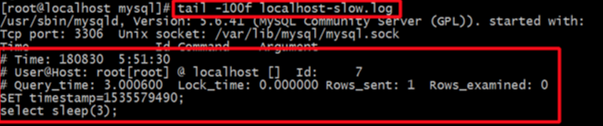
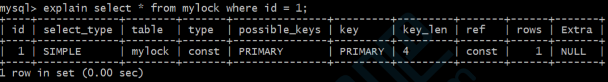

# 慢查询日志

## 性能优化思路

1. 首先需要使用慢查询功能,去获取所有查询时间比较长的SQL语句 

2. 其次使用explain命令去查看有问题的SQL的执行计划 

3. 最后可以使用show profile[s] 查看有问题的SQL的性能使用情况 

4. 优化改造SQL语句(需要对于需求有很好的理解,比如查询某个人最近半年的银行流水,银行只会提供最近一年 

   内的流水,还有的只提供最近半年的查询)

## 慢查询日志介绍

​	数据库查询快慢是影响项目性能的一大因素,对于数据库,我们除了要优化 SQL,更重要的是得先找到需要优化的SQL。

​	MySQL 数据库有一个"慢查询日志"功能,用来记录查询时间超过某个设定的值的SQL ,这将极大程度帮助我们快速定位为症结所在 ,以便对症下药。 

​	至于查询时间的多少才算慢,每个项目、业务都有不同的要求。

​	比如说传统企业的软件允许查询时间高于某个值,但是把这个标准放在互联网项目或者访问量大的网站上,估计就是一个bug,甚至可能升级为一个功能性缺陷。 

​	MySQL的慢查询日志功能,  默认是关闭的，需要手动开启。

## 开启慢查询功能

* 查看是否开启慢查询功能

  ```mysql
  show variables like '%slow_query%';
  show variables like '%long_query_time%';
  ```

  参数说明：

  ```mysql
  -- slow_query_log :是否开启慢查询日志,ON 为开启,OFF 为关闭,如果为关闭可以开启。
  
  -- log-slow-queries :旧版(5.6以下版本)MySQL数据库慢查询日志存储路径。可以不设置该参数,系统则会默认给一个缺省的文件host_name-slow.log
  
  -- slow-query-log-file:新版(5.6及以上版本)MySQL数据库慢查询日志存储路径。可以不设置该参数,系统则会默认给一个缺省的文件host_name-slow.log
  
  -- ong_query_time :慢查询阈值,当查询时间多于设定的阈值时,记录日志,单位为秒。
  ```

  

* 临时开启慢查询功能

  ```mysql
  set global slow_query_log = ON;
  set global long_query_time = 1;
  ```

  ⚠️：临时开启方式，在MySQL重启后失效

* 永久开启慢查询功能
  修改`/etc/my.cnf`配置文件,重启 MySQL, 这种永久生效:

  ```properties
  [mysqld]
  slow_query_log = ON
  slow_query_log_file = /var/log/mysql/slow.log
  long_query_time = 1
  ```

  ```shell
  # 重启mysql
  systemctl restart mysqld
  ```

### 慢查询日志格式




格式说明：

* 第一行：SQL查询执行的具体时间

* 第二行：执行SQL查询的连接信息，用户和连接IP

* 第三行：记录一些比较有用的信息，如下解析：

  ```mysql
  -- Query_time,这条SQL执行的时间,越长则越慢
  -- Lock_time,在MySQL服务器阶段(不是在存储引擎阶段)等待表锁时间
  -- Rows_sent,查询返回的行数
  -- Rows_examined,查询检查的行数,越长就当然越费时间
  ```

* 第四行：设置时间戳，没有实际意义，只是和第一行对应执行时间。

* 第五行及后面所有行(第二个# Time:之前)，执行的sql语句记录信息，因为sql可能会很长。

## 分析慢查询日志

### MySQL自带的mysqldumpslow

得到按照时间排序的前10条里面含有左连接的查询语句:

```shell
[root@localhost mysql]# mysqldumpslow -s t -t 10 -g "left join" /var/log/mysql/slow.log
```

常用参数说明：

```shell
-s:是表示按照何种方式排序
	c：访问时间
	l：锁定时间
	r：返回记录
	t：查询时间
	al：平均锁定时间
	ar：平均返回记录数
	at：平均查询时间
-t:是top n的意思,即为返回前面多少条的数据
-g:后边可以写一个正则匹配模式,大小写不敏感的
```

### 使用mysqlsla工具

​	mysqlsla工具,功能非常强大。数据报表,非常有利于分析慢查询的原因,包括执行频率,数据量,查询消耗等。不过此工具已停止维护,项目 github 介绍页面推荐使用 `percona-toolkit`,下面有介绍。

```shell
mysqlsla -lt /var/log/mysql/slow.log
```

### 使用persona-toolkit工具

​	percona-toolkit是一组高级命令行工具的集合,可以查看当前服务的摘要信息,磁盘检测,分析慢查询日志,查找重复索引,实现表同步等等。

* [下载](https://www.percona.com/downloads/percona-toolkit/3.0.11/binary/tarball/percona-toolkit-3.0.11_x86_64.tar.gz)

* 安装

  ```shell
  tar -xf percona-toolkit-3.0.11_x86_64.tar.gz
  cd percona-toolkit-3.0.11
  perl Makefile.PL
  make
  make install
  ```

* 调错
  Can't locate ExtUtils/MakeMaker.pm in @INC 错误的解决方式:

  ```shell
  yum install -y perl-ExtUtils-CBuilder perl-ExtUtils-MakeMaker
  ```

  Can't locate Time/HiRes.pm in @INC

  ```shell
  yum install -y perl-Time-HiRes
  ```

* 使用pt-query-digest查看慢查询日志

  ```shell
  pt-query-digest /var/lib/mysql/localhost-slow.log
  ```

# 查看执行计划

## 介绍

​	MySQL 提供了一个EXPLAIN命令 , 它可以对SELECT语句进行分析 , 并输出 SELECT 执行的详细信息, 以供开发人员针对性优化. 

​	使用`explain`这个命令来查看一个这些SQL语句的执行计划,查看该SQL语句有没有使用上了索引,有没有做全表扫描,这都可以通过`explain`命令来查看。 

​	可以通过`explain`命令深入了解MySQL的基于开销的优化器,还可以获得很多可能被优化器考虑到的访问策略的细节,以及当运行SQL语句时哪种策略预计会被优化器采用。 

​	EXPLAIN 命令用法十分简单, 在 SELECT 语句前加上 explain 就可以了, 例如: `explain select * from products;`

## 参数说明

expain出来的信息有10列,分别是:`id、select_type、table、type、possible_keys、key、key_len、ref、rows、Extra`

### id

* 每个 SELECT语句都会自动分配的一个唯一标识符. 
* 表示查询中操作表的顺序,有三种情况: 
  * id相同:执行顺序由上到下 
  * id不同:如果是子查询,id号会自增,id越大，优先级越高。
  * id相同的不同的同时存在

* id列为null的就表示这是一个结果集,不需要使用它来进行查询。
   

### select_type(重要)

​	查询类型，主要用于区别普通查询、联合查询(union、union all)、子查询等复杂查询。

#### simple

​	表示不需要union操作或者不包含子查询的简单select查询。有连接查询时,外层的查询为simple,且只有一个

#### primary

​	一个需要union操作或者含有子查询的select,位于最外层的单位查询的select_type即为primary。且只有一个 

#### union

​	union连接的两个select查询,第一个查询是dervied派生表,除了第一个表外,第二个以后的表select_type都是union 

#### dependent union

​	与union一样,出现在union 或union all语句中,但是这个查询要受到外部查询的影响

#### union result

​	包含union的结果集,在union和union all语句中,因为它不需要参与查询,所以id字段为null

#### subquery

​	除了from子句中包含的子查询外,其他地方出现的子查询都可能是subquery

#### dependent subquery

​	与dependent union类似,表示这个subquery的查询要受到外部表查询的影响

#### derived

​	from字句中出现的子查询,也叫做派生表,其他数据库中可能叫做内联视图或嵌套select 

### table

* 显示的查询表名,如果查询使用了别名,那么这里显示的是别名
* 如果不涉及对数据表的操作,那么这显示为null
* 如果显示为尖括号括起来的就表示这个是临时表,后边的N就是执行计划中的id,表示结果来自于这个查询产生。
* 如果是尖括号括起来的`<union M,N>` ,与类似,也是一个临时表,表示这个结果来自于union查询的id为M,N的结果集。 

### type(重要)

* 依次由好到差：

  > **system,const,eq_ref,ref**,fulltext,ref_or_null,unique_subquery,index_subquery,**range**,index_merge,**index**,**ALL**

* 注意事项
  最差要索引使用到range级别。

#### system

全表中只有一行数据或者是空表。可以用子查询演示：


#### const(重要)

使用**唯一索引或者主键** ,返回记录一定是1行记录的**等值where条件**时,通常type是const。其他数据库也叫做唯一
索引扫描



#### eq_ref(重要)

关键字:连接字段**主键或者唯一性索引** 。
此类型通常出现在**多表的 join 查询**, 表示对于**前表的每一个结果, 都只能匹配到后表的一行结果，并且查询到比较操作通常是`=`**，查询效率较高

#### ref(重要)

针对**非唯一性索**引，使用**等值(`=`)查询**，或者是使用了**最左前缀规则索引到查询**。

组合索引最左前缀ref示例：


#### fulltext

​	全文索引检索,要注意,全文索引的优先级很高,若全文索引和普通索引同时存在时,mysql不管代价,优先选择使用全文索引

#### ref_or_null

​	与ref方法类似,只是增加了null值的比较。实际用的不多。 

#### unique_subquery

​	用于where中的in形式子查询,子查询返回不重复值唯一值

#### index_subquery

​	用于in形式子查询使用到了辅助索引或者in常数列表,子查询可能返回重复值,可以使用索引将子查询去重。

#### range(重要) 

​	**索引范围**扫描，常见于使用`>、<、is null、between、in、like`等运算符的查询中。


#### index_merge

​	表示查询使用了两个以上的索引,最后取交集或者并集,常见`and、or`的条件使用了不同的索引,官方排序这个在`ref_or_null`之后,但是实际上由于要读取所个索引,性能可能大部分时间都不如range

#### index(重要)

⚠️关键：条件是出现在索引树中的节点的，可能没有完全匹配索引。

索引全表扫描，把索引从头到尾扫一遍，常见于使用索引列就可以处理不需要读取数据文件的查询、可以使用索引排
序或者分组的查询。

#### 

#### 

#### all(重要) 

​	这个就是**全表扫描**数据文件，然后再在server层进行过滤返回符合要求的记录。


### possible_keys

​	此次查询可能选用的索引，一个或多个

### key

​	查询真正使用到的索引,select_type为`index_merge`时,这里可能出现两个以上的索引,其他的select_type这里只会出现一个。

### key_len

* 用于处理查询的索引长度,如果是单列索引,那就整个索引长度算进去,如果是多列索引,那么查询不一定都能使用到所有的列,具体使用到了多少个列的索引,这里就会计算进去,没有使用到的列,这里不会计算进去。
* 留意下这个列的值,算一下你的多列索引总长度就知道有没有使用到所有的列了。
* 另外, key_len只计算where条件用到的索引长度，而排序和分组就算用到了索引，也不会计算到key_len中。

### ref

* 如果是使用的常数等值查询,这里会显示const
* 如果是连接查询,被驱动表的执行计划这里会显示驱动表的关联字段
* 如果是条件使用了表达式或者函数,或者条件列发生了内部隐式转换,这里可能显示为func

### rows

​	这里是执行计划中估算的扫描行数,不是精确值(InnoDB不是精确的值,MyISAM是精确的值,主要原因是InnoDB里面使用了MVCC并发机制)

### extra(重要)

​	这个列包含不适合在其他列中显示单十分重要的额外的信息,这个列可以显示的信息非常多,有几十种,常用的有：

#### distinct

​	在select部分使用了distinct关键字

#### no tables used

* 不带from子句的查询或者From dual查询
* 使用not in()形式子查询或not exists运算符到连接查询，这种叫做反连接。即，一般连接查询是先查询内表，再查询外表，反连接就是先查询外表，再查询内表。

#### using filesort(重要)

* **排序时无法使用到索引**时,就会出现这个。常见于order by和group by语句中
* 说明MySQL会使用一个外部的索引排序,而不是按照索引顺序进行读取。
* MySQL中无法利用索引完成的排序操作称为“文件排序”
* ⚠️：using filesort说明性能不佳
  

#### using index(重要)

​	查询时 ,直接通过索引就可以获取查询的数据。 

* 表示相应的SELECT查询中使用到了**覆盖索引(Covering Index)** ,避免访问表的数据行,效率不错! 
* 如果同时出现Using Where ,说明索引被用来执行查找索引键值
* 如果没有同时出现Using Where ,表明索引用来读取数据而非执行查找动作。 


#### using join buffer(block nested loop)，using join buffer(batched key accss)

​	5.6.x之后的版本优化关联查询的`BNL,BKA`特性。主要是减少内表的循环数量以及比较顺序地扫描查询。

#### using sort_union，using_union，using intersect，using sort_intersection

* using intersect:表示使用and的各个索引的条件时,该信息表示是从处理结果获取交集
* using union:表示使用or连接各个使用索引的条件时,该信息表示从处理结果获取并集
* using sort_union和using sort_intersection:与前面两个对应的类似,只是他们是出现在用and和or查询信息量大时,先查询主键,然后进行排序合并后,才能读取记录并返回。

#### using temporary(重要)

* 表示**使用了临时表存储中间结果**。
* MySQL在对查询结果order by和group by时使用临时表
* 临时表可以是内存临时表和磁盘临时表,执行计划中看不出来,需要查看status变量,used_tmp_table,used_tmp_disk_table才能看出来。

#### using where(重要)

* 表示存储引擎返回的记录并不是所有的都满足查询条件,需要在server层进行过滤。
  
* 查询条件中分为限制条件和检查条件,5.6之前,存储引擎只能根据限制条件扫描数据并返回,然后server层根据检查条件进行过滤再返回真正符合查询的数据。5.6.x之后支持**ICP**特性,可以把检查条件也下推到存储引擎层,不符合检查条件和限制条件的数据,直接不读取,这样就大大减少了存储引擎扫描的记录数量。extra列显示using index condition 
  

#### firstmatch(tb_name)

​	5.6.x开始引入的优化子查询的新特性之一,常见于where字句含有in()类型的子查询。如果内表的数据量比较大,就可能出现这个

#### loosescan(m…n)

​	5.6.x之后引入的优化子查询的新特性之一,在in()类型的子查询中,子查询返回的可能有重复记录时,就可能出现这个。除了这些之外,还有很多查询数据字典库,执行计划过程中就发现不可能存在结果的一些提示信息

#### filtered

​	使用explain extended时会出现这个列,5.7之后的版本默认就有这个字段,不需要使用explain extended了。这个字段表示存储引擎返回的数据在server层过滤后,剩下多少满足查询的记录数量的比例,注意是百分比,不是具体记录数。

## 参考网站

* [MySQL 性能优化神器 Explain 使用分析](https://segmentfault.com/a/1190000008131735)
* [MySQL explain type详解](https://blog.csdn.net/rewiner120/article/details/70598797)
* [MySQL数据库Sql语句执行效率检查--Explain命令](https://www.cnblogs.com/cb0327/p/6142046.html)
* [MySQL 之 Explain 输出分析](https://mp.weixin.qq.com/s/yOZ3WglZMZJaV9H7ruzA6g)

# profile分析语句

## 介绍

​	Query Profiler是MYSQL自带的一种**query诊断分析工具**，通过它可以分析出一条SQL语句的**硬件性能瓶颈**在什么地方。

​	通常我们在使用的explian，以及slow query log都无法做到精确分析，但是Query Profiler却可以定位出一条SQL语句执行的各种资源消耗情况，比如CPU、IO等，以及该SQL执行所耗费的时间等。不过该工具只有在MySQL5.0.37以及以上版本中才有实现。

​	默认情况下，MySQL的该功能没有打开，需要自己手动开启。

## 语句使用

* `show profile`和`show profiles`语句可以展示==当前会话(退出session后，profiling重置为0)==中执行语句的资源使用情况。

* Profiling是针对进程(process)而非线程(threads),因此运行在服务器上的其他服务进程可能会影响分析结果。Profiling 信息收集依赖于调用 系统方法 getrusage().因此Windows系统不适用。

* `show profiles`：以列表形势显示最近发送到服务器上执行的语句的资源使用情况。显示记录数由变量：*profiling_history_size*控制，默认15条

  ```mysql
  mysql> show profiles;
  +----------+------------+-------------------------------+
  | Query_ID | Duration   | Query                         |
  +----------+------------+-------------------------------+
  |        1 | 0.00371475 | show variables like '%profi%' |
  |        2 | 0.00005700 | show prifiles                 |
  |        3 | 0.00011775 | SELECT DATABASE()             |
  |        4 | 0.00034875 | select * from student         |
  +----------+------------+-------------------------------+
  ```

* `show profile`：展示最近一条语句执行的详细资源占用信息，默认显示**Status**和**Duration**两列

  ```mysql
  mysql> show profile;
  +----------------------+----------+
  | Status               | Duration |
  +----------------------+----------+
  | starting             | 0.000054 |
  | checking permissions | 0.000007 |
  | Opening tables       | 0.000116 |
  | init                 | 0.000019 |
  | System lock          | 0.000009 |
  | optimizing           | 0.000004 |
  | statistics           | 0.000011 |
  | preparing            | 0.000010 |
  | executing            | 0.000002 |
  | Sending data         | 0.000061 |
  | end                  | 0.000005 |
  | query end            | 0.000006 |
  | closing tables       | 0.000006 |
  | freeing items        | 0.000031 |
  | cleaning up          | 0.000010 |
  +----------------------+----------+
  ```

* `show profile`：还可以根据`show profiles`列表中的**Query_ID**，选择显示某条记录的性能分析信息

  ```mysql
  Syntax:
  SHOW PROFILE [type [, type] ... ]
      [FOR QUERY n]
      [LIMIT row_count [OFFSET offset]]
  
  type: {
      ALL
    | BLOCK IO
    | CONTEXT SWITCHES
    | CPU
    | IPC
    | MEMORY
    | PAGE FAULTS
    | SOURCE
    | SWAPS
  }
  ```

## 开启profile功能

* Profiling 功能由MySQL会话变量 : `profiling`控制,默认是OFF.关闭状态。

* 查看是否开启了Profile功能:

  ```mysql
  mysql> select @@profiling;
  +-------------+
  | @@profiling |
  +-------------+
  |           0 |
  +-------------+
  -- show variables like '%profi%'；
  ```

* 开启profile功能

  ```mysql
  set profiling=1; -- 1是开启、0是关闭
  ```

## 示例

* 查看是否打开了性能分析功能

  ```mysql
  select @@profiling;
  ```

* 打开profiling功能

  ```mysql
  set profiling=1;
  ```

* 执行sql语句

  ```mysql
  select * from products;
  select count(*) from products;
  ```

* 执行`show profiles`查看分析列表

  ```mysql
  show profiles;
  ```

  

* 查看SQL语句的执行情况 

  ```mysql
  -- 查看最近一条SQL语句的执行情况
  show profile;
  -- 查看第三条SQL语句的执行情况
  show profile for query 3;
  ```

  

* 可指定资源类型查询

  ```mysql
  show profile cpu,swaps for query 3;
  ```

  

