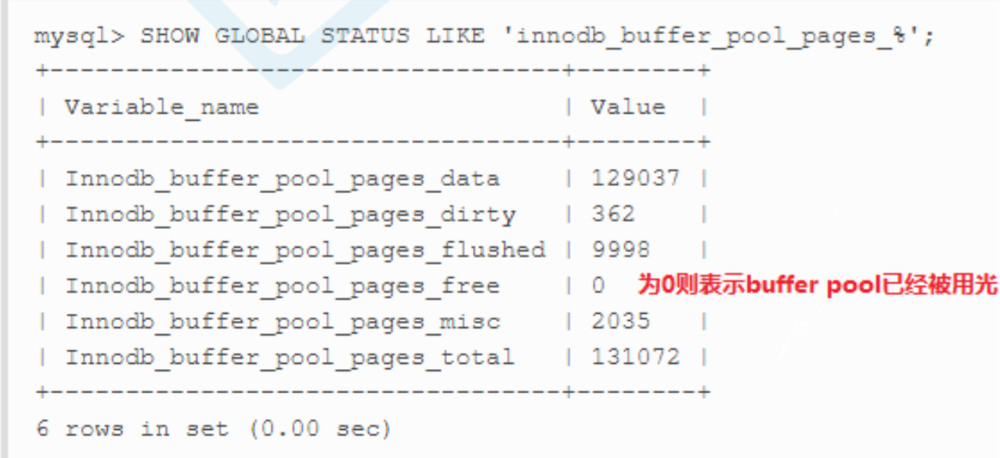

# 服务器层面优化(了解)

## 将数据保存在内存中，保证从内存读取数据

* 设置足够大的 innodb_buffer_pool_size ,将数据读取到内存中。

  ```mysql
  -- 建议innodb_buffer_pool_size设置为总内存大小的3/4或者4/5.
  ```

* 怎样确定 `innodb_buffer_pool_size` 足够大。数据是从内存读取而不是硬盘?

  ```mysql
  show global status like 'innodb_buffer_pool_pages_%';
  ```

  

## 内存预热

将磁盘数据在MySQL Server启动的时候,读取到内存中。

## 降低磁盘写入次数

* 对于生产环境来说,很多日志是不需要开启的,比如:通用查询日志、慢查询日志、错误日志

* 使用足够大的写入缓存 `innodb_log_file_size`

  ```mysql
  -- 推荐 innodb_log_file_size 设置为 0.25 * innodb_buffer_pool_size
  ```

* 设置合适的`innodb_flush_log_at_trx_commit`,和日志落盘有关系。

## 提高磁盘读写

* 可以考虑使用SSD硬盘，不过得考虑成本是否合适。

# SQL设计优化(了解需求且懂技术的人)

* **设计中间**表,一般针对于**统计分析**功能，或者实时性不高的需求(OLTP、OLAP)
* 为减少关联查询,创建合理的**冗余字段**(考虑数据库的三范式和查询性能的取舍,创建冗余字段还需要注意**数据一致性问题**）
* 对于字段太多的大表，考虑**拆表**(比如一个表有100多个字段) 
* 对于表中经常不被使用的字段或者存储数据比较多的字段,考虑拆表(比如商品表中会存储商品介绍,此时可以将商品介绍字段单独拆解到另一个表中,使用商品ID关联) 
* 每张表建议都要有一个主键(主键索引),而且主键类型最好是int类型 ,建议自增主键(不考虑分布式系统的情况下)。 

# SQL语句优化(开发人员)

## 索引优化

* 为搜索字段(**where中的条件**)创建索引(考虑数据的业务场景:查询多还是增删多?)
* 尽量建立**组合索引**并注意组合索引的创建顺序,按照顺序组织查询条件、尽量将筛选粒度大的查询条件放到最左边
* **使用覆盖索引**，SELECT语句中尽量不要使用`＊`
* order by、group by语句要尽量使用到索引 

## LIMIT优化

* 如果预计SELECT语句的查询结果是一条,最好使用`limit 1` ,可以停止全表扫描。

  ```mysql
  SELECT * FROM user WHERE username='全力詹'; -- username没有建立唯一索引 
  SELECT * FROM user WHERE username='全力詹' LIMIT 1;
  ```

* 处理分页会使用到 LIMIT ,当翻页到非常靠后的页面的时候,偏移量会非常大,这时LIMIT的效率会非常差。 `LIMIT OFFSET , SIZE`; 

  LIMIT的优化问题,其实是 OFFSET 的问题,它会导致MySql扫描大量不需要的行然后再抛弃掉.

  * 解决方案：**使用order by和索引覆盖**

    * 原SQL(如果 表中的记录有10020条):

      ```mysql
      SELECT film_id, description FROM film  LIMIT 10000, 20;
      ```

    * 优化的SQL:

      ```mysql
      SELECT film_id, description FROM film ORDER BY title LIMIT 20;
      ```

## 其他优化

* 尽量不使用count(*)、尽量使用count(主键)

  ```mysql
  -- COUNT(*):查询行数,是会遍历所有的行、所有的列。 
  -- COUNT(列):查询指定列不为null的行数(过滤null),如果列可以为空,则COUNT(*)不等于COUNT(列),除非指定的列是非空的列才会让COUNT(*)等于COUNT(列) 
  -- COUNT(伪列):比如count(1)
  ```

* JOIN两张表的关联字段最好都**建立索引**,而且最好**字段类型是一样**的.

  ```mysql
  SELECT * FROM orders o LEFT JOIN user u on o.user_id = u.id;-- orders表中的user_id和user表中的id,类型要一致
  ```

* WHERE条件中尽量**不要使用1=1、not in语句**(建议使用not exists)

* 不用 MYSQL 内置的函数,因为内置函数不会建立查询缓存。

  ```mysql
  -- SQL查询语句和查询结果都会在第一次查询只会存储到MySQL的查询缓存中,如果需要获取到查询缓存中的查询 结果,查询的SQL语句必须和第一次的查询SQL语句一致。
  SELECT * FROM user where birthday = now();
  ```

* 合理利用慢查询日志、explain执行计划查询、show profile查看SQL执行时的资源使用情况。