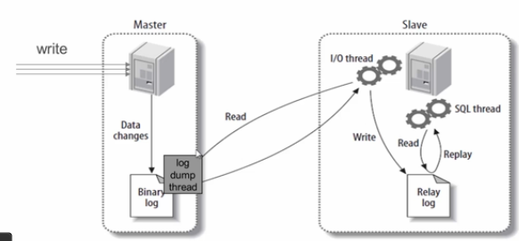
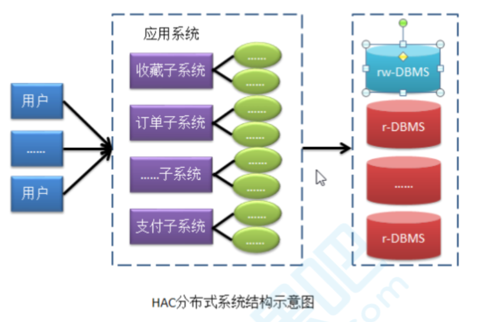
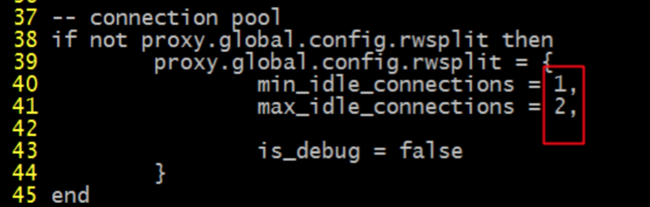

# 集群搭建之主从复制

## 主从复制原理



## binlog介绍和relay日志

查看bin log和relay log日志:

```shell
mysqlbinlog --base64-output=decode-rows -v -v mysql-bin.000058 > binlog
```

## 主从复制实践

### 关闭主从机器的防火墙

```shell
systemctl stop iptables(需要安装iptables服务) 
systemctl stop firewalld(默认)
systemctl disable firewalld.service(设置开启不启动)
```

### 主服务器配置

#### 第一步：修改my.conf文件

在[mysqld]段下添加:

```properties
#启用二进制日志 
log-bin=mysql-bin 
#服务器唯一ID,一般取IP最后一段 
server-id=133
```

#### 第二步：重启mysql服务

```shell
systemctl restart mysqld
```

#### 第三步：主机给从机授备份权限

注意:先要登录到MySQL命令客户端

```shell
mysql>GRANT REPLICATION SLAVE ON *.* TO '从机MySQL用户名'@'从机IP' identified by '从机 MySQL密码';
```

示例：

```mysql
GRANT REPLICATION SLAVE ON *.* TO 'root'@'%' identified by 'root';
```

⚠️注意事项：一般不用root帐号,“%”表示所有客户端都可能连,只要帐号,密码正确,此处可用具体客户端IP代替,如：192.168.145.226,加强安全。

#### 第四步：刷新权限

```mysql
mysql> FLUSH PRIVILEGES;
```

#### 第五步：查询master的状态

```mysql
mysql> show master status;
+------------------+-- -------+--------------+------------------+
| File             | Position | Binlog_Do_DB | Binlog_Ignore_DB |
+------------------+----------+--------------+------------------+
| mysql-bin.000001 |      410 | db1          | mysql            |
+------------------+----------+--------------+------------------+
1 row in set
```

### 从服务器配置

#### 第一步：修改my.conf文件

```properties
[mysqld]
server-id=135
```

#### 第二步：删除UUID文件

* **如果出现此错误**:*Fatal error: The slave I/O thread stops because master and slave have equal MySQL server UUIDs; these UUIDs must be different for replication to work.*
* **原因**：因为是mysql是克隆的系统所以mysql的uuid是一样的,所以需要修改。
* **解决方法**：删除/var/lib/mysql/auto.cnf文件,重新启动MySQL服务。

#### 第三步：重启并登录到MySQL进行配置从服务器

```mysql
mysql>change master to
 master_host='192.168.10.135',
 master_port=3306,
 master_user='root',
 master_password='root',
 master_log_file='mysql-bin.000005',
 master_log_pos=397
```

⚠️注意：语句中间不要断开, `master_port`为mysql服务器端口号(无引号), `master_user`为执行同步操作的数据库账户, `"410"` 无单引号(此处的 410 就是 `show master status` 中看到的 `position` 的值,这里的 `mysql-bin.000001` 就是 `file` 对应的值)。

#### 第四步：启动从服务器复制功能

```mysql
mysql>start slave;
```

#### 第五步：检查从服务器复制功能状态

```mysql
mysql> show slave status \G;
-- ........................(省略部分)
Slave_IO_Running: Yes -- 此状态必须YES 
Slave_SQL_Running: Yes -- 此状态必须YES 
-- ........................(省略部分)
```

⚠️注意：Slave_IO及Slave_SQL进程必须正常运行，即YES状态，否则都是错误的状态(如：其中一个NO均属错误。)

以上操作过程后，从服务器配置完成。

### 测试

​	搭建成功后，往主机中插入数据，看看从机中是否有数据。

# 集群搭建之读写分离

## 读写分离的理解



* **名词解释**：HAC:High Availability Cluster,高可用集群
* ⚠️**注意事项**：MySQL的主从复制,只会保证主机对外提供服务,而从机是不对外提供服务的,只是在后台为主机进行备份。

## 读写分离演示需求

> MySQL master:135
> MySQL slave :136
> MySQL proxy :137

## MySQL-Proxy安装

* 下载

  ```shell
  wget https://downloads.mysql.com/archives/get/file/mysql-proxy-0.8.5-linux-el6-x86-
  64bit.tar.gz
  ```

* 解压缩

  ```shell
  tar -xf mysql-proxy-0.8.5-linux-el6-x86-64bit.tar.gz -C /kkb
  ```

## MySQL-Proxy配置

* 创建mysql-proxy.cnf文件

  ```properties
  [mysqld]
  user=root
  admin-username=root
  admin-password=root
  proxy-address=192.168.10.137:4040
  proxy-backend-addresses=192.168.10.135:3306
  proxy-read-only-backend-addresses=192.168.10.136:3306
  proxy-lua-script=/root/mysql-proxy/share/doc/mysql-proxy/rw-splitting.lua
  log-file=/root/mysql-proxy/logs/mysql-proxy.log
  log-level=debug
  keepalive=true
  daemon=true
  ```

* 修改mysql-proxy.cnf文件的权限

  ```shell
  chmod 660 mysql-proxy.cnf
  ```

* 修改rw-splitting.lua脚本
  

## MySQL-Proxy启动域测试

* 启动命令

  ```shell
  ./mysql-proxy --defaults-file=mysql-proxy.cnf配置文件的地址
  ```

  ⚠️**注意事项**：如果没有配置profile文件的环境变量,则需要去拥有mysql-proxy命令的目录通过./mysql-proxy进行启动。

* 在其他客户端,通过mysql命令去连接MySQL Proxy机器

  ```mysql
  mysql -uroot -proot -h192.168.10.134 -P4040
  ```

  