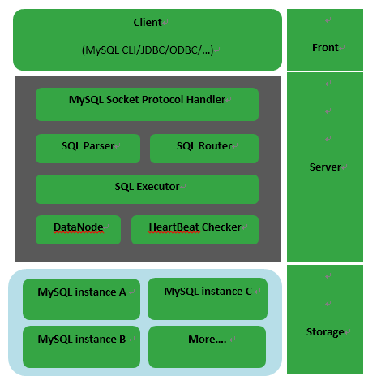
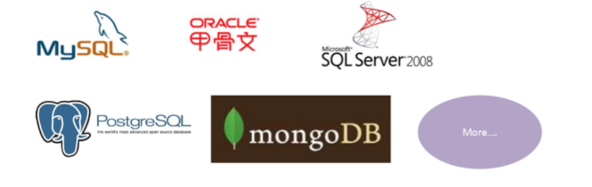
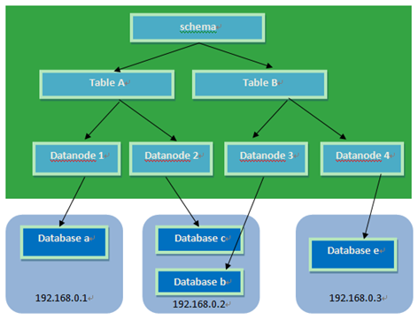
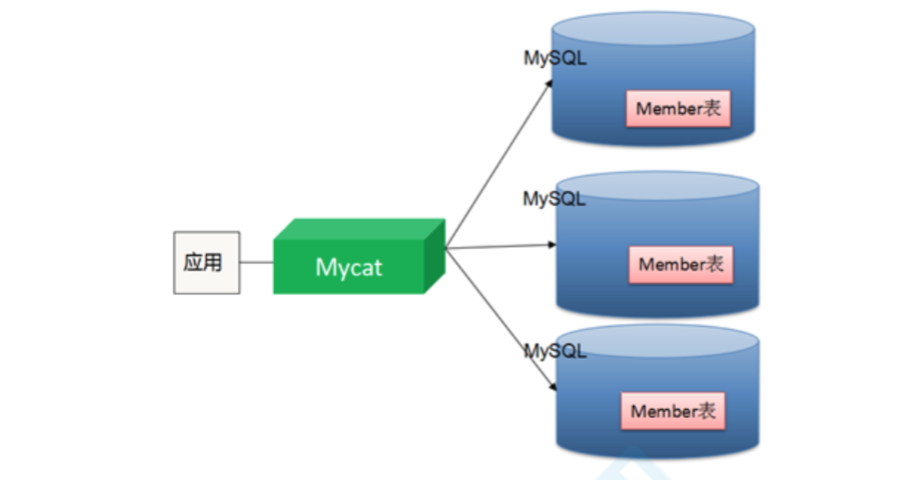

# 分库分表介绍

## 使用背景

* 当【表的数量】达到了几百上千张表时,众多的业务模块都访问这个数据库,压力会比较大,考虑对其进行分库。 
* 当【表的数据】达到了几千万级别,在做很多操作都比较吃力,所以,考虑对其进行分库或者分表。 

## 数据切分(sharding)方案

​	数据的切分(Sharding)根据其切分规则的类型,可以分为两种切分模式: 

* 垂直切分：按照业务模块进行切分,将不同模块的表切分到不同的数据库中。
* 水平切分：将一张大表按照一定的切分规则,按照行切分成不同的表或者切分到不同的库中。

## 切分规则

* 按照ID取模:对ID进行取模,余数决定该行数据切分到哪个表或者库中
* 按照日期:按照年月日,将数据切分到不同的表或者库中
* 按照范围:可以对某一列按照范围进行切分,不同的范围切分到不同的表或者数据库中。

## 切分原则

* 第一原则:能不切分尽量不要切分。
* 第二原则:如果要切分一定要选择合适的切分规则,提前规划好。
* 第三原则:数据切分尽量通过数据冗余或表分组(Table Group)来降低跨库 Join 的可能。
* 第四原则:由于数据库中间件对数据 Join 实现的优劣难以把握,而且实现高性能难度极大,业务读取尽量少使用多表 Join。

## 分库分表需要解决的问题

### 分布式事务问题

* 强一致性事务(同步)
* 最终一致性事务(异步思想)

### 分布式主键ID问题

* redis incr命令
* 数据库(生成主键)
* UUID
* snowflake算法

### 跨库join问题

* 通过业务分析,将不同库的join查询拆分成多个select
* 建立全局表(每个库都有一个相同的表)
* 冗余字段(不符合数据库三范式)
* E-R分片(将有ER关系的记录都存储到一个库中)
* 最多支持跨两张表跨库的join

### 跨库count、order by、group by问题

## 分库分表实现技术

* 阿里的TDDL、Cobar
* 基于阿里Cobar开发的Mycat
* 当当网的sharding-jdbc

# Mycat介绍

## 什么是Mycat？

* [官方网站]([http://www.mycat.org.cn/](http://www.mycat.org.cn/))

## Mycat框架



## Mycat核心概念

* Schema：由它指定逻辑数据库(相当于MySQL的database数据库) 
* Table：逻辑表(相当于MySQL的table表) 
* DataNode：真正存储数据的物理节点
* DataHost：存储节点所在的数据库主机(指定MySQL数据库的连接信息) 
* User：MyCat的用户(类似于MySQL的用户,支持多用户) 

## Mycat主要解决的问题

* 海量数据存储
* 查询优化

## Mycat多对数据库的支持



## Mycat分片策略

​	MyCAT支持水平分片与垂直分片：

* 水平分片：一个表格的数据分割到多个节点上,按照行分隔。
* 垂直分片：一个数据库中多个表格A,B,C,A存储到节点1上,B存储到节点2上,C存储到节点3上。





​	MyCAT通过定义表的分片规则来实现分片,每个表格可以捆绑一个分片规则,每个分片规则指定一个分片字段并绑定一个函数,来实现动态分片算法。 

1. Schema：逻辑库,与MySQL中的Database(数据库)对应,一个逻辑库中定义了所包括的Table。
2. Table：表,即物理数据库中存储的某一张表,与传统数据库不同,这里的表格需要声明其所存储的逻辑数据节点DataNode。在此可以指定表的分片规则。 
3. DataNode：MyCAT的逻辑数据节点,是存放table的具体物理节点,也称之为分片节点,通过DataHost来关联到后端某个具体数据库上 
4. DataHost：定义某个物理库的访问地址,用于捆绑到Datanode上 

# Mycat安装

⚠️注意：需要先安装jdk(操作系统如果是64位，必须按照64位的JDK)

* 第一步：下载MyCat

  ```shell
  wget http://dl.mycat.io/1.6-RELEASE/Mycat-server-1.6-RELEASE-20161028204710-
  linux.tar.gz
  ```

* 第二步：解压缩，得到mycat目录

  ```shell
  tar -zxvf Mycat-server-1.6-RELEASE-20161028204710-linux.tar.gz
  ```

* 第三步：进入mycat／bin，启动MyCat

  ```mysql
  -- 启动命令:./mycat start
  -- 停止命令:./mycat stop
  -- 重启命令:./mycat restart - 查看状态:./mycat status
  ```

* 第四步：访问Mycat：使用mysql的客户端直接连接mycat服务。默认服务端口为【8066】

# Mycat分片

# Mycat读写分离