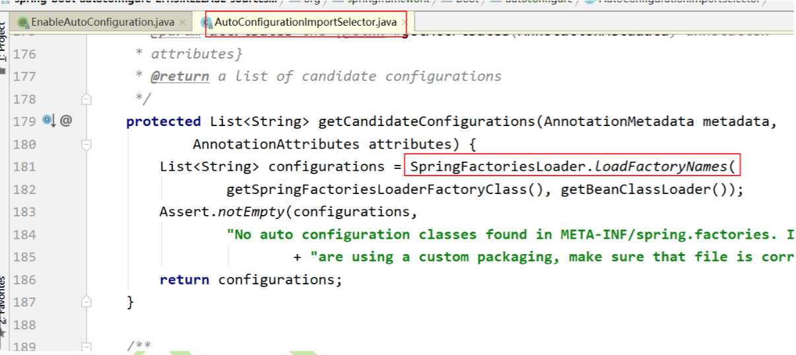
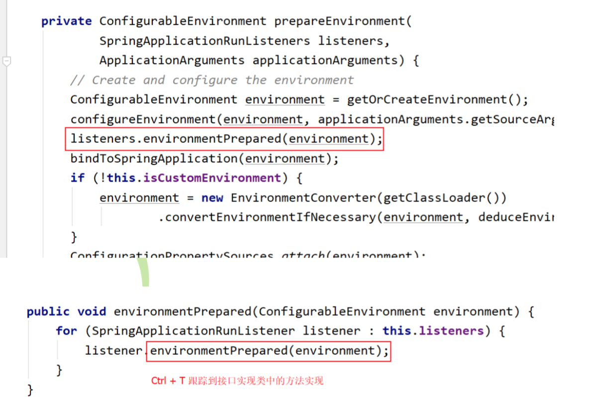
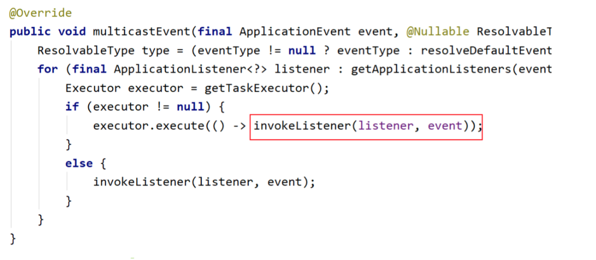
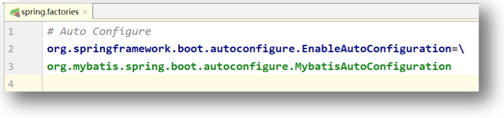

# 自动配置源码解析

​	使用 Spring Boot 开发较之以前的基于 xml 配置式的开发,要简捷方便快速的多。而这完全得益于 Spring Boot 的自动配置。下面就通过源码阅读方式来分析自动配置的运行原理。

## 解析@SpringBootApplication

打开启动类的@SpringBootApplication 注解源码。


我们发现@SpringBootApplication 注解其实就是一个组合注解，其中各个注解的意义为:


### 元注解

* `@Target(ElementType.TYPE)`:表示当前注解仅能注解在类上。
* `@Retention(RetentionPolicy.RUNTIME)`:表示当前注解的生存时间为源码、字节 码,及 JVM 运行期间。
* `@Documented`:表示当前注解的注释信息将显示在javaAPI文档中
* `@Inherited`:表示当前注解所标注的类的子类将会继承该类上的注解

### @SpringBootConfiguration

注解与@Configuration 注解功能完全相同。

```java
@Target(ElementType.TYPE)
@Retention(RetentionPolicy.RUNTIME)
@Documented
@Configuration
public @interface SpringBootConfiguration {

}
```

### @ComponentScan

用于指定当前应用所要扫的包。

```java
@Retention(RetentionPolicy.RUNTIME)
@Target({java.lang.annotation.ElementType.TYPE})
@Documented
@Repeatable(ComponentScans.class)
public @interface ComponentScan
{...
```

### @EnableAutoConfiguration

​	该注解用于完成自动配置,是 Spring Boot 的核心注解。后面要详细解析。这里主要是要对`@EnableXxx` 注解进行说明。 

`@EnableXxx` 注解一般用于开启某一项功能,是为了避免简化配置代码的引入。其是组 合注解,一般情况下`@EnableXxx` 注解中都会组合一个`@Import` 注解,而该`@Import` 注解用于导入指定的类,而该被导入的类一般为配置类。其导入配置类的方式常见的有三种: 

#### 直接引入配置类

​	`@Import` 中指定的类一般为 `Configuration` 结尾,且该类上会注解`@Configuration`,表示当前类为 JavaConfig 类。例如用于开启定时任务的`@EnableScheduling` 注解的`@Import`。 

#### 根据条件选择配置类

​	`@Import` 中指定的类一般以 `ConfigurationSelector` 结尾,且该类实现了` ImportSelector`接口,表示当前类会根据条件选择不同的配置类导入。例如,用于开启缓存功能的`@EnableCaching` 的`@Import`。

#### 动态注册Bean

​	`@Import` 中指定的类一般以 `Registrar` 结尾,且该类实现了 `ImportBeanDefinitionRegistrar`接口,用于表示在代码运行时若使用了到该配置类,则系统会自动将其导入。例如,用于开启 AspectJ 自动代理功能的`@EnableAspectJAutoProxy` 注解的`@Import`。

## 解析@EnableAutoConfiguration

```java
@Target(ElementType.TYPE)
@Retention(RetentionPolicy.RUNTIME)
@Documented
@Inherited
@AutoConfigurationPackage
@Import(AutoConfigurationImportSelector.class)
public @interface EnableAutoConfiguration {...
```

​	该注解用于完成自动配置,是 Spring Boot 的核心注解,是一个组合注解。所谓自动配置是指,将用户自定义的类及框架本身用到的类进行装配。其中最重要的注解有两个:  

* @AutoConfigurationPackage：用于导入并装配用户自定义类,即自动扫包中的类
* @Import：用于导入并装配框架本身的类

### 解析@Import





### 解析@AutoConfigurationPackage


# Spring.yml的加载

​	启动类的 run()方法开始执行后会<u>准备运行环境并注册监听器</u>,在准备运行环境时会发布环境准备事件,该事件会触发监听的执行,即监听器在监听到该事件后会加载配置文件。 

## 启动方法run()跟踪


## 准备运行环境


## 让监听器准备监听过程



## 发布环境准备事件


## 触发监听器




## 加载配置文件


# Spring Boot与Redis的整合


​	在 spring.factories 中有一个 `RedisAutoConfiguration` 类,通过前面的分析我们知道,该类一定会被 Spring 容器自动装配。但自动装配了就可以读取到 Spring Boot 配置文件中 Redis相关的配置信息了?这个类与 Spring Boot 配置文件是怎么建立的联系?

## 解析RedisAutoConfiguration

​	我们知道,若要使代码可以操作 Redis,就需要获取到 `RedisTemplate`,并通过`RedisTemplate` 获取到 Redis 操作对象 `RedisOperations`。没有 `RedisTemplate` 对象,没有`RedisOperations` 接口,是无法操作 Redis 的。`RedisAutoConfiguration` 类就对操作对象及`RedisTemplate` 做了要求及创建。

## 解析RedisProperties

​	该类用于封装来自于 Spring Boot 核心配置文件中的相关属性值。该类的成员变量即为Spring Boot 配置文件中的属性,而`@ConfigurationProperties` 用于指定这些属性在配置文件中的前辍。本类用于封装 Spring Boot 配置文件中以 `spring.redis` 开头的 `database`、`url`、`host`、`password`、`port` 等属性值。

# MyBatis与Spring Boot的整合

​	MyBatis 与 Spring Boot 整合,与 Spring Boot 与 Redis 整合不同的是,在 Spring Boot 默认自动配置的类中是不存在 MyBatis 自动配置类的,但存在 Redis 自动配置类。MyBatis 自动配置类被封装在了第三方的 Starter 中,所以,下面我们看一下第三方开发的 Starter 在 Spring Boot 中是如何工作的。

## 解析依赖

首先要导入第三方的 Starter 依赖。

```xml
<!-- mybatis与spring boot整合依赖 -->
<dependency>
  <groupId>org.mybatis.spring.boot</groupId>
  <artifactId>mybatis-spring-boot-starter</artifactId>
  <version>1.3.2</version>
</dependency>
```

​	在 External Libraries 中找到 `mybatis-spring-boot-starter` 依赖。我们发现其中并没有代码,且 META-INF 中还不存在 `spring.factories` 文件。但打开 pom.xml 文件,我们可以看到,其导入了一个如下依赖。

```xml
<dependency>
  <groupId>org.mybatis.spring.boot</groupId>
  <artifactId>mybatis-spring-boot-autoconfigure</artifactId>
</dependency>
```

​	在 External Libraries 中找到这个依赖。我们发现,其不仅有代码,在 `META-INF` 中还有`spring.factories` 文件,打开这个文件我们找到了 Mybatis 的自动配置类。



## 解析MybatisAutoConfiguration


## 解析MybatisProperties

​	指定用于封装 Spring Boot 配置文件中以 mybatis 开头的 `configLocation`、`mapperLocations`等属性值。


# 自定义Starter

​	前面的代码中,无论是 Spring Boot 中使用 `Web`、`Test`,还是 `MyBatis`、`Dubbo`,都需要导入一个相应的 `Starter` 依赖。那么,如果我们自己的某项功能代码也想将其应用到 Spring Boot 中,为 Spring Boot 项目 供相应支持,需要怎样实现呢?同样,我们需要定义自己的Starter。

## 手写Starter

### Starter工程命名

​	Spring 官方定义的 Starter 通常命名遵循的格式为 `spring-boot-starter-{name}`,例如 `spring-boot-starter-web`。Spring 官方建议,非官方 Starter 命名应遵循`{name}-spring-boot-starter` 的格式,例如,`dubbo-spring-boot-starter`。

### 需求

​	下面我们自定义一个我们自己的 Starter,实现的功能是:为用户 供的字符串添加前辍与后辍,而前辍与后辍定义在 yml 或 properties 配置文件中。例如,用户输入的字符串为 China,`application.yml` 配置文件中配置的前辍为`$$$`,后辍为`+++`,则最终生成的字符串为`$$$China+++`。

### 实现

#### 创建工程

​	创建一个 Spring Boot 工程,命名为 `wrap-spring-boot-starter`,并导入 `Configuration Processor` 与 `Lombok` 依赖 


最终定义好后的工程结构如下:


#### 定义一个Service类


#### 定义配置属性封装类


#### 定义自动配置类


#### 创建spring.factories文件

​	在 `resources/META-INF` 目录下创建一个名为 `spring.factories` 的文件。该配置文件是一个键值对文件,键是固定的,为 `EnableAutoConfiguration` 类的全限定性类名,而值则为我们自定义的自动配置类。


## 使用自定义的Starter

在本地要使用我们自定义的 Starter,首先要保证其已经被 Install 到了本地 Maven 库。

### 创建工程

创建一个 Spring Boot 工程,仅需要一个 web 依赖。


### 导入自定义Starter依赖


### 定义properties.yml

自定义 Starter 中的属性在配置文件中也是有自动 示功能的。


### 定义Controller


### 运行访问

启动类无需修改,直接启动运行即可。


# 相关文档：

* [SpringBoot是如何动起来的？](https://mp.weixin.qq.com/s/lRCxFiiUwD2C2WidTrMTkQ)