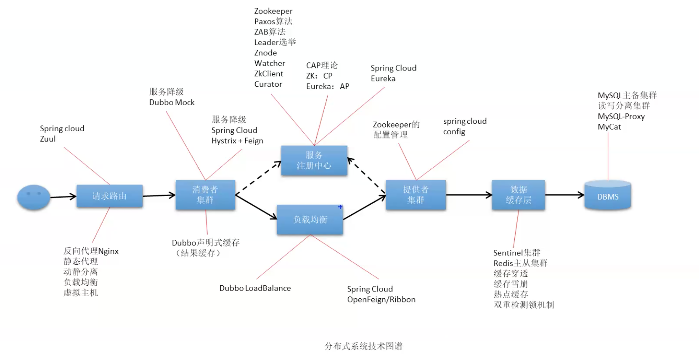
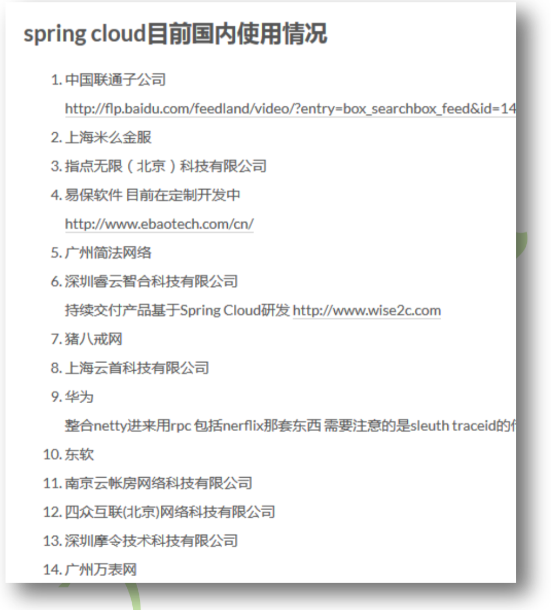
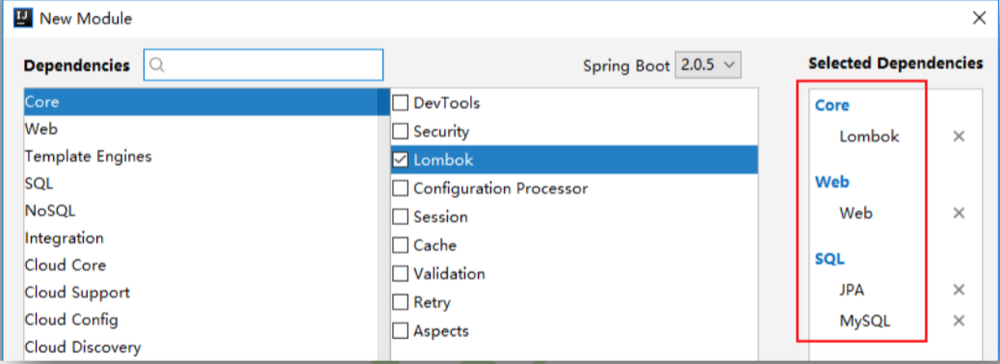
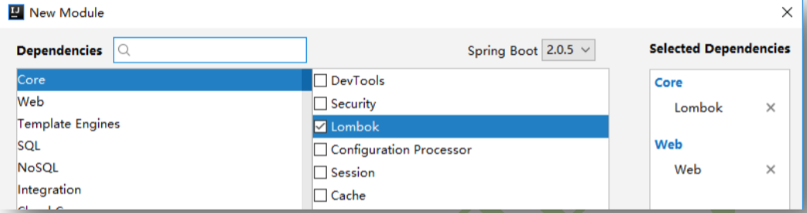

前沿

分布式系统技术回顾



* 反向代理Nginx：静态代理、动静分离、负载均衡、虚拟主机(Spring Cloud Zuul功能类似)
* 消费者集群
  * Dubbo声明式缓存(结果缓存)
  * 服务降级
    * Dubbo Mock
    * Spring Cloud Hystrix+Feign
* 服务注册中心
  * Zookeeper
    * Paxos算法
    * ZAB算法
    * Leader选举
    * Znode
    * Watcher
    * ZkClient
    * Curator
  * Spring Cloud Eureka
  * CAP理论
    * ZK：CP
    * Eureka：AP
* 负载均衡
  * Dubbo：LoadBalance
  * Spring Cloud OpenFeign/Ribbon：其实是Ribbon起的主要作用是负载均衡，不过一般Ribbon都集成到了OpenFeign中，所以说OpenFeign/Ribbon
* 提供者集群
  * Zookeeper配置管理
  * Spring Cloud Config
* 数据缓存层
  * Sentinel集群
  * Redis主从集群：缓存穿透、缓存雪崩、热点缓存、双重检测锁机制
* DBMS
  * MySQL主备集群、读写分离集群
  * MySQL－Proxy
  * MyCat

# Spring Cloud简介

## 官网简介

打开 Spring 官网 http://spring.io 首页的中部,可以看到 Spring Cloud 的简介。

> 【原文】Building distributed systems doesn't need to be complex and error-prone(易错). Spring Cloud offers a simple and accessible(易接受的) programming model to the most common distributed system patterns(模式), helping developers build resilient(有弹性的), reliable(可靠的), and coordinated applications(协调的). Spring Cloud is built on top of Spring Boot, making it easy for developers to get started and become productive quickly.
>
> 【翻译】构建分布式系统不需要复杂和容易出错。Spring Cloud 为最常见的分布式系统模式提供了一种简单且易于接受的编程模型,帮助开发人员构建有弹性的、可靠的、协调的应用程序。Spring Cloud 构建于 Spring Boot 之上,使得开发者很容易入手并快速应用于生产中。

## 百度百科

> Spring Cloud是一系列框架的有序集合。它利用[Spring Boot](https://baike.baidu.com/item/Spring Boot/20249767)的开发便利性巧妙地简化了分布式系统基础设施的开发，如服务发现注册、配置中心、消息总线、负载均衡、断路器、数据监控等，都可以用Spring Boot的开发风格做到一键启动和部署。Spring Cloud并没有重复制造轮子，它只是将目前各家公司开发的比较成熟、经得起实际考验的服务框架组合起来，通过Spring Boot风格进行再封装屏蔽掉了复杂的配置和实现原理，最终给开发者留出了一套简单易懂、易部署和易维护的分布式系统开发工具包。

## 总结

​	Spring Cloud 是什么?阿里高级框架师、Dubbo 项目的负责人刘军说,Spring Cloud 是微服务系统架构的一站式解决方案。 

​	Spring Cloud 与 Spring Boot 是什么关系呢?Spring Boot 为 Spring Cloud 提供了代码实现环境,使用 Spring Boot 将其它组件有机融合到了 Spring Cloud 的体系架构中了。所以说,Spring Cloud 是基于 Spring Boot 的、微服务系统架构的一站式解决方案。 

# Spring Cloud的国内使用情况



# Spring Cloud在线资源

* [Spring Cloud官网](https://spring.io/projects/spring-cloud)
* [Spring Cloud中文网](https://www.springcloud.cc/)
* [Spring Cloud中国社区]([http://springcloud.cn/](http://springcloud.cn/))

# Spring Cloud版本

## 版本号来源

​	Spring Cloud 的版本号并不是我们通常见的数字版本号,而是一些很奇怪的单词。这些单词均为英国伦敦地铁站的站名。同时根据字母表的顺序来对应版本时间顺序,比如:最早 的 Release 版本 Angel(天使),第二个 Release 版本 Brixton(英国地名),然后是 Camden、 Dalston、Edgware,目前使用较多的是 Finchley(英国地名)版本,而最新版本为 Greenwich (格林威治)。国内为了沟通的简单,我们一般称 Finchley 版本为 F 版本,Greenwich 版本为 G 版等。 

​	当某一版本的发布内容积累到临界点或者解决了一个严重 bug 后,就会发布一个 Service Releases 版本,简称 SR 版本,每个 SR 版本后都会跟一个递增的数字,表示其小版本,例如 Finchley.SR1,Finchley.SR2,Greenwich.SR1 等。当然,有的版本还使用里程碑 M 计数。 

## Spring Cloud与Spring Boot版本

​	某一版本的 Spring Cloud 要求必须要运行在某一特定 Spring Boot 版本下。它们的对应关系在 [Spring Cloud 官网首页](https://spring.io/projects/spring-cloud)最下面可以看到版本对应说明。 

# Spring Cloud与Dubbo技术选型

​	Spring Cloud 与 Dubbo 均为微服务框架,开发团队在进行技术选型时,总会将它们进行对比,考虑应该选择哪一个。可以从以下几方面考虑:

* 架构完整度
  * Dubbo架构不够完整，整合第三方功能，但兼容不太好，核心就两模块：**注册中心**、**服务治理**，
  * Spring Cloud模块完整，整合第三方功能，兼容性好
* 社区活跃度
  * Spring Cloud活跃度更高些
* 通讯协议
  * Spring Cloud：ICP rest
  * Dubbo：RPC，效率更好！但有个缺点：对业务接口强依赖
* 技术改造与微服务开发
  * 老项目改造：Dubbo改造成本低，Spring Cloud改造成本高；如果是新项目，Spring Cloud则更好

# 第一个服务提供者／消费者项目

​	本例实现了消费者对提供者的调用,但并未使用到 Spring Cloud,但其为后续 Spring Cloud的运行测试环境。使用 MySQL 数据库,使用 Spring Data JPA 作为持久层技术。

## 创建提供者工程 01-provider-8081

### 创建工程

​	创建一个 Spring Initializr 工程,并命名为 01-provider-8081。导入 Lombok、Web、JPA 及MySQL 驱动依赖。	



### 导入Druid依赖

```xml
<?xml version="1.0" encoding="UTF-8"?>
<project xmlns="http://maven.apache.org/POM/4.0.0" xmlns:xsi="http://www.w3.org/2001/XMLSchema-instance"
         xsi:schemaLocation="http://maven.apache.org/POM/4.0.0 http://maven.apache.org/xsd/maven-4.0.0.xsd">
    <modelVersion>4.0.0</modelVersion>

    <groupId>com.abc</groupId>
    <artifactId>01-provider-8081</artifactId>
    <version>0.0.1-SNAPSHOT</version>
    <packaging>jar</packaging>

    <parent>
        <groupId>org.springframework.boot</groupId>
        <artifactId>spring-boot-starter-parent</artifactId>
        <version>2.1.3.RELEASE</version>
        <relativePath/> <!-- lookup parent from repository -->
    </parent>

    <properties>
        <project.build.sourceEncoding>UTF-8</project.build.sourceEncoding>
        <project.reporting.outputEncoding>UTF-8</project.reporting.outputEncoding>
        <java.version>1.8</java.version>
    </properties>

    <dependencies>
        <dependency>
            <groupId>com.alibaba</groupId>
            <artifactId>druid</artifactId>
            <version>1.1.10</version>
        </dependency>

        <!--修改MySQL驱动版本-->
        <dependency>
            <groupId>mysql</groupId>
            <artifactId>mysql-connector-java</artifactId>
            <version>5.1.47</version>
            <scope>runtime</scope>
        </dependency>
        <dependency>
            <groupId>org.springframework.boot</groupId>
            <artifactId>spring-boot-starter-data-jpa</artifactId>
        </dependency>
        <dependency>
            <groupId>org.springframework.boot</groupId>
            <artifactId>spring-boot-starter-web</artifactId>
        </dependency>

        <dependency>
            <groupId>org.projectlombok</groupId>
            <artifactId>lombok</artifactId>
            <optional>true</optional>
        </dependency>
        <dependency>
            <groupId>org.springframework.boot</groupId>
            <artifactId>spring-boot-starter-test</artifactId>
            <scope>test</scope>
        </dependency>
    </dependencies>

    <build>
        <plugins>
            <plugin>
                <groupId>org.springframework.boot</groupId>
                <artifactId>spring-boot-maven-plugin</artifactId>
            </plugin>
        </plugins>
    </build>

</project>
```

### 定义实体类

```java
@Data
// 使用Hibernate映射机制生成数据库表，默认表名与实体类名相同
@Entity
//@Entity(name="t_depart") 可以name指定表名

// 1. 客户端与Controller间的数据通讯是通过JSON形式进行的，这个Java对象与JSON数据间的转换工作是由SpringMVC的HttpMessageConverter接口完成的，确切地说是由Jackson对该接口的实现类完成的。
// 2. Hibernate默认对所有查询结果开启了延迟加载策略。

//@JsonIgnoreProperties  Json忽略延迟加载属性，避免报错
@JsonIgnoreProperties({"hibernateLazyInitializer", "handler", "fieldHandler"})
public class Depart {
    // 表示当前属性映射到表中为主键
    @Id
    // 主键是自动递增的
    @GeneratedValue(strategy = GenerationType.IDENTITY)
    private Integer id;
    private String name;
}
```

### 定义Repository接口

```java
/**
 * 这是一个接口
 * 两个泛型分别是：
 * 1. 当前Repository所操作的实体类类型
 * 2. 该实体类的id的类型
 */
public interface DepartRepository extends JpaRepository<Depart, Integer> {
}
```

### 定义Service接口

```java
public interface DepartService {
    boolean saveDepart(Depart depart);
    boolean removeDepartById(int id);
    boolean modifyDepart(Depart depart);
    Depart getDepartById(int id);
    List<Depart> listAllDeparts();
}
```

### 定义Service实现类

```java
@Service
public class DepartServiceImpl implements DepartService {
    @Autowired
    private DepartRepository repository;

    // 插入
    @Override
    public boolean saveDepart(Depart depart) {
        // repository的save()方法需要注意：
        // 参数对象若id为null，则执行的是insert
        // 参数对象若具有id，则执行的是update
        Depart obj = repository.save(depart);
        if(obj != null) {
            return true;
        }
        return false;
    }

    // 根据id删除
    @Override
    public boolean removeDepartById(int id) {
        // 若指定id的对象不存在，则deleteById()会抛出异常
        if(repository.existsById(id)) {
            repository.deleteById(id);
            return true;
        }
        return false;
    }

    //修改
    @Override
    public boolean modifyDepart(Depart depart) {
        // repository的save()方法需要注意：
        // 参数对象若id为null，则执行的是insert
        // 参数对象若具有id，则执行的是update
        Depart obj = repository.save(depart);
        if(obj != null) {
            return true;
        }
        return false;
    }

    //根据id查询
    @Override
    public Depart getDepartById(int id) {
        // repository.getOne(id)指定的id对象不存在，则会抛出异常
        if(repository.existsById(id)) {
            return repository.getOne(id);
        }
        Depart depart = new Depart();
        depart.setName("no this depart");
        return depart;
    }

    //查询所有
    @Override
    public List<Depart> listAllDeparts() {
        return repository.findAll();
    }
}
```

### 定义处理器

```java
@RequestMapping("/provider/depart")
@RestController
public class DepartController {
    @Autowired
    private DepartService service;

    @PostMapping("/save")
    public boolean saveHandle(@RequestBody Depart depart) {
        return service.saveDepart(depart);
    }

    @DeleteMapping("/del/{id}")
    public boolean deleteHandle(@PathVariable("id") int id) {
        return service.removeDepartById(id);
    }

    @PutMapping("/update")
    public boolean updateHandle(@RequestBody Depart depart) {
        return service.modifyDepart(depart);
    }

    @GetMapping("/get/{id}")
    public Depart getHandle(@PathVariable("id") int id) {
        return service.getDepartById(id);
    }

    @GetMapping("/list")
    public List<Depart> listHandle() {
        return service.listAllDeparts();
    }
}
```

### 修改配置文件

```yml
server:
  port: 8081

# 设置Spring-Data-JPA
spring:
  jpa:
    # 指定在Spring容器启动时是否自动建表，默认为false
    generate-ddl: true
    # 指定是否在控制台显示其执行的SQL语句，默认false
    show-sql: true
    # 指定应用重启时是否重新创建更新表
    hibernate:
      ddl-auto: none

  # 配置数据源
  datasource:
    type: com.alibaba.druid.pool.DruidDataSource
    driver-class-name: com.mysql.jdbc.Driver
    url: jdbc:mysql:///test?useUnicode=true&amp;characterEncoding=utf8
    username: root
    password: 111

logging:
  # 设置日志输出格式
  pattern:
    console: level-%level %msg%n
  level:
    root: info   # 控制Spring Boot启动时的日志级别

    org.hibernate: info   # 控制jpa hibernate运行时的日志级别
    # 在show-sql为true时，显示SQL中的动态参数值
    org.hibernate.type.descriptor.sql.BasicBinder: trace
    # 在show-sql为true时，显示SQL查询结果
    org.hibernate.type.descriptor.sql.BasicExtractor: trace

    com.abc.provider: debug # 设置业务代码日志级别

```

### 测试

​	可通过谷歌浏览器的 Restlet Client 插件进行测试。

## 创建消费者工程 01-consumer-8080

### 创建工程

创建一个 Spring Initializr 工程,并命名为 01-consumer-8080,导入 Lombok 与 Web 依赖。



### 定义实体类

```java
@Data
public class Depart {
    private Integer id;
    private String name;
}
```

### 定义JavaConfig容器类

```java
@Configuration //@Configuration修饰的类，相当于容器配置文件
public class DepartCodeConfig {
    @Bean //@Bean将对象交给spring容器来管理
    public RestTemplate restTemplate() {
        return new RestTemplate();
    }
}
```

或：

```java
@Configuration
public class DepartCodeConfig {
    @Autowired  
    private RestTemplateBuilder builder;  
  
    // 使用RestTemplateBuilder来实例化RestTemplate对象，spring默认已经注入了RestTemplateBuilder实例  
    @Bean  
    public RestTemplate restTemplate() {  
        return builder.build();  
    } 
}
```

### 定义处理器类

```java
@RestController
@RequestMapping("/consumer/depart")
public class DepartController {
    @Autowired
    private RestTemplate restTemplate;
    private static final String SERVICE_PROVIDER = "http://localhost:8081";

    @PostMapping("/save")
    public boolean saveHandle(@RequestBody Depart depart) {
        String url = SERVICE_PROVIDER + "/provider/depart/save";
        // 第一个参数：消费者访问提供者的URL
        // 第二个参数：操作对象
        // 第三个参数：方法返回值类型
        return restTemplate.postForObject(url, depart, Boolean.class);
    }

    @DeleteMapping("/del/{id}")
    public void deleteHandle(@PathVariable("id") int id) {
        String url = SERVICE_PROVIDER + "/provider/depart/del/" + id;
        restTemplate.delete(url);
    }

    @PutMapping("/update")
    public void updateHandle(@RequestBody Depart depart) {
        String url = SERVICE_PROVIDER + "/provider/depart/update";
        restTemplate.put(url, depart, Boolean.class);
    }

    @GetMapping("/get/{id}")
    public Depart getHandle(@PathVariable("id") int id) {
        String url = SERVICE_PROVIDER + "/provider/depart/get/" + id;
        return restTemplate.getForObject(url, Depart.class);
    }

    @GetMapping("/list")
    public List<Depart> listHandle() {
        String url = SERVICE_PROVIDER + "/provider/depart/list/";
        return restTemplate.getForObject(url, List.class);
    }
}
```

### 测试

​	首先要启动提供者工程,然后再启动消费者工程。然后,仍可通过谷歌浏览器的 Restlet Client 插件进行测试。