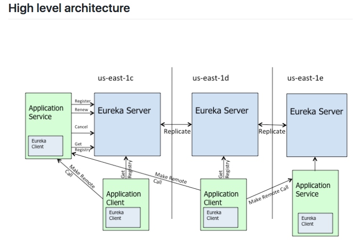
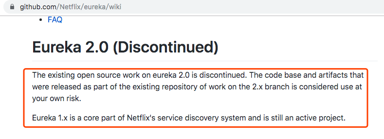
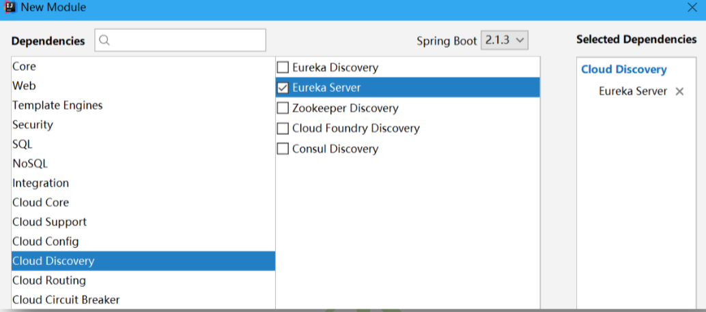
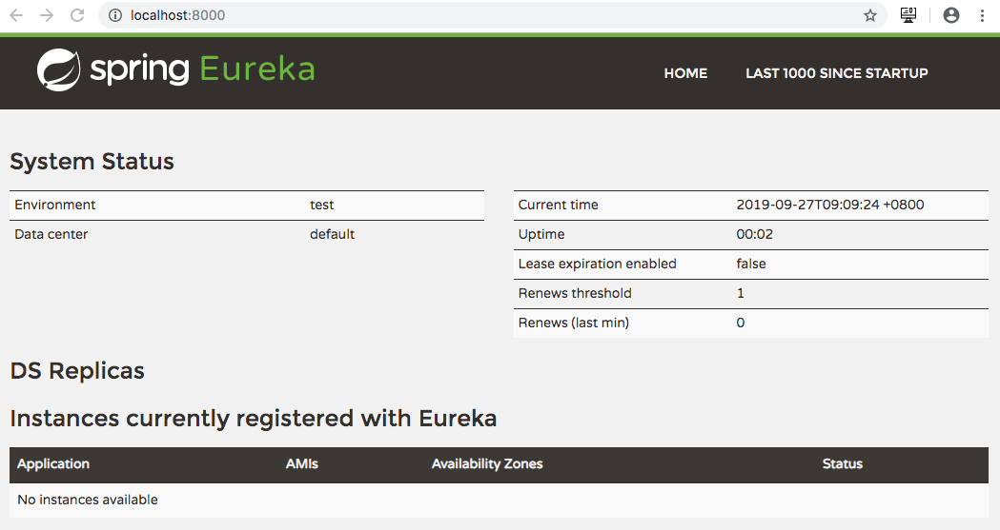
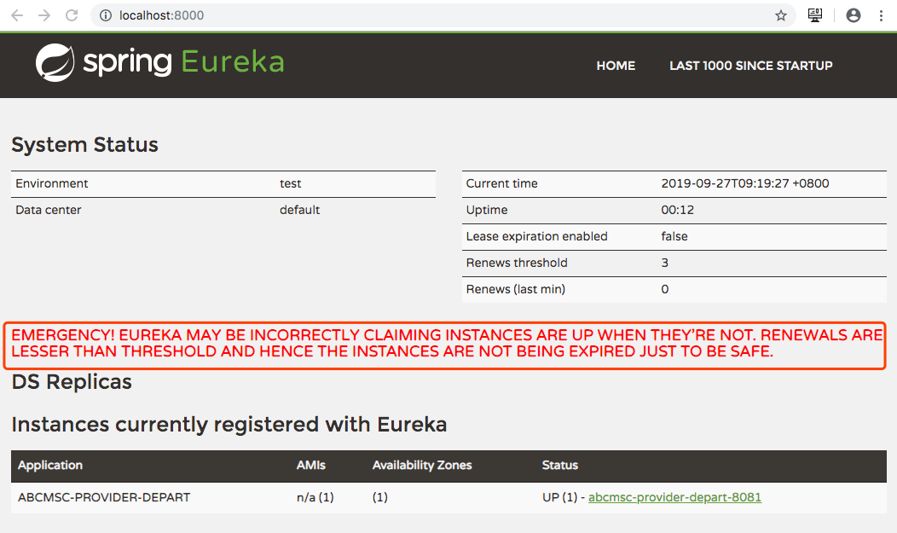
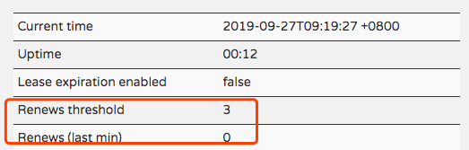
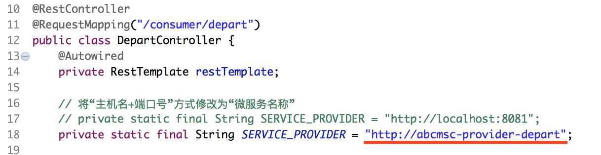
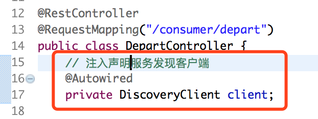
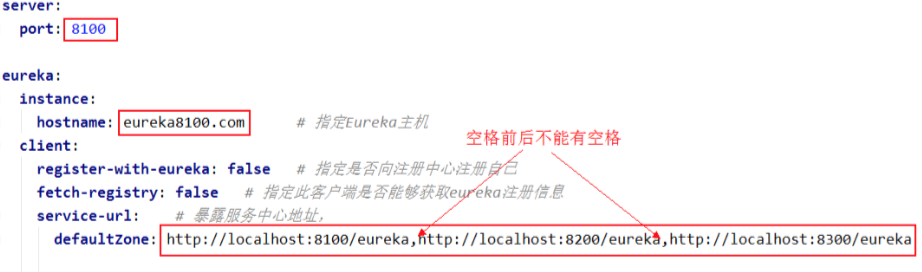
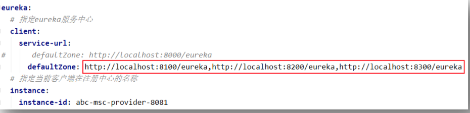

# Eureka概述

## Eureka简介

​	Eureka,古希腊词语,英文读音[juə'ri:kə],意思是“我找到了!我发现了!” 

​	Eureka 是 Netflix 开发的服务发现框架,本身是一个基于 REST 的服务,主要用于定位运行在 AWS域中的中间层服务,以达到==负载均衡==和==中间层服务故障转移==的目的。SpringCloud 将它集成在其子项目 spring-cloud-netflix 中,实现 SpringCloud 的服务发现功能。 

​	其实,Eureka 就是一个专门用于服务发现的服务器,一些服务注册到该服务器,而另一些服务通过该服务器查找其所要调用执行的服务。可以充当服务发现服务器的组件很多,例 如 Zookeeper、Consul、Eureka(集成最好，用的最多) 等 

## Eureka体系架构



> [原文]The architecture above depicts how Eureka is deployed at Netflix and this is how you would typically run it. There is **one** eureka cluster per **region** which knows only about instances in its region. There is at the least **one** eureka server per **zone** to handle zone failures.
>
> Services **register** with Eureka and then send **heartbeats** to renew their leases every 30 seconds. If the client cannot renew the lease for a few times, it is taken out of the server registry in about 90 seconds. The registration information and the renewals are replicated to all the eureka nodes in the cluster. The clients from any zone can look up the **registry** information (happens every 30 seconds) to locate their services (which could be in any zone) and make remote calls.
>
> [翻译]上面的架构描述了Eureka在Netflix上的部署方式，这就是您通常运行它的方式。每个区域有一个eureka集群，它只知道其区域中的实例。每个区域至少有一个eureka服务器来处理区域故障。
>
> 服务在Eureka**注册**，然后发送**心跳**以每30秒更新其租约。如果客户端几次无法续签租约，则大约90秒内会将租约从服务器注册表中删除。注册信息和续订将复制到集群中的所有eureka节点。任何区域的客户端都可以查找**注册表**信息（每30秒发生一次）以查找其服务（可能在任何区域）并进行远程调用。

* 无论消费者Application Client还是提供者Application Service都是Eureka Server的客户端Eureka Client；
* Application Service向Eureka Server中注册、更新、取消、获取(获取微服务注册列表)；Application Client仅从Eureka Server获取(获取微服务注册列表)，以便可以远程调用；
* Eureka Server集群各节点平等，服务注册可以注册到任意一个节点，新注册信息互相复制同步(Replicate)，获取注册列表信息从任何一个节点都可获取；不同于ZK集群的Leader、Follower，注册服务是注册给Leader，然后由Leader广播出去，再由Follower过来同步；
* Eureka Server集群各节点数据同步，保证可用性AP，保证不了CP
* Application Service默认30S发一次心跳，连续3个心跳周期未发送心跳，Eureka Server则认为Application Service挂了，则将其从注册列表中清除出去并同步给所有Eureka Server；Application Service也是默认30S从Eureka Server获取更新一次注册列表；
* 自我保护机制：Application Service不发送心跳，未必真的挂了，也可能是网络抖动等原因，这种情况多的话，理论上Eureka Server要认为它们都挂了，并将其从注册列表中清除，但实则不然，当Eureka Server挂到一定数量的时候，它启动自我保护机制，不再清理Application Service，等待其恢复正常！
* 即使Eureka Server集群所有节点都挂了，Application Client也能正常调用Application Service，因为Application Client中下载有一份服务注册列表(AP的极致体现)，而ZK集群挂了，那就完了

## Eureka与Zookeeper对比

​	Eureka 与 Zookeeper 都可以充当服务中心,那么它们有什么区别呢?它们的区别主要体现在对于 CAP 原则的支持的不同。

* Eureka与AP原则
  * Eureka只要启动就对外提供服务，无论读写，包括启动了自动保护机制仍能读写，只不过这个写操作不能删客户端注册信息
* Zookeeper与CP 原则
  * Zookeeper启动时，首先选举出一个leader，有个初始化同步过程（30～200ms），这个初始化同步过程，对外不提供服务；
  * Zookeeper更新同步时，虽然很快，但也是需要时间的，更新同步过程，对外也是不提供服务的；

## Eureka的闭源谣言

[Eureka 官网的 wiki ](https://github.com/Netflix/eureka/wiki)中公布了如下内容:



> 【原文】The existing open source work on eureka 2.0 is discontinued(终止). The code base(代码库) and artifacts(工程) that were released as part of the existing repository of work on the 2.x branch is considered use at your own risk(被认为在自己的风险中使用). 
>
> 【翻译 】现在的关于 eureka 2.0 的开源工作已经终止。已经发布的现存库中的关于 2.x 分支部分的代码库与工程,你的使用将自负风险。 
>
> 【原文】Eureka 1.x is a core part of Netflix's service discovery system and is still an active project. Additionally(另外), extension work(扩展工作) on eureka 1.x has moved(推进) internally (内部) within Netflix.
>  【翻译】Erueka 1.x 是 Netflix 服务发现系统的核心部分,其仍是一个活跃项目。另外,在 Eureka 1.x 上的扩展工作已经在 Netflix 内部推进。 

# 创建 Eureka 服务中心 00-eurekaserver-8000

这里创建的 Eureka 服务中心,即服务发现服务器。

## 创建工程

​	创建一个 Spring Initializr 工程,命名为 00-eurekaserver-8000,仅导入 Eureka Server 依赖即可。



工程创建完毕后,在 pom 文件中可以看到如下的版本信息：

```xml
<parent>
        <groupId>org.springframework.boot</groupId>
        <artifactId>spring-boot-starter-parent</artifactId>
        <version>2.1.3.RELEASE</version>
        <relativePath/> <!-- lookup parent from repository -->
    </parent>

    <properties>
        <java.version>1.8</java.version>
        <spring-cloud.version>Greenwich.SR1</spring-cloud.version>
    </properties>

```

```xml
<dependencyManagement>
        <dependencies>
            <dependency>
                <groupId>org.springframework.cloud</groupId>
                <artifactId>spring-cloud-dependencies</artifactId>
                <version>${spring-cloud.version}</version>
                <type>pom</type>
                <scope>import</scope>
            </dependency>
        </dependencies>
    </dependencyManagement>
```

## 导入依赖

```xml
<?xml version="1.0" encoding="UTF-8"?>
<project xmlns="http://maven.apache.org/POM/4.0.0" xmlns:xsi="http://www.w3.org/2001/XMLSchema-instance"
         xsi:schemaLocation="http://maven.apache.org/POM/4.0.0 http://maven.apache.org/xsd/maven-4.0.0.xsd">
    <modelVersion>4.0.0</modelVersion>

    <groupId>com.abc</groupId>
    <artifactId>00-eurekaserver-8000</artifactId>
    <version>0.0.1-SNAPSHOT</version>
    <packaging>jar</packaging>

    <parent>
        <groupId>org.springframework.boot</groupId>
        <artifactId>spring-boot-starter-parent</artifactId>
        <version>2.1.3.RELEASE</version>
        <relativePath/> <!-- lookup parent from repository -->
    </parent>

    <properties>
        <java.version>1.8</java.version>
        <spring-cloud.version>Greenwich.SR1</spring-cloud.version>
    </properties>

    <dependencies>
        <dependency>
            <groupId>org.springframework.cloud</groupId>
            <artifactId>spring-cloud-starter-netflix-eureka-server</artifactId>
        </dependency>

        <dependency>
            <groupId>org.springframework.boot</groupId>
            <artifactId>spring-boot-starter-test</artifactId>
            <scope>test</scope>
        </dependency>
        <dependency>
            <groupId>org.springframework.boot</groupId>
            <artifactId>spring-boot-autoconfigure</artifactId>
        </dependency>
    </dependencies>

    <dependencyManagement>
        <dependencies>
            <dependency>
                <groupId>org.springframework.cloud</groupId>
                <artifactId>spring-cloud-dependencies</artifactId>
                <version>${spring-cloud.version}</version>
                <type>pom</type>
                <scope>import</scope>
            </dependency>
        </dependencies>
    </dependencyManagement>

    <build>
        <plugins>
            <plugin>
                <groupId>org.springframework.boot</groupId>
                <artifactId>spring-boot-maven-plugin</artifactId>
            </plugin>
        </plugins>
    </build>

</project>
```

## 创建并配置yml文件

```yml
server:
  port: 8000

eureka:
  instance:
    hostname: localhost    # 指定EurekaServer主机名
  client:
    register-with-eureka: false    # 指定是否向Eureka中注册当前主机
    fetch-registry: false          # 指定是否能够从Eureka中获取注册表
    service-url:
#      defaultZone: http://localhost:8000/eureka     # 暴露Eureka服务中心地址
      defaultZone: http://${eureka.instance.hostname}:${server.port}/eureka     # 设置与Eureka Server交互的地址，查询服务和注册服务都需要依赖这个地址。默认是http://localhost:8761/eureka ；多个地址可使用 , 分隔。
```

启动工程后，访问：http://localhost:8000/，可以看到下面的页面，其中还没有发现任何服务



## 定义Spring boot启动类

```java
@SpringBootApplication
@EnableEurekaServer   // 开启Eureka服务(新版本中，该注解可以忽略)
public class EurekaServerApplication {

    public static void main(String[] args) {
        SpringApplication.run(EurekaServerApplication.class, args);
    }
}
```

# 创建提供者工程 02-provider-8081

## 创建工程

复制 01-provider-8081,并重命名为 02-provider-8081。

## 添加依赖管理及依赖

```xml
<!--eureka客户端依赖-->
        <dependency>
            <groupId>org.springframework.cloud</groupId>
            <artifactId>spring-cloud-starter-netflix-eureka-client</artifactId>
        </dependency>
```

## 修改yml文件

```yml
# 指定Eureka服务中心
eureka:
  client:
    service-url:
      defaultZone: http://localhost:8000/eureka
      # defaultZone: http://eureka8100.com:8100/eureka,http://eureka8200.com:8200/eureka,http://eureka8300.com:8300/eureka
  #指定当前客户端在注册中心的名称（根据个人喜好，可以用这种自定义方式，也可以用默认显示方式：IP：application.name:port）
  instance:
    instance-id: abcmsc-provider-depart-8081
```

## 修改启动类

```java
@SpringBootApplication
@EnableEurekaClient //开始Eureka客户端(新版本中，该注解可以忽略)
public class ProviderApplication {

    public static void main(String[] args) {
        SpringApplication.run(ProviderApplication.class, args);
    }
}
```


# actuator完善微服务info

## 提供者工程添加依赖

在提供者工程的 pom 中添加 actuator 监控依赖

```xml
<!--actuator依赖-->
        <dependency>
            <groupId>org.springframework.boot</groupId>
            <artifactId>spring-boot-starter-actuator</artifactId>
        </dependency>
```

## 修改配置文件

```yml
#设置info监控终端显示信息
info:
  company.name: www.abc.com
  company.addr: China Beijing
  company.tel: 12345678
  app.name: abc-msc
  app.desc: mic-server-cloud
  author: abc
```

# Eureka自我保护机制

## 自我保护机制

​	在 Eureka 服务页面中看到如下红色字体内容,表示当前 EurekaServer 启动了自我保护机制,进入了自我保护模式。



> 【原文】Emergency (紧急情况) ! Eureka may be incorrectly claiming(判断) instances(指微服务 主机) are up when they're not. Renewals(续约,指收到的微服务主机的心跳) are lesser than threshold(阈值) and hence(从此) the instances are not being expired(失效) just to be(只是为了) safe. 
>
> 【翻译】紧急情况!当微服务主机联系不上时,Eureka 不能够正确判断它们是否处于 up 状 态。当更新(指收到的微服务主机的心跳、续约)小于阈值时,为了安全,微服务主机将不再失效。 

​	默认情况下,EurekaServer 在 90 秒后没有检测到服务列表中的某微服务,则会自动将该微服务从服务列表中删除。但很多情况下并不是该微服务节点(主机)出了问题,而是由于网络抖动等原因使该微服务无法被 EurekaServer 发现,即无法检测到该微服务主机的心跳。 若在短暂时间内网络恢复正常,但由于 EurekaServer 的服务列表中已经没有该微服务,所以该微服务已经无法提供服务了。 

​	在短时间内若 EurekaServer 丢失较多微服务(EurekaServer 收到的心跳数量小于阈值), 那么其会自动进入自我保护模式:**服务列表只可读取、写入,不可执行删除操作**。当 EurekaServer 收到的心跳数量恢复到阈值以上时,其会自动退出 Self Preservation 模式(翻译 自官网)。 

## 默认值修改

​	启动自我保护的阈值因子默认为 0.85,即 85%。即 EurekaServer 收到的心跳数量若小于 应该收到数量的 85%时,会启动自我保护机制。 

​	自我保护机制默认是开启的,可以通过修改 EurekaServer 中配置文件来关闭。但不建议关闭。 

```yml
  server:
#  设置自我保护机制的阀值，默认0.85
    renewal-percent-threshold: 0.75
#    关闭自我保护机制，默认true
    enable-self-preservation: false
```


## 自我保护启动阀值



​	查看前面 Eureka 的启动界面,可以看到 Renews threshold 与 Renews(last min)两个数值。 这两个值都是瞬时值,而非平均值。就像汽车的瞬时速度与平均速度一样。

* Renews threshold:Server 会统计最近这 15 分钟接收到的总的心跳数(一个瞬时值), 然后再根据阈值因子计算出阈值心跳数,再平均到每分钟。这就是当前的值。表示当前时刻应达到的最低心跳数。低于该心跳,则启动自我保护机制
* Renews(last min):当前这一分钟内接收到的心跳数量。一个瞬时值,是当前这一刻向前推的这一分钟内接收到的心跳数量。

# 创建消费工程 02-consumer-8080

消费者将使用提供者暴露的服务名称(spring.application.name)来消费服务。

## 创建工程

复制 01-consumer-8080,并重命名为 02-consumer-8080

## 添加依赖管理及依赖

```xml
<?xml version="1.0" encoding="UTF-8"?>
<project xmlns="http://maven.apache.org/POM/4.0.0" xmlns:xsi="http://www.w3.org/2001/XMLSchema-instance"
         xsi:schemaLocation="http://maven.apache.org/POM/4.0.0 http://maven.apache.org/xsd/maven-4.0.0.xsd">
    <modelVersion>4.0.0</modelVersion>

    <groupId>com.abc</groupId>
    <artifactId>02-consumer-8080</artifactId>
    <version>0.0.1-SNAPSHOT</version>
    <packaging>jar</packaging>

    <parent>
        <groupId>org.springframework.boot</groupId>
        <artifactId>spring-boot-starter-parent</artifactId>
        <version>2.1.3.RELEASE</version>
        <relativePath/> <!-- lookup parent from repository -->
    </parent>

    <properties>
        <java.version>1.8</java.version>
        <spring-cloud.version>Greenwich.SR1</spring-cloud.version>
    </properties>

    <dependencies>
        <!--actuator依赖-->
        <dependency>
            <groupId>org.springframework.boot</groupId>
            <artifactId>spring-boot-starter-actuator</artifactId>
        </dependency>
        <!--eureka客户端依赖-->
        <dependency>
            <groupId>org.springframework.cloud</groupId>
            <artifactId>spring-cloud-starter-netflix-eureka-client</artifactId>
        </dependency>

        <dependency>
            <groupId>org.springframework.boot</groupId>
            <artifactId>spring-boot-starter-web</artifactId>
        </dependency>

        <dependency>
            <groupId>org.projectlombok</groupId>
            <artifactId>lombok</artifactId>
            <optional>true</optional>
        </dependency>
        <dependency>
            <groupId>org.springframework.boot</groupId>
            <artifactId>spring-boot-starter-test</artifactId>
            <scope>test</scope>
        </dependency>
    </dependencies>

    <dependencyManagement>
        <dependencies>
            <dependency>
                <groupId>org.springframework.cloud</groupId>
                <artifactId>spring-cloud-dependencies</artifactId>
                <version>${spring-cloud.version}</version>
                <type>pom</type>
                <scope>import</scope>
            </dependency>
        </dependencies>
    </dependencyManagement>

    <build>
        <plugins>
            <plugin>
                <groupId>org.springframework.boot</groupId>
                <artifactId>spring-boot-maven-plugin</artifactId>
            </plugin>
        </plugins>
    </build>
</project>

```


## 修改yml文件

```yml
spring:
#指定当前微服务对外暴露的名称
  application:
    name: abcmsc-consumer-depart

eureka:
#指定eureka服务中心
  client:
    service-url:
      defaultZone: http://localhost:8000/eureka
      # defaultZone: http://eureka8100.com:8100/eureka,http://eureka8200.com:8200/eureka,http://eureka8300.com:8300/eureka
```

## 修改处理器



```java
@RestController
@RequestMapping("/consumer/depart")
public class DepartController {
    @Autowired
    private RestTemplate restTemplate;

    // 将“主机名+端口号”方式修改为“微服务名称”
    // private static final String SERVICE_PROVIDER = "http://localhost:8081";
    private static final String SERVICE_PROVIDER = "http://abcmsc-provider-depart";

    @PostMapping("/save")
    public boolean saveHandle(@RequestBody Depart depart) {
        String url = SERVICE_PROVIDER + "/provider/depart/save";
        // 第一个参数：消费者访问提供者的URL
        // 第二个参数：操作对象
        // 第三个参数：方法返回值类型
        return restTemplate.postForObject(url, depart, Boolean.class);
    }

    @DeleteMapping("/del/{id}")
    public void deleteHandle(@PathVariable("id") int id) {
        String url = SERVICE_PROVIDER + "/provider/depart/del/" + id;
        restTemplate.delete(url);
    }

    @PutMapping("/update")
    public void updateHandle(@RequestBody Depart depart) {
        String url = SERVICE_PROVIDER + "/provider/depart/update";
        restTemplate.put(url, depart, Boolean.class);
    }

    @GetMapping("/get/{id}")
    public Depart getHandle(@PathVariable("id") int id) {
        String url = SERVICE_PROVIDER + "/provider/depart/get/" + id;
        return restTemplate.getForObject(url, Depart.class);
    }

    @GetMapping("/list")
    public List<Depart> listHandle() {
        String url = SERVICE_PROVIDER + "/provider/depart/list/";
        return restTemplate.getForObject(url, List.class);
    }
}
```

## 修改JavaConfig类

```java
@Configuration
public class DepartCodeConfig {

    // 开启负载均衡，为了让负载均衡器完成从服务名称到主机的映射
    @LoadBalanced
    @Bean
    public RestTemplate restTemplate() {
        return new RestTemplate();
    }
}
```

## 修改启动类

```java
@SpringBootApplication
@EnableDiscoveryClient //开启服务发现客户端(新版本中，该注解可以忽略)
public class ConsumerApplication {

    public static void main(String[] args) {
        SpringApplication.run(ConsumerApplication.class, args);
    }
}
```

# 服务发现 Discovery

直接修改处理器



```java
 @GetMapping("/discovery")
    public Object discoveryHandle() {
        // 获取Eureka中所有的微服务名称
        List<String> springApplicationNames = client.getServices();
        // 遍历所有微服务
        for(String name: springApplicationNames) {
            // 根据微服务名称获取到所有提供该服务的主机信息
            List<ServiceInstance> instances = client.getInstances(name);
            for(ServiceInstance instance: instances) {
                String host = instance.getHost();
                int port = instance.getPort();
                System.out.println(host + " : " + port);
            }
        }
        return springApplicationNames;
    }
```

# EurekaServer 集群

​	这里要搭建的 EurekaServer 集群中包含三个 EurekaServer 节点,其端口号分别为 8100、8200 与 8300。

## 创建 00-eurekaserver-8100

### 复制工程

复制 00-eurekaserver-8000 工程,并重命名为 00-eurekaserver-8100（注意修改pom中 <artifactId>属性配置）。

### 修改配置文件



## 创建 00-eurekaserver-8200 

再以相同的方式再复制出 00-eurekaserver-8200。 

## 创建 00-eurekaserver-8300 

再以相同的方式再复制出 00-eurekaserver-8300。 

## 修改客户端配置文件

修改客户端工程的配置文件,指定 Eureka 集群的各个主机即可。这里以提供者工程 02-provider-8081 为例。 

