# 概述

## OpenFeign简介

### 官网简介


> ［原文］Spring Cloud OpenFeign provides integrations for Spring Boot apps through autoconfiguration and binding to the Spring Environment and other Spring programming model idioms.
>
> ［翻译］Spring Cloud OpenFeign 通过自动配置的方式,通过绑定到 Spring 环境的方式和其他Spring 编程模型风格的方式,提供了集成化的 Spring Boot 应用。

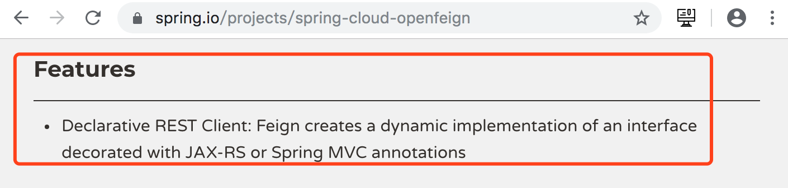

> ［原文］Declarative REST Client: Feign creates a dynamic implementation of an interface decorated with JAX-RS or Spring MVC annotations
>
> ［翻译］声明式 REST 客户端:Feign 通过使用 JAX-RS 或 SpringMVC 注解的装饰方式,生成接口的动态实现。

### 综合说明

​	Feign,假装、伪装。OpenFeign 可以使消费者将提供者提供的服务名伪装为接口进行消费,消费者只需使用`Service 接口 + 注解`的方式即可直接调用 Service 接口方法,而无需再使用 RestTemplate 了(实质上，底层依然用的是RestTemplate)。简述：OpenFeign就是对RestTemplate的包装，伪装为业务接口进行调用。

## OpenFeign与Feign

​	Spring Cloud 之前的版本(F版本之前)环境下使用的是 Feign,而该项目现(F版本开始)已更新为了 OpenFeign。所以后续使用的依赖也发生了变化。 

```xml
<!--高版本用openfeign依赖-->
<dependency>
	<groupId>org.springframework.cloud</groupId>
	<artifactId>spring-cloud-starter-openfeign</artifactId>
</dependency>

<!--以前版本用的feign依赖-->
<dependency>
	<groupId>org.springframework.cloud</groupId>
	<artifactId>spring-cloud-starter-feign</artifactId>
</dependency>
```

## Ribbon与OpenFeign

​	说到 OpenFeign,不得不提的就是 Ribbon。Ribbon 是 Netflix 公司的一个开源的负载均衡项目,是一个**客户端负载均衡器,具体是运行在消费者端**（Dubbo的负载均衡配置可以配在提供者端，也可以配置在消费者端，意义不同而已）。 

​	OpenFeign 中使用 Ribbon 进行负载均衡,所以 OpenFeign 直接内置了 Ribbon。即在导入 OpenFeign 依赖后,无需再专门导入 Ribbon 依赖了。 

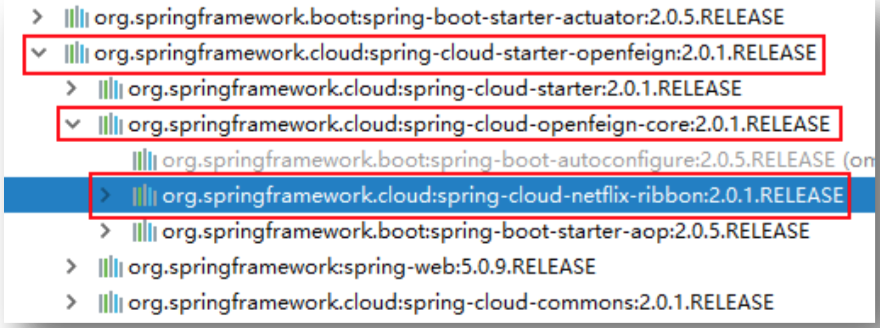

# 声明式Rest客户端OpenFeign

## 创建消费者工程 03-consumer-feign-8080

### 创建工程

复制 02-consumer-8080,并重命名为 03-consumer-feign-8080。

### 添加openfeign依赖

```xml
<!--openfeign依赖-->
<dependency>
	<groupId>org.springframework.cloud</groupId>
	<artifactId>spring-cloud-starter-openfeign</artifactId>
</dependency>
```

### 定义Service接口

```java
@FeignClient("abcmsc-provider-depart")   // 指定当前Service所绑定的微服务名称
@RequestMapping("/provider/depart")
public interface DepartService {
    @PostMapping("/save")
    boolean saveDepart(@RequestBody Depart depart);
    @DeleteMapping("/del/{id}")
    boolean removeDepartById(@PathVariable("id") int id);
    @PutMapping("/update")
    boolean modifyDepart(@RequestBody Depart depart);
    @GetMapping("/get/{id}")
    Depart getDepartById(@PathVariable("id") int id);
    @GetMapping("/list")
    List<Depart> listAllDeparts();
}
```

### 修改处理器

```java
@RestController
@RequestMapping("/consumer/depart")
public class DepartController {
    @Autowired
    private DepartService service;

    @PostMapping("/save")
    public boolean saveHandle(@RequestBody Depart depart) {
       return service.saveDepart(depart);
    }

    @DeleteMapping("/del/{id}")
    public boolean deleteHandle(@PathVariable("id") int id) {
        return service.removeDepartById(id);
    }

    @PutMapping("/update")
    public boolean updateHandle(@RequestBody Depart depart) {
        return service.modifyDepart(depart);
    }

    @GetMapping("/get/{id}")
    public Depart getHandle(@PathVariable("id") int id) {
        return service.getDepartById(id);
    }

    @GetMapping("/list")
    public List<Depart> listHandle() {
        return service.listAllDeparts();
    }
}
```

### 修改配置文件

```yml
#指定超时时限
feign:
  client:
    config:
      default:
        connectTimeout: 5000  # 指定Feign连接提供者的超时时限(取决于网络环境)
        readTimeout: 5000    # 指定Feign从请求到获取提供者响应的超时时限(取决于提供者业务执行时间)
#有关效率设置，开启Gzip压缩
  compression:
    request: #请求压缩，指Feign客户端对提供者的请求压缩
      enabled: true    # 开启对请求的压缩
      # 指定对哪些MIME类型的文件进行压缩
      mime-types: ["text/xml", "application/xml", "application/json"]
      min-request-size: 2048  # 指定启用压缩的最小文件大小，单位字节
    response: #响应压缩，指Feign客户端对客户端浏览器的响应压缩
      enabled: true   # 开启对客户端响应的压缩
```


### 修改启动类

```java
// 指定Feign接口所在的包
@EnableFeignClients(basePackages = "com.abc.consumer.service")
@SpringBootApplication
@EnableDiscoveryClient
public class ConsumerApplication {

    public static void main(String[] args) {
        SpringApplication.run(ConsumerApplication.class, args);
    }

}
```

## 创建提供者工程 03-provider-8081

### 修改工程

复制工程 02-provider-8081,并重命名为 03-provider-8081。

### 修改Service接口实现类

```java
 @Override
    public Depart getDepartById(int id) {

        // 休眠
        try {
            TimeUnit.SECONDS.sleep(6);
        } catch (InterruptedException e) {
            e.printStackTrace();
        }

        if(repository.existsById(id)) {
            return repository.getOne(id);
        }
        Depart depart = new Depart();
        depart.setName("no this depart");
        return depart;
    }
```

提供者业务执行时间6S>feign.client.config.default.readTimeout,请求超时：

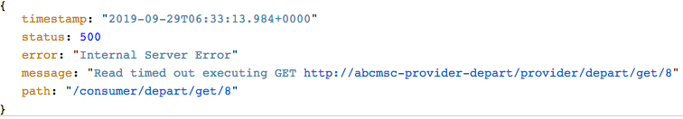

# Ribbon负载均衡

## 系统结构

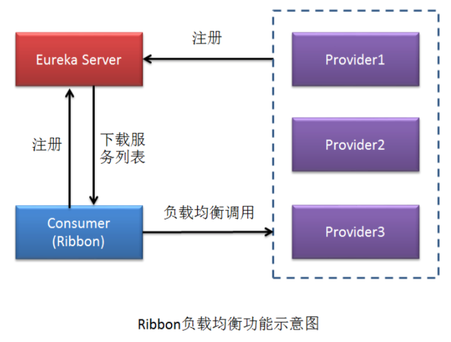

## 创建提供者03-provider-8082

### 复制提供者工程 8081

复制 02-provider-8081 工程,并重命名为 03-provider-8082。

### 修改配置文件

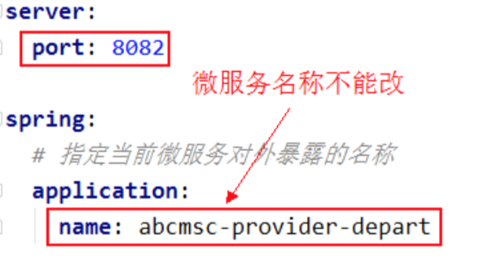

### 修改service实现

```java
@Service
public class DepartServiceImpl implements DepartService {
    @Autowired
    private DepartRepository repository;

    // 读取配置文件中的属性值
    @Value("${server.port}")
    private int port;

    //......
  
    @Override
    public Depart getDepartById(int id) {
        // repository.getOne(id)指定的id对象不存在，则会抛出异常
        if(repository.existsById(id)) {
            Depart depart = repository.getOne(id);
            // 部门名称后加上端口号
            depart.setName(depart.getName() + port);
            return depart;
        }
        Depart depart = new Depart();
        depart.setName("no this depart" + port);
        return depart;
    }

    @Override
    public List<Depart> listAllDeparts() {
        List<Depart> departs = repository.findAll();
        for(Depart depart : departs) {
            // 部门名称后加上端口号
            depart.setName(depart.getName() + port);
        }
        return departs;
    }
}
```

## 创建提供者03-provider-8083

以相同的方式创建提供者工程 03-provider-8083

## 创建提供者03-provider-8084

以相同的方式创建提供者工程 03-provider-8084

# Ribbon源码解析

1. 负载均衡，可以看`@LoadBalanced`注解

   ```java
   @Configuration
   public class DepartCodeConfig {
   
       @LoadBalanced
       @Bean
       public RestTemplate restTemplate() {
           return new RestTemplate();
       }
   }
   ```

2. 点击`@LoadBalanced`进去，可了解到接口`LoadBalancerClient`，该接口实现类就一个`RibbonLoadBalancerClient`
   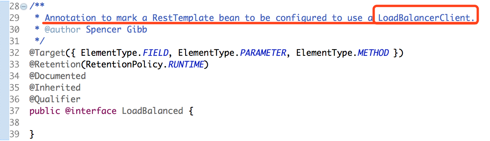

## 跟踪 RibbonLoadBalancerClient 类 

1. 跟踪`execute(String serviceId, LoadBalancerRequest<T> request, Object hint)`方法的获取服务逻辑
   

   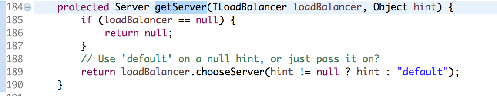

   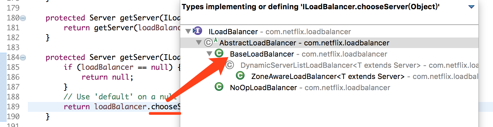

   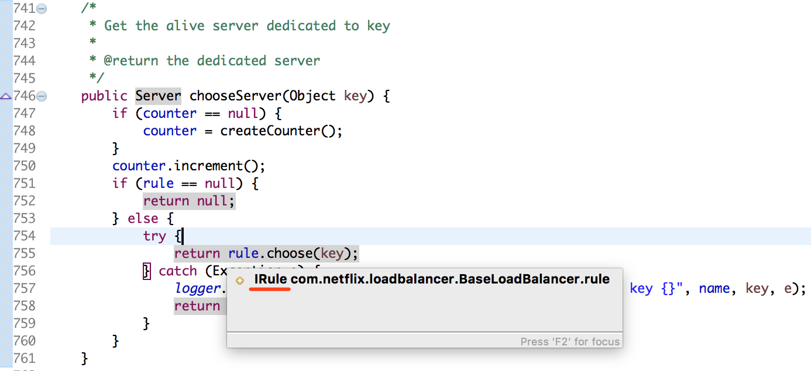

   ⚠️：`Server chooseServer(Object key)`根据key选择服务，其实key就提供者的微服务名称，即：`application.yml`中`spring.application.name`

   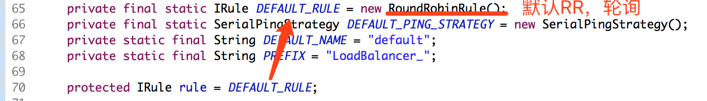

   1. `RoundRobinRule extends AbstractLoadBalancerRule`
   2. `abstract class AbstractLoadBalancerRule implements IRule, IClientConfigAware`

   总结：如果要定义一个负载均衡器，直接实现接口IRule即可

## 解析IRule类 

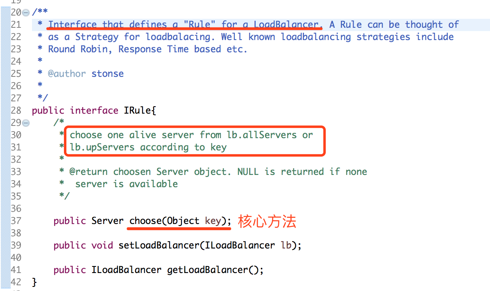

## Ribbon内置负载均衡算法


### RoundRobinRule

轮询策略。Ribbon 默认采用的策略。

1. AtomicInteger：AtomicXXX 原子整型，专门解决高并发场景数值增减（AtomicLong在ZK的逻辑时钟中涉及到）；
2. `Thread.yield();`：将当前线程由执行态——>就绪态；线程状态［阻塞、就绪（就绪态，就差CPU资源了）、执行］

### RandomRule

随机策略,从所有可用的 provider 中随机选择一个。

### RetryRule

先按照 RoundRobinRule 策略获取 provider,若获取失败,则在指定的时限内重试。默认的时限为 500 毫秒。

### BestAvailableRule

选择并发量最小的 provider,即连接的消费者数量最少的 provider。

### AvailabilityFilteringRule

该算法规则是:过滤掉处于断路器跳闸状态的 provider,或已经超过连接极限的 provider,对剩余 provider 采用轮询策略。

### ZoneAvoidanceRule

复合判断 provider 所在区域的性能及 provider 的可用性选择服务器。

### WeightedResponseTimeRule

“权重响应时间”策略。根据每个 provider 的平均响应时间计算其权重,响应时间越快权重越大,被选中的机率就越高。在刚启动时采用轮询策略。后面就会根据权重进行选择了。

# 更换负载均衡策略03-consumer-loadbalance-8080

## 更换内置策略

​	Ribbon 默认采用的是 `RoundRobinRule`,即**轮询策略**。但<u>通过修改消费者工程的配置文件,或修改消费者的启动类或 JavaConfig 类可以实现更换负载均衡策略的目的</u>。

### 创建工程

复制 03-consumer-feign-8080 工程,并重命名为 03-consumer-loadbalance-8080。

### 方式一：修改配置文件

修改配置文件,在其中添加如下内容:

```yml
# 修改负载均衡策略
abcmsc-provider-depart:   # 要负载均衡的提供者微服务名称
  ribbon:   # 指定要使用的负载均衡策略
    NFLoadBalancerRuleClassName: com.netflix.loadbalancer.RandomRule
```

### 方式二：修改JavaConfig类

在 JavaConfig 类中添加负载负载 Bean 方法:

```java
@Configuration
public class DepartCodeConfig {

    // 开启消息者端的负载均衡功能，默认是轮询策略
    @LoadBalanced
    @Bean
    public RestTemplate restTemplate() {
        return new RestTemplate();
    }

    // 指定Ribbon使用随机算法策略
     @Bean
     public IRule loadBalanceRule() {
         return new RandomRule();
     }
}
```

## 自定义负载均衡策略

直接在 03-consumer-loadbalance-8080 工程上修改。

### 定义CustomRule类

​	Ribbon 支持自定义负载均衡策略。负载均衡算法类需要实现 IRule 接口。 

​	该负载均衡策略的思路是:从所有可用的 provider 中排除掉指定端口号的 provider,剩余 provider 进行随机选择。 

```java
/**
 * 自定义负载均衡算法：
 * 从所有可用的provider中排除掉指定端口号的provider，剩余provider进行随机选择。
 */
public class CustomRule implements IRule {
    private ILoadBalancer lb;
    // 要排除的提供者端口号集合
    private List<Integer> excludePorts;

    public CustomRule() {
    }

    public CustomRule(List<Integer> excludePorts) {
        this.excludePorts = excludePorts;
    }

    @Override
    public Server choose(Object key) {
        // 获取所有可用的提供者
        List<Server> servers = lb.getReachableServers();
        // 获取所有排除了指定端口号的提供者
        List<Server> availableServers = this.getAvailableServers(servers);
        // 从剩余的提供者中随机获取可用的提供者
        return this.getAvailableRandomServers(availableServers);
    }

    // 获取所有排除了指定端口号的提供者
    private List<Server> getAvailableServers(List<Server> servers) {
        // 若不存在要排除的Server，则直接将所有可用Servers返回
        if(excludePorts == null || excludePorts.size() == 0) {
            return servers;
        }

        // 定义一个集合，用于存放排除了指定端口号的Server
        List<Server> aservers = new ArrayList<>();
        for (Server server : servers) {
            boolean flag = true;
            for(Integer port : excludePorts) {
                if(server.getPort() == port) {
                    flag = false;
                    break;
                }
            }
            // 若flag为false，说明上面的for循环执行了break，说明当前遍历的Server是要排除掉的Server
            if (flag) {
                aservers.add(server);
            }
        }
        return aservers;
    }

    // 从剩余的提供者中随机获取可用的提供者
    private Server getAvailableRandomServers(List<Server> availableServers) {
        // 获取一个[0，availableServers.size())的随机整数
        int index = new Random().nextInt(availableServers.size());
        return availableServers.get(index);
    }

    @Override
    public void setLoadBalancer(ILoadBalancer lb) {
        this.lb = lb;
    }

    @Override
    public ILoadBalancer getLoadBalancer() {
        return lb;
    }
}
```

### 修改JavaConfig类

将原来的负载均衡 Bean 方法注释掉,添加新的负载均衡策略方法。

```java
@Configuration
public class DepartCodeConfig {

    // 开启消息者端的负载均衡功能，默认是轮询策略
    @LoadBalanced
    @Bean
    public RestTemplate restTemplate() {
        return new RestTemplate();
    }

    // 指定Ribbon使用随机算法策略
    // @Bean
    // public IRule loadBalanceRule() {
    //     return new RandomRule();
    // }

//     指定Ribbon使用随机算法策略
     @Bean
     public IRule loadBalanceRule() {
         List<Integer> ports = new ArrayList<>();
         ports.add(8083);
         return new CustomRule(ports);
     }
}
```


