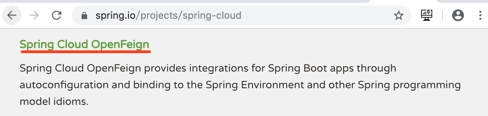

# 概述

## OpenFeign简介

### 官网简介



> ［原文］Spring Cloud OpenFeign provides integrations for Spring Boot apps through autoconfiguration and binding to the Spring Environment and other Spring programming model idioms.
>
> ［翻译］Spring Cloud OpenFeign 通过自动配置的方式,通过绑定到 Spring 环境的方式和其他Spring 编程模型风格的方式,提供了集成化的 Spring Boot 应用。


> ［原文］Declarative REST Client: Feign creates a dynamic implementation of an interface decorated with JAX-RS or Spring MVC annotations
>
> ［翻译］声明式 REST 客户端:Feign 通过使用 JAX-RS 或 SpringMVC 注解的装饰方式,生成接口的动态实现。

### 综合说明

​	Feign,假装、伪装。OpenFeign 可以使消费者将提供者提供的服务名伪装为接口进行消费,消费者只需使用`Service 接口 + 注解`的方式即可直接调用 Service 接口方法,而无需再使用 RestTemplate 了(实质上，底层依然用的是RestTemplate)。简述：OpenFeign就是对RestTemplate的包装，伪装为业务接口进行调用。

## OpenFeign与Feign

​	Spring Cloud 之前的版本(F版本之前)环境下使用的是 Feign,而该项目现(F版本开始)已更新为了 OpenFeign。所以后续使用的依赖也发生了变化。 

```xml
<!--高版本用openfeign依赖-->
<dependency>
	<groupId>org.springframework.cloud</groupId>
	<artifactId>spring-cloud-starter-openfeign</artifactId>
</dependency>

<!--以前版本用的feign依赖-->
<dependency>
	<groupId>org.springframework.cloud</groupId>
	<artifactId>spring-cloud-starter-feign</artifactId>
</dependency>
```

## Ribbon与OpenFeign

​	说到 OpenFeign,不得不提的就是 Ribbon。Ribbon 是 Netflix 公司的一个开源的负载均衡项目,是一个**客户端负载均衡器,具体是运行在消费者端**（Dubbo的负载均衡配置可以配在提供者端，也可以配置在消费者端，意义不同而已）。 

​	OpenFeign 中使用 Ribbon 进行负载均衡,所以 OpenFeign 直接内置了 Ribbon。即在导入 OpenFeign 依赖后,无需再专门导入 Ribbon 依赖了。 


# 声明式Rest客户端OpenFeign

## 创建消费者工程 03-consumer-feign-8080

### 创建工程

复制 02-consumer-8080,并重命名为 03-consumer-feign-8080。

### 添加openfeign依赖

```xml
<!--openfeign依赖-->
<dependency>
	<groupId>org.springframework.cloud</groupId>
	<artifactId>spring-cloud-starter-openfeign</artifactId>
</dependency>
```

### 定义Service接口

```java
@FeignClient("abcmsc-provider-depart")   // 指定当前Service所绑定的微服务名称
@RequestMapping("/provider/depart")
public interface DepartService {
    @PostMapping("/save")
    boolean saveDepart(@RequestBody Depart depart);
    @DeleteMapping("/del/{id}")
    boolean removeDepartById(@PathVariable("id") int id);
    @PutMapping("/update")
    boolean modifyDepart(@RequestBody Depart depart);
    @GetMapping("/get/{id}")
    Depart getDepartById(@PathVariable("id") int id);
    @GetMapping("/list")
    List<Depart> listAllDeparts();
}
```

### 修改处理器

```java
@RestController
@RequestMapping("/consumer/depart")
public class DepartController {
    @Autowired
    private DepartService service;

    @PostMapping("/save")
    public boolean saveHandle(@RequestBody Depart depart) {
       return service.saveDepart(depart);
    }

    @DeleteMapping("/del/{id}")
    public boolean deleteHandle(@PathVariable("id") int id) {
        return service.removeDepartById(id);
    }

    @PutMapping("/update")
    public boolean updateHandle(@RequestBody Depart depart) {
        return service.modifyDepart(depart);
    }

    @GetMapping("/get/{id}")
    public Depart getHandle(@PathVariable("id") int id) {
        return service.getDepartById(id);
    }

    @GetMapping("/list")
    public List<Depart> listHandle() {
        return service.listAllDeparts();
    }
}
```

### 修改配置文件

```yml
#指定超时时限
feign:
  client:
    config:
      default:
        connectTimeout: 5000  # 指定Feign连接提供者的超时时限(取决于网络环境)
        readTimeout: 5000    # 指定Feign从请求到获取提供者响应的超时时限(取决于提供者业务执行时间)
#有关效率设置，开启Gzip压缩
  compression:
    request: #请求压缩，指Feign客户端对提供者的请求压缩
      enabled: true    # 开启对请求的压缩
      # 指定对哪些MIME类型的文件进行压缩
      mime-types: ["text/xml", "application/xml", "application/json"]
      min-request-size: 2048  # 指定启用压缩的最小文件大小，单位字节
    response: #响应压缩，指Feign客户端对客户端浏览器的响应压缩
      enabled: true   # 开启对客户端响应的压缩
```


### 修改启动类

```java
// 指定Feign接口所在的包
@EnableFeignClients(basePackages = "com.abc.consumer.service")
@SpringBootApplication
@EnableDiscoveryClient
public class ConsumerApplication {

    public static void main(String[] args) {
        SpringApplication.run(ConsumerApplication.class, args);
    }

}
```

## 创建提供者工程 03-provider-8081

### 修改工程

复制工程 02-provider-8081,并重命名为 03-provider-8081。

### 修改Service接口实现类

```java
 @Override
    public Depart getDepartById(int id) {

        // 休眠
        try {
            TimeUnit.SECONDS.sleep(6);
        } catch (InterruptedException e) {
            e.printStackTrace();
        }

        if(repository.existsById(id)) {
            return repository.getOne(id);
        }
        Depart depart = new Depart();
        depart.setName("no this depart");
        return depart;
    }
```

提供者业务执行时间6S>feign.client.config.default.readTimeout,请求超时：


# Ribbon负载均衡

## 系统结构


## 创建提供者03-provider-8082

### 复制提供者工程 8081

复制 02-provider-8081 工程,并重命名为 03-provider-8082。

### 修改配置文件


### 修改service实现

```java
@Service
public class DepartServiceImpl implements DepartService {
    @Autowired
    private DepartRepository repository;

    // 读取配置文件中的属性值
    @Value("${server.port}")
    private int port;

    //......
  
    @Override
    public Depart getDepartById(int id) {
        // repository.getOne(id)指定的id对象不存在，则会抛出异常
        if(repository.existsById(id)) {
            Depart depart = repository.getOne(id);
            // 部门名称后加上端口号
            depart.setName(depart.getName() + port);
            return depart;
        }
        Depart depart = new Depart();
        depart.setName("no this depart" + port);
        return depart;
    }

    @Override
    public List<Depart> listAllDeparts() {
        List<Depart> departs = repository.findAll();
        for(Depart depart : departs) {
            // 部门名称后加上端口号
            depart.setName(depart.getName() + port);
        }
        return departs;
    }
}
```

## 创建提供者03-provider-8083

以相同的方式创建提供者工程 03-provider-8083

## 创建提供者03-provider-8084

以相同的方式创建提供者工程 03-provider-8084

# Ribbon源码解析

# 更换负载均衡策略03-consumer-loadbalance-8080


执行：

就绪：就差CPU资源

阻塞：

Thread.yield();//高并发场景用到，由执行——>就绪


