# 前置概念

## 服务熔断简介

### 雪崩效应

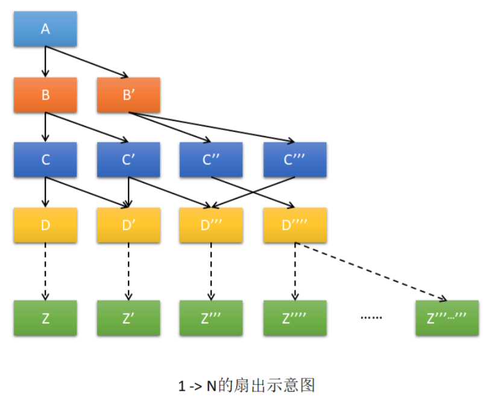

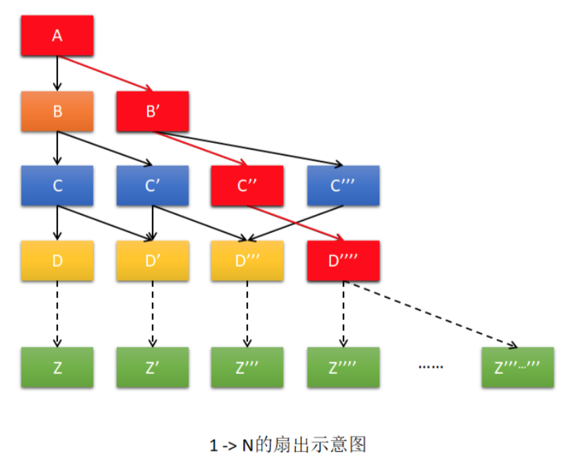

### 服务雪崩

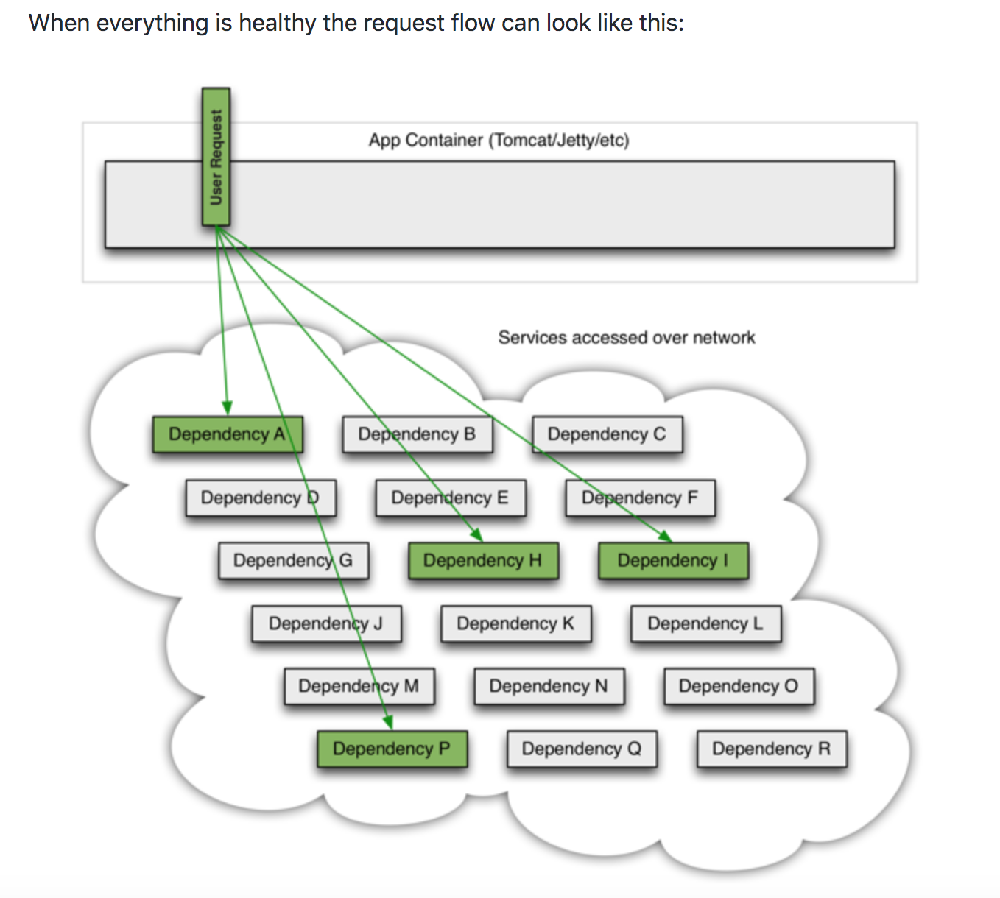

上图是用户请求的多个服务(A,H,I,P)均能正常访问并返回的情况。

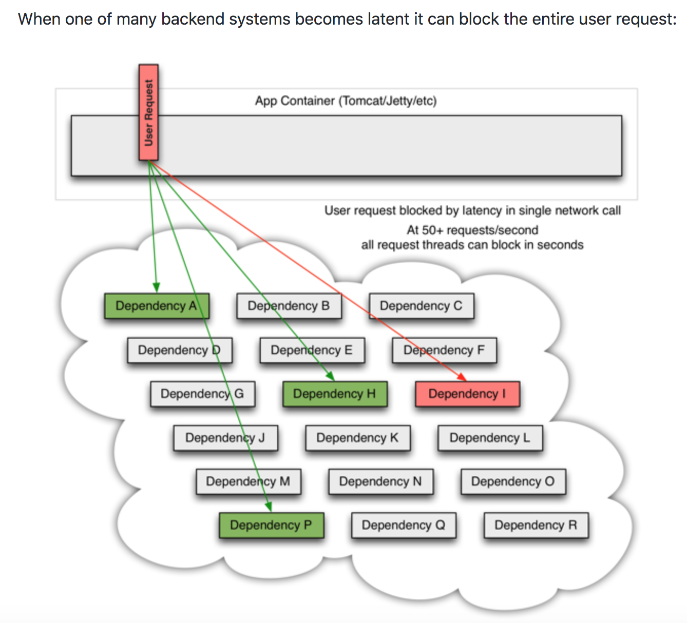

上图为请求服务 I 出现问题时,一个用户请求被阻塞的情况。

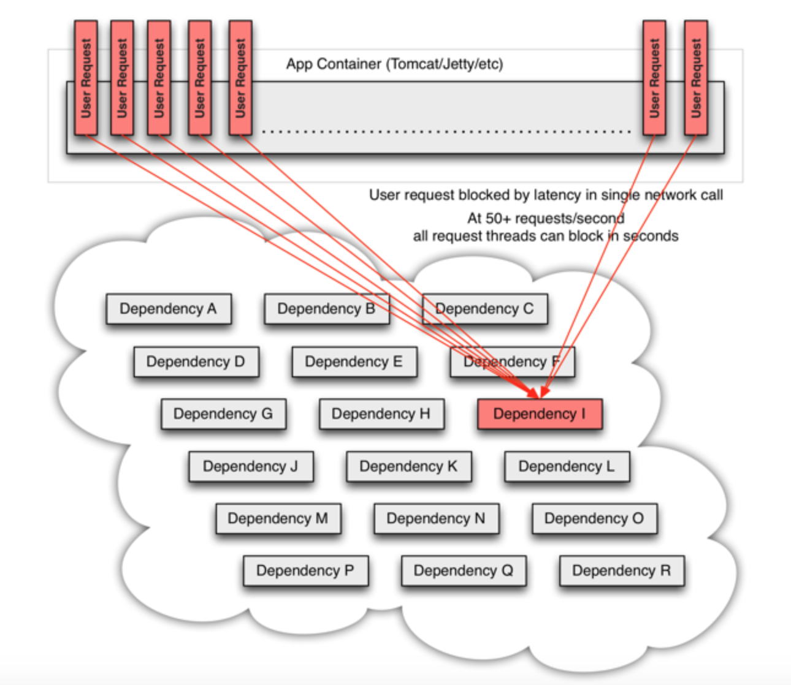

上图为大量用户请求服务 I 出现异常全部陷入阻塞的的情况,即服务发生雪崩的情况。

### 熔断机制

​	熔断机制是服务雪崩的一种有效解决方案。当指定时间窗内的请求失败率达到设定阈值时,系统将通过断路器直接将此请求链路断开。常见的熔断有两种:

* 预熔断
* 即时熔断

## 服务降级简介

​	服务降级是请求发生问题时的一种增强用户体验的方式。

​	现代系统中,当发生服务熔断时,一定会发生服务降级;但发生服务降级,并不一定是发生了服务熔断。

服务降级埋点节点：

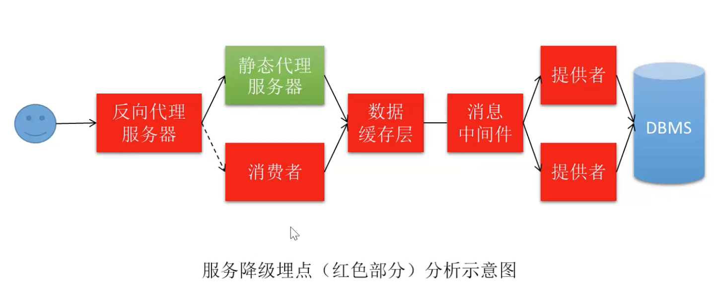 

# Hystrix简介

​	Spring Cloud 是通过 Hystrix 来实现服务熔断与降级的。

## [官网wiki](https://github.com/Netflix/Hystrix/wiki)

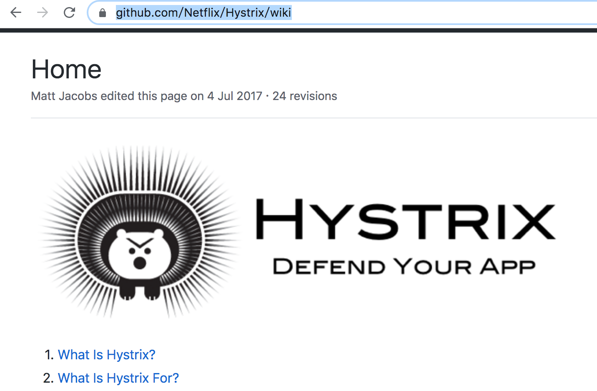

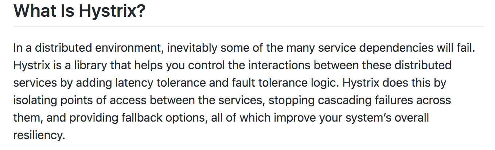

> 【原文】In a distributed environment, inevitably(不可避免地) some of the many service dependencies will fail. Hystrix is a library that helps you control the interactions(交互) between these distributed services by adding ==latency tolerance==(延迟容忍) and ==fault tolerance logic==(容 错逻辑). Hystrix does this by isolating points of access between the services, stopping ==cascading failures==(级联错误) ==across them==(跨服务), and providing ==fallback options==(回退选项), all of which improve your system’s overall resiliency(弹性). 
>
> 【翻译】在分布式环境中,许多服务依赖中的一些服务发生失败是不可避免的。Hystrix 是一 个库,通过添加延迟容忍和容错逻辑,帮助你控制这些分布式服务之间的交互。Hystrix 通过 隔离服务之间的访问点、停止跨服务的级联故障以及提供回退选项来实现这一点,所有这些 都可以提高系统的整体弹性。 

## 综合说明

​	当 Hystrix 监控到某个服务发生故障后,其不会让该服务的消费者阻塞,或向消费者抛出异常,而是向消费者返回一个符合预期的、可处理的备选响应(FallBack),这样就避免了服务雪崩的发生。

# fallbackMethod 服务降级

​	Hystrix 对于服务降级的实现方式有两种:**fallbackMethod 服务降级**,与 **fallbackFactory 服务降级**。首先来看 fallbackMethod 服务降级。

## 创建消费者工程 04-consumer-fallbackmethod-8080

### 创建工程

复制 02-consumer-8080 工程,并重命名为 04-consumer-fallbackmethod-8080。 该工程的运行说明 hystrix 本身与 feign 是没有关系的。 

### 添加 hystrix 依赖

```xml
<!--hystrix依赖-->
<dependency>
     <groupId>org.springframework.cloud</groupId>
     <artifactId>spring-cloud-starter-netflix-hystrix</artifactId>
</dependency>
```

### 修改处理器类

```java
 // 指定该方法要使用服务降级，即若当前处理器方法在运行过程中发生异常，
    // 法给客户端正常响应时，就会调用fallbackMethod指定的方法
    @HystrixCommand(fallbackMethod = "getHystrixHandle")
    @GetMapping("/get/{id}")
    public Depart getHandle(@PathVariable("id") int id) {
        String url = "http://localhost:8081/provider/depart/get/" + id;
        return restTemplate.getForObject(url, Depart.class);
    }

    // 服务降级方法，即响应给客户端的备选方案
    public Depart getHystrixHandle(@PathVariable("id") int id) {
        Depart depart = new Depart();
        depart.setId(id);
        depart.setName("no this depart");
        return depart;
    }
```

### 在启动类添加注解@EnableCircuitBreaker

```java
@EnableCircuitBreaker  // 开启熔断器
@SpringBootApplication
public class ConsumerApplication {

    public static void main(String[] args) {
        SpringApplication.run(ConsumerApplication.class, args);
    }

}
```

​	这一个类上添加的注解太多了,为了避免这种情况的发生,Spring Cloud 专门定义了一个组合注解`@SpringCloudApplication`,就包含了这三个注解。所以可以用它直接替换掉那三个注解。

```java
// @EnableCircuitBreaker  // 开启熔断器
// @SpringBootApplication
@SpringCloudApplication
public class ConsumerApplication {

    public static void main(String[] args) {
        SpringApplication.run(ConsumerApplication.class, args);
    }

}
```

## 创建消费者工程 04-consumer-feign-fallbackmethod-8080

### 创建工程

​	复制 03-consumer-feign-8080 工程,并重命名为 04-consumer-feign-fallbackmethod-8080。该工程是 Hystrix 与 Feign 结合使用。当然,一般情况下都是这样使用的。

### 添加 hystrix 依赖

```xml
<!--hystrix依赖-->
<dependency>
    <groupId>org.springframework.cloud</groupId>
    <artifactId>spring-cloud-starter-netflix-hystrix</artifactId>
</dependency>
```

### 修改处理器类

```java
@HystrixCommand(fallbackMethod = "getHystrixHandle")
@GetMapping("/get/{id}")
public Depart getHandle(@PathVariable("id") int id) {
  return service.getDepartById(id);
}

public Depart getHystrixHandle(@PathVariable("id") int id) {
  Depart depart = new Depart();
  depart.setId(id);
  depart.setName("no this depart2");
  return depart;
}
```

### 在启动类添加注解@SpringCloudApplication

```java
// 指定Service接口所在的包，开启OpenFeign客户端
@EnableFeignClients(basePackages = "com.abc.consumer.service")
@SpringCloudApplication
public class ConsumerApplication {

    public static void main(String[] args) {
        SpringApplication.run(ConsumerApplication.class, args);
    }

}
```

## 小结

* fallbackMethod 服务降级有个明显的缺点，就是降级方法和处理器方法融合在一起，乱且维护不便！所以，我们一般不用这种方式，会用fallbackFactory 服务降级方式；

# fallbackFactory 服务降级

## 创建消费者工程 04-consumer-fallbackfactory-8080

### 创建工程

复制 04-consumer-hystrix-8080 工程,并重命名为 04-consumer-fallbackfactory-8080。

### 定义降级处理类

```java
package com.abc.consumer.service;

import com.abc.consumer.bean.Depart;
import feign.hystrix.FallbackFactory;
import org.springframework.stereotype.Component;

import java.util.List;

/**
 * 服务降级处理类，该类需要实现FallbackFactory接口，
 * 其泛型为该服务降级类所对应的Feign接口
 */
@Component
public class DepartFallbackFactory implements FallbackFactory<DepartService> {
    @Override
    public DepartService create(Throwable throwable) {
        return new DepartService() {

            @Override
            public boolean saveDepart(Depart depart) {
                System.out.println("执行saveDepart()的服务降级处理方法");
                return false;
            }

            @Override
            public boolean removeDepartById(int id) {
                System.out.println("执行removeDepartById()的服务降级处理方法");
                return false;
            }

            @Override
            public boolean modifyDepart(Depart depart) {
                System.out.println("执行modifyDepart()的服务降级处理方法");
                return false;
            }

            // fallbackFactory的优先级低于fallbackMethod的
            @Override
            public Depart getDepartById(int id) {
                System.out.println("执行getDepartById()的服务降级处理方法");
                Depart depart = new Depart();
                depart.setId(id);
                depart.setName("no this depart -- 类级别");
                return depart;
            }

            @Override
            public List<Depart> listAllDeparts() {
                System.out.println("执行listAllDeparts()的服务降级处理方法");
                return null;
            }
        };
    }
}
```


### 修改Feign接口

```java
@Service
// 指定当前Service所绑定的提供者微服务名称
// fallbackFactory指定该接口所绑定的服务降级类
@FeignClient(value = "abcmsc-provider-depart", fallbackFactory = DepartFallbackFactory.class)
@RequestMapping("/provider/depart")
public interface DepartService {
    @PostMapping("/save")
    boolean saveDepart(@RequestBody Depart depart);
    @DeleteMapping("/del/{id}")
    boolean removeDepartById(@PathVariable("id") int id);
    @PutMapping("/update")
    boolean modifyDepart(@RequestBody Depart depart);
    @GetMapping("/get/{id}")
    Depart getDepartById(@PathVariable("id") int id);
    @GetMapping("/list")
    List<Depart> listAllDeparts();
}
```

⚠️：`@FeignClient(value = "abcmsc-provider-depart", fallbackFactory = DepartFallbackFactory.class)`

## 创建消费者工程 04-consumer-fallbackfeign-8080

### 创建工程

复制 04-consumer-fallbackfactory-8080 工程,并重命名为 04-consumer-fallbackfeign-8080。

### 定义降级处理类

```java
package com.abc.consumer.service;

import com.abc.consumer.bean.Depart;
import org.springframework.stereotype.Component;
import org.springframework.web.bind.annotation.RequestMapping;

import java.util.List;

@Component
@RequestMapping("/fallback/consumer/depart")
public class DepartFallback implements DepartService {

    @Override
    public boolean saveDepart(Depart depart) {
        System.out.println("执行saveDepart()的服务降级处理方法");
        return false;
    }

    @Override
    public boolean removeDepartById(int id) {
        System.out.println("执行removeDepartById()的服务降级处理方法");
        return false;
    }

    @Override
    public boolean modifyDepart(Depart depart) {
        System.out.println("执行modifyDepart()的服务降级处理方法");
        return false;
    }

    // fallbackFactory的优先级低于fallbackMethod的
    @Override
    public Depart getDepartById(int id) {
        System.out.println("执行getDepartById()的服务降级处理方法");
        Depart depart = new Depart();
        depart.setId(id);
        depart.setName("no this depart -- 类级别");
        return depart;
    }

    @Override
    public List<Depart> listAllDeparts() {
        System.out.println("执行listAllDeparts()的服务降级处理方法");
        return null;
    }
}
```

⚠️：`@RequestMapping("/fallback/consumer/depart")`，这里必须加上`/fallback`

### 修改Feign接口

```java
@Service
// 指定当前Service所绑定的提供者微服务名称
// fallback指定该接口所绑定的服务降级类
@FeignClient(value = "abcmsc-provider-depart", fallback = DepartFallback.class)
@RequestMapping("/provider/depart")
public interface DepartService {
    @PostMapping("/save")
    boolean saveDepart(@RequestBody Depart depart);
    @DeleteMapping("/del/{id}")
    boolean removeDepartById(@PathVariable("id") int id);
    @PutMapping("/update")
    boolean modifyDepart(@RequestBody Depart depart);
    @GetMapping("/get/{id}")
    Depart getDepartById(@PathVariable("id") int id);
    @GetMapping("/list")
    List<Depart> listAllDeparts();
}
```

⚠️：`fallback = DepartFallback.class`

# Hystrix 高级属性配置

## 执行隔离策略(面试点)

防止提供者被熔断,防止大量客户端请求被阻塞。

1. 类型

   * 隔离请求的方式有两种类型:

     * ==线程隔离 thread==：**Hystrix 的默认隔离策略**。系统会创建一个依赖线程池,为每个依赖请求分配一个独立的线程,而每个依赖所拥有的线程数量是有上限的。当对该依赖的调用 请求数量达到上限后再有请求,则该请求阻塞（实际不是阻塞，而是直接降级反馈）。所以对某依赖的并发量取决于为该依赖所分配的线程数量。 
     * ==信号量隔离==：对依赖的调用所使用的线程仍为请求线程,即不会为依赖请求再新创建新的线程。但系统会为每种依赖分配一定数量的信号量,而每个依赖请求分配一个信号号。 当对该依赖的调用请求数量达到上限后再有请求,则该请求阻塞（实际不是阻塞，而是直接降级反馈）。所以对某依赖的并发量取决于为该依赖所分配的信号号数量。其实可以理解为一个计数器；

   * 两种类型区别：

     * 线程是进程一个执行体，可以独立运行，而信号仅仅是进程执行的一个条件；
     * 线程池是有上限的，而信号量没有上限；
     * 线程创建需要消耗时间、占用资源，调用链短的话，效率低；调用链长则有优势；
     * 为一个请求服务的资源，若采用信号量，就一种资源，效率低；若采用线程隔离，其资源多，效率高；

   * 应用场景

     * 互联网项目中用线程隔离，企业内部用信号量隔离；
     * 系统简单(调用链短)，采用信号量隔离，否则采用线程隔离；
     * 线程池是有上限的，而信号量没有上限；

      

2. 修改策略（实际中，不常修改，使用默认即可）
   若是在配置文件中，则可通过以下语句修改：

   ```properties
   hystrix.command.default.execution.isolation.strategy=thread
   hystrix.command.default.execution.isolation.strategy=semaphore
   ```

   若是在代码中，则可通过以下语句修改：

   ```java
   HystrixCommandProperties.Setter().withExecutionIsolationStrategy(ExecutionIsolationStrate gy.THREAD);
   HystrixCommandProperties.Setter().withExecutionIsolationStrategy(ExecutionIsolationStrate gy.SEMAPHORE);
   ```

3. 默认值
   在 `HystrixCommandProperties` 类的构造器中设置有这些高级属性的默认值。
   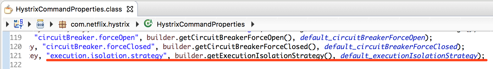

## 线程执行超时时限

​	在默认的线程执行隔离策略中,关于线程的执行时间,可以为其设置超时时限。当然,首先通过下面的属性开启该超时时限,该属性默认是开启的,即默认值为 true。若要关闭,则可以配置文件中设置该属性的值为 false。

`hystrix.command.default.execution.timeout.enabled`

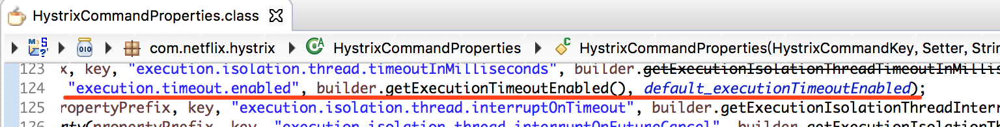

​	在开启了执行线程超时时限后,可以通过以下属性设置时限长度。`hystrix.command.default.execution.isolation.thread.timeoutInMilliseconds`其默认值为 1000 毫秒。这就是前面引入时为什么 sleep(4)是也报超时异常的原因,只要超过了 1 秒就会超时。 

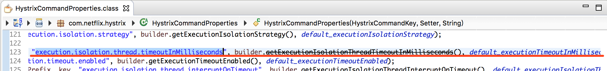

## 超时中断

​	当线程执行超时时是否中断线程的执行。默认为 true,即超时即中断。通过以下属性进 行设置。`hystrix.command.default.execution.isolation.thread.interruptOnTimeout`

## 取消中断

​	在线程执行过程中,若请求取消了,当前执行线程是否结束呢?由该值设置。默认为 false, 即取消后不中断。通过以下属性进行设置。`hystrix.command.default.execution.isolation.thread.interruptOnCancel`

## 线程池相关属性

关于执行线程的线程池,可以通过以下的这些属性[设置](https://github.com/Netflix/Hystrix/wiki/Configuration)。

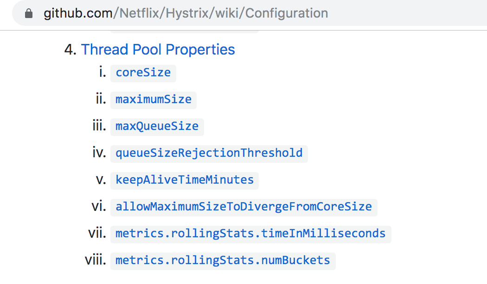

# Dashboard 监控仪表盘

## 定义消费者工程 04-consumer-dashboard-8080

Hystrix-dashboard 用于监控 Hystrix 服务降级情况,所以应添加在消费者工程中。

### 创建工程

​	本例完全可以直接在 04-consumer-fallbackfeign-8080 工程中进行修改,为了便于演示,这里又新建了一个工程。复制工程 04-consumer-fallbackfeign-8080,并重命名为04-consumer-dashboard-8080。

### 添加依赖

```xml
<!-- hystrix-dashboard依赖 -->
<dependency>
    <groupId>org.springframework.cloud</groupId>
    <artifactId>spring-cloud-starter-netflix-hystrix-dashboard</artifactId>
</dependency>

<!--actuator依赖-->
<dependency>
    <groupId>org.springframework.boot</groupId>
    <artifactId>spring-boot-starter-actuator</artifactId>
</dependency>
```

### 修改配置文件

​	在配置文件中添加如下内容,用于开启 actuator 的所有 web 终端,并调整 Hystrix 隔离线程执行的超时时限。

```yaml
# 开启actuator的所有web终端
management:
  endpoints:
    web:
      exposure:
        include: "*"

# 设置服务熔断时限，默认值为100ms
hystrix:
  command:
    default:
      execution:
        isolation:
          thread:
            timeoutInMilliseconds: 100
```

### 修改启动类

```java
// 指定Service接口所在的包，开启OpenFeign客户端
@EnableFeignClients(basePackages = "com.abc.consumer.service")
@SpringCloudApplication
@EnableHystrixDashboard   // 开启Hystrix仪表盘功能
public class ConsumerApplication {

    public static void main(String[] args) {
        SpringApplication.run(ConsumerApplication.class, args);
    }

}
```

## 定义提供者工程 04-provider-8081

### 创建工程

​	复制 03-provider-8081 工程,并重命名为 04-provider-8081。因为 03-provider-8081 工程的 Service 接口实现类中的 getDepartById()方法中具有 sleep()休眠功能。

### 修改service实现类

​	这里仅修改 getDepartById()方法。为了测试方便,这里将 id 值设置为 sleep()的时间,这样设置没有业务上的意义。 为了演示效果,这里测试时 id 的取值为 2、4。当取 2 时,不会超时,但当取 4 时,隔离线程执行会超时。 

```java
@Override
public Depart getDepartById(int id) {
    int time = 110;
    if(id < 3) {
        time = 50;
    }
    try {
        TimeUnit.MILLISECONDS.sleep(time);
    } catch (InterruptedException e) {
        e.printStackTrace();
    }

    if(repository.existsById(id)) {
        return repository.getOne(id);
    }
    Depart depart = new Depart();
    depart.setName("no this depart");
    return depart;
}
```

## 仪表盘介绍

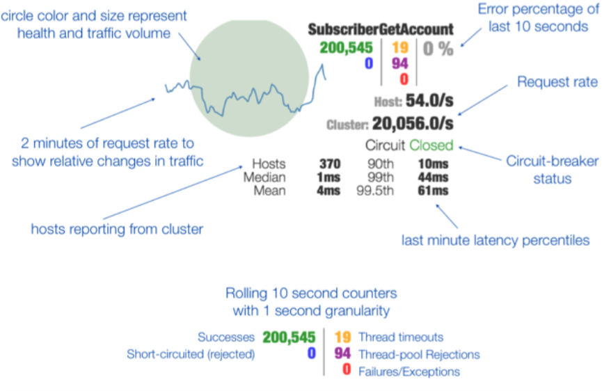

# 服务降级报警机制

​	无论是由于个别原因导致某个或某些消费者出现问题,还是由于高并发出现消费问题而引发服务熔断,他们都将启用服务降级机制。无论哪种原因启用了服务降级,系统都应该向管理员发出警报通知管理员,例如向管理员发送短信。这种发生服务降级后向管理员发出警报的机制称为服务熔断报警机制。

## 创建工程 04-consumer-fallbackalarm-8080

​	复制前面任意的服务熔断消费者工程,这里复制 04-consumer-feign-fallbackmethod-8080 工程,并重命名为 04-consumer-fallbackalarm-8080。 

## 添加依赖

```xml
<!--Spring Boot与Redis整合依赖-->
<dependency>
    <groupId>org.springframework.boot</groupId>
    <artifactId>spring-boot-starter-data-redis</artifactId>
</dependency>
```

## 修改配置文件

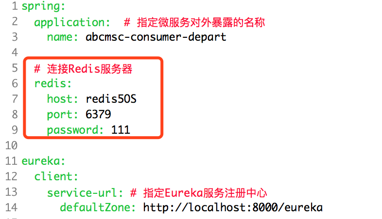

## 修改处理器

修改处理器,首先创建一个线程池,包含 5 个线程,然后再修改服务降级方法。

```java
@RestController
@RequestMapping("/consumer/depart")
public class DepartController {
	@Autowired
	private DepartService service;
	@Autowired
	private StringRedisTemplate template;

	// 创建一个线程池，包含5个线程
	private ForkJoinPool pool = new ForkJoinPool(5);

	public Depart getHystrixHandle(@PathVariable("id") int id, HttpServletRequest request) {

		// 指定存放到Redis中的key为"ip + 发生降级的方法名"
		String ip = request.getLocalAddr();
		String key = ip + "_getDepartById";
		// 异常发生后的报警
		queryCache(key);

		Depart depart = new Depart();
		depart.setId(id);
		depart.setName("no this depart");
		return depart;
	}

	// 异常发生后的报警
	private void queryCache(String key) {
		// 获取Redis操作对象
		BoundValueOperations<String, String> ops = template.boundValueOps(key);
		String value = ops.get();
		if (value == null) {
			synchronized (this) {
				value = ops.get();
				if (value == null) {
					// 使用线程池实现异步短信发送
					sendFallbackMsg(key);
					value = "短信已发送";
					ops.set(value, 10, TimeUnit.SECONDS);
				}
			}
		}
	}

	// 使用线程池实现异步短信发送
	private void sendFallbackMsg(String key) {

		pool.submit(() -> {
			System.out.println("发送服务异常报警短信：" + key);
		});

	}

	@PostMapping("/save")
	public boolean saveHandle(@RequestBody Depart depart) {
		return service.saveDepart(depart);
	}

	@DeleteMapping("/del/{id}")
	public boolean deleteHandle(@PathVariable("id") int id) {
		return service.removeDepartById(id);
	}

	@PutMapping("/update")
	public boolean updateHandle(@RequestBody Depart depart) {
		return service.modifyDepart(depart);
	}

	@HystrixCommand(fallbackMethod = "getHystrixHandle")
	@GetMapping("/get/{id}")
	public Depart getHandle(@PathVariable("id") int id, HttpServletRequest request) {
		return service.getDepartById(id);
	}

	@GetMapping("/list")
	public List<Depart> listHandle() {
		return service.listAllDeparts();
	}
}
```

