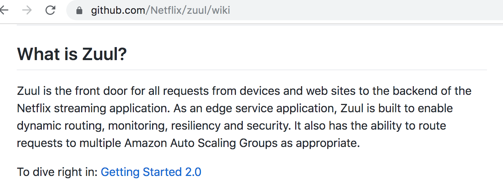
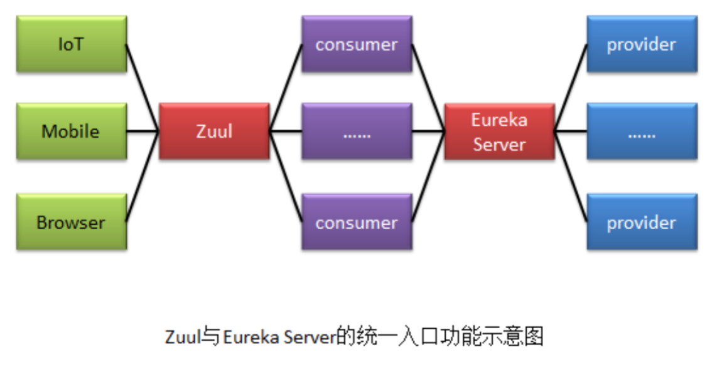
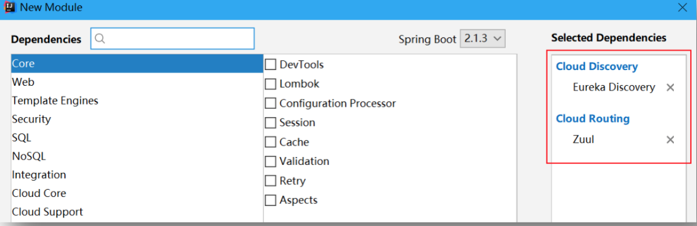
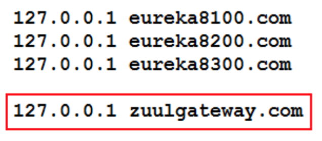
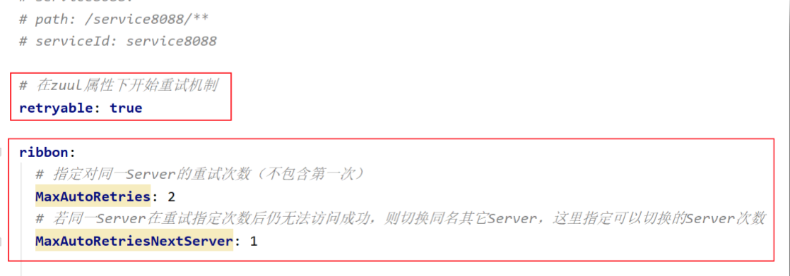
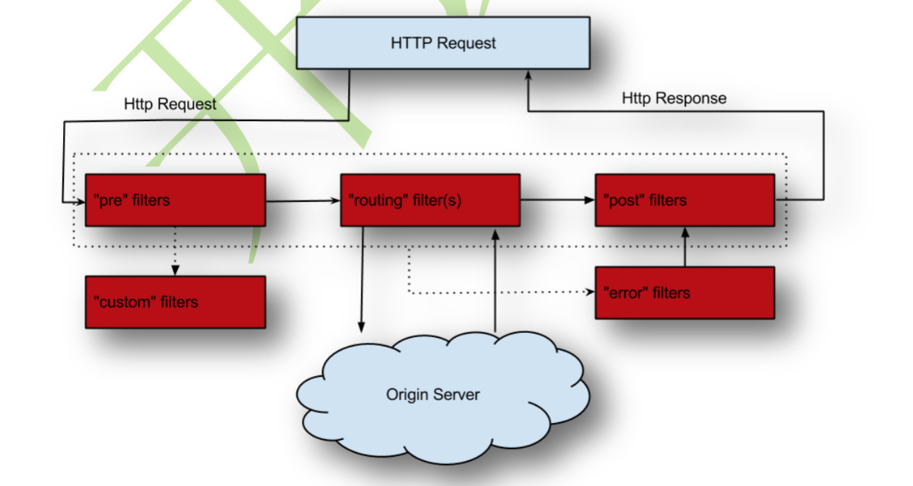
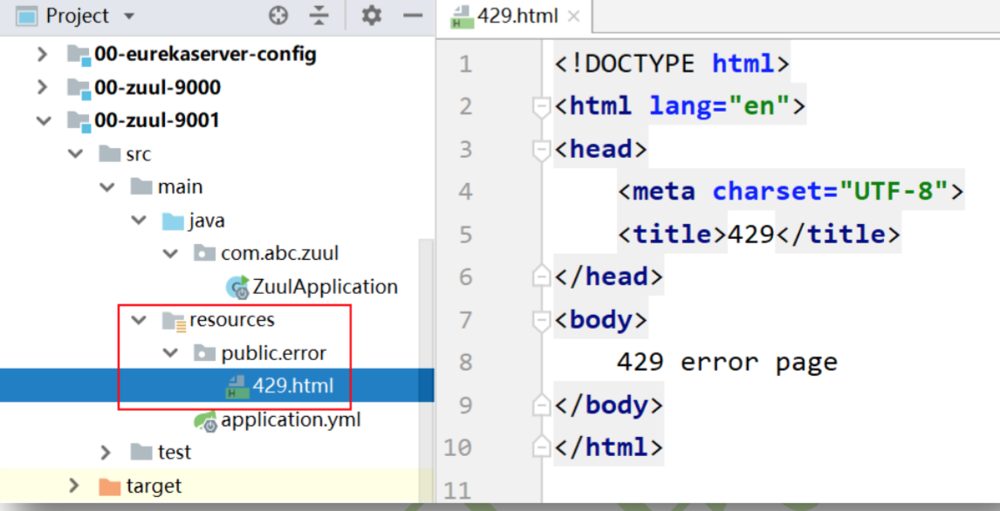

# 简介

## [官网wiki](https://github.com/Netflix/zuul/wiki)



> 【原文】Zuul is the front door for all requests from ==devices and web sites==(设备和 web 站点) to ==the backend of the Netflix streaming application==(Netflix 流应用后端). As an ==edge service application==(边界服务应用), Zuul is built to enable dynamic routing, monitoring, resiliency and security. It also has the ability to route requests to multiple ==Amazon Auto Scaling Groups==(亚马逊 自动缩放组,亚马逊的一种云计算方式)==as appropriate==(视情况而定, 酌情). 
>
> 【翻译】ZUUL 是从设备和 web 站点到 Netflix 流应用后端的所有请求的前门。作为边界服务 应用,ZUUL 是为了实现动态路由、监视、弹性和安全性而构建的。它还具有根据情况将请 求路由到多个 Amazon Auto Scaling Groups(亚马逊自动缩放组,亚马逊的一种云计算方式) 的能力。 

## 综合说明

​	Zuul 主要提供了==对请求的路由与过滤功能==。路由功能主要指,将外部请求转发到具体的微服务实例上,是外部访问微服务的统一入口。过滤功能主要指,对请求的处理过程进行干预,对请求进行校验、服务聚合等处理。

​	将 Zuul 放到整个系统架构中,其作用是这样的:服务提供者是消费者通过 EurekaServer进行访问的,即相当于EurekaServer 是服务提供者的统一入口。那么服务消费者很多,用户怎样访问这些消费者工程呢?当然可以像之前那样直接访问这些工程。但这种方式没有统一的消费者工程调用入口,不便于访问与管理,而 Zuul 就是这样的一个对于消费者的统一入口。即：EurekaServer是provider的访问统一入口；Zuul是consumer的访问统一入口；



# 基本环境搭建

​	这里需要一个 EurekaServer,一个 zuul 网关,及两个消费者。我们使用05-consumer-feign-fallbackmethod-8090 与 04-consumer-feign-fallbackmethod-8080  作为两个消费者。

## 修改 04-consumer-feign-fallbackmethod-8080 工程

​	两个消费者工程原来都是采用默认的 8080 端口号,所以要修改一个工程的。这里直接拷贝 04-consumer-feign-fallbackmethod-8080工程为工程05-consumer-feign-fallbackmethod-8090，端口号为 8090。 

​	8080与8090 这两个消费者工程,在本例中代表两个不同的微服务,所以微服务名称要设置的不一样。 

```yaml
server:
  port: 8090

spring:
  application:  # 指定微服务对外暴露的名称
    name: abcmsc-consumer-depart-8090

eureka:
  client:
    service-url: # 指定Eureka服务注册中心
      defaultZone: http://localhost:8000/eureka
      # defaultZone: http://eureka8100.com:8100/eureka,http://eureka8200.com:8200/eureka,http://eureka8300.com:8300/eureka
```

## 创建 zuul 网关服务器 00-zuul-9000

### 创建工程



### 定义配置文件

```yaml
server:
  port: 9000

eureka:
  client:
    service-url:
      defaultZone: http://localhost:8000/eureka

spring:
  application:
    name: abcmsc-zuul-depart
```

### 修改启动类

```java
@EnableZuulProxy    // 开启zuul代理模式
@SpringBootApplication
public class ZuulApplication {

    public static void main(String[] args) {
        SpringApplication.run(ZuulApplication.class, args);
    }

}
```

### 修改windows的host文件



# 服务路由

## 路由策略配置

​	服务路由功能,只需要通过暴露 Zuul 中配置的路由地址就可以让用户访问到指定的微服务、URL 或本地功能。

### 微服务默认”负载均衡路由”

​	微服务路由是指,用户提交的请求被路由到一个指定的微服务中,若该微服务名称的主机有多个,则==默认采用轮询的负载均衡策略==。

修改配置文件，在配置文件中添加如下配置：

```yaml
server: 
  port: 9000

eureka: 
  client:
    service-url:
      defaultZone: http://localhost:8000/eureka

spring: 
  application:
    name: abcmsc-zuul-depart
zuul:
# 设置微服务路由规则 
  routes:
# 指定要路由到的微服务名称
 
    service8080:
# 指定路由路径,即访问 URI 以/abc8080 开头, # 则会被路由到 serviceId 指定的微服务
      path: /abc8080/**
      serviceId: abcmsc-consumer-depart
    service8090:
      path: /abc8090/**
      serviceId: abcmsc-consumer-depart-8090
```

### 微服务 Ribbon 负载均衡路由

​	若不想使用默认的轮询负载均衡策略,可使用 Ribbon 的负载均衡策略。**该路由需要禁止 Ribbon 使用 Eureka**。修改配置文件如下:

```yaml
zuul:
# 设置微服务路由规则 
  routes:
    service8080:
      path: /abc8080/** 
      serviceId: ribbon-route # 指定该 path 由 ribbon 路由
      
# 指定 ribbon 路由策略 
ribbon-route:
  ribbon:
    # 指定负载均衡策略为随机算法
    NFLoadBalancerRuleClassName: com.netflix.loadbalancer.RandomRule
    # 指定要负载均衡的服务器列表来自于配置文件
    NIWSServiceListClassName: com.netflix.loadbalancer.ConfigurationBasedServerList 
    # 指定要负载均衡的服务器列表
    listOfServers: localhost:8080, localhost:8081, localhost:8082

# 禁止 Ribbon 使用 Erueka 
ribbon:
  eureka: 
    enabled: false
```

### URL路由

​	URL 路由是指,用户提交的请求被路由到一个指定的 URL 实例中。

```yaml
service8090:
	path: /abc8090/**
	url: http://localhost:8090
```

## 路由其它配置

### 路由通配符

前面使用的`/**`是路由通配符,用于匹配请求路径。除了`/**`外,还有两个:`/*`与/?。

* `/**`:匹配任意多级路径,例如,/client/aaa/bbb/ccc,/client/aaa/bbb,/client/aaa
* `/*`:匹配一级路径,例如,/client/aaa,/client/a
*  /?:匹配一级路径,且该路径仅能包含一个字符,例如,/client/a

### 路由前缀

​	在配置路由策略时,可以为路由路径配置一个统一的前辍。在前面的配置文件中增加如下配置。

```yaml
spring:
  application:
    name: abcmsc-zuul-depart

zuul:
  # 指定统一前辍
  prefix: /abc
```

### 服务名称屏蔽

```yaml
zuul:
  # 指定统一前辍
  prefix: /abc
  
  #指定要屏蔽的微服务名称，使客户端不能直接通过微服务名称访问
  # 屏蔽所有微服务名称
  ignored-services: "*"
  # 屏蔽指定微服务名称
  # ignored-services: abcmsc-consumer-depart-8080
```

### 路径屏蔽

```yaml
zuul:
  # 指定统一前辍
  prefix: /abc
  
  #指定要屏蔽的微服务名称，使客户端不能直接通过微服务名称访问
  # 屏蔽所有微服务名称
  ignored-services: "*"
  # 屏蔽指定微服务名称
  # ignored-services: abcmsc-consumer-depart-8080
  
  # 屏蔽指定URI
  ignored-patterns: /**/list/**
```

### 重试机制



# 路由过滤

​	在服务路由之前、中、后,可以对外请求进行过滤,使其只能访问它应该访问到的资源,增强安全性。此时需要通过 ZuulFilter 过滤器来实现对外服务的安全控制。 

## 路由过滤架构



## 定义RouteFilter类

​	直接将该 RouteFilter 类定义在 00-zuul-9000 工程中。该过滤的条件是,若请求中没有携带请求参数 user,则报 401,否则请求正常通过。

```java
package com.abc.zuul.filter;

import javax.servlet.http.HttpServletRequest;

import org.apache.http.HttpStatus;
import org.springframework.cloud.netflix.zuul.filters.support.FilterConstants;
import org.springframework.stereotype.Component;

import com.netflix.zuul.ZuulFilter;
import com.netflix.zuul.context.RequestContext;
import com.netflix.zuul.exception.ZuulException;

import lombok.extern.slf4j.Slf4j;

@Component
@Slf4j
public class RouteFilter extends ZuulFilter {

	// 指定路由之前执行过滤
	// pre:run()方法在请求被路由之前执行
	// route:run()方法在请求被路由时执行
	// post:run()方法在请求被路由之后执行
	// error:run()方法在请求被路由过程中出现异常时执行
	@Override
	public String filterType() {
		// 返回"pre"
		return FilterConstants.PRE_TYPE;
	}

	// 多个过滤器中，各过滤器的优先级顺序，值越小，优先级越高
	@Override
	public int filterOrder() {
		return 0;
	}

	// 对请求通过过滤的核心逻辑
	@Override
	public Object run() throws ZuulException {
		// 获取请求上下文
		RequestContext context = RequestContext.getCurrentContext();
		// 获取请求
		HttpServletRequest request = context.getRequest();

		// 获取请求参数
		String user = request.getParameter("user");
		if (user == null) {
			log.warn("user用户为空");
			// 指定当前请求未通过zuul过滤，默认值为true
			context.setSendZuulResponse(false);
			// 向客户端响应码401，未授权
			context.setResponseStatusCode(HttpStatus.SC_UNAUTHORIZED);
			return null;
		}

		log.info("通过过滤");
		return null;
	}

	// 过滤器常开
	@Override
	public boolean shouldFilter() {
		return true;
	}
}

```


# 请求限流

## 实现 00-zuul-9001

### 创建工程

复制工程 00-zuul-9000,并命名为 00-zuul-9001。

### 删除RouteFilter

删除 RouteFilter 类,该工程中不使用。

### 添加依赖

```xml
<!-- spring-cloud-zuul-ratelimit 依赖 -->
<dependency>
  <groupId>com.marcosbarbero.cloud</groupId>
  <artifactId>spring-cloud-zuul-ratelimit</artifactId>
  <version>2.0.5.RELEASE</version>
</dependency>
```

### 修改配置文件

```yaml
server:
  port: 9001

eureka:
  client:
    service-url:
      defaultZone: http://localhost:8000/eureka

spring:
  application:
    name: abcmsc-zuul-depart

zuul:
# 设置微服务路由规则 
  routes:
    service8080:
      path: /abc8080/**
      serviceId: abcmsc-consumer-depart
# 对限流的配置 
  ratelimit:
    enabled: true # 开启限流 
    default-policy: # 设置限流策略
      refresh-interval: 3 # 限流单位时间窗口
      limit: 3 # 在指定的单位时间窗口内启动限流的限定值
      quota: 1 # 指定限流的时间窗口数量
      type: # 指定限流查验对象类型
      - user 
      - origin  
      - url
```

### 添加异常处理页面



# 灰度发布

​	Zuul的灰度发布，其实就是基于Eureka的元数据，使用Zuul的过滤实现的灰度发布！

## 创建三个消费者工程

这里要创建三个工程。其中两个代表原系统工程,一个代表要进行灰度发布的工程。

### 创建 05-consumer-gray-8080

修改配置文件：

```yaml
server: 
  port: 8080
spring: 
  application:
    name: abcmsc-consumer-depart
eureka: 
  client:
    service-url:
      defaultZone: http://localhost:8000/eureka
  instance:
    metadata-map: # 添加指定的元数据,为主机添加元数据标记
      host-mark: running-host
```

修改处理器：

```java
// 服务降级方法，即响应给客户端的备选方案
public Depart getHystrixHandle(@PathVariable("id") int id) {
  Depart depart = new Depart();
  depart.setId(id);
  depart.setName("no this depart8080");
  return depart;
}
```

### 创建 05-consumer-gray-8081

修改配置文件

```yaml
server: 
  port: 8081
spring: 
  application:
    name: abcmsc-consumer-depart
eureka: 
  client:
    service-url:
      defaultZone: http://localhost:8000/eureka
  instance:
    metadata-map: # 添加指定的元数据,为主机添加元数据标记
      host-mark: running-host
```

修改处理器：

```java
// 服务降级方法，即响应给客户端的备选方案
public Depart getHystrixHandle(@PathVariable("id") int id) {
  Depart depart = new Depart();
  depart.setId(id);
  depart.setName("no this depart8081");
  return depart;
}
```

### 创建 05-consumer-gray-8082

修改配置文件

```yaml
server: 
  port: 8082
spring: 
  application:
    name: abcmsc-consumer-depart
eureka: 
  client:
    service-url:
      defaultZone: http://localhost:8000/eureka
  instance:
    metadata-map: # 添加指定的元数据,为主机添加元数据标记
      host-mark: gray-host
```

修改处理器

```java
// 服务降级方法，即响应给客户端的备选方案
public Depart getHystrixHandle(@PathVariable("id") int id) {
  Depart depart = new Depart();
  depart.setId(id);
  depart.setName("no this depart8082");
  return depart;
}
```


## 创建Zuul工程

### 创建工程

复制工程 00-zuul-9000,并重命名为 00-zuul-9002。

### 添加依赖

```xml
<dependency>
			<groupId>io.jmnarloch</groupId>
			<artifactId>
				ribbon-discovery-filter-spring-cloud-starter
			</artifactId>
			<version>2.1.0</version>
		</dependency>
```

### 修改配置文件

```yaml
server:
  port: 9002

eureka:
  client:
    service-url:
      defaultZone: http://localhost:8000/eureka

spring:
  application:
    name: abcmsc-zuul-depart

zuul:
# 设置微服务路由规则 
  routes:
    service8080:
      path: /abc8080/**
      serviceId: abcmsc-consumer-depart
```

### 定义过滤器

```java
@Component
@Slf4j
public class GrayFilter extends ZuulFilter {
	// 指定路由之前执行过滤
	@Override
    public String filterType() {
        // 返回"pre"
        return FilterConstants.PRE_TYPE;
    }

    @Override
    public int filterOrder() {
        return 0;
    }
    // 过滤器常开
    @Override
    public boolean shouldFilter() {
        return true;
    }

    // 对请求过滤的核心逻辑
    @Override
    public Object run() throws ZuulException {
        // 获取请求上下文
        RequestContext context = RequestContext.getCurrentContext();
        // 获取请求
        HttpServletRequest request = context.getRequest();

        // 获取指定的头信息，该头信息在浏览器提交请求时携带
        String mark = request.getHeader("gray-mark");

        // 默认将请求路由到running-host上
        // "host-mark"与"running-host"是在消费者工程中
        // 添加的元数据key-value
        RibbonFilterContextHolder.getCurrentContext().add("host-mark", "running-host");

        // 若mark的值不空，且为"enable"，则将请求路由到gray-host上
        if(!StringUtils.isEmpty(mark) && "enable".equals(mark)) {
            RibbonFilterContextHolder.getCurrentContext().add("host-mark", "gray-host");
        }
        return null;
    }
}
```

# Zuul的高可用

​	Zuul 的高可用非常关键,因为外部请求到后端微服务的流量都会经过 Zuul。故而在生产环境中,我们一般都需要部署高可用的 Zuul 以避免单点故障。 

​	作为整个系统入口路由的高可用,需要借助额外的负载均衡器来实现,例如 Nginx、 HAProxy、F5 等。在 Zuul 集群的前端部分部署负载均衡服务器。Zuul 客户端将请求发送到负 载均衡器,负载均衡器将请求转发到其代理的其中一个 Zuul 节点。这样,就可以实现 Zuul 的高 