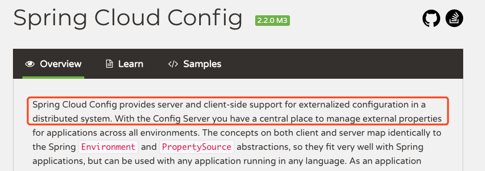

# Spring Cloud Config简介

## 官网介绍



> 【原文】Spring Cloud Config provides server and client-side support for externalized configuration in a distributed system. With the Config Server you have a central place to manage external properties for applications across all environments. 
>
> 【翻译】SpringCloudConfig 为分布式系统中的外部化配置提供服务器和客户端支持。使用 Config 服务器,可以在中心位置管理所有环境中应用程序的外部属性。 

## 综合说明

​	Spring Cloud Config 就是对微服务的配置文件进行统一管理的。其工作原理是,我们首先需要将各个微服务公共的配置信息推送到 GitHub 远程版本库。然后我们再定义一个 Spring Cloud Config Server,其会连接上这个 GitHub 远程库。这样我们就可以定义 Config 版的 Eureka Server、提供者与消费者了,它们都将作为 Spring Cloud Config Client 出现,它们都会通过连接 Spring Cloud Config Server 连接上 GitHub 上的远程库,以读取到指定配置文件中的内容。

## 原理


# 创建配置文件工程 00-configserver-9999

## 创建工程


## 定义配置文件

application.yml

```yaml
server:
  port: 9999

# 指定当前工程所关联的Git远程地址
spring:
  cloud:
    config:
      server:
        git:
          uri: git@github.com:changbingbing/abcmsc-config-center.git
          # 获取到远程git库连接的超时时限，默认5S
          timeout: 5
          # 指定要操作的远程git库的分支，默认master
          default-label: master
```

## 定义启动类

```java
//开启ConfigServer功能
@EnableConfigServer
@SpringBootApplication
public class Application {

	public static void main(String[] args) {
		SpringApplication.run(Application.class, args);
	}

}
```

## 修改hosts文件

`vi /etc/hosts`

```shell
127.0.0.1 eureka8001.com
127.0.0.1 eureka8002.com
127.0.0.1 configserver.com
```

## 启动测试

按需求组装配置(默认访问master分支)，具体解析规则不用深究

* [http://configserver.com:9999/master/application-dev.yml](http://configserver.com:9999/master/application-dev.yml)
* [http://configserver.com:9999/application-dev.yml](http://configserver.com:9999/application-dev.yml)
* [http://configserver.com:9999/ap-dev.yml](http://configserver.com:9999/ap-dev.yml)
* [http://configserver.com:9999/application-dev.properties](http://configserver.com:9999/application-dev.properties)
* [http://configserver.com:9999/application-dev.json](http://configserver.com:9999/application-dev.json)
* [http://configserver.com:9999/application/master](http://configserver.com:9999/application/master)

# 定义 Config 版的 Eureka 服务器 06-config-eurekaserver

## 创建工程

复制 00-eurekaserver-8000 工程,并重命名为 06-config-eurekaserver。

## 添加config客户端依赖

在原工程依赖的基础上添加 spring cloud config 的客户端依赖。

```xml
<!-- spring cloud config客户端依赖 -->
<dependency>
  <groupId>org.springframework.cloud</groupId>
  <artifactId>spring-cloud-starter-config</artifactId>
</dependency>
```

## 定义bootstrap.yml

```yaml
spring:
  cloud:
    config:
    # 指定ConfigServer地址
      uri: http://configserver.com:9999
      # 指定要访问的远程分支
      label: master
      # 指定要从远程库读取的配置文件名称，注意无需扩展名
      name: application-eureka-config
      # 环境选择
      profile: dev
```

注意⚠️：

> ​	这里不是`application.yml`，而是`bootstrap.yml`！这两种文件都是spring boot的配置文件，都是在应用启动的时候加载，但放的配置内容是不同的。`bootstrap.yml`存放应用启动时需要加载的配置信息，`application.yml`存放的是应用启动后，服务运行所需的配置信息；

## 启动测试

[http://eureka8001.com:8001/](http://eureka8001.com:8001/)

# 定义 Config 版的提供者 06-config-provider

## 创建工程

复制 03-provider-8082 工程,重命名为 06-config-provider。

## 添加config客户端依赖

在原工程依赖的基础上添加 spring cloud config 的客户端依赖。

```xml
<!-- spring cloud config客户端依赖 -->
<dependency>
  <groupId>org.springframework.cloud</groupId>
  <artifactId>spring-cloud-starter-config</artifactId>
</dependency>
```

## 定义bootstrap.yml

```yaml
spring:
  cloud:
    config:
    # 指定ConfigServer地址
      uri: http://configserver.com:9999
      # 指定要访问的远程分支
      label: master
      # 指定要从远程库读取的配置文件名称，注意无需扩展名
      name: application-provider-config
      # 环境选择
      profile: dev
```

# 定义 Config 版的消费者 06-config-consumer

## 创建工程

复制 04-consumer-hystrix-8080 工程,并重命名为 06-config-consumer。

## 添加config客户端依赖

```xml
<!-- spring cloud config客户端依赖 -->
<dependency>
  <groupId>org.springframework.cloud</groupId>
  <artifactId>spring-cloud-starter-config</artifactId>
</dependency>
```

## 定义bootstrap.yml

```yaml
spring:
  cloud:
    config:
    # 指定ConfigServer地址
      uri: http://configserver.com:9999
      # 指定要访问的远程分支
      label: master
      # 指定要从远程库读取的配置文件名称，注意无需扩展名
      name: application-consumer-config
      # 环境选择
      profile: dev
```

# 配置更新

## Webhooks

​	GitHub 中提供了 Webhooks 功能来确保远程库中的配置文件更新后,客户端中的配置信息也可以实时更新。具体实现方式可参考[一篇博文](https://blog.csdn.net/qq_32423845/article/details/79579341)。

​	但这种方式存在很大的弊端，不适于生产应用:

* 每个 Config Client 主机都需要在 GitHub 中注册,即若要增加 Config Client,则需要修改GitHub。
* 每个ConfigClient主机想从远程库中更新配置信息时都需要提交一个acturator的refresh监控终端请求,且为 POST 请求。即当有很多的 Config Client 主机时,就需要提交很多 的这种 POST 请求。 

​	由于这种方式并不适合生产环境下的使用,而 **Spring Cloud Bus 消息总线**系统解决了这 些问题。所以,生产环境下,我们使用的是 Spring Cloud Bus。 