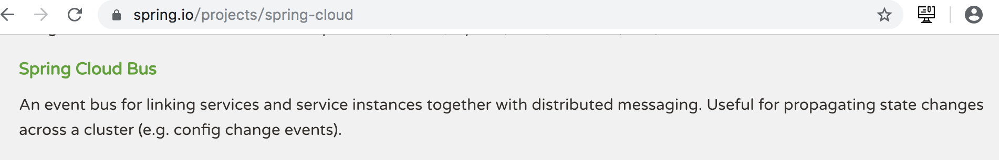
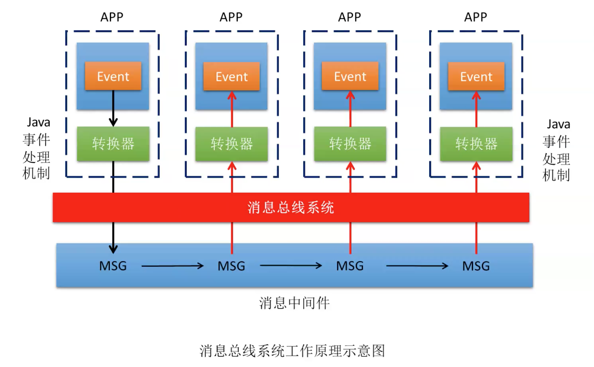
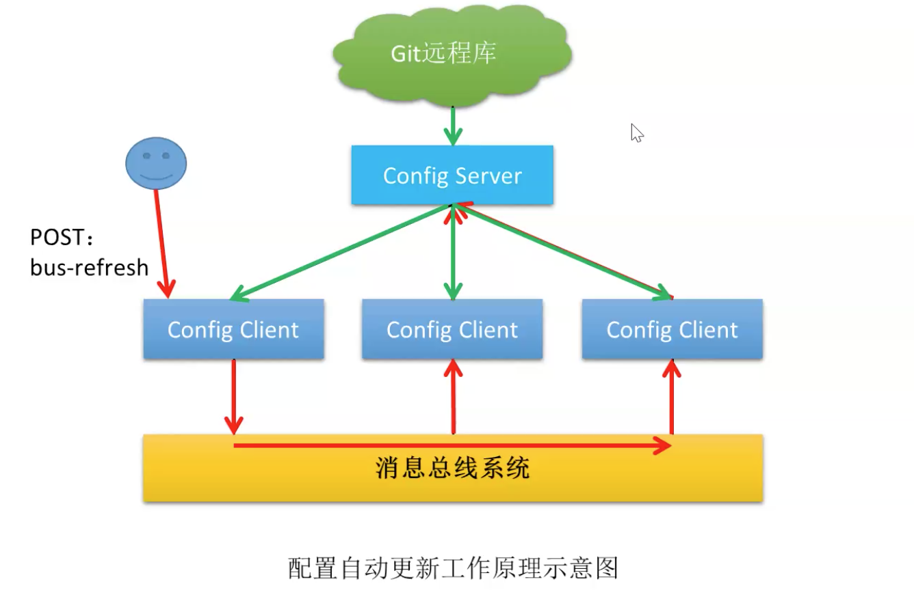
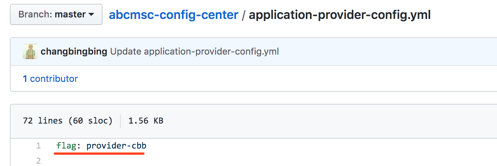
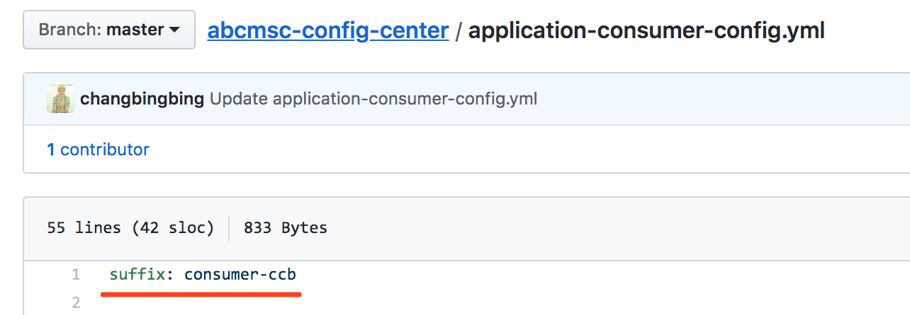
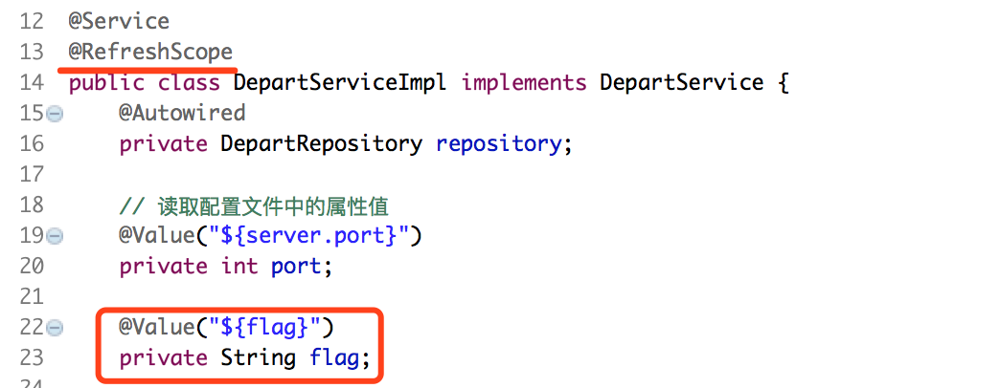
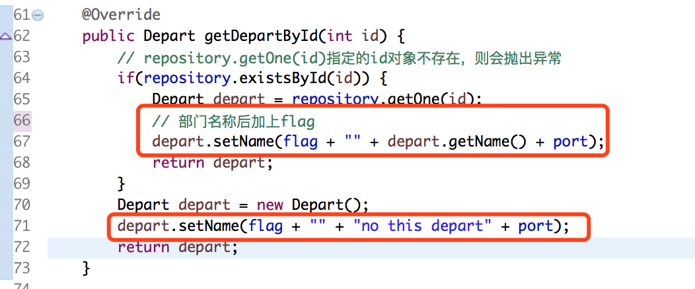
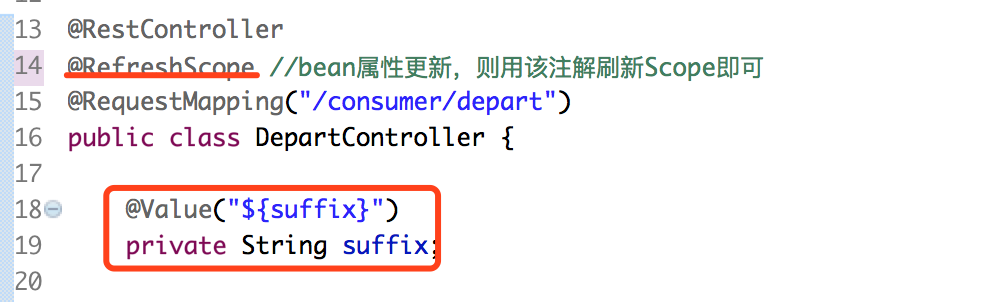
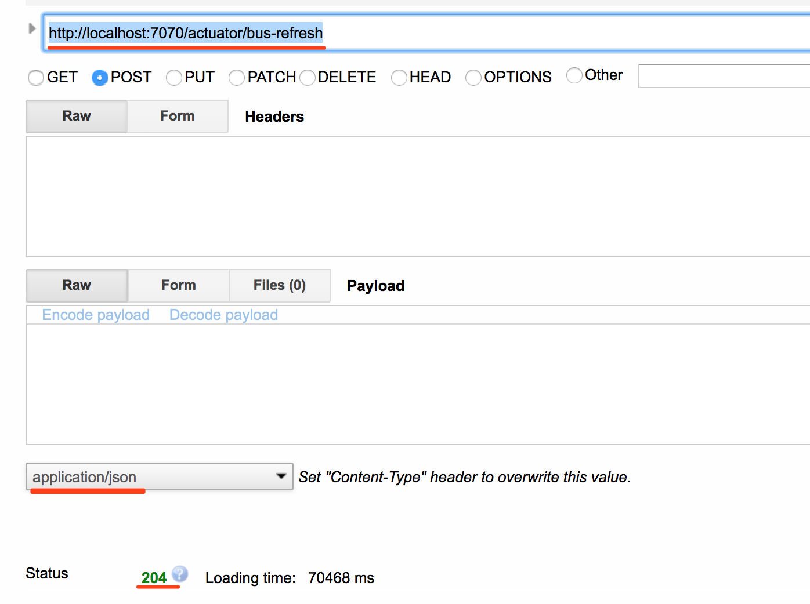

# Spring Cloud Bus概述

## 官方简介



> 【翻译】用于将服务和服务实例与分布式消息系统链接在一起的事件总线。在集群中传播状态更改很有用(例如配置更改事件)。

## 工作原理



​		消息总线系统，实际就是整合了消息中间件和转换器；转换器，即JAVA事件处理机制；

1. Event通过转换器转换为MSG，随后发布到消息中间件；
2. MSG在消息中间件中又传播给其它APP，经转换器再转换为Event；

## 配置自动更新原理



​	有人更新了远程的配置管理中心（Git远程库）配置，要更新本地配置为最新配置，怎么办呢？

1. 随便哪个Config Client提交一个POST:bus-refresh(这是一个监控终端)请求到Git远程库并下载更新本地配置；
2. Config Client提交一个POST:bus-refresh请求，实际就是一个Event，进而触发事件处理机制转换为消息发布到消息中间件
3. 消息通过消息中间件传播给其它Config Client，收到消息随即也提交一个Event进行下载更新本地

# 修改远程库中的配置文件

​	为了方便后面的测试,这里分别在提供者配置文件 application-provider-config.yml 与消费者配置文件 application-consumer-config.yml 中各添加了一个自定义属性。 

## 修改 application-provider-config.yml



## 修改 application-consumer-config.yml



# 创建提供者工程 06 -config-provider-bus

## 创建工程

复制 06-config-provider,并重命名为 06 -config-provider-bus。

## 导入依赖

```xml
<dependency>
  <groupId>org.springframework.cloud</groupId>
  <artifactId>spring-cloud-starter-bus-kafka</artifactId>
</dependency>
<dependency>
  <groupId>org.springframework.boot</groupId>
  <artifactId>spring-boot-starter-actuator</artifactId>
</dependency>
```

## 修改配置文件

```yaml
spring:
  cloud:
    config:
    # 指定ConfigServer地址
      uri: http://configserver.com:9999
      # 指定要访问的远程分支
      label: master
      # 指定要从远程库读取的配置文件名称，注意无需扩展名
      name: application-provider-config
      # 环境选择
      profile: dev

# 注册kafka集群
  kafka:
    bootstrap-servers: 192.168.36.231:9092,192.168.36.190:9092,192.168.36.234:9092

# 开启bus-refresh监控终端  
management:
  endpoints:
    web:
      exposure:
        include: bus-refresh
```

## 修改接口实现类





# 创建消费者工程 06 -config-consumer-bus

## 创建工程

复制 06-config-consumer,并重命名为 06 -config-consumer-bus。

## 导入依赖

```xml
<dependency>
  <groupId>org.springframework.cloud</groupId>
  <artifactId>spring-cloud-starter-bus-kafka</artifactId>
</dependency>
<dependency>
  <groupId>org.springframework.boot</groupId>
  <artifactId>spring-boot-starter-actuator</artifactId>
</dependency>
```

## 修改配置文件

```yaml
spring:
  cloud:
    config:
    # 指定ConfigServer地址
      uri: http://configserver.com:9999
      # 指定要访问的远程分支
      label: master
      # 指定要从远程库读取的配置文件名称，注意无需扩展名
      name: application-consumer-config
      # 环境选择
      profile: dev

# 注册kafka集群
  kafka:
    bootstrap-servers: 192.168.36.231:9092,192.168.36.190:9092,192.168.36.234:9092

# 开启bus-refresh监控终端  
management:
  endpoints:
    web:
      exposure:
        include: bus-refresh
```

## 修改处理器类



# 提交POST请求

注意⚠️：

* 远程配置管理中心配置更新，自己肯定知道，所以配置变更后需要直接**手动提交个POST**才能完成各个Config Client的配置自动更新
* 随便哪个Config Client提交POST请求都可以，不提交POST，远程的配置更新则不会更新至所有Config Client

http://localhost:7070/actuator/bus-refresh



响应**204**则说明更新OK，直接测试就OK了