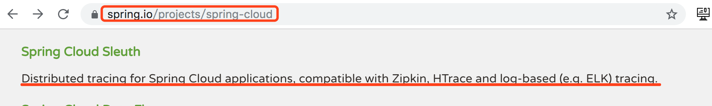
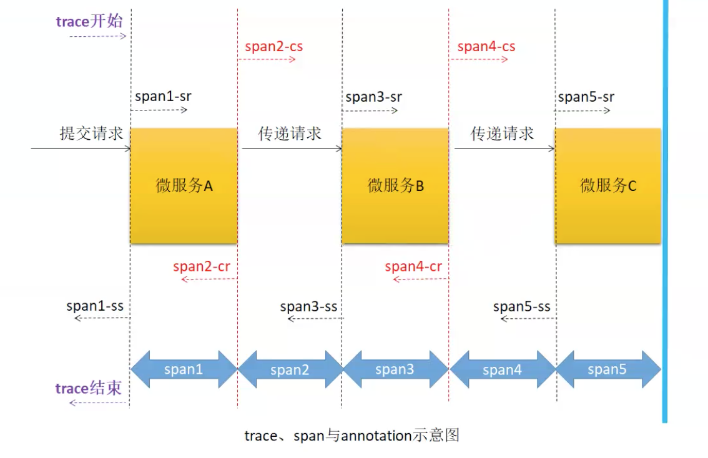
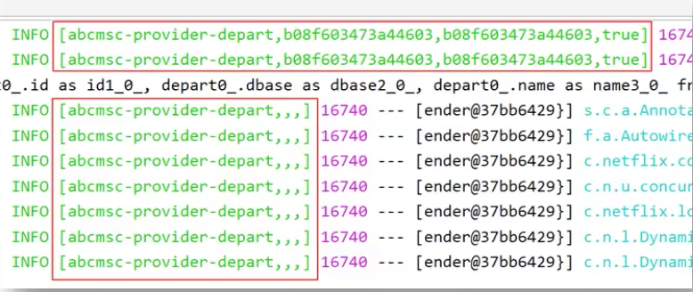
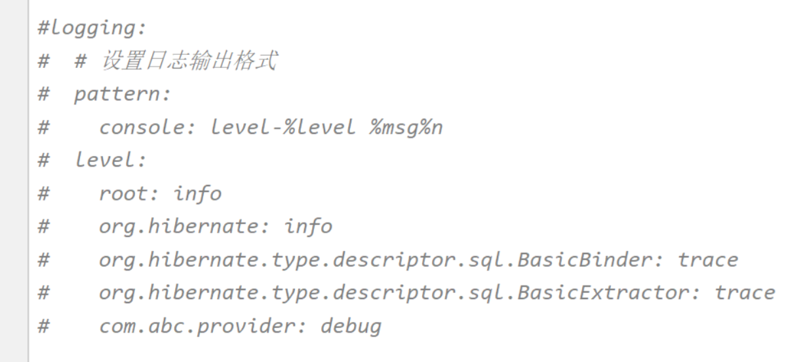
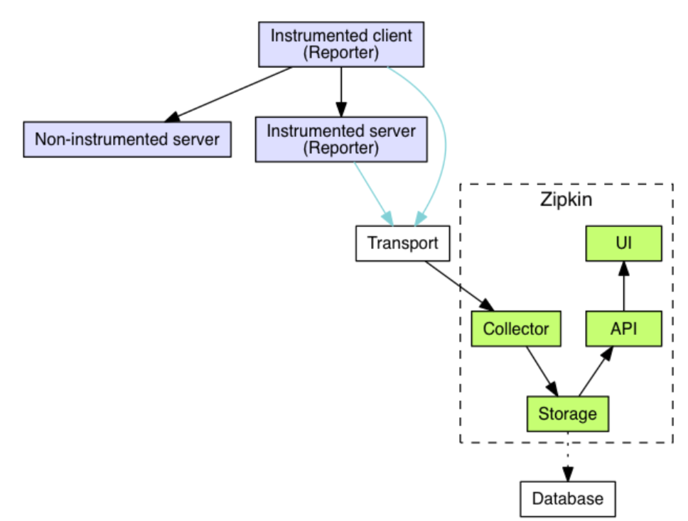
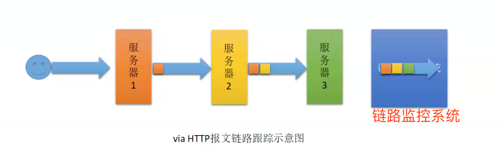

# Sleuth简介

打开官网就可以看到对 [Sleuth](https://spring.io/projects/spring-cloud) 的一个简单功能介绍。



> ［原文］Distributed tracing for Spring Cloud applications, compatible with Zipkin, HTrace and log-based (e.g. ELK) tracing.
>
> ［翻译］(Spring Cloud Sleuth 可以实现)针对 Spring Cloud 应用程序的分布式跟踪,兼容Zipkin、HTrace 和基于日志的(如 Elk)跟踪。

注意⚠️：**Sleuth是日志的生产者**，即使服务生成日志的。下面提的**zipken是日志的收集者**

# Sleuth基本理论

## Spring Cloud Sleuth文档

[Spring Cloud Sleuth 的官方文档](https://cloud.spring.io/spring-cloud-sleuth/reference/html/)中可以查看到服务跟踪的基本理论。

## trace与span

服务跟踪理论中存在有跟踪单元的概念,而跟踪单元中包含两个概念:trace 与 span。



* ==trace==:跟踪单元是从客户端所发起的请求抵达被跟踪系统的边界开始,到被跟踪系统向客户返回响应为止的过程,这个过程称为一个 trace。 
* ==span==:每个 trace 中会调用若干个服务,为了记录调用了哪些服务,以及每次调用所消耗的时间等信息,在每次调用服务时,埋入一个调用记录,这样一个调用记录称为一个 span。 
* ==关系==:一个 trace 由若干个有序的 span 组成。

​	Spring Cloud Sleuth 为服务之间调用提供链路追踪功能。为了唯一的标识 trace 与 span, 系统为每个 trace 与 span 都指定了一个 64 位长度的数字作为 ID,即 traceID 与 spanID。 

## annotation

​	用于表示及时记录事件的实体,表示一个事件发生的时间点。这些实体本身仅仅是为了 原理叙述的方便,对于 Spring Cloud Sleuth 本身并没有什么必要性。这样的实体有多个,常 用的有四个: 

* cs:Client Send,表示客户端发送请求的时间点,一个 span 的开始。
* sr:Server Receive,表示服务端接收到请求的时间点,一个 span 的结束,另一个 span 的开始。(sr-cs)的值表示请求在网络上传输的时长。
* ss:Server Send,表示服务端发送请求处理结果的时间点,一个 span 的结束,另一个span 的开始。(ss-sr)的值表示服务端处理请求的时长。
* cr:Client Receive,表示客户端接收到来自服务端的响应的时间点,一个 span 的结束, trace 的结束。(cr-ss)的值表示响应在网络上传输的时长。 

## Sleuth的日志采样

### 日志生成

​	只要在工程中添加了 Spring Cloud Sleuth 与 Zipkin 依赖, 那么工程在启动与运行过程中就会自动生成很多的日志。Sleuth 会为日志信息打上收集标记,需要收集的设置为 true,不需要的设置为 false。这个标记可以通过在代码中添加自己的日志信息看到。



### 日志采样率

​	Sleuth 对于这些日志支持抽样收集,即并不是所有日志都会上传到日志收集服务器,日志收集标记就起这个作用。（水塘抽样算法，抽样率0.1）

# 跟踪日志的生产者Sleuth

## 创建提供者工程 07-sleuth-provider-8081

### 创建工程

复制 02-provider-8081,并重命名为 07-sleuth-provider-8081。

### 导入依赖

```xml
<!-- sleuth依赖 -->
<dependency>
  <groupId>org.springframework.cloud</groupId>
  <artifactId>spring-cloud-starter-sleuth</artifactId>
</dependency>
```

### 修改处理器

在处理器方法中添加想要添加的日志。这里使用 Lombok 的@Slf4j 日志工具。注意：日志级别为 info。 

```java
@Slf4j
@RequestMapping("/provider/depart")
@RestController
public class DepartController {
    @Autowired
    private DepartService service;
  
  	@GetMapping("/get/{id}")
    public Depart getHandle(@PathVariable("id") int id) {
    		log.info("生产者的处理器方法被调用");
        return service.getDepartById(id);
    }

    //......
}
```

### 修改配置文件

将配置文件中有关日志的配置注释,否则看不到后面的演示结果。



## 创建消费者工程 07-sleuth-consumer-8080

### 创建工程

复制 02-consume -8081,并重命名为 07-sleuth-consumer-8081。

### 导入依赖

```xml
<!-- sleuth依赖 -->
<dependency>
  <groupId>org.springframework.cloud</groupId>
  <artifactId>spring-cloud-starter-sleuth</artifactId>
</dependency>
```

### 修改处理器

```java
@Slf4j
@RestController
@RefreshScope //bean属性更新，则用该注解刷新Scope即可
@RequestMapping("/consumer/depart")
public class DepartController {
	
	@Value("${suffix}")
	private String suffix;
	
    @Autowired
    private DepartService service;

    // 服务降级：若当前处理器方法发生异常，则执行fallbackMethod属性指定的方法
    @HystrixCommand(fallbackMethod = "getHystrixHandle")
    @GetMapping("/get/{id}")
    public Depart getHandle(@PathVariable("id") int id) {
    		log.info("消费者的处理器方法被调用");
    		Depart depart = service.getDepartById(id);
    		depart.setName(suffix+"~"+depart.getName());
        return depart;
    }

    public Depart getHystrixHandle(@PathVariable("id") int id) {
        Depart depart = new Depart();
        depart.setId(id);
        depart.setName("no this depart  -- 方法级别" + suffix);
        return depart;
    }

    //......
}
```

# zipkin工作过程

## [zipkin简介](https://zipkin.io/)

​	zipkin 是 Twitter 开发的一个分布式系统 APM(Application Performance Management,应用性能管理)工具,其是基于 Google Dapper 实现的,用于完成日志的聚合。其与 Sleuth 联用,可以为用户提供调用链路监控可视化 UI 界面。

​	<u>主流的日志集合解析方案用的是**ELK**，为什么Spring Cloud中引入**zipkin**呢？主要是ELK对日志数据分析的维度缺少请求链路中的span时间节点，所以如果要对链路中高延迟的分析，ELK做不到，而zipken可以做到。</u>

## zipkin系统结构

### 服务器组成



zipkin 服务器主要由 4 个核心组件构成:

* ==Collector==:收集组件,它主要用于处理从外部系统发送过来的跟踪信息,将这些信息转 换为 Zipkin 内部处理的 Span 格式,以支持后续的存储、分析、展示等功能。
* ==Storage==:存储组件,它主要用于处理收集器接收到的跟踪信息,默认会将这些信息存储在内存中,也可以修改存储策略,例如,将跟踪信息存储到数据库中。
* ==API==:外部访问接口组件,外部系统通过这里的 API 可以实现对系统的监控。
* ==UI==:用于操作界面组件,基于 API 组件实现的上层应用。通过 UI 组件用户可以方便而有直观地查询和分析跟踪信息。

### 日志发送方式

​	在 Spring Cloud Sleuth + zipkin 系统中,客户端中一旦发生服务间的调用,就会被配置在微服务中的 Sleuth 的监听器监听,然后生成相应的 Trace 和 Span 信息,并发送给 zipkin服务端。发送的方式主要有两种：一种是通过 **via HTTP 报文**的方式,也可以通过 **Kafka、RabbitMQ** 发送。

​	<u>当然，高并发下，via HTTP方式效率低，这一点从下图可看出，随调用链越长，请求头信息越多，效率则越低，所以生产环境一般会用第二种通过MQ发送</u>。



# zipkin服务端搭建

新建文件夹zipkin

```shell
cd ....../zipkin

# 下载
curl -sSL https://zipkin.io/quickstart.sh | bash -s
# 启动
java -jar zipkin.jar

# 访问
http://localhost:9411/zipkin/
```

# 创建 zipkin 客户端工程-via

## 修改提供者 07-sleuth-provider-8081

### 导入依赖

```xml
<!-- sleuth依赖 -->
<!-- <dependency>
   <groupId>org.springframework.cloud</groupId>
   <artifactId>spring-cloud-starter-sleuth</artifactId>
  </dependency> -->
<!-- zipkin客户端依赖，其实包含了sleuth依赖 -->
<dependency>
  <groupId>org.springframework.cloud</groupId>
  <artifactId>spring-cloud-starter-zipkin</artifactId>
</dependency>
```

### 修改配置文件

```yaml
spring
  #指定zipkin服务地址
  zipkin:
    base-url: http://localhost:9411/zipkin/
  # 设置采样比例为1.0,即全部都需要，默认为0.1
  sleuth:
    sampler:
      probability: 1.0
```

## 修改消费者工程 07-sleuth-consumer-8080

### 导入依赖

```xml
<!-- sleuth依赖 -->
<!-- <dependency>
   <groupId>org.springframework.cloud</groupId>
   <artifactId>spring-cloud-starter-sleuth</artifactId>
  </dependency> -->
<!-- zipkin客户端依赖，其实包含了sleuth依赖 -->
<dependency>
  <groupId>org.springframework.cloud</groupId>
  <artifactId>spring-cloud-starter-zipkin</artifactId>
</dependency>
```

### 修改配置文件

```yaml
spring
  #指定zipkin服务地址
  zipkin:
    base-url: http://localhost:9411/zipkin/
  # 设置采样比例为1.0,即全部都需要，默认为0.1
  sleuth:
    sampler:
      probability: 1.0
```

## via小结

​	这种方式有个缺陷：**访问量大，高并发下，（头里写数据）效率很低**。所以，生产环境，一般不这样用。生产环境会和MQ（kafka）相结合。

# sleuth + zipkin + kafka 

## 创建提供者工程 07-kafka-sleuth-provider -8081

### 创建工程

复制 07-sleuth-provider-8081,并重命名为 07-sleuth-provider-kafka-8081。

### 导入依赖

```xml
<dependency>
  <groupId>org.springframework.kafka</groupId>
  <artifactId>spring-kafka</artifactId>
</dependency>
```

### 修改配置文件

```yaml
spring
  kafka:
    bootstrap-servers: 192.168.36.231:9092,192.168.36.190:9092,192.168.36.234:9092
  zipkin:
    sender:
      type: kafka
```

## 创建消费者工程 07-kafka-sleuth-consumer-8080

### 创建工程

复制 07-sleuth-consumer-8081,并重命名为 07-sleuth-consumer-kafka-8081。

### 导入依赖

```xml
<dependency>
  <groupId>org.springframework.kafka</groupId>
  <artifactId>spring-kafka</artifactId>
</dependency>
```

### 修改配置文件

```yaml
spring
  kafka:
    bootstrap-servers: 192.168.36.231:9092,192.168.36.190:9092,192.168.36.234:9092
  zipkin:
    sender:
      type: kafka
```

## 启动服务

1. zk启动

2. kafka集群启动

3. zipkin启动

   ```shell
   # 注意⚠️：这里配一台机器即可，配一台整个集群都可以找到
   java -DKAFKA_BOOTSTRAP_SERVERS=kafkaOS1.9092 –jar zipkin.jar
   ```

4. 启动提供者、消费者