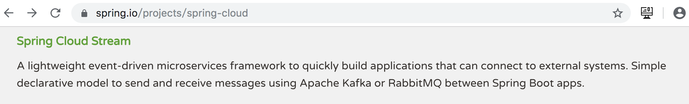

# 简介

## 官网



> 【原文】A lightweight event-driven microservices framework to quickly build applications that can connect to external systems. Simple declarative(声名式的) model to send and receive messages using Apache Kafka or RabbitMQ between Spring Boot apps.
> 【翻译】一个轻量级的事件驱动微服务框架,用于快速构建可连接到外部系统的应用程序。在 Spring Boot 应用程序之间使用 Kafka 或 RabbitMQ 发送和接收消息的简单声明式模型。

## 综合

​	Spring Cloud Stream 是一个用来为微服务应用构建消息驱动能力的框架。<u>通过使用Spring Cloud Stream,可以有效简化开发人员对消息中间件的使用复杂度,让系统开发人员可以有更多的精力关注于核心业务逻辑的处理</u>。但是目前 Spring Cloud Stream 只支持RabbitMQ 和 Kafka 的自动化配置。

# [程序模型](https://cloud.spring.io/spring-cloud-static/spring-cloud-stream/2.2.1.RELEASE/spring-cloud-stream.html#spring-cloud-stream-overview-application-model)

spring cloud 官网首页中点击相应版本的参考文档。


​	应用程序的核心部分(Application Core)通过 inputs 与 outputs 管道,与中间件连接,而管道是通过绑定器 Binder 与中间件相绑定的。

# stream kafka微服务

## 消息发送给一个主题的生产者

### 创建工程 08-spring-clourd-stream-kafka

​	任意复制前面的一个提供者或消费者工程,将其中的除启动类之外的其它代码全部删除, 并命名为 08-spring-clourd-stream-kafka。 

### 导入依赖

仅需再添加一个 Spring Cloud Stream Kafka 相关的依赖即可。

```xml
<dependency>
  <groupId>org.springframework.cloud</groupId>
  <artifactId>spring-cloud-stream-binder-kafka</artifactId>
</dependency>
```

pom.xml 文件

```xml
<?xml version="1.0" encoding="UTF-8"?>
<project xmlns="http://maven.apache.org/POM/4.0.0" xmlns:xsi="http://www.w3.org/2001/XMLSchema-instance"
         xsi:schemaLocation="http://maven.apache.org/POM/4.0.0 http://maven.apache.org/xsd/maven-4.0.0.xsd">
    <modelVersion>4.0.0</modelVersion>

    <groupId>com.abc</groupId>
    <artifactId>08-spring-cloud-stream-kafka</artifactId>
    <version>0.0.1-SNAPSHOT</version>

    <parent>
        <groupId>org.springframework.boot</groupId>
        <artifactId>spring-boot-starter-parent</artifactId>
        <version>2.1.3.RELEASE</version>
        <relativePath/> <!-- lookup parent from repository -->
    </parent>

    <properties>
        <java.version>1.8</java.version>
        <spring-cloud.version>Greenwich.SR1</spring-cloud.version>
    </properties>

    <dependencies>
        <dependency>
            <groupId>org.springframework.cloud</groupId>
            <artifactId>spring-cloud-stream-binder-kafka</artifactId>
        </dependency>

        <!--actuator依赖-->
        <dependency>
            <groupId>org.springframework.boot</groupId>
            <artifactId>spring-boot-starter-actuator</artifactId>
        </dependency>
        <!--eureka客户端依赖-->
        <dependency>
            <groupId>org.springframework.cloud</groupId>
            <artifactId>spring-cloud-starter-netflix-eureka-client</artifactId>
        </dependency>

        <dependency>
            <groupId>org.springframework.boot</groupId>
            <artifactId>spring-boot-starter-web</artifactId>
        </dependency>

        <dependency>
            <groupId>org.projectlombok</groupId>
            <artifactId>lombok</artifactId>
            <optional>true</optional>
        </dependency>
    </dependencies>

    <dependencyManagement>
        <dependencies>
            <dependency>
                <groupId>org.springframework.cloud</groupId>
                <artifactId>spring-cloud-dependencies</artifactId>
                <version>${spring-cloud.version}</version>
                <type>pom</type>
                <scope>import</scope>
            </dependency>
        </dependencies>
    </dependencyManagement>

    <build>
        <plugins>
            <plugin>
                <groupId>org.springframework.boot</groupId>
                <artifactId>spring-boot-maven-plugin</artifactId>
            </plugin>
        </plugins>
    </build>

</project>

```

### 创建发生产者类

```java
package com.abc.producer;

import org.springframework.beans.factory.annotation.Autowired;
import org.springframework.beans.factory.annotation.Qualifier;
import org.springframework.cloud.stream.annotation.EnableBinding;
import org.springframework.cloud.stream.messaging.Source;
import org.springframework.messaging.MessageChannel;
import org.springframework.messaging.support.MessageBuilder;
import org.springframework.stereotype.Component;

// 生产者类
@Component
// spring cloud中的Source类
// MQ与生产者类通过消息管道相绑定
@EnableBinding(Source.class)
public class SomeProducer {
    // 必须使用byName注入消息管道，系统中还定义了
    // 名称为nullChannel与errorChannel的两个同类型管道
    @Autowired
    @Qualifier(Source.OUTPUT)
    private MessageChannel channel;

    public void sendMsg(String message) {
        // 通过消息管道发送信息，即消息写入到消息管道，再通过管道写入到MQ
        channel.send(MessageBuilder.withPayload(message).build());
    }
}
```

### 创建处理器

```java
package com.abc.controller;

import com.abc.producer.SomeProducer;
import org.springframework.beans.factory.annotation.Autowired;
import org.springframework.web.bind.annotation.PostMapping;
import org.springframework.web.bind.annotation.RequestParam;
import org.springframework.web.bind.annotation.RestController;

@RestController
public class SomeController {
    // 将生产者注入
    @Autowired
    private SomeProducer producer;

    @PostMapping("/msg/send")
    public String sendMsg(@RequestParam("message") String message) {
        // 生产者发送消息
        producer.sendMsg(message);
        return "send success";
    }
}
```

### 创建配置文件

```yaml
eureka:
  client:
    service-url: # 指定Eureka服务注册中心
      defaultZone: http://localhost:8000/eureka

spring:
  application:   # 指定当前微服务对外(提供者)暴露的名称
    name: abcmsc-stream-kafka

  cloud:
    stream:
      kafka:
        binder:    # 指定Stream所连接的Kafka集群
          brokers: kafkaOS1:9092,kafkaOS2:9092,kafkaOS3:9092
          # 指定是否自动创建主题
          auto-create-topics: true

      bindings:
        output:   # 指定要输出的消息主题及类型
          destination: persons
          content-type: text/plain
```

### 启动运行

1. 启动ZK
2. 启动kafka
3. 启动Eureka
4. 启动当前应用(生产者)
5. 启动消费者(命令行)

## 消息发送给多个主题

### 创建工程 08-spring-clourd-stream-kafka2

复制前面的 08-spring-clourd-stream-kafka,重命名为 08-spring-clourd-stream-kafka2。

### 定义 Source 接口

```java
package com.abc.source;

import org.springframework.cloud.stream.annotation.Output;
import org.springframework.messaging.MessageChannel;

public interface CustomSource {
    String CHANNEL_NAME = "xxx";

    @Output(CustomSource.CHANNEL_NAME)
    MessageChannel output();
}

```

### 修改发布者类

```java
package com.abc.producer;

import com.abc.source.CustomSource;
import org.springframework.beans.factory.annotation.Autowired;
import org.springframework.beans.factory.annotation.Qualifier;
import org.springframework.cloud.stream.annotation.EnableBinding;
import org.springframework.cloud.stream.messaging.Source;
import org.springframework.messaging.MessageChannel;
import org.springframework.messaging.support.MessageBuilder;
import org.springframework.stereotype.Component;

// 生产者类
@Component
// 绑定两个管道
@EnableBinding({Source.class, CustomSource.class})
public class SomeProducer {
    @Autowired
    @Qualifier(Source.OUTPUT)  // 指定channel Bean的名称
    private MessageChannel channel;

    @Autowired
    @Qualifier(CustomSource.CHANNEL_NAME)  // 指定channel Bean的名称
    private MessageChannel customChannel;

    public void sendMsg(String message) {
        // 通过消息管道发送信息
        channel.send(MessageBuilder.withPayload(message).build());
        customChannel.send(MessageBuilder.withPayload(message).build());
    }
}
```

### 修改配置文件

在配置文件中添加如下输出目标。

```yaml
bindings:
  output: # 指定要输出的消息主题及类型
    destination: persons
    content-type: text/plain

  xxx: # 管道名称
    destination: countries
    content-type: text/plain
```

## 创建消息消费者 – @PostConstruct 方式

​	为了简单起见,这里就不再单独创建消费者工程了,都直接定义在前面的生产者工程中。 

​	Spring Cloud Stream 提供了三种创建消费者的方式,这三种方式的都是在消费者类的“消费”方法上添加注解。只要有新的消息写入到了管道,该“消费”方法就会执行。只不过三种注解,其底层的实现方式不同。即当新消息到来后,触发“消费”方法去执行的实现方式不同。 

* @PostConstruct 方式：发布订阅方式
* @ServiceActivator 方式：管道中进入消息，则激活消费者服务，即激活方式
* @SteamListener 方式：监听方式

### 创建消费者类

```java
@Component
@EnableBinding(Sink.class)
public class SomeConsumer {
    @Autowired
    @Qualifier(Sink.INPUT)  // 指定channel Bean的名称
    private SubscribableChannel channel;

    @PostConstruct
    public void printMSG() {
        channel.subscribe(new MessageHandler() {
            @Override
            public void handleMessage(Message<?> message) throws MessagingException {
                System.out.println(message.getHeaders() + " , ");
                byte[] payload = (byte[])message.getPayload();
                System.out.println(new String(payload));
            }
        });
    }
}
```

### 修改配置文件


## 创建消息消费者 -- @ServiceActivator 方式

### 注释掉前面的消费者

### 创建消费者类

```java
@Component
@EnableBinding(Sink.class)
public class SomeConsumer2 {

    @ServiceActivator(inputChannel = Sink.INPUT)
    public void pringMSG(Object message) {
        System.out.println(message);
    }
}
```

## 创建消息消费者 -- @SteamListener 方式

### 注释掉前面的消费者

### 创建消费者类

```java
@Component
@EnableBinding(Sink.class)
public class SomeConsumer3 {

    @StreamListener(Sink.INPUT)
    public void pringMSG(Object message) {
        System.out.println(message);
    }
}
```


