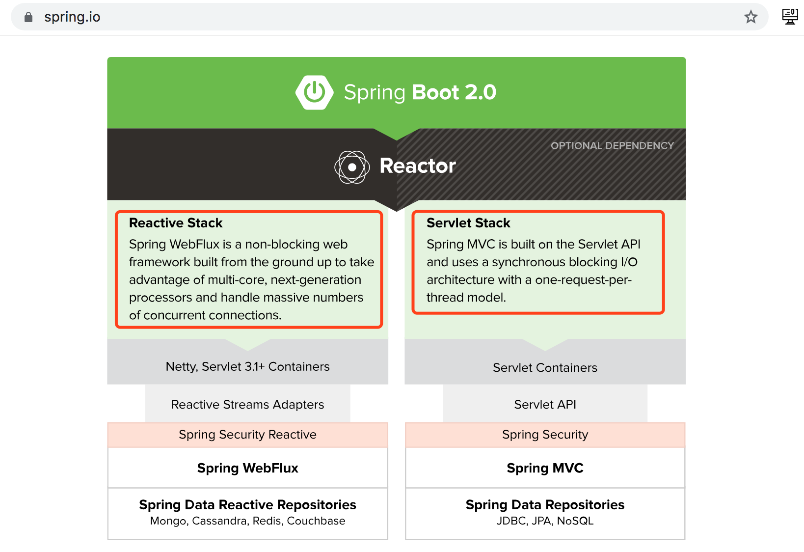

# WebFlux 简介

> 【原文】Spring WebFlux is a non-blocking web framework built from the ground up(自底向上) to take advantage of(利用) multi-core(多核),next-generation processors(下一代处理器) and handle massive(大量) numbers of concurrent connections(并发连接). 
>
> 【翻译】Spring WebFlux 是一个自底向上构建的非阻塞 Web 框架,用于利用多核、下一代处 理器处理高并发连接。 

打开 Spring 官网,可以看到 [WebFlux 在线参考文档入口](https://docs.spring.io/spring/docs/current/spring-framework-reference/web-reactive.html#spring-webflux)地址。

* WebFlux要求JDK版本在9之上(包含9版本)
* WebFlux暂不支持关系型数据库
* Mono：包含一个元素的序列
* Flux：包含多个元素的序列

# WebFlux 牛刀小试

## 第一个 WebFlux 工程 01-firstwebflux

## 添加耗时操作

## 返回 Flux

# SSE

## SSE 简介

## SSE 技术规范

## SSE 举例 03-sse

# Reactive Stream

## Reactive Stream 概述

## 反应式流规范

## 发布者类 SubmissionPublisher

## “发布-订阅”模式反应式流编程 04-reactiveStream

## “发布-处理-订阅”模式响应流编程 04-reactiveStream