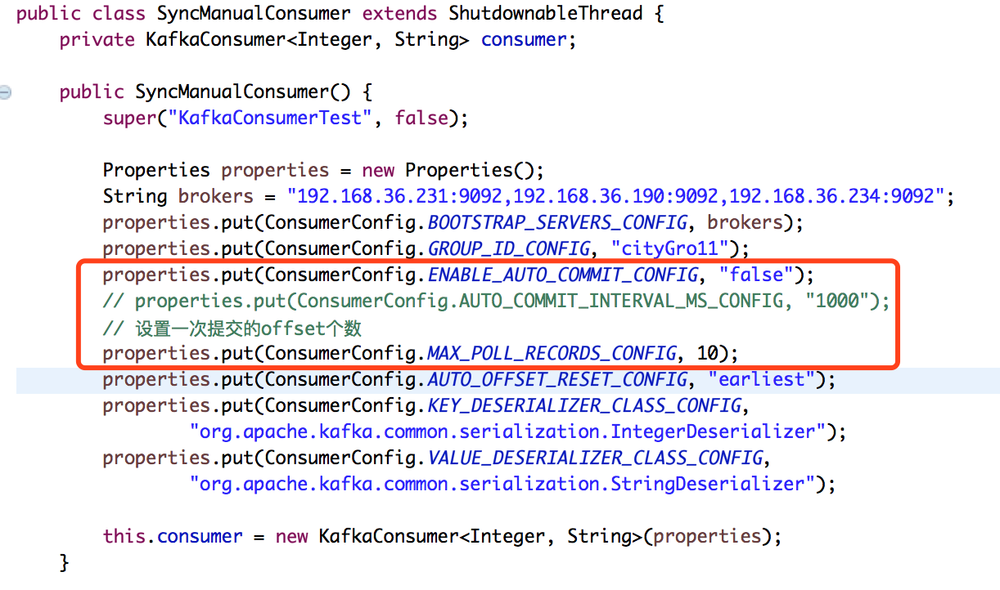
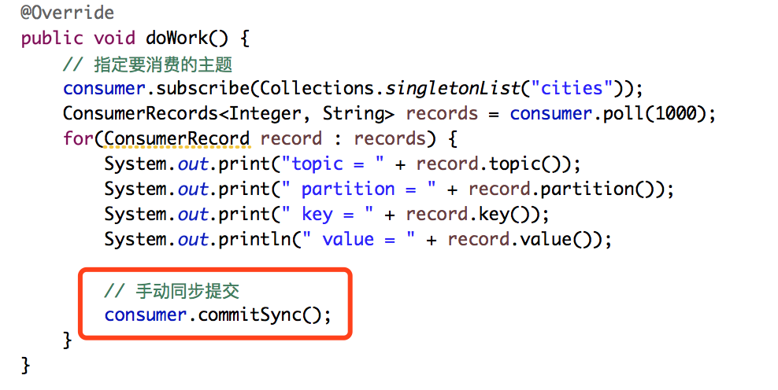
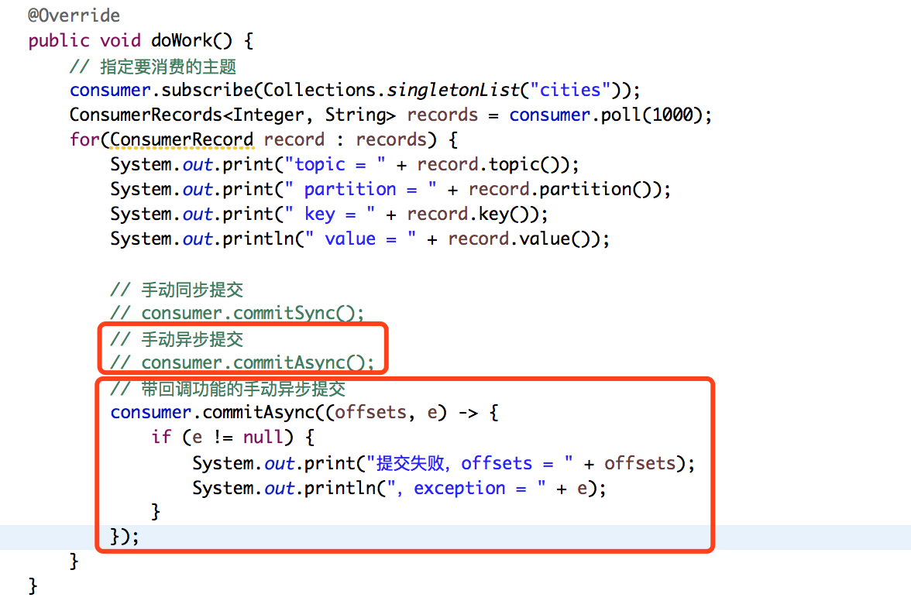
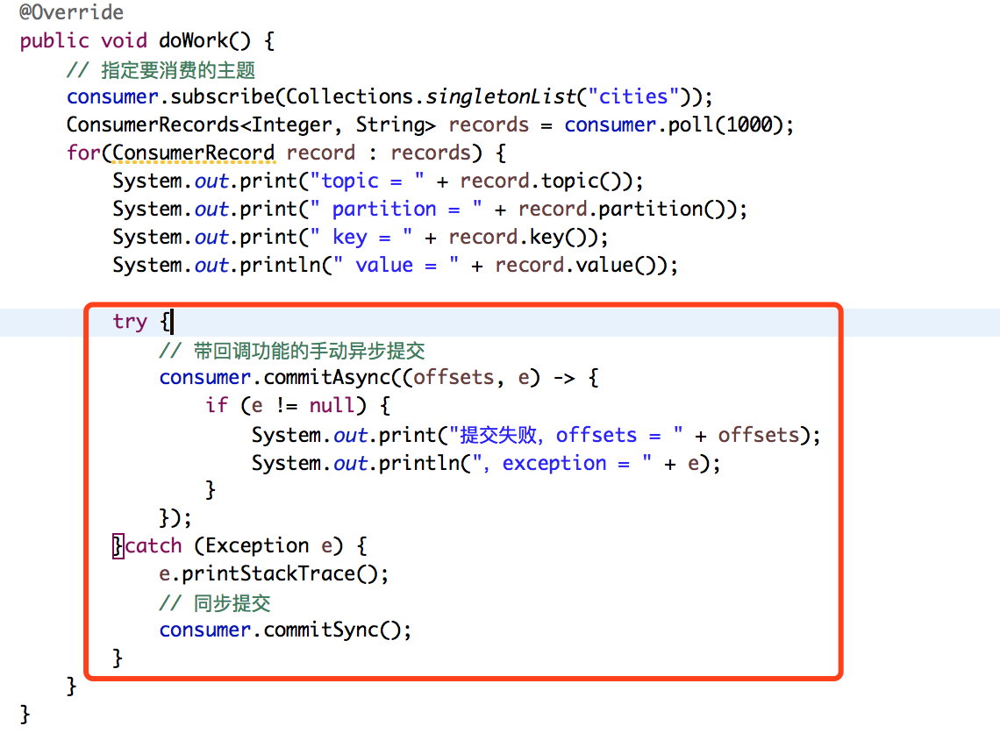
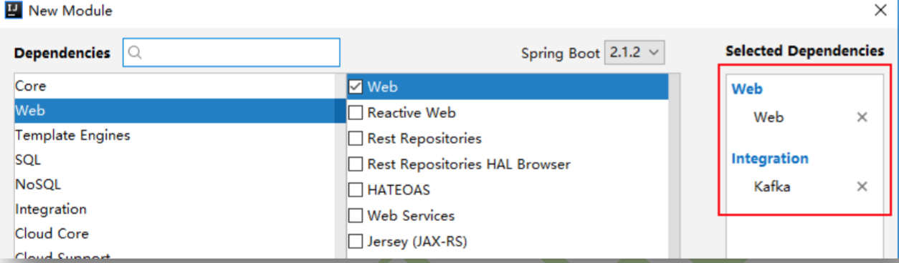

# 准备工作

​	首先在命令行创建一个名称为 cities 的主题,并创建该主题的订阅者。

## 创建主题

```shell
#3个partitions、2个副本
bin/kafka-topics.sh --create --bootstrap-server 192.168.36.230:9092 --replication-factor 2 --partitions 3 --topic cities
```

## 创建订阅者

```shell
bin/kafka-console-consumer.sh --bootstrap-server 192.168.36.230:9092 --topic cities --from-beginning
```

# 使用kafka原生API

## 创建工程

​	创建一个 Maven 的 Java 工程,命名为 kafkaDemo。创建时无需导入依赖。为了简单,后面的发布者与消费者均创建在该工程中。

```shell
GroupId:com.abc
ArtifactId:kafkademo
Version:1.0-SNAPSHOT
```

## 导入依赖

```xml
<dependency>
	<groupId>org.apache.kafka</groupId>
	<artifactId>kafka_2.12</artifactId>
	<version>1.1.1</version>
</dependency>
```


## 创建发布者OneProducer

### 创建发布者类OneProducer

```java
public class OneProducer {
    // 第一个泛型为key的类型，第二个泛型为消息本身的类型
    private KafkaProducer<Integer, String> producer;

    public OneProducer() {
        Properties properties = new Properties();
      //kafka集群
        properties.put("bootstrap.servers",
                       "192.168.36.231:9092,192.168.36.190:9092,192.168.36.234:9092");
      //key序列化器
        properties.put("key.serializer",
                          "org.apache.kafka.common.serialization.IntegerSerializer");
      //value序列化器
        properties.put("value.serializer",
                          "org.apache.kafka.common.serialization.StringSerializer");

        this.producer = new KafkaProducer<Integer, String>(properties);
    }

    public void sendMsg() {
        // 创建记录（消息）
        // 指定主题及消息本身(partition 和 key 都未指定,则使用轮询算法选出一个 partition)
        // ProducerRecord<Integer, String> record =
        //                        new ProducerRecord<>("cities", "shanghai");
        // 指定主题、key，及消息本身(未指定 partition 但指定了 key,则通过对 key 的 hash 值与 		partition 数量取模,该取模结果就是要选出的 partition 索引)
        // ProducerRecord<Integer, String> record =
        //                        new ProducerRecord<>("cities", 1, "shanghai");
        // 指定主题、要写入的patition、key，及消息本身(指定了 partition,则直接写入到指定的 partition)
        ProducerRecord<Integer, String> record =
                                  new ProducerRecord<>("cities", 1, 1, "shanghai");

        // 发布消息，其返回值为Future对象，表示其发送过程为异步，不过这里不使用该返回结果
        // Future<RecordMetadata> future = producer.send(record);
        producer.send(record);
    }
}
```

### 测试类OneProducerTest

```java
public class OneProducerTest {

    public static void main(String[] args) throws IOException {
        OneProducer producer = new OneProducer();
        producer.sendMsg();
        System.in.read();//消息发送是异步的，加这句是为了避免主线程结束；
    }
}
```

### 测试发布者

```shell
[root@localhost kafka]# bin/kafka-console-consumer.sh --bootstrap-server 192.168.36.231:9092 --topic cities --from-beginning
shanghai
```

## 创建发布者TwoProducer

### 创建发布者类TwoProducer

复制 OneProducer 类,仅修改 sendMsg()方法

```java
public void sendMsg() {
        // 创建记录（消息）
        // 指定主题及消息本身
        // ProducerRecord<Integer, String> record =
        //                        new ProducerRecord<>("cities", "shanghai");
        // 指定主题、key，及消息本身
        // ProducerRecord<Integer, String> record =
        //                        new ProducerRecord<>("cities", 1, "shanghai");
        // 指定主题、要写入的patition、key，及消息本身
        ProducerRecord<Integer, String> record =
                                  new ProducerRecord<>("cities", 0, 1, "shanghai");

        // 可以调用以下两个参数的send()方法，可以在消息发布成功后触发回调的执行
        producer.send(record, new Callback() {
            // RecordMetadata，消息元数据，即主题、消息的key、消息本身等的封装对象
            @Override
            public void onCompletion(RecordMetadata metadata, Exception exception) {
                System.out.print("partition = " + metadata.partition());
                System.out.print("，topic = " + metadata.topic());
                System.out.println("，offset = " + metadata.offset());
            }
        });

    }
```

### 测试类TwoProducerTest

```java
public class TwoProducerTest {

    public static void main(String[] args) throws IOException {
        TwoProducer producer = new TwoProducer();
        producer.sendMsg();
        System.in.read();
    }
}
```

## 批量发送消息

### 创建发布者类SomeProducerBatch

复制前面的发布者类,在其基础上进行修改。

```java
public class SomeProducerBatch {
    // 第一个泛型为key的类型，第二个泛型为消息本身的类型
    private KafkaProducer<Integer, String> producer;

    public SomeProducerBatch() {
        Properties properties = new Properties();
        properties.put("bootstrap.servers", "192.168.36.231:9092,192.168.36.190:9092,192.168.36.234:9092");
        properties.put("key.serializer", "org.apache.kafka.common.serialization.IntegerSerializer");
        properties.put("value.serializer", "org.apache.kafka.common.serialization.StringSerializer");
        // 指定要批量发送的消息个数，默认16k
        properties.put("batch.size", 16384);  // 16K
        // 指定积攒消息的时长，默认值为0ms
        properties.put("linger.ms", 50);  // 50ms
        this.producer = new KafkaProducer<Integer, String>(properties);
    }

    public void sendMsg() {
        for (int i=0; i<50; i++) {
            ProducerRecord<Integer, String> record =
                    new ProducerRecord<>("cities", 0, i * 10, "city-" + i*100);

            producer.send(record, new Callback() {
                // RecordMetadata，消息元数据，即主题、消息的key、消息本身等的封装对象
                @Override
                public void onCompletion(RecordMetadata metadata, Exception exception) {
                    System.out.print("partition = " + metadata.partition());
                    System.out.print("，topic = " + metadata.topic());
                    System.out.println("，offset = " + metadata.offset());
                }
            });
        }
    }
}
```

### 测试类ProducerBatchTest

```java
public class ProducerBatchTest {

    public static void main(String[] args) throws IOException {
        SomeProducerBatch producer = new SomeProducerBatch();
        producer.sendMsg();
        System.in.read();
    }
}
```

## 消费者组

### 创建消费者类SomeConsumer

```java
public class SomeConsumer extends ShutdownableThread {
    private KafkaConsumer<Integer, String> consumer;

    public SomeConsumer() {
      //KafkaConsumerTest，当前消费者名称，可以随意定义；false，表示消费过程是否允许中断，一般不允许
        super("KafkaConsumerTest", false);

        Properties properties = new Properties();
        String brokers = "192.168.36.231:9092,192.168.36.190:9092,192.168.36.234:9092";
        properties.put("bootstrap.servers", brokers);
        // 指定消费者组ID
        properties.put("group.id", "cityGroup1");
        // 开启offset自动提交
        properties.put("enable.auto.commit", "true");
        // 指定自动提交的最晚时间间隔
        properties.put("auto.commit.interval.ms", "10000");
        // 指定broker认定consumer宕机的时限。从consumer读取消息开始计时，一直到其收到consumer
        // 提交的offset，这个时间段不能超过该值，否则broker认定当前consumer宕机
        properties.put("session.timeout.ms", "30000");
        // 消费者向broker controller发送心跳，即心跳发送频率！取值一般为session.timeout.ms／3
        properties.put("heartbeat.interval.ms", "10000");
        // 若没有指定初始的offset或指定的offset不存在，则offset要读取其指定的默认值
        // earliest：从该partition的最开始的offset开始，一般是0
        // lastest：从该partition的最后offset开始，即HW
        properties.put("auto.offset.reset", "earliest");
      //反序列化器
        properties.put("key.deserializer",
                "org.apache.kafka.common.serialization.IntegerDeserializer");
        properties.put("value.deserializer",
                "org.apache.kafka.common.serialization.StringDeserializer");

        this.consumer = new KafkaConsumer<Integer, String>(properties);
    }

    @Override
    public void doWork() {
        // 指定要消费的主题，可以指定多个主题
        consumer.subscribe(Collections.singletonList("cities"));
        // poll()是阻塞的方法，其参数表示，若broker中没有消息，该poll()等待的最长时间
        // 到时仍没有消息，则返回null，解除阻塞
        ConsumerRecords<Integer, String> records = consumer.poll(1000);
        for(ConsumerRecord record : records) {
            System.out.print("topic = " + record.topic());
            System.out.print(" partition = " + record.partition());
            System.out.print(" key = " + record.key());
            System.out.println(" value = " + record.value());
        }
    }
}
```

### 测试类ConsumerTest

```java
public class ConsumerTest {
    public static void main(String[] args) {
        SomeConsumer consumer = new SomeConsumer();
        consumer.start();
    }
}
```

## 消费者同步手动提交

消费者向 broker 提交 offset 后等待 broker 成功响应。

### 创建消费者类SyncManualConsumer

直接复制前面的 SomeConsumer,在其基础上进行修改。

```java
public class SyncManualConsumer extends ShutdownableThread {
    private KafkaConsumer<Integer, String> consumer;

    public SyncManualConsumer() {
        super("KafkaConsumerTest", false);

        Properties properties = new Properties();
        String brokers = "192.168.36.231:9092,192.168.36.190:9092,192.168.36.234:9092";
        properties.put(ConsumerConfig.BOOTSTRAP_SERVERS_CONFIG, brokers);
        properties.put(ConsumerConfig.GROUP_ID_CONFIG, "cityGro11");
        properties.put(ConsumerConfig.ENABLE_AUTO_COMMIT_CONFIG, "false");
        // properties.put(ConsumerConfig.AUTO_COMMIT_INTERVAL_MS_CONFIG, "1000");
        // 设置一次提交的offset个数
        properties.put(ConsumerConfig.MAX_POLL_RECORDS_CONFIG, 10);
        properties.put(ConsumerConfig.AUTO_OFFSET_RESET_CONFIG, "earliest");
        properties.put(ConsumerConfig.KEY_DESERIALIZER_CLASS_CONFIG,
                "org.apache.kafka.common.serialization.IntegerDeserializer");
        properties.put(ConsumerConfig.VALUE_DESERIALIZER_CLASS_CONFIG,
                "org.apache.kafka.common.serialization.StringDeserializer");

        this.consumer = new KafkaConsumer<Integer, String>(properties);
    }

    @Override
    public void doWork() {
        // 指定要消费的主题
        consumer.subscribe(Collections.singletonList("cities"));
        ConsumerRecords<Integer, String> records = consumer.poll(1000);
        for(ConsumerRecord record : records) {
            System.out.print("topic = " + record.topic());
            System.out.print(" partition = " + record.partition());
            System.out.print(" key = " + record.key());
            System.out.println(" value = " + record.value());

            // 手动同步提交
            consumer.commitSync();
        }
    }
}
```

#### 修改构造器

直接复制前面的 SomeConsumer,在其基础上进行修改。



直接复制前面的 SomeConsumer,在其基础上进行修改。

#### 修改doWork()方法



### 测试类SyncManulTest

```java
public class SyncManualTest {
    public static void main(String[] args) {
        SyncManualConsumer consumer = new SyncManualConsumer();
        consumer.start();
    }
}
```


## 消费者异步手动提交

### 创建消费者类 AsyncManualConsumer

复制前面的 SyncManualConsumer 类,在其基础上进行修改。

```java
public class AsynManualConsumer extends ShutdownableThread {
    private KafkaConsumer<Integer, String> consumer;

    public AsynManualConsumer() {
        super("KafkaConsumerTest", false);

        Properties properties = new Properties();
        String brokers = "192.168.36.231:9092,192.168.36.190:9092,192.168.36.234:9092";
        properties.put(ConsumerConfig.BOOTSTRAP_SERVERS_CONFIG, brokers);
        properties.put(ConsumerConfig.GROUP_ID_CONFIG, "cityGro11");
        properties.put(ConsumerConfig.ENABLE_AUTO_COMMIT_CONFIG, "false");
        // properties.put(ConsumerConfig.AUTO_COMMIT_INTERVAL_MS_CONFIG, "1000");
        // 设置一次提交的offset个数
        properties.put(ConsumerConfig.MAX_POLL_RECORDS_CONFIG, 10);
        properties.put(ConsumerConfig.AUTO_OFFSET_RESET_CONFIG, "earliest");
        properties.put(ConsumerConfig.KEY_DESERIALIZER_CLASS_CONFIG,
                "org.apache.kafka.common.serialization.IntegerDeserializer");
        properties.put(ConsumerConfig.VALUE_DESERIALIZER_CLASS_CONFIG,
                "org.apache.kafka.common.serialization.StringDeserializer");

        this.consumer = new KafkaConsumer<Integer, String>(properties);
    }

    @Override
    public void doWork() {
        // 指定要消费的主题
        consumer.subscribe(Collections.singletonList("cities"));
        ConsumerRecords<Integer, String> records = consumer.poll(1000);
        for(ConsumerRecord record : records) {
            System.out.print("topic = " + record.topic());
            System.out.print(" partition = " + record.partition());
            System.out.print(" key = " + record.key());
            System.out.println(" value = " + record.value());

            // 手动同步提交
            // consumer.commitSync();
            // 手动异步提交,该方式无法获取异步提交结果
            // consumer.commitAsync();
            // 带回调功能的手动异步提交
            consumer.commitAsync((offsets, e) -> {
                if (e != null) {
                    System.out.print("提交失败，offsets = " + offsets);
                    System.out.println("，exception = " + e);
                }
            });
        }
    }
}
```



### 测试类 AsyncManulTest

```java
public class AsyncManualTest {
    public static void main(String[] args) {
        AsynManualConsumer consumer = new AsynManualConsumer();
        consumer.start();
    }
}
```


## 消费者同异步手动提交

### 创建消费者类 SyncAsyncManualConsumer

复制前面的 AsyncManualConsumer 类,在其基础上进行修改。

```java
public class SyncAsyncManualConsumer extends ShutdownableThread {
    private KafkaConsumer<Integer, String> consumer;

    public SyncAsyncManualConsumer() {
        super("KafkaConsumerTest", false);

        Properties properties = new Properties();
        String brokers = "192.168.36.231:9092,192.168.36.190:9092,192.168.36.234:9092";
        properties.put(ConsumerConfig.BOOTSTRAP_SERVERS_CONFIG, brokers);
        properties.put(ConsumerConfig.GROUP_ID_CONFIG, "cityGro11");
        properties.put(ConsumerConfig.ENABLE_AUTO_COMMIT_CONFIG, "false");
        // properties.put(ConsumerConfig.AUTO_COMMIT_INTERVAL_MS_CONFIG, "1000");
        // 设置一次提交的offset个数
        properties.put(ConsumerConfig.MAX_POLL_RECORDS_CONFIG, 10);
        properties.put(ConsumerConfig.AUTO_OFFSET_RESET_CONFIG, "earliest");
        properties.put(ConsumerConfig.KEY_DESERIALIZER_CLASS_CONFIG,
                "org.apache.kafka.common.serialization.IntegerDeserializer");
        properties.put(ConsumerConfig.VALUE_DESERIALIZER_CLASS_CONFIG,
                "org.apache.kafka.common.serialization.StringDeserializer");

        this.consumer = new KafkaConsumer<Integer, String>(properties);
    }

    @Override
    public void doWork() {
        // 指定要消费的主题
        consumer.subscribe(Collections.singletonList("cities"));
        ConsumerRecords<Integer, String> records = consumer.poll(1000);
        for(ConsumerRecord record : records) {
            System.out.print("topic = " + record.topic());
            System.out.print(" partition = " + record.partition());
            System.out.print(" key = " + record.key());
            System.out.println(" value = " + record.value());

            try {
                // 带回调功能的手动异步提交
                consumer.commitAsync((offsets, e) -> {
                    if (e != null) {
                        System.out.print("提交失败，offsets = " + offsets);
                        System.out.println("，exception = " + e);
                    }
                });
            }catch (Exception e) {
                e.printStackTrace();
                // 同步提交，避免重复消费问题［异步提交异常，派个同步提交在死等（同步是阻塞的），直到offset提交成功，最终消费成功］
                consumer.commitSync();
            }
        }
    }
}
```



### 测试类 SyncAsyncManualTest

```java
public class SyncAsyncManualTest {
    public static void main(String[] args) {
        SyncAsyncManualConsumer consumer = new SyncAsyncManualConsumer();
        consumer.start();
    }
}
```

# Spring Boot Kafka

为了简单,以下代码是将消息发布者与订阅者定义到了一个工程中的。

## 创建工程

创建一个 Spring Boot 工程,导入如下依赖。



## 定义发布者

Spring 是通过 KafkaTemplate 来完成对 Kafka 的操作的。

### 修改配置文件

```properties
# 自定义属性
kafka:
  topic: cities

# 配置Kafka
spring:
  kafka:
    bootstrap-servers: 192.168.36.231:9092,192.168.36.190:9092,192.168.36.234:9092
    producer:   # 配置生产者
      key-serializer: org.apache.kafka.common.serialization.StringSerializer
      value-serializer: org.apache.kafka.common.serialization.StringSerializer
```


### 定义发布者处理器

```java
@RestController
public class SomeProducer {
    @Autowired
    private KafkaTemplate<String, String> template;

    // 从配置文件读取自定义属性
    @Value("${kafka.topic}")
    private String topic;

    // 由于是提交数据，所以使用Post方式
    @PostMapping("/msg/send")
    public String sendMsg(@RequestParam("message") String message) {
        template.send(topic, message);
        return "send success";
    }
}
```

## 定义消费者

Spring 是通过监听方式实现消费者的。

### 修改配置文件

在配置文件中添加如下内容。注意,Spring 中要求必须为消费者指定组。

```properties
# 自定义属性
kafka:
  topic: cities

# 配置Kafka
spring:
  kafka:
    bootstrap-servers: 192.168.36.231:9092,192.168.36.190:9092,192.168.36.234:9092
    producer:   # 配置生产者
      key-serializer: org.apache.kafka.common.serialization.StringSerializer
      value-serializer: org.apache.kafka.common.serialization.StringSerializer

    consumer:   # 配置消费者
      group-id: group0  # 消费者组
      key-deserializer: org.apache.kafka.common.serialization.StringDeserializer
      value-deserializer: org.apache.kafka.common.serialization.StringDeserializer
```

### 定义消费

```java
@Component
public class SomeConsumer {

    @KafkaListener(topics = "${kafka.topic}")
    public void onMsg(String message) {
        System.out.println("Kafka消费者接受到消息 " + message);
    }

}
```

